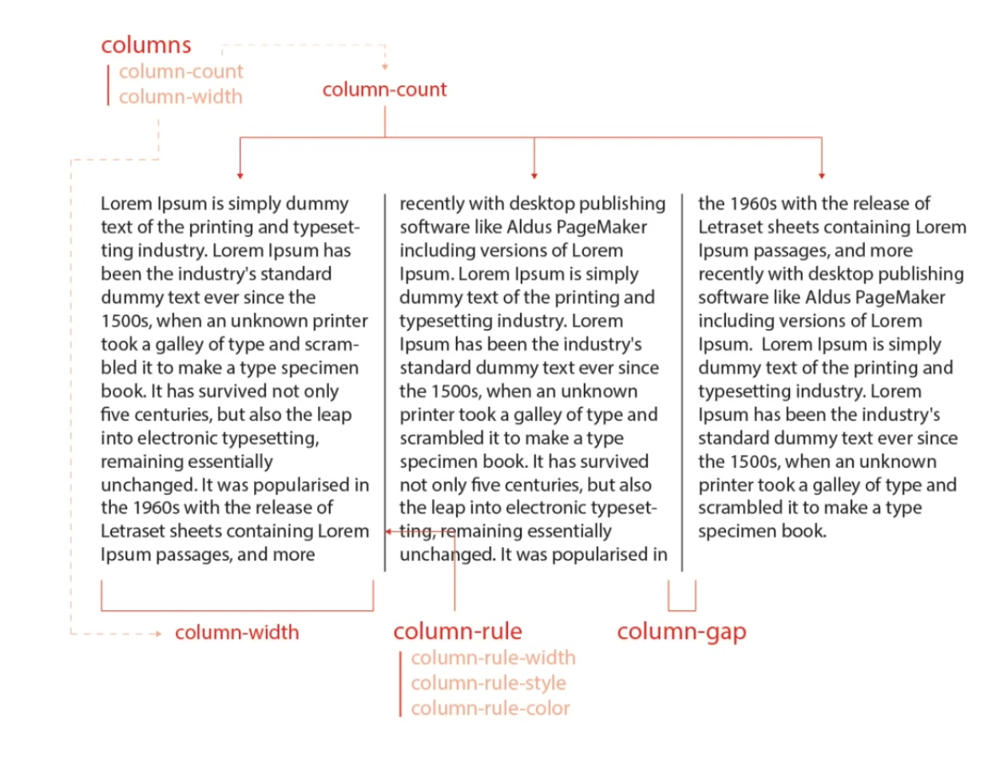

# CSS 속성 15. `columns`

일반 블록 레이아웃을 확장하여 여러 텍스트 다단으로 쉽게 정리하며, 가독성 확보



## `columns`

다단을 정의 - 단축 속성

### 속성 값

| 값             | 의미                               | 기본값 |
| -------------- | ---------------------------------- | ------ |
| `auto`         | 브라우저가 단의 너비와 개수를 설정 | `auto` |
| `column-width` | 단의 최적 너비를 설정              | `auto` |
| `column-count` | 단의 개수를 설정                   | `auto` |

### 사용법

```css
columns: 너비 개수;
```

```css
.text {
  columns: 100px 2;
}
```

## `column-width`

단의 최적 너비를 설정 - 개별 속성

### 속성 값

| 값     | 의미                              | 기본값 |
| ------ | --------------------------------- | ------ |
| `auto` | 브라우저가 단의 너비를 설정       | `auto` |
| 단위   | `px` , `em` , `cm` 등 단위로 지정 |        |

### 사용법

```css
column-width: 너비;
```

> ☝️ 각 단이 줄어들 수 있는 최적 너비(최소 너비)를 설정하며, 요소의 너비가 가변하 하나의 단이 최적 너비보다 줄어들 경우 단의 개수가 조정된다.

## `column-count`

단의 개수를 설정 - 개별 속성

### 속성 값

| 값     | 의미                        | 기본값 |
| ------ | --------------------------- | ------ |
| `auto` | 브라우저가 단의 개수를 설정 | `auto` |
| 숫자   | 단의 개수를 설정            |        |

### 사용법

```css
column-count: 개수;
```

## `column-gap`

단과 단 사이의 간격 설정

### 속성 값

| 값       | 의미                                            | 기본값   |
| -------- | ----------------------------------------------- | -------- |
| `normal` | 브라우저가 단과 단 사이의 간격을 설정 ( `1em` ) | `normal` |
| 단위     | `px` , `em` , `cm` 등 단위로 지정               |          |

### 사용법

```css
column-gap: 간격;
```

## `column-rule`

단과 단 사이의 (구분)선을 지정 - 단축 속성

| 값                  | 의미             | 기본값               |
| ------------------- | ---------------- | -------------------- |
| `column-rule-width` | 선의 두께를 지정 | `medium`             |
| `column-rule-style` | 선의 종류를 지정 | `none`               |
| `column-rule-color` | 선의 색상을 지정 | 요소의 글자색과 동일 |

### 사용법

```css
column-rule: 두께 종류 색상;
```

