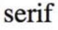
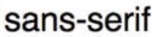
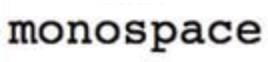
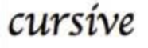
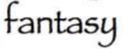

# CSS 속성 9. `font`

## `font`

글자 관련 속성들을 지정 - 단축 속성

### 속성 값

| 값            | 의미                  | 기본값                              |
| ------------- | --------------------- | ----------------------------------- |
| `font-style`  | 글자 기울기 지정      | `normal`                            |
| `font-weight` | 글자 두께 지정        | `normal`                            |
| `font-size`   | 글자 크기 지정        | `medium` ( `16px` )                 |
| `line-height` | 줄 높이(줄 간격) 지정 | `normal` ( `reset.css` 적용시 `1` ) |
| `font-family` | 글꼴(서체) 지정       | 운영체제(브라우저)에 따라 달라짐    |

### 사용법

```css
font: 기울기 두께 크기 / 줄높이 글꼴;
```

> ☝️ 일반적으로 단축 속성의 경우 값의 순서를 바꾸어도 정상적으로 동작한다. 그런데 `font` 크기와 줄 높이는 같은 단위를 사용하기 때문에 순서를 알아야 CSS가 해석할 수 있다. 따라서 '크기 / 줄높이'로 `/` 로 구분한다. 

```css
.box {
  font: italic bold 20px / 1.5 "Arial", sans-serif;
}
```

```css
.box {
  font: 30px / 1.5;             /* ERROR */
  font: bold;                   /* ERROR */
  font: bold sans-serif;        /* ERROR */
  font: 30px / 1.5 sans-serif;
  font: bold 30px sans-serif;
  font: italic 30px / 1.5 "Arial", sans-serif;
}
```

> ☝️ 단축 속성을 사용하려면 `font-size` 와 `font-family` 는 필수적으로 입력해야 한다.

## `font-style`

글자 스타일(기울기)을 지정 - 개별 속성

### 속성 값

| 값        | 의미           | 기본값   |
| --------- | -------------- | -------- |
| `normal`  | 스타일 없음    | `normal` |
| `italic`  | 이탤릭체(활자) |          |
| `oblique` | 기울어진 글자  |          |

### 예제

```html
<p>Hello world!</p>
```

```css
p {
  font-style: italic;
}
```

> ☝️ `italic` 과 `oblique` 의 차이 - [italic vs oblique in CSS](https://stackoverflow.com/questions/1680624/font-style-italic-vs-oblique-in-css)

## `font-weight`

글자 두께(가중치)를 지정 - 개별 속성

### 속성 값

| 값        | 의미                                                         | 기본값         |
| --------- | ------------------------------------------------------------ | -------------- |
| `normal`  | 기본 글자 두께, `400` 과 동일                                | `normal` (400) |
| `bold`    | 글자 두껍게, `700` 과 동일                                   |                |
| `bolder`  | 부모(상위) 요소보다 더 두껍게( `bold` 보다 두껍다는 개념이 아님) |                |
| `lighter` | 부모(상위) 요소보다 더 얇게                                  |                |
| 숫자      | `100` 부터 `900` 까지의 100단위의 숫자 9개, `normal` 과 `bold` 이외의 두께를 제공하는 글꼴(서체)을 위한 설정 |                |

### 일반적인 두께의 이름

`font-weight` 의 각 값은 일반적으로 다음과 같은 글꼴의 이름으로 표현됨

| 값    | 일반적인 두께 이름        |
| ----- | ------------------------- |
| `100` | Thin (Hairline)           |
| `200` | Extra Light (Ultra Light) |
| `300` | Light                     |
| `400` | Normal (기본)             |
| `500` | Medium                    |
| `600` | Semi Bold (Demi Bold)     |
| `700` | Bold                      |
| `800` | Extra Bold (Ultra Bold)   |
| `900` | Black (Heavy)             |

### 상대적 두께

`bolder` 나 `lighter` 를 사용할 경우 부모(상위) 요소에게 상속받은 값에서 다음과 같이 계산됨

| 상속 값 | `bolder` | `lighter` |
| ------- | -------- | --------- |
| `100`   | `400`    | `100`     |
| `200`   | `400`    | `100`     |
| `300`   | `400`    | `100`     |
| `400`   | `700`    | `100`     |
| `500`   | `700`    | `100`     |
| `600`   | `900`    | `400`     |
| `700`   | `900`    | `400`     |
| `800`   | `900`    | `700`     |
| `900`   | `900`    | `700`     |

### 숫자 값과 두께의 불일치

글꼴(서체)의 정확한 두께를 숫자로 표현할 수 없는 경우에만..

1. `400` 이 주어지면 `500` 을 사용하고, `500` 이 불가하면 `500` 미만의 다른 두께 사용
2. `500` 이 주어지면 `400` 을 사용하고, `400` 이 불가하면 `400` 미만의 다른 두께 사용
3. `500` 미만 값이 주어지면, 가장 가까운 숫자의 얇은 두께 사용
4. `500` 초과 값이 주어지면, 가장 가까운 숫자의 두꺼운 두께 사용

> 예를 들면 `normal` 과 `bold` 만 지원하는 글꼴일 경우, `100` ~ `500` 은 `normal` 을 의미하고, `600` ~ `900` 은 `bold` 를 의미합니다.

## `font-size`

글자의 크기를 지정 - 개별 속성

### 속성 값

| 값         | 의미                              | 기본값   |
| ---------- | --------------------------------- | -------- |
| 단위       | `px` , `em` , `cm` 등 단위로 지정 | `16px`   |
| `%`        | 부모(상위) 요소의 비율로 지정     |          |
| `xx-small` | 가장 작은 크기                    |          |
| `x-small`  | 더 작은 크기                      |          |
| `small`    | 작은 크기                         |          |
| `medium`   | 중간 크기                         | `medium` |
| `large`    | 큰 크기                           |          |
| `x-large`  | 더 큰 크기                        |          |
| `xx-large` | 가장 큰 크기                      |          |
| `smaller`  | 부모(상위) 요소보다 작은 크기     |          |
| `larger`   | 부모(상위) 요소보다 큰 크기       |          |

> ☝️ `xx-small` 부터 `xx-large` 까지의 값은 불명확한 값으로 사용을 추천하지 않음

## `line-height`

줄 높이(행간) 지정 - 개별 속성

### 속성 값

| 값       | 의미                                       | 기본값   |
| -------- | ------------------------------------------ | -------- |
| `normal` | 브라우저의 기본 정의를 사용( `1` ~ `1.4` ) | `normal` |
| 숫자     | 요소 자체 글꼴 크기의 배수로 지정          |          |
| 단위     | `px` , `em` , `cm` 등 단위로 지정          |          |
| `%`      | 요소 자체 글꼴 크기의 비율로 지정          |          |


> 이미지 출처 : [Deep dive CSS: font metrics, line-height and vertical-align](http://iamvdo.me/en/blog/css-font-metrics-line-height-and-vertical-align?utm_source=CSS-Weekly&utm_campaign=Issue-253&utm_medium=web)

> ☝️ `line-height` 는 첫 번째 줄과 두 번째 줄 사이의 간격을 말하는 것이 아니라 한 줄이 가지는 높이 값이다.

## `font-family`

글꼴(서체) 지정 - 개별 속성

### 속성 값

| 값                                                           | 의미                        | 기본값 |
| ------------------------------------------------------------ | --------------------------- | ------ |
| 글꼴이름                                                     | 글꼴(서체) 후보 목록을 지정 |        |
| `serif` <br />`sans-serif`<br />`monospace`<br />`cursive`<br />`fantasy` | 글꼴 계열 이름을 지정       |        |

### 사용법

```css
font-family: [글꼴 후보1, 글꼴 후보2, ... ], 글꼴 계열;
```

```css
.box {
  font-family: Arial, "Open Sans", "돋움", dotum, sans-serif;
}
```

> ☝️ 글꼴 계열은 필수로 입력해야 한다.

### ❓ 왜 후보를 여러 개 입력하는가?

브라우저는 웹 페이지를 불러올 때 웹 페이지의 리소스들(이미지, 폰트 등)을 다운로드 받는다.

폰트의 경우 용량이 크기 때문에 웹 폰트를 제공하지 않는다면, 컴퓨터에 설치되어 있는 폰트를 사용하는데, 따라서 여러 후보를 명시해 OS 환경, 브라우저 환경마다 사용할 폰트를 지정해줄 수 있다. 글꼴 계열 역시 해당 계열의 서체를 사용하도록 만들 수 있다.

> 웹 폰트 : 웹에서 사용하기 적합하게 용량을 경량화한 폰트 

### 글꼴 계열(Generic family)

| 계열         | 의미                                          | 예시                                 |
| ------------ | --------------------------------------------- | ------------------------------------ |
| `serif`      | 바탕체 계열                                   |            |
| `sans-serif` | 고딕체 계열                                   |  |
| `monospace`  | 고정너비(가로폭이 동등한) 글꼴 계열           |    |
| `cursive`    | 필기체 계열                                   |        |
| `fantasy`    | 장식(재미있는 문자 표현을 포함하는) 글꼴 계열 |        |

