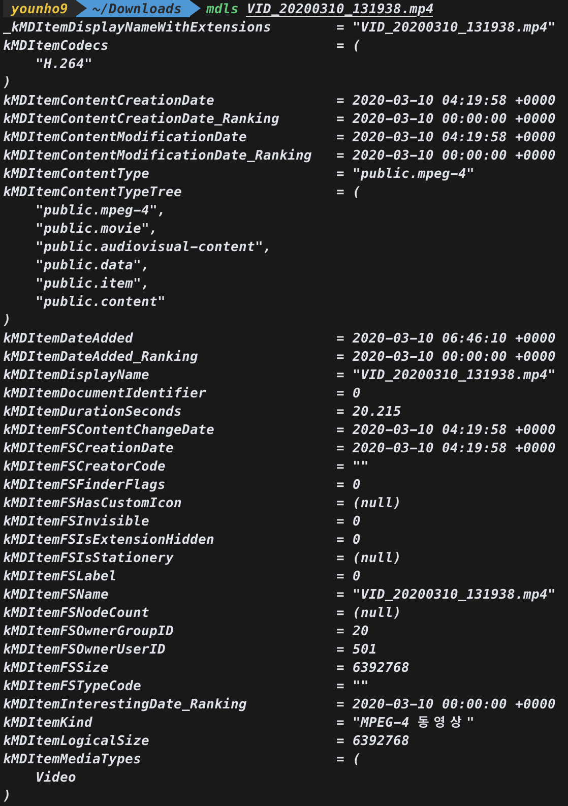

## 자바스크립트

- 변수 키워드 `var` 생략 가능?

-

## 미디어프로젝트

### 자료 조사

      - Tmap + 블랙박스 연동

         - 영상 데이터에 시간 정보는 잘 담김

         - `mdls [파일명]` (메타데이터 보는 명령어)

         - (번외) Tmap 블랙박스는 영상에 날짜 시간이 표시 안됨 → 사고시 법적 효력 X

      - Tmap API 공부 - 🔗 [http://tmapapi.sktelecom.com/main.html](http://tmapapi.sktelecom.com/main.html)

      > 웹페이지 보기가 불편하니 아래 코드로 수정

      ```html
      <div id="side_wrap" class="ui-resizable" style="height: 768px; width: 0px;">
      ```


      


### 필요한 기술

#### Tmap과 연동한 운전 습관 개선 확장 앱

1. pwa를 만들고 영상 촬영과 GPS 로그를 백그라운드에서 진행하고 Tmap을 실행해서 경로를 안내함 Tmap에서 운행 종료를 하면 영상 촬영, 기록을 멈춤. GPS로그와 영상을 담아 서버로 전송함.

   > PWA에서 백그라운드 프로세싱이 안되는 한계

1. pwa를 만들고 목적지를 입력 후 Tmap 실행 (Tmap은 블랙박스 사용으로 설정되어 있는 상태) Tmap 완료 후 gps + 영상 추출.

   > Tmap 주행 후 GPS 추출이 가능하지 않으면 마찬가지로 PWA에서 백그라운드 프로세싱이 안되서 GPS 데이터 만드는게 불가능할 듯

1. 앱을 만들고 백그라운드에서 영상 촬영, GPS 트랙하면서 (블랙박스 역할) Tmap으로 경로 안내.

   > 사실상 블랙박스 앱?

   다른 앱들

   - [지켜보고있다 블랙박스](https://apps.apple.com/kr/app/%EC%A7%80%EC%BC%9C%EB%B3%B4%EA%B3%A0%EC%9E%88%EB%8B%A4-%EB%B8%94%EB%9E%99%EB%B0%95%EC%8A%A4/id1105489515)

   - [오토보이 블랙박스](https://play.google.com/store/apps/details?id=com.happyconz.blackbox&hl=ko)

#### 앱 만들기

- ionic

  한번 시도해보고 구글링 결과 내장 카메라, 비디오 레코딩 하는 화면을 그리는 것까지 하기엔 예제나 자료가 부족했음.

- React-Native

  자료가 조금 더 많은 편인듯

어떤 것으로 해야할 지는 조금 더 공부를 하면서 정하는 것으로 한다.

## 그외 만들고 싶은 프로젝트들

- 웹페이지 모든 소스 다운로드 툴

- 읽기모드 익스텐션 (chrome)
