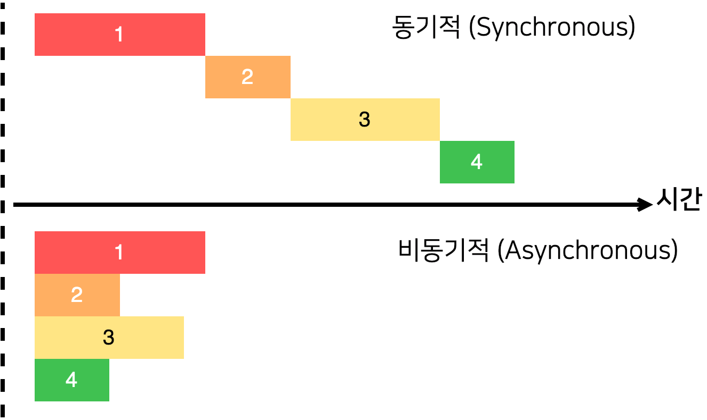

## React-Native 실행 환경설정

[맥(Mac)에 react native 개발 환경 구축하기](https://dev-yakuza.github.io/ko/react-native/install-on-mac/)

이 블로그의 설정 방법을 따라가면서 React-Native 실행환경을 설정했다.

      


      


성공!

## JavaScript 문법

### 삼항연산자

`condition ? true : false`

- 한 줄이 너무 길 때

```javascript
let text = array.length === 0 ? `배열이 비어있다.` : `배열이 비어있지 않다`;
```

### Truthy and Falsy

`undefined` 와 `null` 은 모두 `false` 로 간주됨.

`Falsy` 한 값

- `undefined`

- `null`

- `0`

- ```

  ```

- `NaN`

- `false`

이 외에는 모두 `true` 로 간주됨

`!` , `!!` 를 활용해 `Falsy` 한 값과 `Truthy` 한 값을 한번에 처리할 수 있음

### 단축 평가 논리 계산법

A `&&` B 연산자를 사용할 때 A가 `Truthy` 한 값이라면, B가 결과값이 되고, `Falsy` 한 값이라면, A가 출력된다.

```javascript
console.log(true && 'hello'); // hello
console.log(false && 'hello'); // false
console.log('hello' && 'bye'); // bye
console.log(null && 'hello'); // null
console.log(undefined && 'hello'); // undefined
console.log('' && 'hello'); // ''
console.log(0 && 'hello'); // 0
console.log(1 && 'hello'); // hello
console.log(1 && 1); // 1
```

A `||` B 연산자는 만약 A가 `Truthy` 한 값이라면, A가 결과값이 되고, `Falsy` 한 값이라면 B가 출력된다.

```javascript
console.log(true || 'hello'); // true
console.log(false || 'hello'); // hello
console.log('hello' || 'bye'); // hello
console.log(null || 'hello'); // hello
console.log(undefined || 'hello'); // undefined
console.log('' || 'hello'); // hello
console.log(0 || 'hello'); // hello
console.log(1 || 'hello'); // 1
console.log(1 || 1); // 1
```

### 함수의 기본 파라미터

파라미터에서 `=` 기호를 사용해 기본값을 설정할 수 있다.

```javascript
function calculateCircleArea(r = 1) {
  return Math.PI * r * r;
}

const area = calculateCircleArea();
console.log(area); // 3.141592653589793
```

### 조건문 더 스마트하게 쓰기

- 특정 값이 여러 값 중 하나인지 확인해야 할 때

```javascript
function isAnimal(text) {
  return text === '고양이' || text === '개' || text === '거북이' || text === '너구리';
}

console.log(isAnimal('개')); // true
console.log(isAnimal('노트북')); // false
```

배열의 `includes` 함수를 사용

```javascript
function isAnimal(name) {
  const animals = ['고양이', '개', '거북이', '너구리'];
  return animals.includes(name);
}

console.log(isAnimal('개')); // true
console.log(isAnimal('노트북')); // false
```

화살표 함수 사용

```javascript
const isAnimal = name => ['고양이', '개', '거북이', '너구리'].includes(name);

console.log(isAnimal('개')); // true
console.log(isAnimal('노트북')); // false
```

- 값에 따라 다른 결과물을 반환해야 할 때

```javascript
function getSound(animal) {
  if (animal === '개') return '멍멍!';
  if (animal === '고양이') return '야옹~';
  if (animal === '참새') return '짹짹';
  if (animal === '비둘기') return '구구 구 구';
  return '...?';
}
```

`switch` 사용

```javascript
function getSound(animal) {
  switch (animal) {
    case '개':
      return '멍멍!';
    case '고양이':
      return '야옹~';
    case '참새':
      return '짹짹';
    case '비둘기':
      return '구구 구 구';
    default:
      return '...?';
  }
}

console.log(getSound('개')); // 멍멍!
console.log(getSound('비둘기')); // 구구 구 구
```

객체 활용

```javascript
function getSound(animal) {
  const sounds = {
    개: '멍멍!',
    고양이: '야옹~',
    참새: '짹짹',
    비둘기: '구구 구 구',
  };
  return sounds[animal] || '...?';
}

console.log(getSound('개')); // 멍멍!
console.log(getSound('비둘기')); // 구구 구 구
```

- 값에 따라 다른 코드 구문을 실행할 때

```javascript
function makeSound(animal) {
  const tasks = {
    개() {
      console.log('멍멍');
    },
    고양이() {
      console.log('고양이');
    },
    비둘기() {
      console.log('구구 구 구');
    },
  };
  if (!tasks[animal]) {
    console.log('...?');
    return;
  }
  tasks[animal]();
}

makeSound('개');
makeSound('비둘기');
```

### 비구조화 할당 (구조분해) 문법

#### 비구조화 할당

```javascript
const object = { a: 1, b: 2 };

const { a, b } = object;

console.log(a); // 1
console.log(b); // 2
```

- 함수의 파라미터

```javascript
const object = { a: 1, b: 2 };

function print({ a, b }) {
  console.log(a);
  console.log(b);
}

print(object);
```

#### 비구조화 할당시 기본값 설정

```javascript
const object = { a: 1 };

const { a, b = 2 } = object;

console.log(a); // 1
console.log(b); // 2
```

- 함수의 파라미터

```javascript
const object = { a: 1 };

function print({ a, b = 2 }) {
  console.log(a);
  console.log(b);
}

print(object);
// 1
// 2
```

#### 비구조화 할당시 이름 바꾸기

```javascript
const animal = {
  name: '멍멍이',
  type: '개',
};

const nickname = animal.name;

console.log(nickname); // 멍멍이
```

`animal.name` 값을 `nickname` 값에 담고 있다. 이를 비구조화 할당을 사용한다면,

```javascript
const animal = {
  name: '멍멍이',
  type: '개',
};

const { name: nickname } = animal;
console.log(nickname);
```

`:` 문자를 사용해서 이름을 바꿔줄 수 있다.

#### 배열 비구조화 할당

```javascript
const array = [1, 2];
const [one, two] = array;

console.log(one);
console.log(two);
```

배열 안에 있는 원소를 다른 이름을 새로 선언해주고 싶을 때 사용하면 유용. 객체 비구조화 할당과 마찬가지로 기본값 지정이 가능.

```javascript
const array = [1];
const [one, two = 2] = array;

console.log(one);
console.log(two);
```

#### 깊은 값 비구조화 할당

```javascript
const deepObject = {
  state: {
    information: {
      name: 'younho9',
      languages: ['korean', 'english', 'chinese'],
    },
  },
  value: 5,
};
```

여기서 `name` , `languages` , `value` 값을 밖으로 꺼내고 싶을 때

```javascript
const deepObject = {
  state: {
    information: {
      name: 'younho9',
      languages: ['korean', 'english', 'chinese'],
    },
  },
  value: 5,
};

const { name, languages } = deepObject.state.information;
const { value } = deepObject;

const extracted = {
  name,
  languages,
  value,
};

console.log(extracted); // {name: "younho9", languages: Array[3], value: 5}
```

아래의 코드는 다음과 같다

```javascript
const extracted = {
  name: name,
  languages: languages,
  value: value,
};
```

다른 방법은

```javascript
const deepObject = {
  state: {
    information: {
      name: 'younho9',
      languages: ['korean', 'english', 'chinese'],
    },
  },
  value: 5,
};

const {
  state: {
    information: { name, languages },
  },
  value,
} = deepObject;

const extracted = {
  name,
  languages,
  value,
};

console.log(extracted);
```

이렇게 하는 방법도 있다.

## 자바스크립트에서 비동기 처리 다루기



```javascript
function work() {
  const start = Date.now();
  for (let i = 0; i < 10000000; i++) {}
  const end = Date.now();
  console.log(end - start + 'ms');
}

work();
console.log('다음 작업');
```

`work()` 를 수행하는 동안 다음 작업이 진행되지 않는다.

이를 비동기적으로 처리하게 만들고 싶다. → `setTImeout()` 함수 사용

```javascript
function work() {
  setTimeout(() => {
    const start = Date.now();
    for (let i = 0; i < 1000000000; i++) {}
    const end = Date.now();
    console.log(end - start + 'ms');
  }, 0);
}

console.log('작업 시작!');
work();
console.log('다음 작업');
```

먼저 `work()` 이후의 작업을 실행하고 `work()` 는 백그라운드에서 실행한다.

만약 비동기적으로 처리하면서 `work()` 함수가 끝난 이후에 어떤 작업을 처리하게 만들어주고 싶다면, 콜백 함수를 사용할 수 있다.

```javascript
function work(callback) {
  setTimeout(() => {
    const start = Date.now();
    for (let i = 0; i < 1000000000; i++) {}
    const end = Date.now();
    console.log(end - start + 'ms');
    callback();
  }, 0);
}

console.log('작업 시작!');
work(() => {
  console.log('작업이 끝났어요!');
});
console.log('다음 작업');
```

`work()` 가 끝난 뒤에 수행할 함수(작업)를 파라미터로 넘겨준다.

### Promise

그런데 만약 비동기 작업이 많아질 때, 모두 콜백 함수로 처리하면 코드가 난잡해지게 된다.

```javascript
function increaseAndPrint(n, callback) {
  setTimeout(() => {
    const increased = n + 1;
    console.log(increased);
    if (callback) {
      callback(increased);
    }
  }, 1000);
}

increaseAndPrint(0, n => {
  increaseAndPrint(n, n => {
    increaseAndPrint(n, n => {
      increaseAndPrint(n, n => {
        increaseAndPrint(n, n => {
          console.log('끝!');
        });
      });
    });
  });
});
```

이를 위해 만들어진 ES6에 도입된 기능이 `Promise` 이다.

`Promise` 는 성공할 수도 있고, 실패할 수도 있다. 성공할 때는 `resolve` 를 호출해주고, 실패할 때는 `reject` 를 호출한다.

```javascript
const myPromise = new Promise((resolve, reject) => {
  setTimeout(() => {
    resolve(1);
  }, 1000);
});

myPromise.then(n => {
  console.log(n);
});
```
