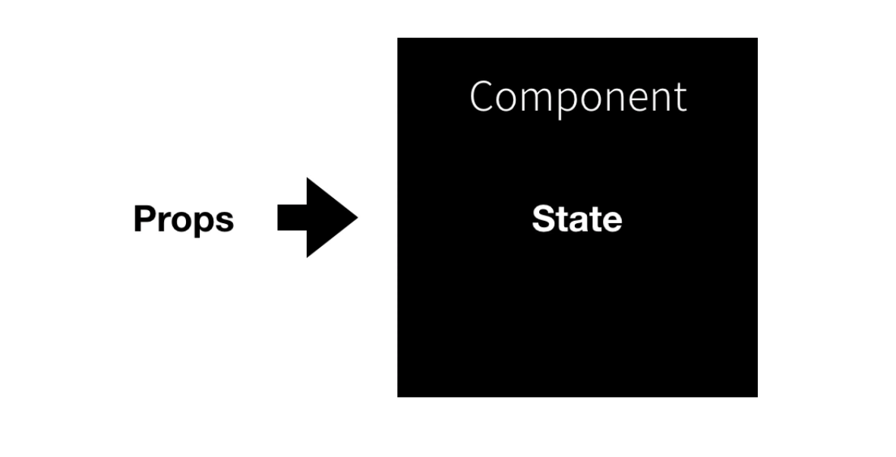
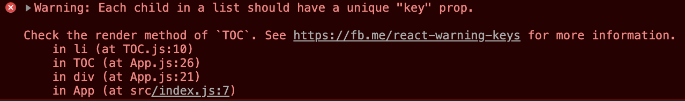

## NPM

[NPM1 - YouTube](https://www.youtube.com/playlist?list=PLuHgQVnccGMCwEXgZ-dep4SJlGEuYip-6)

Node Package Manager : 앱스토어에서 앱을 설치하는 것처럼 NPM에서 패키지를 설치할 수 있음.

패키지는 -g (global)에 설치할 수도 있고, 해당 디렉토리의 부품으로써 사용하도록 설치할 수 있다.

### 검색과 설치

[npm](https://www.npmjs.com/)

> NPM을 검색하고 설치할 수 있는 사이트

만약 `local-web-server` 라는 패키지를 설치하고 싶을 때,

- `npm i local-web-server`

- `npm install local-web-server`

> i는 install의 약자

컴퓨터의 전역적인, 독립적인 프로그램으로 설치하고 싶을 때,

- `npm install -g local-web-server`

> g는 global의 약자

권한이 없다면 `sudo` 를 앞에 추가한다.

### 패키지 목록 보기와 업데이트, 삭제

현재 디렉토리에 설치된 패키지 보기

`npm list`

전역에 설치된 패키지 보기

`npm list -g`

전역에 설치된 패키지 중 제일 상단에 있는 패키지만 보기

`npm list -g --depth=0`

전역에 있는 패키지 업데이트하기

`npm update -g local-web-server`

전역에 있는 패키지 삭제하기

`npm uninstall -g local-web-server`

> 📌 바퀴를 다시 만들지 마라!

## React

[React - YouTube](https://www.youtube.com/playlist?list=PLuHgQVnccGMCRv6f8H9K5Xwsdyg4sFSdi)

### React 앱 만들기

- `npm install -g create-react-app` - 전역에 설치해서 사용하는 방법.

```bash
npm install -g create-react-app
mkdir my-app
cd my-app
create-react-app .
```

- npx - 임시로 패키지를 설치해서 사용하고 지우는 실행 도구.

```bash
npx create-react-app my-app
cd my-app
npm start
```

### React 앱 실행

`npm run start`

### 코딩하기

#### `public` 디렉토리 - static 자원이 위치한 곳.

- `index.html`

```html
<div id="root"></div>
```

> 이 `root` 안에 리액트 컴포넌트들이 들어가게 된다.

#### `src` 디렉토리 - source 코드가 있는 곳.

- `index.js`

```javascript
ReactDOM.render(<App />, document.getElementById('root'));
```

> `<App />` 컴포넌트를 `root` 엘리먼트로 전달하게된다.

- `App.js` 클래스형 (클래스형과 함수형 컴포넌트가 있는데 이 강좌는 클래스형으로 진행)

```javascript
import React from 'react';
import logo from './logo.svg';
import './App.css';

class App extends React.Component {
  render() {
    return (
      <div className="App">
        <header className="App-header">
          
          <p>
            Edit <code>src/App.js</code> and save to reload.
          </p>
          <a
            className="App-link"
            href="https://reactjs.org"
            target="_blank"
            rel="noopener noreferrer"
          >
            Learn React
          </a>
        </header>
      </div>
    );
  }
}

export default App;
```

> ☝️ 반드시 리액트는 반환할 때 하나의 태그로 감싸져 있어야 한다.

### 배포하기

- `npm run build` - 리액트 앱을 빌드해줌

- `npx serve -s build` - 빌드한 앱으로 로컬 호스팅

### JSX

> 📌 **JSX는 JavaScript가 아니다!**

JSX로 작성한 코드는 create-react-app에 의해 JavaScript 코드로 컨버팅 된다.

### Hello World!

```javascript
import React from 'react';
import './App.css';

class App extends React.Component {
  render() {
    return <div className="App">Hello World!</div>;
  }
}

export default App;
```

`App` class는 리액트 컴포넌트를 확장하고 `render` 라는 메소드를 가진다. (필수), 클래스 내부 메소드에서 `function` 키워드는 생략 가능하다. (ES6)

### `Components` 와 `props`

컴포넌트를 여러 개 사용할 때 완전히 똑같은 컴포넌트만 사용해야 한다면, 한계가 있을 것이다. 컴포넌트가 특정 속성을 가짐에 따라 변경해줄 수 있도록 `props` 를 활용할 수 있다.

```javascript
import React from 'react';
import './App.css';

class Subject extends React.Component {
  render() {
    return (
      <header>
        <h1>{this.props.title}</h1>
        {this.props.sub}
      </header>
    );
  }
}

class App extends React.Component {
  render() {
    return (
      <div className="App">
        <Subject title="WEB" sub="World Wide Web!" />
        <Subject title="React" sub="For UI!" />
      </div>
    );
  }
}

export default App;
```

### React Developer Tools

[React Developer Tools](https://chrome.google.com/webstore/detail/react-developer-tools/fmkadmapgofadopljbjfkapdkoienihi?hl=ko)

### 컴포넌트 파일로 분리하기

`App.js`

```javascript
import React from 'react';
import Subject from './components/Subject';
import Content from './components/Content';
import TOC from './components/TOC';
import './App.css';

class App extends React.Component {
  render() {
    return (
      <div className="App">
        <Subject title="WEB" sub="World Wide Web!" />
        <Subject title="React" sub="For UI!" />
        <Content text="HTML is FUN!" />
        <TOC />
      </div>
    );
  }
}

export default App;
```

`import React from 'react';` - 리액트 라이브러리를 사용하기 위해 필수.

해당 컴포넌트에서 사용하는 다른 컴포넌트는 `import` 에 명시.

해당 컴포넌트가 외부에서 사용할 수 있도록 `export` 에 명시.

### `props` 와 `state`



`props` 는 외부에서, 내부로 전달. 외부에서 사용할 컴포넌트에 속성에 기입하면 내부 컴포넌트에서 `props` 로 접근할 수 있음. 사용하는 입장에서 조작.

`state` 는 내부의 상태 값.

`App.js`

```javascript
import React from 'react';
import Subject from './components/Subject';
import TOC from './components/TOC';
import Content from './components/Content';
import './App.css';

class App extends React.Component {
  constructor(props) {
    super(props);
    this.state = {
      subject: { title: 'WEB', sub: 'World Wide Web!' },
    };
  }
  render() {
    return (
      <div className="App">
        <Subject title={this.state.subject.title} sub={this.state.subject.sub} />
        <Subject title="React" sub="For UI!" />
        <TOC />
        <Content text="HTML is FUN!" />
      </div>
    );
  }
}

export default App;
```

`constructor` : 컴포넌트가 실행될 때 가장 먼저 실행되는 함수 ( `state` 값을 초기화)

해당 객체 안에서 `{ this.state.subject.title }` 으로 접근할 수 있음.

### `TOC` 개선

`TOC.js`

```javascript
import React from 'react';

class TOC extends React.Component {
  render() {
    var lists = [];
    var data = this.props.data;
    var i = 0;

    while (i < data.length) {
      lists.push(
        <li key={data[i].id}>
          <a href={'/content/' + data[i].id}>{data[i].title}</a>
        </li>,
      );
      i = i + 1;
    }

    return (
      <nav>
        <ul>{lists}</ul>
      </nav>
    );
  }
}

export default TOC;
```

`TOC.js` 에서 외부에서 `data` (객체가 담긴 리스트)를 `props` 로 전달받고, 해당 리스트의 요소들을 순차적으로 `lists` 에 담아 출력하게 바꾼다.

이 때 여러 개의 목록은 `key` 를 가져야한다. `key={data[i].id}` 가 필수.

키를 기입하지 않을 경우.



`App.js`

```javascript
import React from 'react';
import Subject from './components/Subject';
import TOC from './components/TOC';
import Content from './components/Content';
import './App.css';

class App extends React.Component {
  constructor(props) {
    super(props);
    this.state = {
      subject: { title: 'WEB', sub: 'World Wide Web!' },
      contents: [
        { id: 1, title: 'HTML', desc: 'HTML is for information' },
        { id: 2, title: 'CSS', desc: 'CSS is for Design' },
        { id: 3, title: 'JavaScript', desc: 'JavaScript is for Interactive' },
      ],
    };
  }
  render() {
    return (
      <div className="App">
        <Subject title={this.state.subject.title} sub={this.state.subject.sub} />
        <TOC data={this.state.contents} />
        <Content text="HTML is FUN!" />
      </div>
    );
  }
}

export default App;
```

이렇게 외부에서 `Contents` 를 추가할 수 있다.

### 이벤트 `state` , `props` , `render()` 함수

React 에서는 `props` 또는 `state` 의 값이 변경되었을 때 `render()` 함수가 호출되도록 약속되어 있다. → 화면이 다시 그려진다.

#### 동적으로 변수 제어

`Subject.title` 을 클릭했을 때, `this.state.mode` 변수를 변경하고 싶다. 이 때 `Subject.title` 은 `<a>` 태그로 감싸져 있다.

`onClick` 속성으로 클릭했을 때 실행할 함수(이벤트 핸들러)를 정의할 수 있다.

그런데 `onClick` 이 발생했을 때, 화면이 새로고침 된다. `<a>` 태그의 기본 동작 방법이기 때문.

```javascript
...

<h1><a href="/" onClick={function(e){
  console.log(e);
	// debugger;
  e.preventDefault();
}}>{this.state.subject.title}</a></h1>

...
```

> ☝️ `debugger;` 를 삽입하고 실행하면 해당 위치에서 멈춰지고 개발자도구에서 해당 위치의 소스를 볼 수 있음

이벤트가 발생한 태그의 기본적인 동작방법을 못하게 막는 것이 `event` 객체의 `preventDefault()` 라는 함수이다. 이를 통해 새로고침되는 현상을 막을 수 있다.

`state` 를 변경하고 싶을 때.

```javascript
return (
  <div className="App">
    <header>
      <h1>
        <a
          href="/"
          onClick={function (e) {
            e.preventDefault();
            this.setState({
              mode: 'welcome',
            });
          }.bind(this)}
        >
          {this.state.subject.title}
        </a>
      </h1>
      {this.state.subject.sub}
    </header>
    <TOC data={this.state.contents} />
    <Content title={_title} desc={_desc} />
  </div>
);
```

- 이벤트가 실행됐을 때 실행되는 function 내부에 `this` 의 값이 아무것도 세팅되어 있지 않다. → this 바인딩 사용해야함. 함수 안의 `this` 를 매개변수로 넣은 값으로 설정함. ( `this` = `App` )

- `state` 를 동적으로 변경할 땐 `setState` 함수를 사용해야 함

#### React에서 객체 또는 배열 state 변경

React에서는 컴포넌트의 `state` 가 변경될 때마다 해당 컴포넌트 `render` 함수와 하위 컴포넌트의 `render` 함수를 실행해 `reload` 하게 된다.

따라서 하위 컴포넌트에는 변경되는 것이 없다면 비효율적일 수 있다.

이를 위해 `React.Component` 의 `shouldComponentUpdate` 함수가 있다.

`shouldComponentUpdate` 는 `newProps` 와 `newState` 라는 매개변수를 가진다. 여기서 `newProps` 는 컴포넌트의 바뀐 props 값을 말한다.

`newProps` 와 이전 값을 나타내는 `this.props.data` 를 이용해 `props` 가 바뀌었을 때만 해당 컴포넌트의 `render` 함수를 호출하게 할 수 있다. (둘이 같으면 `false` 리턴하고 둘이 다르면 `true` 를 리턴함으로 가능)

그런데 만약 `state` 에 객체 또는 배열이 있을 경우에, 객체나 배열의 원본을 변경하는 함수를 통해 `state` 를 업데이트하게 되면(예를 들어, 배열의 `push` 함수는 원본에 데이터를 추가한다.) 원본이 수정되었기 때문에 `newProps` 와 `this.props.data` 는 같을 수밖에 없고, 따라서 `shouldComponentUpdate` 함수를 통한 조작이 불가능해지고 이는 성능 개선을 불가능하게 만들게 된다.

따라서 배열에서는 `push` 함수 대신 `concat` , 객체에서는 `Object.assign` 함수 등으로 새로운 배열이나 객체로 `state` 를 바꿔주는 것으로 `shouldComponentUpdate` 함수를 통한 조작을 가능하게 할 수 있다.
