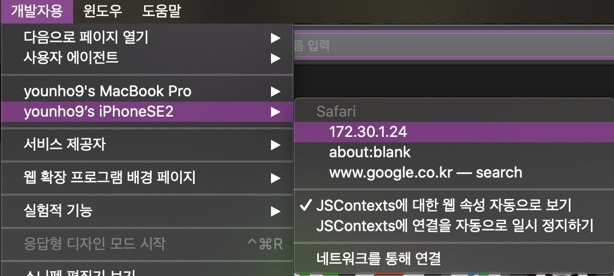
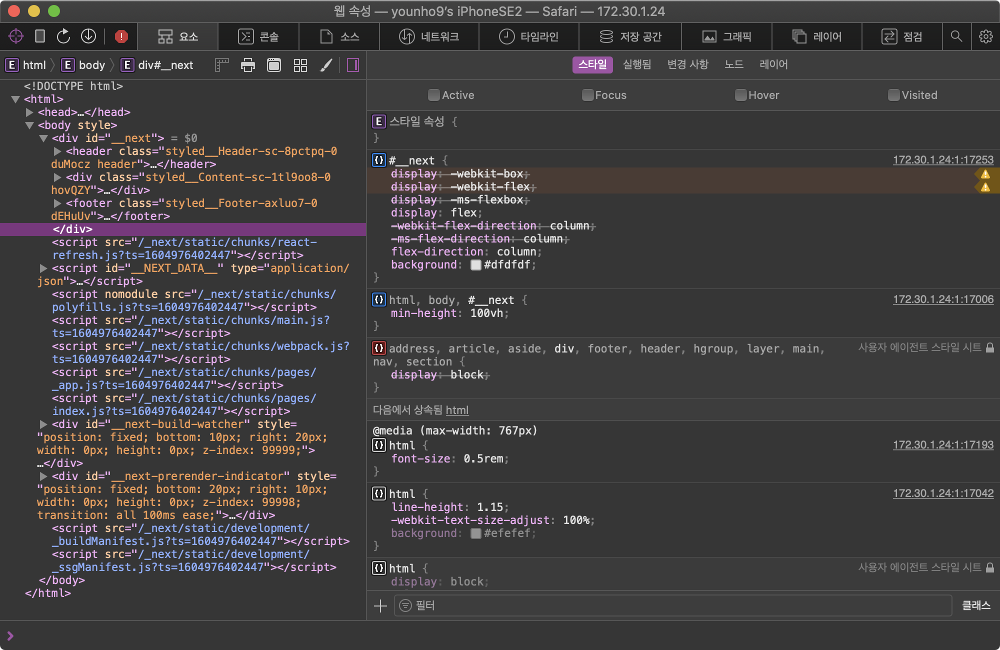

## 모바일 사파리 디버깅

- 아이폰을 맥북에 연결한다.

- 아이폰에서 디버깅하고자 하는 웹페이지를 Safari에 띄운다.

- 맥북에서 Safari를 실행한다.

- 개발자용 > iPhone > Safari 웹 페이지 선택

  

- 요소, 콘솔, 소스, 네트워크 등 사파리의 개발자 도구로 디버깅할 수 있다.

  

[Debugging Your iPhone Mobile Web App With Safari Dev Tools](https://medium.com/better-programming/debugging-your-iphone-mobile-web-app-using-safari-development-tools-71240657c487)

## 모바일 사파리를 맥의 Chrome에서 디버깅하기

모바일 Safari를 맥의 Chrome에서 디버깅하는 방법은 다음에 알아봐야겠다.

[Jon Sadka - How to debug an issue in Chrome for iOS using remote debugging](https://jonsadka.com/blog/how-to-debug-a-chrome-specific-bug-on-ios-using-remote-debugging)

## 리액트

- 리액트는 내부적으로 컴포넌트가 반환하는 엘리먼트들을 트리 형태로 관리하고 표현한다.

- 이를 Virtual-DOM으로 부르는데, 이는 JavaScript 일반 객체이다. (Plain Object)

- 기존 VanillaJS는 UI를 명령형으로 작성해야 하지만, React는 선언형으로 UI를 작성할 수 있다.

### 컴포넌트

- 컴포넌트는 내부에서 관리하는 상태 값인 `state` 와 부모 컴포넌트에서 내려 주는 속성 값 `props` 를 가진다.

- 컴포넌트는 `state` , `props` 가 변경되면 `render()` 함수가 실행되어 화면을 갱신한다.

- **UI 데이터(상태값과 속성값)로 뷰를 렌더링하는 것**이 리액트의 핵심이다.

- `setState` 는 비동기로 동작한다.

### 리액트의 렌더링 과정

- 컴포넌트의 Props나 State의 변경이 있을 때, 컴포넌트의 이전 상태 엘리먼트와 새로 만들어진 엘리먼트를 비교하고 실제 DOM의 업데이트 여부를 결정한다. 비교하여 찾은 변경 점에 대해서만 갱신한다.

- 컴포넌트의 `setState` 메서드가 수행되면, 해당 컴포넌트를 Dirty 체크하고, 다음 이벤트 루프에서 배치 작업으로 대상 컴포넌트들의 엘리먼트를 렌더링한다. (비동기)

- 이러한 리액트의 렌더링 과정을 다음과 같이 쪼갤 수 있다.

  - 변경 점을 찾는 Reconciliation의 Diffing 알고리즘 (render or reconciliation phase)

  - 변경 점을 실제 UI에 적용하는 ReactDOMComponent.updateComponent (commit phase)

#### Reconciliation: The diffing algorithm

Reconciliation은 어떤 변경에 대한 전/후 엘리먼트 트리를 비교(Diff)하여, 갱신이 필요한 부분만을 찾아 업데이트하는 것을 의미한다. 이를 통해 브라우저의 DOM 조작을 최소화시킨다.

> 다시 정리

- `render()` 에서 새로운 엘리먼트 트리를 생성

- 이전 엘리먼트 트리와 비교하여 변경 점을 찾아 업데이트

그런데 Diff 알고리즘은 O(n^3)의 시간복잡도를 가지고 있다. 리액트는 다음의 방법으로 O(n)에 근사한 **휴리스틱 알고리즘**을 구현하였다.

- **다른 타입의 두 엘리먼트는 다른 트리**를 만들 것이다.

- **같은 레벨의 엘리먼트에** **`key`** **프로퍼티**를 통해 변경되지 않아야 할 엘리먼트를 표시한다.

> ☝ 휴리스틱 알고리즘 : 직관에 의존하는 알고리즘. 즉 휴리스틱은 보통 합리적인 실행 시간을 가지지만 그것이 항상 그렇다는 어떠한 추론 과정이나 증명이 없다.

**같은 위치에서 엘리먼트의 타입이 다른 경우**

1. 기존 트리를 제거 후 새로운 트리를 만든다.

1. 기존 트리 제거 시 트리 내부(하위)의 엘리먼트/컴포넌트들은 모두 제거한다. (컴포넌트의 경우 제거되면서 `componentWillUnmount()` 가 실행됨.) 이전 트리의 모든 state가 사라진다.

1. 새로운 트리를 만들 때 내부 엘리먼트/컴포넌트들도 모두 새로 만든다. (컴포넌트의 경우 `componentDidMount()` 가 실행됨.)

**같은 위치에서 엘리먼트의 타입이 같은 경우**

1. 엘리먼트의 `attributes` 를 비교한다.

1. 변경된 `attributes` 만 업데이트한다.

1. 자식 엘리먼트들에 `diff` 알고리즘을 재귀적으로 적용한다.

**같은 위치에서 엘리먼트가 컴포넌트를 표현하고 그 타입이 같은 경우**

1. 컴포넌트 인스턴스 자체는 변하지 않는다. (state가 유지된다.)

1. 컴포넌트 인스턴스의 업데이트 전 라이프사이클 메서드 들이 호출되며 props가 업데이트 된다.

1. `render()` 를 호출하고 컴포넌트의 이전 엘리먼트 트리와 다음 엘리먼트 트리에 대해 diff 알고리즘을 재귀적으로 적용한다.

**자식 엘리먼트 재귀**

- 리액트는 자식 엘리먼트에 대한 반복적인 비교를 할 때 두 리스트를 순회하고 차이점이 있으면 변경을 생성한다.

- 정렬과 같은 상황에 취약하다.

**keys**

- 이를 해결하기 위해 자식 엘리먼트들이 key를 가지고 있다면 key를 통해 기존 트리와 이후 트리의 자식 들이 일치하는지 확인한다.

### Avoid Reconciliation

- 컴포넌트의 불필요한 렌더링을 피하기 위해 사용한다.

  - `ShouldComponentUpdate` 함수가 `return false` 하도록 한다.

  - 컴포넌트가 `PureComponent` 를 상속받도록 한다.

  - 함수형 컴포넌트를 `React.memo()` 로 감싸서 `export` 한다.

> ☝ 핵심은 해당 컴포넌트가 `state` , `props` 가 변경 되었을 때만 렌더링하도록 하는 것이다. 이것이 가능한 것은 리액트가 컴포넌트 렌더링 결과를 메모이징하는 것이다.

가장 좋은 케이스는 같은 부모 컴포넌트에 의해 같은 `props` 로 **자주 렌더링 될 때**이다. 이전 메모이징 결과와 `props` 가 같다면 내부를 비교하지 않고 메모이징 된 결과를 사용한다.

하지만 반대로 `props` 가 다른 경우가 대부분이라면, 이전 `props` 와 다음 `props` 비교를 하고, 컴포넌트 렌더링을 하기 때문에 불필요한 `props` 비교를 하게 만든다. 또한 메모이징은 메모리를 사용하기 때문에 남용해선 안된다.

> 처음부터 성능에 최적화된 애플리케이션을 설계하는 것 자체가 비효율적이다. 하지만 컴포넌트를 적절히 분리하는 것은 중요하다. 컴포넌트를 적절히 분리하여 이슈를 빠르게 파악하고 대응할 수 있도록 하는 것이 전략이다.

[UI 런타임으로서의 React](https://overreacted.io/ko/react-as-a-ui-runtime/)

[재조정 (Reconciliation) - React](https://ko.reactjs.org/docs/reconciliation.html#tradeoffs)

[성능 최적화 - React](https://ko.reactjs.org/docs/optimizing-performance.html)

[React 렌더링과 성능 알아보기 : TOAST Meetup](https://meetup.toast.com/posts/110)

[React.memo() 현명하게 사용하기](https://ui.toast.com/weekly-pick/ko_20190731)

### 리액트 훅(Hook)

#### 훅(Hook)이란?

- 함수 컴포넌트에서 React state를 연동(hook into)할 수 있게 해주는 함수.

- 즉 상태를 함수 컴포넌트에 동기화 해준다. (이 말은 상태가 함수 컴포넌트 외부에서 관리되고 있다는 의미를 내포함.)

#### 동기

- 컴포넌트 사이에서 상태와 관련된 로직을 재사용하기 어렵다.

  - render props, HOC와 같은 패턴은 래퍼를 깊게 만든다.

- 라이프사이클 메서드 들이 컴포넌트를 복잡하고 이해하기 어렵게 만든다.

- 클래스보다 함수가 직관적이다. `this` 바인딩

<br/>

#### 훅의 규칙

> ☝ 리액트는 훅이 **호출되는 순서**에 의존한다. (상태를 식별하기 위해 호출 순서를 사용하는 것으로 보인다.)

- 최상위(at the Top Level)에서만 훅을 호출해야 한다. (반복문, 조건문, 중첩된 함수 내에서 Hook을 호출하지 말라)

  ```javascript
  // 🔴 조건문에 Hook을 사용함으로써 첫 번째 규칙을 깼습니다
  if (name !== '') {
    useEffect(function persistForm() {
      localStorage.setItem('formData', name);
    });
  }
  ```

- 오직 React 함수 내에서 Hook을 호출해야 한다. (일반 JS 함수에서 호출하지 말라)

> ☝ 리액트의 훅은 렌더링 되는 개별 컴포넌트의 **한 수준 위의 외부 공간(실행 컨텍스트)**에 연결 리스트(배열)형태로 저장되는 데이터( `state` , `setter` )이다.
> 다른 컴포넌트와 공유되지 않고, 리렌더링되는 컴포넌트에서 엑세스할 수 있다.

### useState

useState에서 반환된 setter 함수를 사용하면, React에게 내부적으로 액션을 dispatch하게 되고, 이 컴포넌트가 new state를 가지고 있고, 업데이트 해야 된다는 것을 알린다.

[React hooks: not magic, just arrays](https://medium.com/@ryardley/react-hooks-not-magic-just-arrays-cd4f1857236e)

### useEffect

- 렌더링 이후(DOM 업데이트 후)에 수행할 "side effect"를 수행할 수 있다.

### Fiber

- virtualDOM의 증분 렌더링을 활성화하기 위함.

- `requestIdleCallback` 을 활용.

- 컴포넌트 트리에 대한 추가 정보를 포함하기 위한 내부 객체

- 내장 스택에 의존한 동기식 재귀 모델에서 링크드 리스트와 포인터가 있는 비동기식 모델로 알고리즘을 재구현함.

  - 호출 스택을 마음대로 중단하고 스택 프레임을 수동으로 조작하기 위해

[React Fiber Architecture - A Deep Dive](https://tusharsharma.dev/posts/react-fiber-architecture-a-deep-dive)
