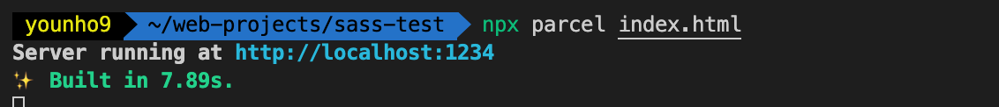

# Sass(SCSS) 개요

> ❗️ 해당 글은 [패스트캠퍼스 - 프론트엔드 개발 강의](https://www.fastcampus.co.kr/dev_online_react/)에서 HTML & CSS, SASS(SCSS) Part의 [박영웅 강사님](https://github.com/ParkYoungWoong)의 강의자료([Sass(SCSS) 완전 정복!](https://heropy.blog/2018/01/31/sass/))를 보며 정리한 것입니다.

## Sass(SCSS)

CSS는 쉬운 언어에 속하지만 문법이 원시적인 편이라 작업이 고도화될수록 복잡하고 불편해진다.

하지만 웹에서는 표준 CSS만 동작할 수 있다.

Sass는 CSS 전처리기(Preprocessor)로, CSS와 유사하고 보다 편리한 문법과 다양한 기능을 제공한다. 따라서 Sass로 보다 편하게 코드를 작성하면 CSS로 컴파일(Compile)한 이후 웹에서 동작할 수 있게 된다.

> ☝️ 다른 CSS 전처리기로 Less, Stylus가 있는데, Sass가 가장 오래된 CSS 확장 언어이며, 성숙도가 높고 커뮤니티가 발달되어 있다.

### Sass와 SCSS

Sass(Syntactically Awesome Style Sheets)의 3버전부터 등장한 SCSS(Sassy Cascading Style Sheets)는 이름처럼 CSS 문법을 살려 'Sass한 CSS'이다. 

CSS호환성을 갖춰 **CSS가 지원하는 모든 문법과 기능을** SCSS에서 그대로 사용할 수 있다.

```sass
// Sass
.box
	width: 100px
	height: 200px
	.content
		color: red
		float: left
```

```scss
// SCSS
.box {
  width: 100px;
  height: 200px;
  .content{
    color: blue;
    float: left;
  }
}
```

둘의 가장 큰 차이는 Sass는 선택자의 유효범위를 '들여쓰기'로 구분하고, SCSS는 중괄호( `{}` )로 구분한다는 것이다. 

CSS와의 호환성 때문에 SCSS의 방식이 선호된다.

> ☝️ 이외에도 `@mixin` , `@include` 등에서 차이가 있다.

### 컴파일 환경

#### SassMeister

간단하게 웹페이지에서 사용하는  Sass 컴파일러

 [SassMeister](https://www.sassmeister.com/)

#### Parcel

먼저 npm이 설치되어 있어야 한다.

[node.js 다운로드](https://nodejs.org/en/)

프로젝트에서

```bash
npm init -y
```

이후 Parcel을 설치한다

```bash
npm install --save-dev parcel-bundler
```

그리고 `<link>` 로 Sass 파일이 연결되어 있는 `index.html` 을 실행해본다.

```bash
npx parcel index.html
```



## Reference

[패스트캠퍼스 - 프론트엔드 개발 강의](https://www.fastcampus.co.kr/dev_online_react/) - HTML & CSS, SASS(SCSS) Part by [ParkYoungWoong](https://github.com/ParkYoungWoong)

[Sass(SCSS) 완전 정복!](https://heropy.blog/2018/01/31/sass/)
