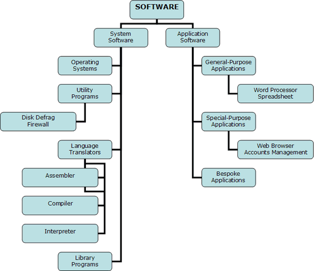

## 시스템 소프트웨어와 응용프로그램의 차이

### 응용프로그램(애플리케이션)

- 사용자에게 직접 서비스를 제공하는 것이 목적

- ex) 워드프로세서, 파워포인트 ...

### 시스템 소프트웨어

- 시스템 소프트웨어 : 다른 소프트웨어에 서비스를 제공하는 소프트웨어 플랫폼을 제공하는 것이 목적

- 기계 종속적(Machine Dependency)

- ex) 운영체제, 컴파일러, 디버거 ...

## 운영체제(OS)와 시스템 소프트웨어, 애플리케이션의 관계

운영체제 역시 시스템 소프트웨어라고 할 수 있고, 하드웨어의 리소스를 제어, 관리하는 역할을 한다. 운영체제가 제공하는 하드웨어 제어 및 관리는 범용성을 띄고 있기 때문에 각 애플리케이션의 특성을 반영하지 못하고, 따라서 어떤 애플리케이션은 어셈블리로 직접 하드웨어를 제어하기도 한다.

일반적으로 운영체제 위에서 애플리케이션이 동작함으로 애플리케이션은 운영체제에 종속된다. 운영체제에는 핵심이 되는 커널이 존재하며, 커널이 애플리케이션과 하드웨어를 연결시켜 주는 역할을 한다.

> 커널(Kernel)은 운영체제의 핵심이 되는 프로그램으로, 시스템의 모든 것을 완전히 통제한다. 핵심 역할은 1. 보안, 2. 자원 관리, 3. 추상화 이다.
> 출처 : [Wiki - 커널\_(컴퓨팅)](<https://ko.wikipedia.org/wiki/%EC%BB%A4%EB%84%90_(%EC%BB%B4%ED%93%A8%ED%8C%85)>)

## 시스템 소프트웨어의 종류

- 어셈블러(Assembler), 링커(Linker), 로더(Loader), 매크로 프로세서(Macro processor)

- 컴파일러(Compiler), 운영체제(Operating Systems)

- 입출력 장치 드라이버(I/O Device Driver)

- ...

### 시스템 소프트웨어의 목적

유저가 컴퓨터 머신이 내부적으로 어떻게 동작하는 지에 대한 세부사항을 모르더라도 응용프로그램이나 문제를 해결하는데 집중할 수 있도록 한다.

> 📌 가용한 자원의 효율적인 사용(To acheive efficient use of available resources)

## 참고자료

[시스템 소프트웨어란?(응용 소프트웨어와 시스템 소프트웨어의 차이)](http://dev.youngkyu.kr/5?category=577623)
