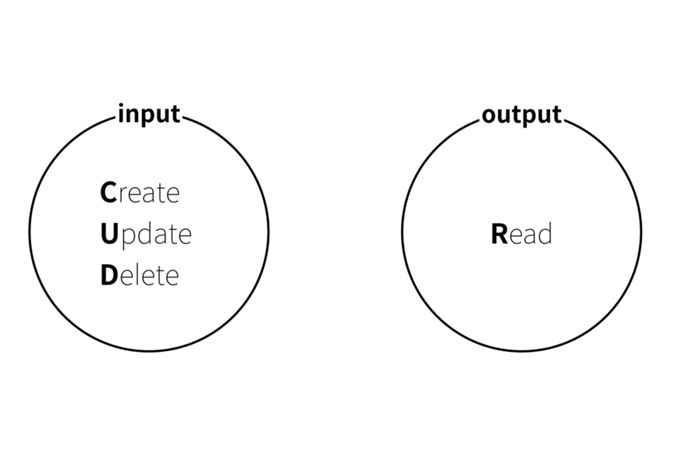
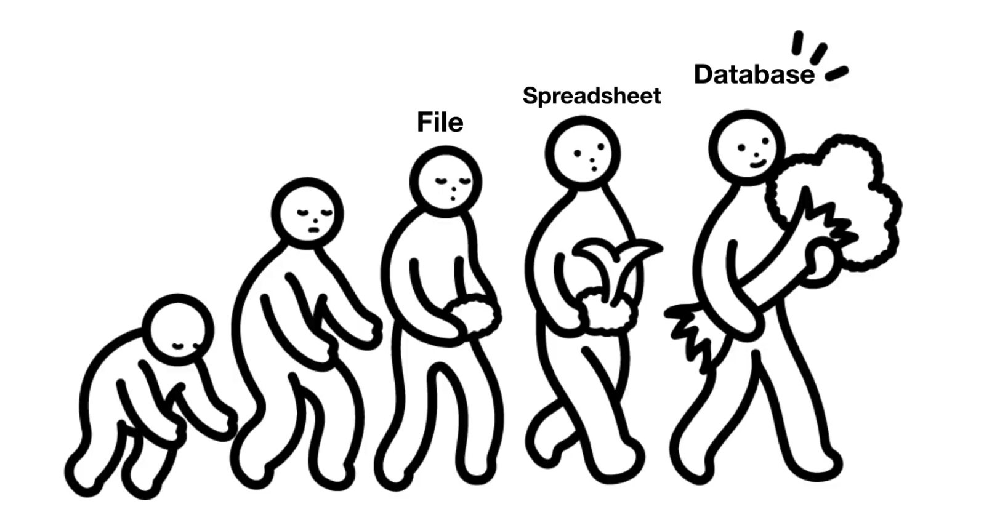
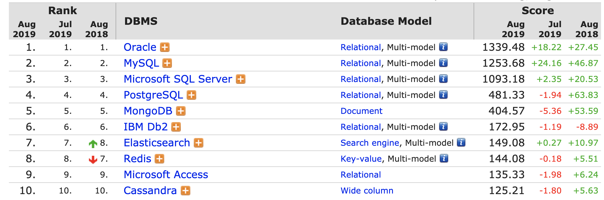
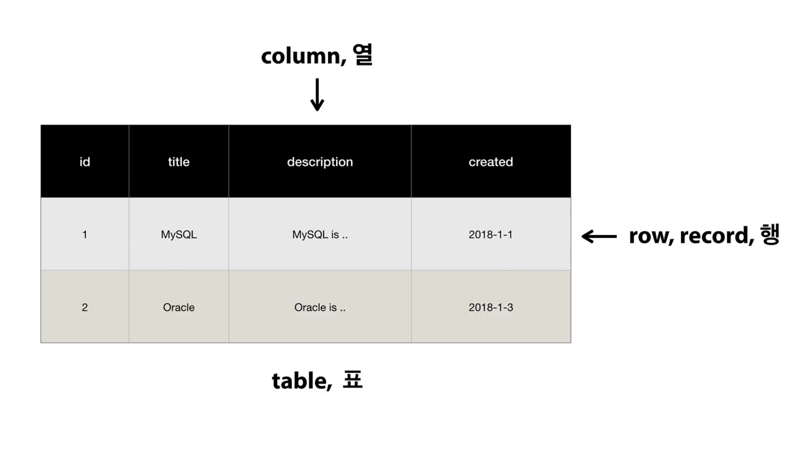

# Database 기초

## Database의 본질



- 입력 - 생성, 수정, 삭제
- 출력 - 읽기

### file vs database



> `Database` 는 프로그래밍 언어를 이용해서 `CRUD` 할 수 있다.
>
> 자동화할 수 있다.

### 수업을 마치며

- 어떤 데이터베이스를 선택할 것인가



> 관계형 데이터베이스 ( `Oracle` `MySQL` ... ) : 오랜 시간 시장을 장악.
>
> 비-관계형 데이터베이스 ( `MongoDB` ... ) : 최근의 `NoSQL` 흐름.

- `Oracle` : 유료. 자금력이 있는 대기업, 관공서에서 사용. 보안이 중요한 데이터베이스. (금융)
- `MySQL` : 무료. open source. 신뢰성이 아주 중요하지는 않은 데이터베이스 (SNS)
- `MongoDB` : 비관계형 데이터베이스.

## Database - MySQL

file만으로 데이터를 입력, 출력하는 것이 어려워짐에 따라 데이터베이스의 필요성이 드러남.

1960년대 - Relational database의 등장 (현재까지 절대 강자로 군림하고 있음)

데이터를 표의 형태로 정리 정돈, 정렬, 검색과 같은 작업을 빠르고 편리하고 안전하게 할 수 있다.

MySQL, Oracle, SQL Server, PostgreSQL, DB2, Access ...

1994년 MySQL 등장

- 무료
- 오픈 소스
- 관계형 데이터베이스의 주요한 기능을 대부분 갖추고 있는 준수한 데이터베이스 시스템
- WEB이 등장하면서 웹 개발자들은 WEB Page에 사용할 데이터베이스를 찾게 되었고 무료인 MySQL이 매우 좋은 대안이었음.
- WEB과 함께 폭발적인 성장.

스프레드시트는 마우스 또는 키보드로 입력해야 함. 

데이터베이스는 프로그래밍 언어를 이용해 할 수 있음. 

## MySQL의 구조

표 < database < schema < database < database server

- 보안 (차등적인 권한을 줄 수 있다.)
- root : 모든 권한이 열려있다.

```bash
/usr/local/mysql/bin$ ./mysql -uroot -p
```

## 스키마의 사용

### 데이터베이스 만들기

```mysql
CREATE DATABASE dbname;
```

### 데이터베이스 삭제하기

```mysql
DROP DATABASE dbname;
```

### 데이터베이스 사용하기

```mysql
USE dbname;
```

### 데이터베이스 보기

```mysql
SHOW DATABASES;
```


- SQL(Structured Query Language) 
- Structured: 구조화된 / 정리정돈된 데이터베이스를
- Query: CRUD를 요청할 수 있게
- Language: 데이터베이스 서버와 유저가 소통할 수 있는 언어로 구현한 프로그램.



### Table 만들기

```mysql
CREATE TABLE topic(
	id INT(11) NOT NULL AUTO_INCREMENT,
	title VARCHAR(100) NOT NULL,
	description TEXT NULL,
	created DATATIME NOT NULL,
	author VARCHAR(30) NULL,
	profile VARCHAR(100) NULL,
	PRIMARY KEY(id)
)
```

### Table 보기

```mysql
SHOW TABLES; // table 목록 보기
DESC table_name; // table 구조 보기
SELECT * FROM topic;
SELECT id,title,created,author FROM topic; // 정해진 column만 보기
```

### INSERT

```mysql
INSERT INTO table_name (column1, column2 ...) VALUES('value1', 'value2' ...)
```

- `NOW()` : 현재 시간 함수

### SELECT 

https://dev.mysql.com/doc/refman/8.0/en/select.html

### READ

