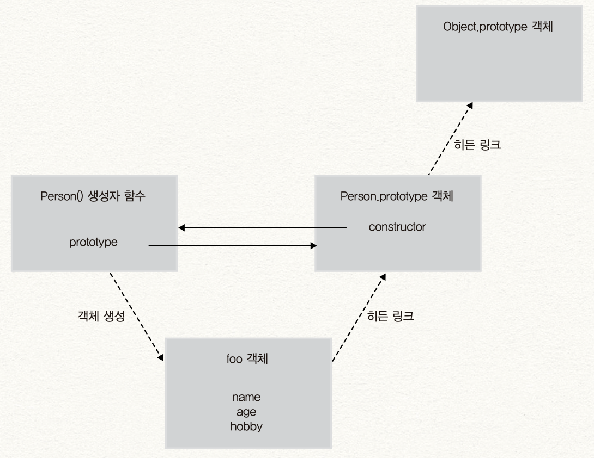

# 4. 함수와 프로토타입 체이닝 - 3

> 이 글은 고현준, 송형주 님의 [인사이드 자바스크립트](https://g.co/kgs/K6Laug)를 참조하여 작성한 글입니다.

> 📌 Table of Contents

## 프로토타입 체이닝

### 프로토타입의 두 가지 의미

JS는 C++이나 Java 같은 객체지향 언어와 다른 **프로토타입 기반의 객체지향 프로그래밍**을 지원한다.

JS가 어떻게 OOP 기능을 제공하는지 이해하려면, **프로토타입과 프로토타입 체이닝**에 대해 제대로 이해해야 한다.

Java와 같은 객체지향 프로그래밍에서는 클래스를 정의하고 이를 통해 객체를 생성하지만 JS에는 클래스 개념이 없다. 대신에 객체 리터럴이나, 생성자 함수로 객체를 생성하는데, 이렇게 **생성된 객체의 부모 객체가 바로** **`Prototype`** **객체**다. 자식 객체는 부모 객체가 가진 프로퍼티 접근이나 메소드 호출이 가능하다.

> ☝️ 참고로 최근의 ES6 문법에서는 `Class` 문법이 추가되었으나 자바스크립트가 클래스 기반으로 바뀌었다는 것은 아니다.

JS의 모든 객체는 자신의 부모인 `Prototype` 객체를 가리키는 숨겨진 프로퍼티가 있는데 ECMAScript에서는 이를 **암묵적 프로토 타입 링크(Implicit prototype link)**라고 부르며 **`[[Prototype]]`** **라는 숨겨진 프로퍼티**에 저장된다. (크롬이나 파이어폭스 같은 브라우저에서는 이를 **`__proto__`** **프로퍼티**로 **명시적으로** 제공하고 있다.)

그런데 함수 객체가 가지는 **`prototype`** **프로퍼티**와 객체의 숨은 프로퍼티 **`[[Prototype]]`** **링크**를 구분해야 한다. 이것이 바로 헷갈리기 쉬운 프로토타입의 두 가지 의미이다.

#### `prototype` 프로퍼티

JS에서 함수를 정의하면, 함수 생성과 동시에 `Prototype` 객체 가 생성된다. 그리고 생성된 함수는 **`prototype`** **프로퍼티**를 통해 `Prototype` 객체를 가리키게 된다.

`Prototype` 객체는 일반적인 객체와 같으며, 기본 속성으로 `constructor` 와 `__proto__` 를 가지고 있다. 그리고 `constructor` 속성은 `Prototype` 객체와 함께 생성되었던 함수를 가리킨다.

```javascript
function myFunc() {}
console.dir(myFunc);
```

[출력 결과]


#### `[[Prototype]]` 링크( `__proto__` )

이 `[[Prototype]]` 링크 속성은 **모든 객체가 가지고 있는 속성**이다. 이 속성은 이 **객체를 생성한 생성자 함수의** **`prototype`** **프로퍼티가 가리키는** `Prototype` **객체**를 가리키고, 링크로 연결해 **자신의 부모 객체로 설정**한다.

```javascript
// Person 생성자 함수
function Person(name) {
  this.name = name;
}

// foo 객체 생성
var foo = new Person('foo');

console.dir(Person);
console.dir(foo);
```

[출력 결과]


결과를 보면 `Person()` 생성자 함수의 `prototype` 프로퍼티와 `foo` 객체의 `__proto__` 프로퍼티가 같은 `Prototype` 객체를 가리키고 있다.

또한 해당 `Prototype` 객체는 `constructor()` 프로퍼티가 `Person()` 생성자 함수를 가리키고 있다.


JS의 객체 생성 방식을 다시 한번 정리하면 이렇다.

1. 생성자 함수( `Person()` )를 정의하면, 함수와 동시에 `Prototype` 객체( `Person.prototype` )이 생성된다.

1. `Person` 함수의 `prototype` 프로퍼티는 `Person.prototype` 을 가리키고, `Person.prototype.constructor` 가 `Person()` 함수를 가리킨다.

1. `Person()` 함수로 생성된 객체( `foo` )는 `Person()` 함수의 `prototype` 프로퍼티가 가리키는 `Prototype` 객체를 `[[Prototype]]` 링크로 연결한다. (`__proto__` )

### 객체 리터럴 방식으로 생성된 프로토타입 체이닝

객체 리터럴 방식으로 객체를 생성하는 것도 결국 내부에서는 생성자 함수 `Object()` 를 사용하는 것임을 기억하자.

그리고 JS에서 객체는 자기 자신의 프로퍼티뿐만 아니라, 자신의 부모 역할을 하는 `Prototype` 객체의 프로퍼티를 자신의 것으로 접근하는 것이 가능하다. 이를 **프로토타입 체이닝**이라고 한다.

```javascript
var myObject = {
  name: 'foo',
  sayName: function () {
    console.log('My Name is ' + this.name);
  },
};

myObject.sayName(); // My Name is foo
console.log(myObject.hasOwnProperty('name')); // true
console.log(myObject.hasOwnProperty('nickName')); // false
myObject.sayNickName(); // Uncaught TypeError: Object #<Object> has no method 'sayNickName'
```

`myObject` 는 `name` 프로퍼티와 `sayName()` 메소드를 가진 객체이다. `sayName()` 메소드는 제대로 출력되지만, `sayNickName()` 메소드는 `myObject` 의 메소드가 아니므로 에러가 발생한다.

그런데 `myObject` 에는 `hasOwnProperty()` 라는 메소드가 없음에도 결과가 정상적으로 출력됐다.

이유는 다음과 같다.

1. 객체 리터럴로 생성된 객체도 내장 생성자 함수 `Object()` 를 통해 생성된 것이다.

1. 생성자 함수 `Object()` 역시 함수 객체이므로 `prototype` 프로퍼티를 갖고 있고, `Object.prototype` 객체를 가리키고 있다.

1. 생성자 함수 `Object()` 를 통해 생성된 `myObject` 객체는 `Object()` 함수의 `prototype` 프로퍼티가 가리키는 `Object.prototype` 객체를 `[[Prototype]]` 링크로 연결한다.

1. JS에서 특정 객체의 프로퍼티나 메소드에 접근하려고 할 때, 접근하려는 프로퍼티 또는 메소드가 없다면, `[[Prototype]]` 링크를 따라 자신의 부모 역할을 하는 `Prototype` 객체의 프로퍼티 또는 메소드를 차례대로 검색한다. (이를 **프로토타입 체이닝**이라고 한다.)

1. `Object.prototype` 객체는 모든 객체의 조상 역할을 하는 객체로서, `toString()` , `hasOwnProperty()` 등의 표준 메소드를 갖고 있으므로, 이를 사용할 수 있다.


### 생성자 함수로 생성된 객체의 프로토타입 체이닝

그러면 객체 리터럴 방식이 아닌, 직접 정의한 생성자 함수로 객체를 생성하는 경우 어떻게 프로토타입 체이닝이 동작하는지 알아보자.

```javascript
// Person() 생성자 함수
function Person(name, age, hobby) {
  this.name = name;
  this.age = age;
  this.hobby = hobby;
}

// foo 객체 생성
var foo = new Person('foo', 30, 'tennis');

// 프로토타입 체이닝
console.log(foo.hasOwnProperty('name')); // true

// Person.prototype 객체 출력
console.dir(Person.prototype);
```

위의 예제에서 `foo` 객체의 생성자는 `Person()` 함수이다. 따라서 `foo` 객체의 `Prototype` 객체는 자신을 생성한 `Person()` 함수의 `prototype` 프로퍼티가 가리키는 객체( `Person.prototype` )가 된다.

그런데 어떻게 `Object.prototype` 객체가 갖고 있는 표준 메소드인 `hasOwnProperty()` 를 사용할 수 있었을까?

1. `foo.hasOwnProperty()` 메소드를 호출했을 때 `foo` 객체에는 `foo.hasOwnProperty()` 메소드가 없기 때문에 프로토타입 체이닝으로 부모 객체인 `Person.prototype` 에서 `hasOwnProperty()` 메소드를 찾는다.

1. 하지만, `Person.prototype` 객체는 디폴트로 `constructor` 프로퍼티만을 갖고 있으므로 `hasOwnProperty()` 메소드가 없다.

1. `Person.prototype` 객체 역시 JS 객체로, 모든 객체의 부모인 `Object.prototype` 을 `Prototype` 객체로 가진다. 따라서, `Object.prototype` 에서 `hasOwnProperty()` 를 다시 검색하는 프로토타입 체이닝이 한번 더 일어나고, 표준 메소드들을 사용할 수 있다.



이렇게 객체 리터럴 방식과 직접 정의한 생성자 함수에서의 프로토타입 체이닝 방법에서 조금 차이가 있지만 결국 원칙은 같다.

> "자바스크립트에서 모든 객체는 자신을 생성한 생성자 함수의 `prototype` 프로퍼티가 가리키는 객체를 자신의 `Prototype` 객체(부모 객체)로 취급한다."

### 프로토타입 체이닝의 종점

앞서 살펴본 것처럼, `Object.prototype` 객체는 **프로토타입 체이닝의 종점**이다. 방식에 상관 없이 모든 객체는 프로토타입 체이닝으로 `Object.prototype` 객체가 가진 프로퍼티와 메소드에 접근 가능하고 서로 공유 가능하다.

### 기본 데이터 타입 확장

JS의 숫자, 문자열, 배열 등에서 사용하는 표준 메소드들의 경우 이들의 프로토타입인 `Number.prototype` , `String.prototype` , `Array.prototype` 에 정의되어 있다. 또한 이들 역시 `Object.prototype` 을 자신의 프로토타입으로 갖고 있어서 `Object.prototype` 의 메소드 역시 사용할 수 있다.

또한 JS는 표준 빌트인 `Prototype` 객체에 사용자가 직접 메소드를 정의해 추가하는 것을 허용한다.

```javascript
String.prototype.testMethod = function () {
  console.log('This is the String.prototype.testMethod()');
};

var str = 'This is test';
str.testMethod();

console.dir(String.prototype);
```

[출력 결과]


### 프로토타입도 자바스크립트 객체다

함수가 생성될 때, 자신의 `prototype` 프로퍼티에 연결되는 `Prototype` 객체는 디폴트로 `constructor` 프로퍼티만을 가진 객체다. 다시 말해 **`Prototype`** **객체 역시 자바스크립트 객체**이다.

즉, 일반 객체처럼 동적 프로퍼티 추가/삭제가 가능하다. 이렇게 변경된 프로퍼티는 실시간으로 프로토타입 체이닝에 반영된다.

```javascript
// Person 생성자 함수
function Person(name) {
  this.name = name;
}

// foo 객체 생성
var foo = new Person('foo');

// foo.sayHello();
// 이 시점에는 sayHello() 메소드가 foo 객체와 Person.prototype 객체 모두에 정의되어 있지 않으므로 에러가 발생한다.

// Prototype 객체에 sayHello() 메소드 정의
Person.prototype.sayHello = function () {
  console.log('Hello');
};

foo.sayHello(); // Hello
```

`foo` 객체의 `Prototype` 객체인 `Person.prototype` 객체에 동적으로 `sayHello()` 메소드를 추가한 이후에는 `foo` 객체에 `sayHello()` 메소드가 없지만 프로토타입 체이닝으로 'Hello' 가 출력된다.

### 프로토타입 메소드와 `this` 바인딩

`Prototype` 객체는 메소드를 가질 수 있다. (이를 짧게 **프로토타입 메소드**라고 부르기도 함.)

만약 프로토타입 메소드 내부에서 `this` 를 사용한다면 이는 어디에 바인딩될 것인가?

이는 앞서 살펴본 객체의 메소드를 호출할 때 `this` 바인딩 규칙과 동일하다. 즉 `this` 가 메소드를 호출한 객체에 바인딩된다.

```javascript
// Person() 생성자 함수
function Person(name) {
  this.name = name;
}

// getName() 프로토타입 메소드
Person.prototype.getName = function () {
  return this.name;
};

// foo 객체 생성
var foo = new Person('foo');

console.log(foo.getName()); // foo

// Person.prototype 객체에 name 프로퍼티 동적 추가
Person.prototype.name = 'person';

console.log(Person.prototype.getName()); // person
```

### 디폴트 프로토타입은 다른 객체로 변경이 가능하다

앞에서 살펴본 것처럼 JS에서는 함수를 정의할 때, 함수 생성과 동시에 `Prototype` 객체가 생성되고, 생성된 함수의 `prototype` 프로퍼티가 `Prototype` 객체를 가리킨다.

이 함수 생성과 동시에 생성되는 `Prototype` 객체를 **디폴트 프로토타입**이라고 한다. 그런데, 이 디폴트 프로토타입 객체를 다른 일반 객체로 변경하는 것이 가능하다.

```javascript
// Person() 생성자 함수
function Person(name) {
  this.name = name;
}
console.log(Person.prototype.constructor);

// foo 객체 생성
var foo = new Person('foo');
console.log(foo.country);

// 디폴트 프로토타입 객체 변경
Person.prototype = {
  country: 'korea',
};
console.log(Person.prototype.constructor);

// bar 객체 생성
var bar = new Person('bar');
console.log(foo.country);
console.log(bar.country);
console.log(foo.constructor);
console.log(bar.constructor);
```

[출력 결과]


그런데 주의해야할 점이 있는데, 생성자 함수의 `prototype` 프로퍼티를 다른 일반 객체로 변경하면, 변경한 이후에 생성된 객체들은 변경된 `Prototype` 객체로 `[[Prototype]]` 링크를 연결한지만, 이전에 생성된 객체들은 기존 `Prototype` 객체로 `[[Prototype]]` 링크를 유지한다.


### 객체의 프로퍼티 읽기나 메소드를 실행할 때만 프로토타입 체이닝이 동작한다

프로토타입 체이닝은 객체의 프로퍼티를 읽으려고할 때, 메소드를 실행할 때만 동작하고 반대로 객체에 있는 특정 프로퍼티에 값을 쓰려고 할 때는 프로토타입 체이닝이 일어나지 않는다. 객체에 없는 프로퍼티에 값을 쓰려고 할 경우에는 동적으로 객체에 프로퍼티를 추가하기 때문이다.

```javascript
// Person() 생성자 함수
function Person(name) {
  this.name = name;
}

Person.prototype.country = 'Korea';

var foo = new Person('foo');
var bar = new Person('bar');
console.log(foo.country); // Korea
console.log(bar.country); // Korea

foo.country = 'USA';

console.log(foo.country); // USA
console.log(bar.country); // Korea
```

`foo.country` 를 'USA'로 수정하였지만, `bar.country` 는 그대로 'Korea'인데, 이는 `Person.prototype.country` 가 수정되지 않았기 때문이다.

## 참고자료

[🔗 [Javascript ] 프로토타입 이해하기](https://medium.com/@bluesh55/javascript-prototype-%EC%9D%B4%ED%95%B4%ED%95%98%EA%B8%B0-f8e67c286b67)

[🔗 Javascript 기초 - Object prototype 이해하기](http://insanehong.kr/post/javascript-prototype/)
