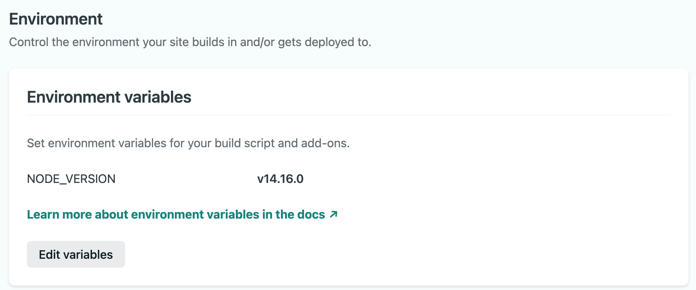

## 에러 상황

Netlify 배포 로그에서 다음과 같은 에러가 발생했다.

```plain text
12:27:26 PM: yarn install v1.17.0
12:27:26 PM: [1/4] Resolving packages...
12:27:27 PM: [2/4] Fetching packages...
12:27:53 PM: error @docusaurus/core@2.0.0-alpha.72: The engine "node" is incompatible with this module. Expected version ">=12.13.0". Got "10.24.0"
```

특정 의존 패키지의 node 호환성이 12.13.0 버전 이상을 요구했다.

<br />

## 해결 방법

Netify의 환경변수 설정 방법을 보고 현재 Node LTS 버전으로 환경변수를 설정했다.

[Build environment variables](https://docs.netlify.com/configure-builds/environment-variables/?_ga=2.261710157.1369896613.1616900979-1392009064.1614316322#netlify-configuration-variables)



이제 Deploy logs 에서 v14.16.0 버전을 다운받아 배포 환경으로 사용하게 되었다.

```plain text
12:37:40 PM: Started restoring cached node version
12:37:44 PM: Finished restoring cached node version
12:37:45 PM: Downloading and installing node v14.16.0...
12:37:45 PM: Downloading https://nodejs.org/dist/v14.16.0/node-v14.16.0-linux-x64.tar.xz...
12:37:45 PM: Computing checksum with sha256sum
```

<br />
