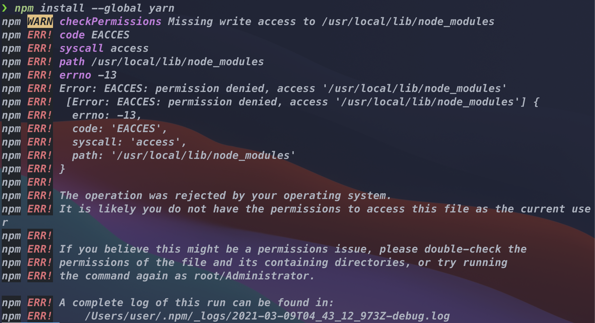

## 에러 상황

NPM을 처음 설치하고 `global` 옵션으로 `yarn` 을 설치하려고 할 때 에러가 발생했다.

```bash
Missing write access to /usr/local/lib/node_modules
```



해당 디렉토리에 쓰기 권한이 없다는 뜻이기 때문에, 다음의 명령어를 실행한다.

```bash
sudo chown -R $USER /usr/local/lib/node_modules
```

<br />
