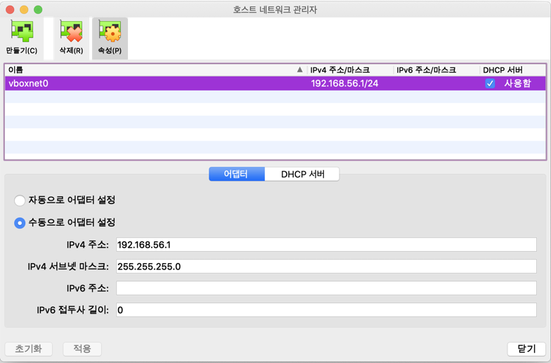
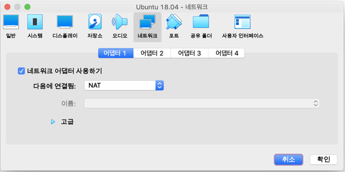
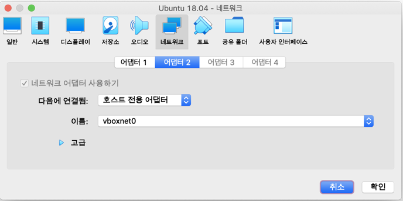
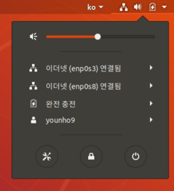
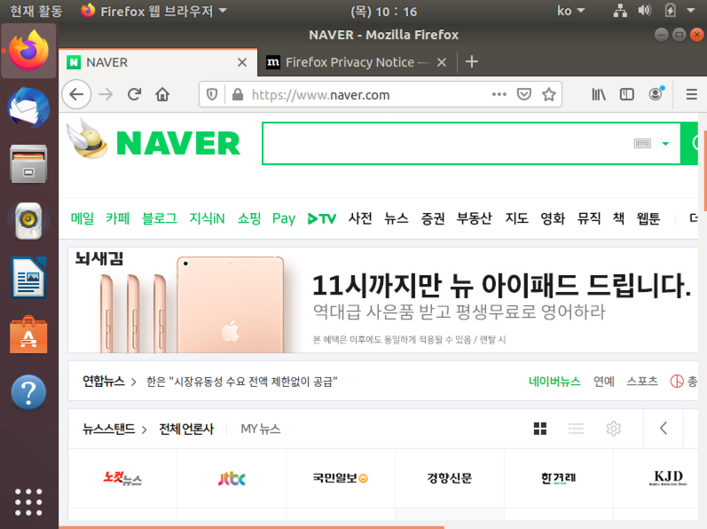
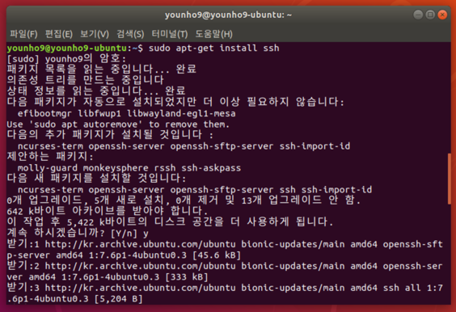
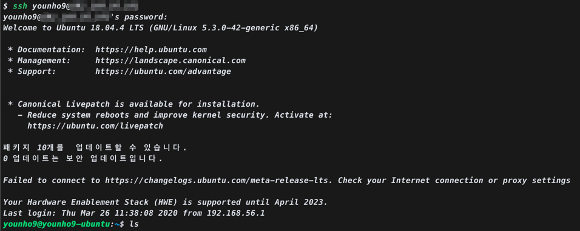
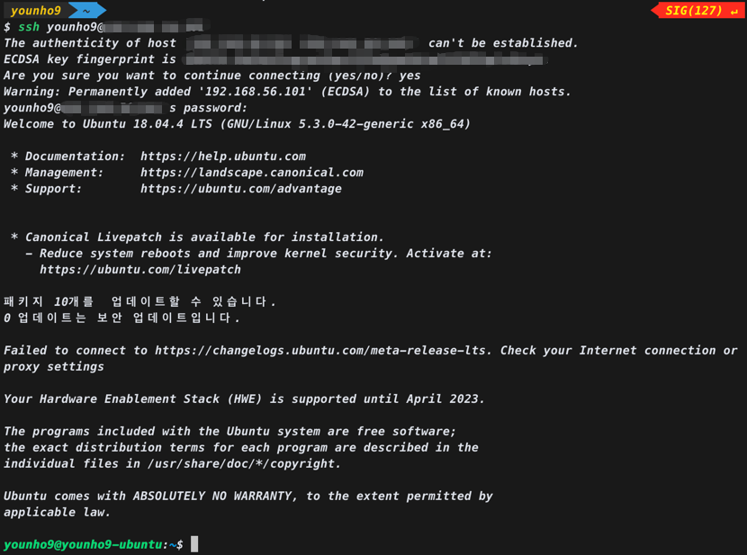
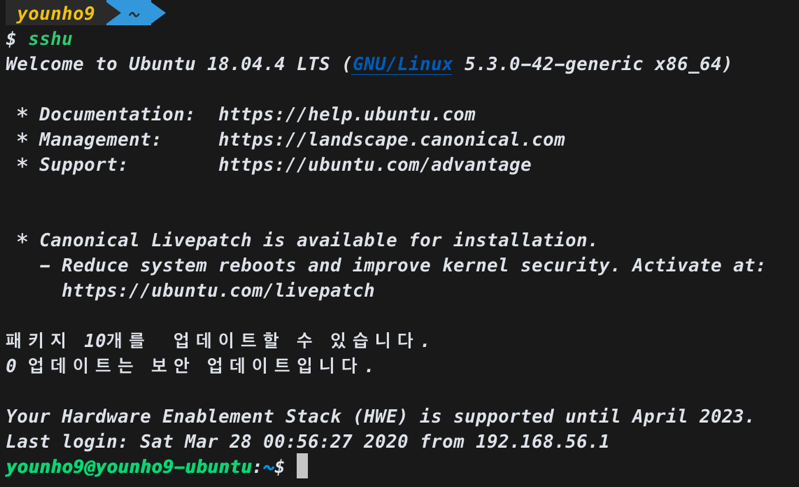

## 가상머신은 느리다.

> 대학생으로서 쓰는 리눅스(Linux) 설치기 - 2편

지난 글에서 버추얼박스(VirtualBox)에 우분투(Ubuntu)를 설치하는 법을 다뤘다. 설치
하고 사용해본 소감은 **"너무 느리고 불편하다"** 였다. 내가 느끼기에 불편한 점은
대략 이정도 였다.

- 구글링하려면 너무 느려서 맥에서 해야함

- 구글링하고 코드 복붙하는데 단축키가 다름

- 우분투 터미널에서 터치패드로 스크롤하는 속도가 너무 빠름

- 맥북에서 비행기 이륙하는 소리가 들림

<br />

버추얼박스 설정을 통해 가상머신에 CPU와 메모리를 많이 할당해주면 빨라질 것이고,
단축키도 세팅할 수 있지만 아무래도 익숙하지 않았다.

리눅스를 쓰는 현재 목적이 대학교 실습과 과제를 수행하기 위해서이기 때문에 프로그
래밍하는 환경을 개선하는 것을 목표로 구글링을 해보았고, 찾은 해결책은 SSH를 통해
버추얼박스에 설치된 우분투 서버에 접속하는 것이었다.

이 역시 세팅하는 법이 까다로웠기 때문에 글로 남겨놓는다.

<br />

## 버추얼박스 설정

먼저 맥의 VirtualBox > 파일 > 호스트 네트워크 관리자로 들어가서 네트워크 어댑터
를 만들어 준다.


<br />

만들고 나면 vboxnet()이라는 어댑터가 생성되는 것을 볼 수 있다.



<br />

맥 터미널에서 ifconfig으로 확인해보면 vboxnet() 인터페이스가 추가된 것을 확인할
수 있다.


<br />

그리고 나서 VirtualBox 관리자의 우분투 설정에서 네트워크를 확인해보면, 기본적으
로 어댑터 1이 NAT로 설정되어 있는 것을 확인할 수 있다.



<br />

일단 먼저 어댑터 2에서 추가했던 vboxnet() 호스트 전용 어댑터를 추가해준다.



<br />

## 우분투 설정

그리고나서 우분투에 들어가서 인터넷 연결 상태를 확인해본다. 설정된 네트워크 2개
가 연결됨 상태로 되어 있으면 정상이다.



<br />

우분투에서 firefox 브라우저도 잘 동작하는지 확인해본다.



<br />

### ssh & ifconfig

우분투에서 ifconfig을 통해 ip주소를 알아야 한다. 초기에 ifconfig이 설치되어 있지
않다면 아래의 명령어로 설치할 수 있다. 이 때 우분투 계정 암호가 필요하다.

```bash
sudo apt install net-tools
```


<br />

설치가 된 이후 다시 ifconfig을 해보면 두 개의 네트워크 인터페이스가 나오는데,
`enp0s3` , `enp0s8` 이다. 이 때 `enp0s8` 가 어댑터 2로 연결한 vboxnet()이고, 이
어댑터의 inet 뒤로 이어지는 ipv4 주소가 필요하다.


여기의 ipv4 주소가 `192.168.56.xxx` 라 하면 맥(호스트)에서 ssh로 이 주소를 통해
접근할 수 있다.

<br />

이제 우분투에서 ssh 서버를 오픈해주어야 한다. 먼저 ssh가 설치되어 있지 않다면 아
래의 명령어로 설치할 수 있다. 역시 우분투 계정 암호가 필요하다.

```bash
sudo apt-get install ssh
```



<br />

설치가 완료되면 `service ssh start` 명령어로 ssh 서버를 오픈한다.
`ps -ef | grep ssh` ssh 프로그램이 성공적으로 실행되는지 확인할 수 있다. sshd 라
고 되어있는 프로세스가 보인다면 서버가 성공적으로 열린 것이다. 서버를 닫는 명령
어는 `service ssh stop` 이다.

```bash
service ssh start
ps -ef | grep ssh
```


<br />

이제 우분투 설정이 완료되었다.

<br />

## 맥 터미널에서 ssh로 우분투 접속

우분투에서 확인한 ipv4 주소로 맥 터미널에서 ssh로 접속할 수 있다. ipv4 주소가
`192.168.56.xxx` 라면 맥에서 터미널을 실행하고 `ssh username@192.168.56.xxx` 를
실행한다. 우분투의 암호를 입력하면 아래와 같은 내용이 출력되고 우분투 서버에 접
속하게 된다.

이제 맥 터미널에서 프로그래밍할 수 있다!



<br />

맥 터미널에서 우분투 서버에서 나오고 싶다면 `exit` 을 사용하면 된다.


<br />

## 추가 세팅

### ssh 키 등록

맥에서 우분투에 접속하기 위해 `ssh username@192.168.56.xxx` 를 입력하면 암호를입
력해야 한다. 이 암호 입력 과정을 ssh 키를 등록하면 생략할 수 있다.

아래의 링크를 통해 원리를 확인할 수 있다.

[SSH Key - 비밀번호 없이 로그인 - 원격제어](https://opentutorials.org/module/432/3742)

<br />

서버가 Public key를 갖고 있고, 클라이언트가 Private key를 통해 서버에 접근하는방
식인데, 키 페어는 클라이언트 측에서 만든다. 따라서 우분투(서버)에 접속하려는맥(
클라이언트)에서 키를 만든다.

`ssh-keygen -t rsa` 를 실행해 ssh 키 페어를 만든다. `-t rsa` 는 `rsa` 라는 암호
화 방식으로 키를 생성한다는 뜻이다.

```bash
$ ssh-keygen -t rsa
Generating public/private rsa key pair.
```

SSH 키를 저장할 위치를 지정하는데 엔터를 누르면 기본 경로 (\$HOME/.ssh)에 저장된
다. 그리고 passphrase를 입력하는데 passphrase는 일종의 비밀번호로 비공개키를 입
력한 값으로 암호화하는데 자동 로그인을 원한다면 생략해야한다.

비밀번호를 확인하면 같은 값으로 생략하면 되고, 그러면 키가 생성된다.

아래의 명령으로 키를 확인할 수 있다.

```bash
ls -al ~/.ssh/
```

<br />

그러면 이제 Public key를 우분투 서버에 추가해주면 된다. 아래의 명령으로 우분투서
버로 파일을 보낼 수 있다.

```bash
scp $HOME/.ssh/id_rsa.pub username@192.168.56.xxx:id_rsa.pub
```

`192.168.56.xxx` 는 우분투의 ipv4 주소이다.

아래의 사진처럼 결과가 출력되면 성공이다.


<br />

그리고 전송된 id_rsa.pub 파일을 우분투의 `$HOME/.ssh/authorized_keys` 에 추가해
준다. 우분투에서 아래의 명령으로 추가할 수 있다.

```bash
cat $HOME/id_rsa.pub >> $HOME/.ssh/authorized_keys
```

<br />

만약 우분투에 `/.ssh` 디렉토리나 `authorized_keys` 파일이 없다면 먼저 id_rsa.pub
파일 내용을 화면에 출력하고, 키 내용을 복사한다.

그리고 홈 디렉토리에서 `mkdir ~/.ssh` 로 디렉토리를 만들어준다. 그리고
`echo [public_key_string] >> ~/.ssh/authorized_keys` 를 실행한다.

```bash
cat ~/.ssh/id_rsa.pub
mkdir ~/.ssh
echo [public_key_string] >> ~/.ssh/authorized_keys
```

<br />

성공적으로 키 페어가 클라이언트와 서버에 저장되면 호스트에서 암호 입력 없이 ssh
로 접속할 수 있다. 만약 처음 ssh로 접속하는 것이면 아래의 메시지가 출력된다.

```plain text
The authenticity of host 'foo.bar.com (111.111.11.111)' can't be established.
ECDSA key fingerprint is fd:fd:d4:f9:77:fe:73:84:e1:55:00:ad:d6:6d:22:fe.
Are you sure you want to continue connecting (yes/no)? yes
```



성공!

<br />

### alias 등록

마지막으로 맥 터미널에서 매번 `ssh username@192.168.56.xxx` 의 명령어를 입력하는
것이 상당히 불편하므로 쉘의 run command에 alias를 등록해준다.

맥에서 bash를 사용한다면 ~/bash_profile 에, zsh를 사용한다면 ~/zshrc에 alias를등
록하면 사용자가 지정한 단축 명령만으로 원하는 명령어를 실행할 수 있다.

vim으로 ~/bash_profile 또는 ~/zshrc 를 열고, 다음 내용을 추가한다. 본인은 우분투
에 접속한다는 뜻으로 `sshu` 라는 별칭을 사용하였다.

```bash
alias sshu="ssh username@192.168.52.xxx"
```


<br />

그리고 쉘을 다시 실행해준다.

```bash
# bash를 사용할 경우
source ~/.bash_profile

# zsh를 사용할 경우
source ~/.zshrc
```

<br />

이제 `sshu` 키워드 만으로 암호없이 우분투에 접속 가능하다!



<br />

### 버추얼박스 네트워크 이해

추가적으로 버추얼박스의 네트워크를 자세히 이해하려면 이 글을 읽어보자.

[[VM] VirtualBox 네트워크 설정 상세 분석](https://cjwoov.tistory.com/11)

<br />

### 참고자료

[VirtualBox(Ubuntu/Linux) 브릿지를 이용한 ssh 원격접속하기](https://hongku.tistory.com/75)
