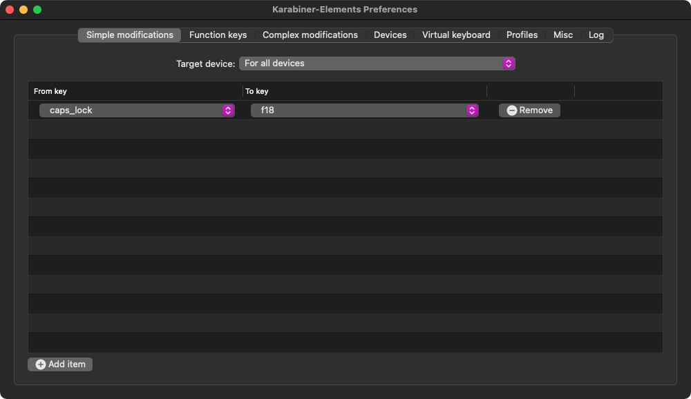
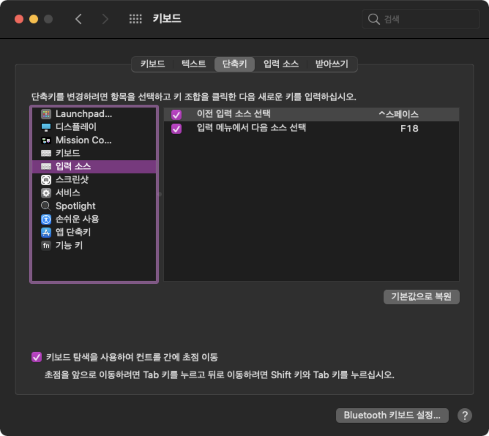

## Alfred

### 라이센스 이전

Alfred Preferences > Powerpack > View your license key > Deactivate 로 기존 맥에
귀속된 라이센스를 비활성화할 수 있다.

새로 사용할 맥에서 알프레드 설치후 라이센스를 등록하면 이전 맥에 등록되어 있었던
라이센스를 다시 사용할 수 있다.

### 설정 동기화

자신이 갖고 있는 알프레드 설정 파일을 Alfred Preferences > Advanced > Syncing >
Reveal in Finder 에서 볼 수 있는데, 이를 Dropbox 또는 Google Drive 등으로 공유하
거나, 파일을 공유하고, 새로 설정하는 맥에서 Alfred Preferences > Advanced >
Syncing > Set preferences folder에서 알프레드 설정 파일이 있는 디렉토리를 설정하
면 이전의 설정을 가져올 수 있다.

하지만 이 때 workflow에서 커스터마이징해놨던 것들은 완전히 동기화 되지 않아서,
살짝 손 봐줘야 했다. (아이콘, 파파고 API 키 등등...)

## Karabiner-Elements

맥에서 한/영 전환 키 딜레이가 있는 이슈가 있는데, 이를 해결하기 위해서
[Karabiner-Elements](https://karabiner-elements.pqrs.org/) 를 사용해 Caps-lock
키를 다른 키에 바인딩하고, 바인딩된 키를 한영 전환 키로 사용하면, 딜레이 없이 한
/영 전환을 할 수 있다.

`caps_lock` 키를 사용하지 않는 `F18` 키에 바인딩한다.

시스템 환경설정 > 키보드 > 단축키 > 입력 소스에서 입력 메뉴에서 다음 소스 선택을
`F18` 키로 변경한다.

한/영 전환을 딜레이 없이 사용할 수 있다.
