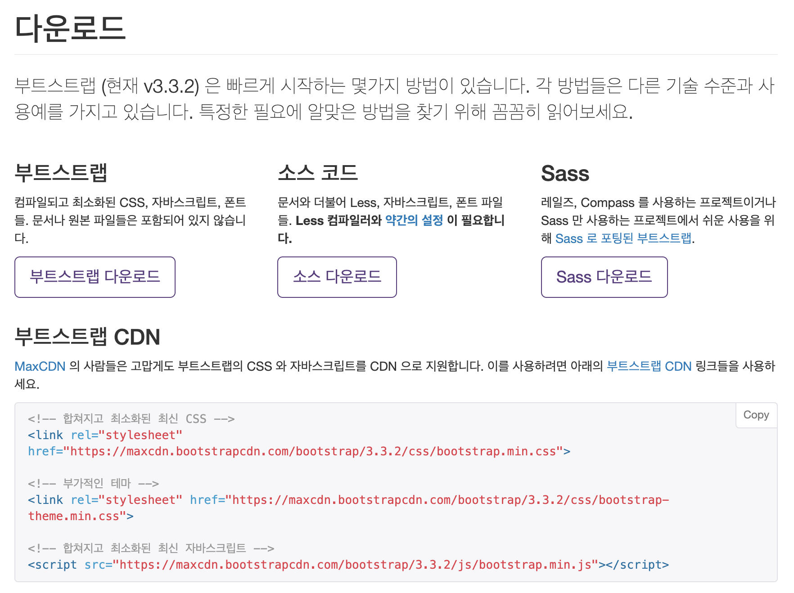

## Bootstrap 시작하기

### Bootstrap 이란?

1. 트위터에서 개발

1. 이미 잘 디자인된 버튼, 레이아웃 등을 쉽게 사용할 수 있음

1. `Bootstrap.css` 를 불러오고 클래스로 간단하게 불러와서 사용.

### Bootstrap 시작하기

[부트스트랩 공식 사이트](https://getbootstrap.com/)

[부트스트랩 비공식 한국어 사이트](http://bootstrapk.com/)

[부트스트랩 CDN](https://www.bootstrapcdn.com/)

> ☝️ CDN이란?CDN is short for content delivery network. A content delivery network (CDN) is a system of distributed servers (network) that deliver pages and other web content to a user, based on the geographic locations of the user, the origin of the webpage and the content delivery server.CDN - Webopedia

#### 다운로드 방법

bootstrap download

1. 컴파일되고 최소화된 CSS, JS, font 파일을 다운받아 HTML 문서에 Link로 삽입.

1. 소스 코드로 다운받기

> 소스로 다운받으면 Less 나 Grunt 등을 사용해서 관리할 수 있는 모양이다. 잘은 모르겠다..

1. Sass 버전 다운받기

> 부트스트랩은 Less 를 기반으로 만들어 졌지만 공식 Sass 버전도 제공한다.

1. 부트스트랩 CDN으로 파일을 다운받지 않고 링크 삽입 만으로 사용하기.

### 버전 3와 4의 차이

- 3 버전은 px 기준, 4 버전은 em 기준

- IE8 이하 버전 지원 종료

> 관리자 템플릿, WISYWIG 에디터 등 아직까지 플러그인들이 3기반에 머물러 있는 경우가 많음.3을 추천한다고 함.패스트캠퍼스 - 프론트엔드 개발 강의 - Bootstrap Part

### 레이아웃

| 화면 사이즈        | 표현    |
| ------------------ | ------- |
| 768px 보다 클 때   | col-sm- |
| 970px 보다 클 때   | col-md- |
| 1170px 보다 클 때  | col-lg- |
| 768px 보다 작을 때 | col-xs- |

뒤에는 12 컬럼을 기준으로 차지하고 싶은 만큼 숫자를 대입하여 사용함.
