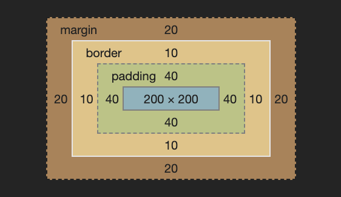

> ❗️ 해당 글은 [패스트캠퍼스 - 프론트엔드 개발 강의](https://www.fastcampus.co.kr/dev_online_react/)에서 HTML & CSS, SASS(SCSS) Part의 [박영웅 강사님](https://github.com/ParkYoungWoong)의 강의자료를 정리한 것입니다.

### `box-sizing`

요소의 크기 계산 기준을 지정

 

#### 속성 값

| 값          | 의미                                                                                              | 기본값      |
| ----------- | ------------------------------------------------------------------------------------------------- | ----------- |
| content-box | 너비( width , height )만으로 요소의 크기를 계산                                                   | content-box |
| border-box  | 너비( width , height )에 안쪽 여백( padding )과 테두리 선( border )를 포함하여 요소의 크기를 계산 |             |

> ☝️ 속성 값으로 padding-box 가 있기는 하지만, 브라우저 호환성이 매우 떨어지므로 사실상 사용이 불가능하다.

box-model

> 파란색 부분 : content-box노란색 부분 : border-box

 

### Reference

[패스트캠퍼스 - 프론트엔드 개발 강의](https://www.fastcampus.co.kr/dev_online_react/) - HTML & CSS, SASS(SCSS) Part by [ParkYoungWoong](https://github.com/ParkYoungWoong)
