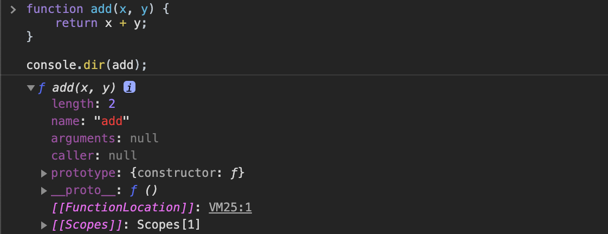
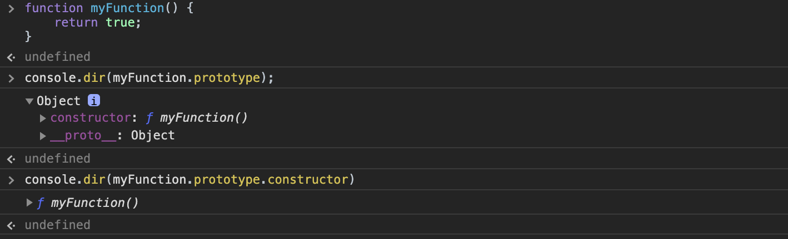
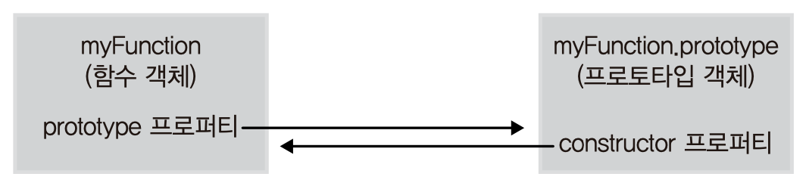

> 이 글은 고현준, 송형주 님의 [인사이드 자바스크립트](https://g.co/kgs/K6Laug)를 참조하여 작성한 글입니다.

JavaScript의 가장 중요한 개념 1순위는 당연히 **함수**다. JS의 함수는 모듈화 처리나 클로저, 객체 생성 등 자바스크립트의 근간이 되는 많은 기능을 제공하고 있다.

## 함수 정의

JS에서 함수를 생성하는 방법은 4가지이다.

- 함수 선언문(function statement)

- 함수 표현식(function expression)

- `Function()` 생성자 함수

- - (ES6) 화살표 함수(arrow function)

<br />

### 함수 리터럴

> 리터럴 : 함수를 생성하는 표기법으로 생각하면 된다. ex) 객체 리터럴, 배열 리터럴 ...

```javascript
function add(x, y) {
  return x + y;
}
```

함수 리터럴은 크게 네 부분으로 구성된다.

- `function` 키워드 : 함수 리터럴은 `function` 키워드로 시작.

- 함수명 [옵셔널] : 함수 내부 코드에서 재귀적 호출 또는 디버거가 구분하기 위한 식별자로 사용.

- 매개변수 리스트 : 다른 언어와 달리 매개변수 타입을 기입하지 않는다.

- 함수 몸체 : 함수가 호출됐을 때 실행되는 부분.

<br />

### 함수 선언문

함수 선언문은 함수 리터럴 형태를 그대로 이용하는데, **함수 선언의 경우 반드시 함수명이 있어야** 한다.

```javascript
function add(x, y) {
  return x + y;
}
```

> ☝ 함수 선언은 `hoisting` 이 발생하므로 사용에 주의. (함수 표현식 사용을 권장)

<br />

### 함수 표현식

함수 리터럴로 하나의 함수를 만들고 **변수에 할당**하여 함수를 생성하는 것을 **함수 표현식**이라고 한다.

이 경우 함수명이 선택 사항이며 보통 사용하지 않는다. 이러한 함수를 **익명 함수**라 한다.

```javascript
var add = function (x, y) {
  return x + y;
};

var plus = add;

console.log(add(3, 4)); // 7
console.log(plus(5, 6)); // 11
```

- 여기서 `add` 변수는 함수 리터럴로 생성한 함수를 참조하는 변수이지 함수명이 아니다. 이러한 변수를 **함수 변수**라고 부른다.

- 함수 변수 `add` 는 함수의 참조값을 가지므로 다른 변수 `plus` 에도 그대로 할당할 수 있다.

- 함수 변수를 사용해 함수를 호출할 수 있다.

함수 이름을 포함하여 작성할 수도 있는데 이러한 함수를 **기명 함수**라 한다.

```javascript
var add = function sum(x, y) {
  return x + y;
};

console.log(add(3, 4)); // 7
console.log(sum(3, 4)); // Error: sum is not defined
```

`sum(3,4)` 의 호출이 `Error` 가 발생하는데 함수 표현식에 사용된 함수명은 **외부 코드에서 접근 불가**하다.

함수명은 함수 내부에서 재귀적으로 호출하거나 디버거에서 함수를 구분할 때 사용한다.

```javascript
// 함수 내부 재귀적 호출 예시
var factorialVar = function factorial(n) {
  if (n <= 1) {
    return 1;
  }
  return n * factorial(n - 1);
};

console.log(factorialVar(3));
```

위에서 함수 선언문으로 정의한 경우에 함수명으로 호출하여 혼란스러울 수 있는데, 함수 선언문으로 정의한 함수는 다음과 같은 함수 표현식 형태로 변경되기 때문이다.

```javascript
var add = function add(x, y) {
  return x + y;
};
```

함수 이름과 함수 변수의 이름이 `add` 로 같으므로 실제로는 `add` 함수 변수로 함수 외부에서 호출이 가능하게 된 것이다.

<br />

> ☝ 함수 선언문과 함수 표현식에서 세미콜론

함수 선언문으로 함수를 정의할 때는 함수 끝에 세미콜론을 따로 붙이지 않고,

함수 표현식으로 함수를 정의할 때는 함수 끝에 세미콜론을 붙이는 것을 권장한다.

일반적인 하나의 관습이다.

<br />

### `Function()` 생성자 함수

JS의 함수도 `Function()` 이라는 기본 내장 생성자 함수로부터 생성된 객체이다.

앞서 살펴본 함수 선언문이나 함수 표현식 방식도 결국 내부적으로는 `Function()` 생성자 함수로 생성된다.

```javascript
new Function (arg1, arg2, ..., argN, functionBody)

- arg1, arg2, ... , argN - 함수의 매개변수
- functionBody - 함수가 호출될 때 실행될 코드를 포함한 문자열
```

```javascript
var add = new Function('x', 'y', 'return x + y');
console.log(add(3, 4)); // 7
```

이 방법은 자주 사용되지 않으므로 상식 수준으로 알고 넘어가자.

<br />

### 화살표 함수(arrow function)

화살표 함수는 ES6에서 추가된 문법으로 `function` 키워드 사용보다 간단하게 만들 수 있다. 화살표 함수는 항상 **익명 함수**이다.

```javascript
var add = (x, y) => {
  return x + y;
};

var add = (x, y) => x + y;
```

`add` 함수를 이처럼 간단하게 작성할 수 있다. 화살표 함수는 함수 body가 한 줄일 때, `{}` 를 생략하면 `return` 키워드를 생략한다. ( `{}` 를 사용하면 `return` 키워드를 사용해야 한다.)

상황에 따라 더 간단하게 작성할 수 있는 몇 가지 규칙이 있다.

```javascript
// 매개변수가 없는 경우
var foo = () => console.log('bar');
foo(); // bar

// 매개변수가 하나인 경우 () 생략 가능
var foo = x => x;
console.log(foo('bar')); // bar

// 매개변수가 여러 개인 경우
var foo = (a, b) => a + b;
console.log(foo(1, 2)); // 3

// 함수 body가 여러 줄일 경우
var foo = (a, b) => {
  var c = 3;
  return a + b + c;
};
console.log(foo(1, 2)); // 6

// 객체를 반환할 때
var foo = () => ({ a: 1, b: 2, c: 3 });
console.log(foo()); // { a: 1, b: 2, c: 3 }
```

> 콜백 함수, `this` 키워드 등에서 차이가 있는데, 이는 추후에 기술

<br />

### 함수 호이스팅(hoisting)

함수 선언문 형태로 정의한 함수의 유효 범위는 코드의 맨 처음부터 시작한다. 이를 **함수 호이스팅**이라고 부른다.

자바스크립트에서는 변수 생성과 초기화의 작업이 분리돼서 이루어지기 때문에 함수 표현식, `Function()` 생성자 함수, 화살표 함수에서는 일어나지 않는다.

이러한 함수 호이스팅이 코드의 구조를 어지럽힐 수 있으므로 많은 사람들이 함수 선언 방식을 추천하지 않기도 한다.

<br />

## 함수 객체

### 함수도 객체다

JS에서는 함수도 객체로, 기본 기능인 코드 실행뿐만 아니라 함수 자체가 일반 객체처럼 프로퍼티들을 가질 수 있다.

```javascript
function add(x, y) {
  return x + y;
}

add.result = add(3, 2);
add.status = 'OK';

console.log(add.result);
console.log(add.status);
```

`add()` 함수에 마치 일반 객체처럼 프로퍼티를 동적으로 생성하고 접근할 수 있다.

### 함수는 값으로 취급된다

함수가 일반 객체처럼 취급될 수 있으므로 다음과 같은 동작이 모두 가능하다.

- 리터럴에 의해 생성

- 변수나 배열의 요소, 객체의 프로퍼티 등에 할당 가능

- 함수의 인자로 전달 가능

- 함수의 리턴값으로 리턴 가능

- 동적으로 프로퍼티를 생성 및 할당 가능

> ☝ 이러한 기능이 모두 가능한 객체를 일급 객체(First Class)라고 한다.
> 이러한 특성으로 함수형 프로그래밍이 가능하다.

#### 변수나 프로퍼티의 값으로 할당

```javascript
// 변수에 함수 할당
var bar = function () {
  return 100;
};
console.log(bar()); // 100

// 프로퍼티에 함수 할당
var obj = {};
obj.baz = function () {
  return 200;
};
console.log(obj.baz()); // 200
```

#### 함수 인자로 전달

```javascript
// 함수 표현식으로 foo() 함수 생성
var foo = function (func) {
  func(); // 인자로 받은 func() 함수 호출
};

// foo() 함수 실행
foo(function () {
  console.log('Function can be used as the argument.');
});
```

#### 리턴 값으로 활용

```javascript
// 함수를 리턴하는 foo() 함수 정의
var foo = function () {
  return function () {
    console.log('this function is the return value.');
  };
};

var bar = foo();
bar();
```

<br />

### 함수 객체의 기본 프로퍼티

함수 역시 일반적인 객체의 기능에 추가적으로, 호출됐을 때 정의된 코드를 실행하는 기능을 가지고 있다.

일반 객체와는 다르게 추가로 **함수 객체만의 표준 프로퍼티**가 정의되어 있다.

```javascript
function add(x, y) {
  return x + y;
}

console.dir(add);
```



결과를 살펴보면, `arguments` , `caller` , `length` 등과 같은 다양한 프로퍼티가 기본적으로 생성된 것을 확인할 수 있다. 이 프로퍼티들이 표준 프로퍼티다.

- `name` : 함수 이름 (익명 함수인 경우 빈 문자열)

- `caller` : 자신을 호출한 함수.

- `arguments` : 함수를 호출할 때 전달된 인자값.

- `length` : 함수를 작성할 때 정의한 인자 개수.

- `prototype` : 이 함수가 생성자로 사용될 때 이 함수를 통해 생성된 객체의 부모 역할을 하는 프로토타입 객체

- `__proto__` : 자신의 부모 역할을 하는 프로토타입 객체를 가리키는 `[[Prototype]]` ( `Function.prototype` )

> ☝ 출력값을 확인해보면 크롬에서는 `Empty()` 함수

> **`Function.prototype`** **객체의 프로토타입 객체는?**

모든 함수들의 부모 객체인 `Function.prototype` 의 부모는 예외적으로 `Object.prototype` 객체

<br />

#### 함수 객체와 프로토타입 객체와의 관계



`myFunction()` 함수의 프로토타입, `myFunction.prototype` 객체는 `constructor` 와 `__proto__` 라는 두 개의 프로퍼티가 있다.

`myFunction.prototype.constructor` 의 값을 출력해보면, 프로토타입 객체와 매핑된 함수를 볼 수 있는데 `myFunction()` 함수를 가리키고 있다.



<br />

## 참고 자료

🔗 [JavaScript - 화살표 함수(Arrow function)](https://velog.io/@ki_blank/JavaScript-%ED%99%94%EC%82%B4%ED%91%9C-%ED%95%A8%EC%88%98Arrow-function)
