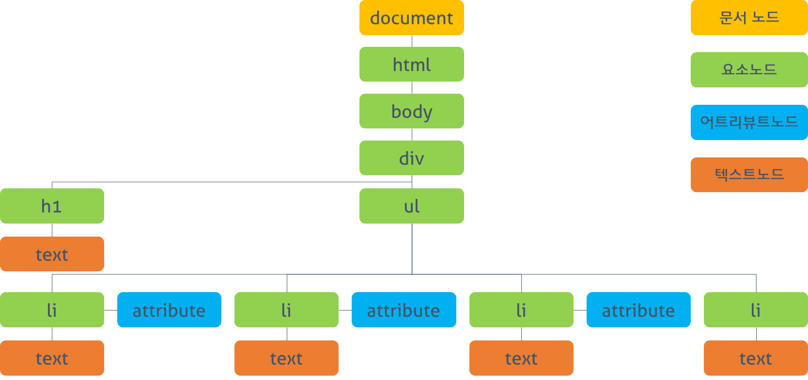
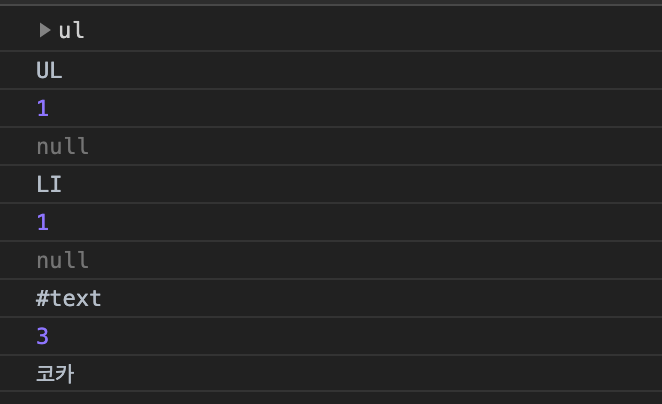
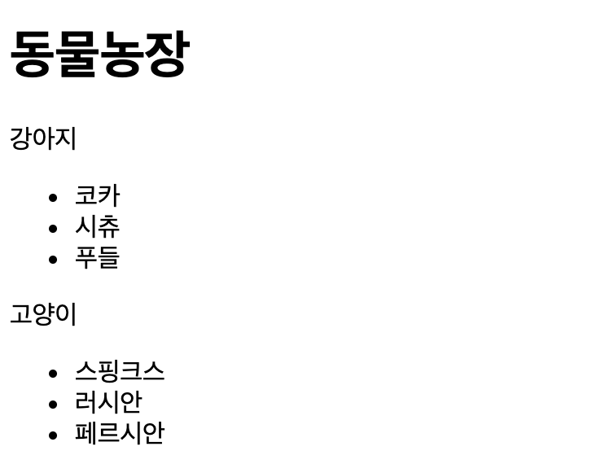
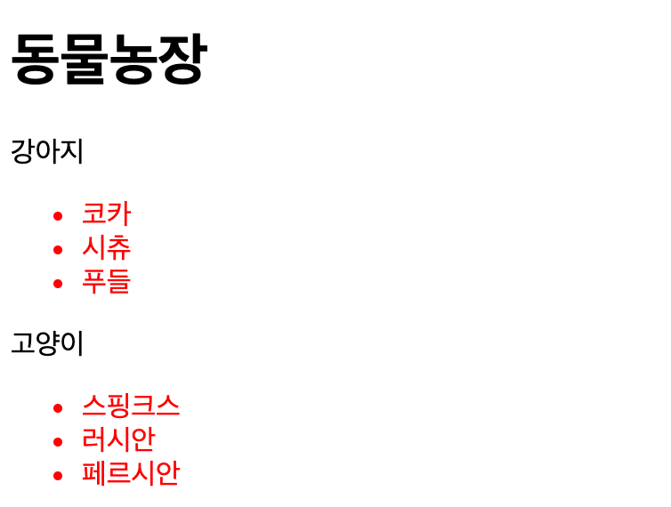
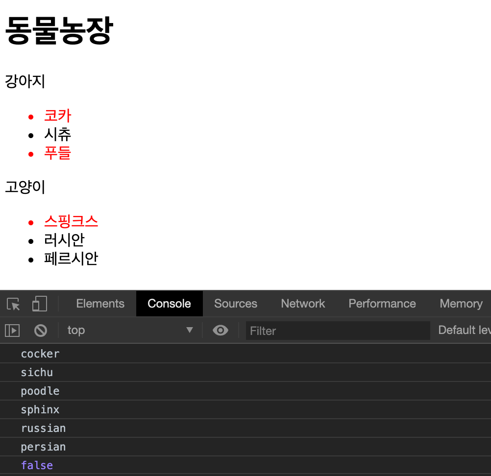
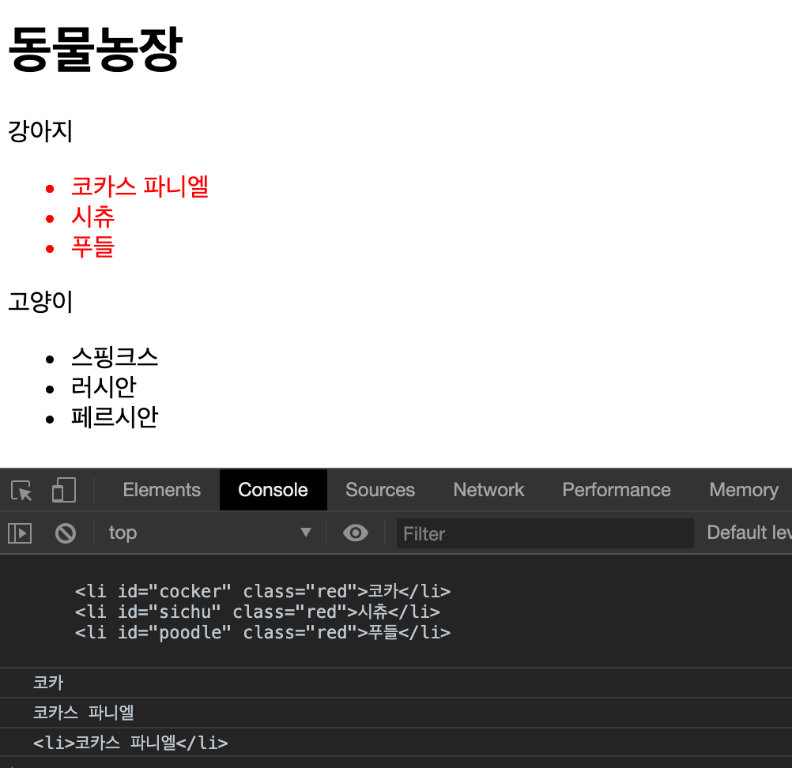
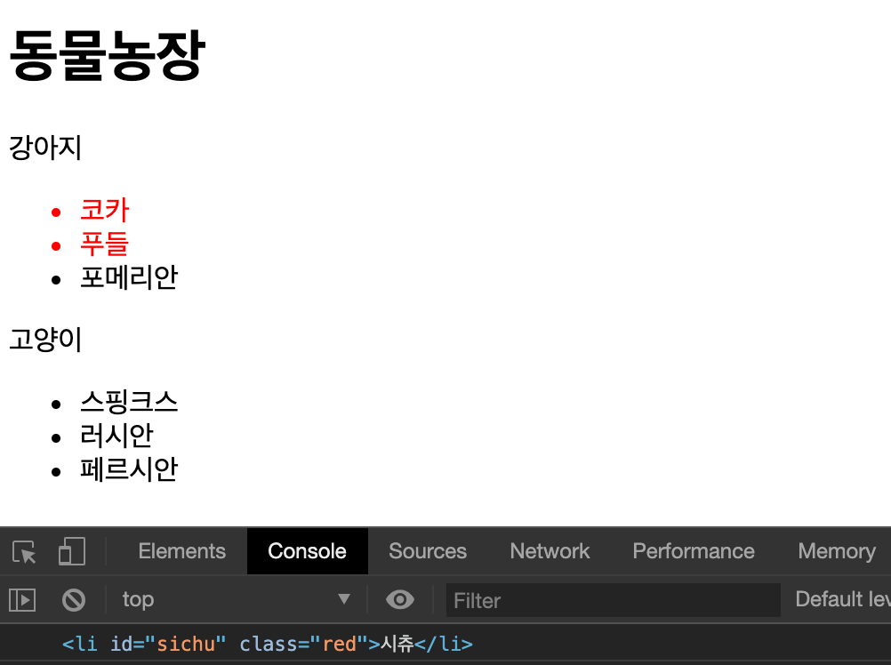
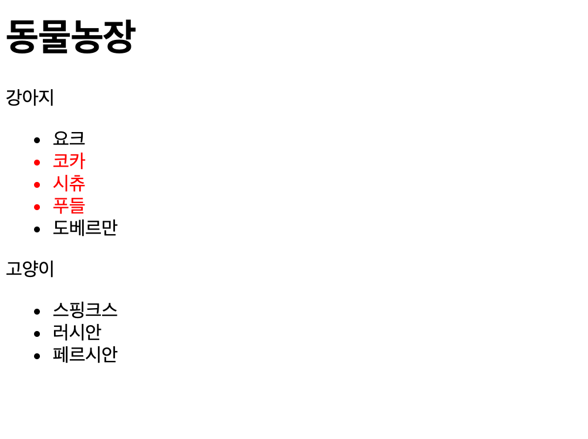
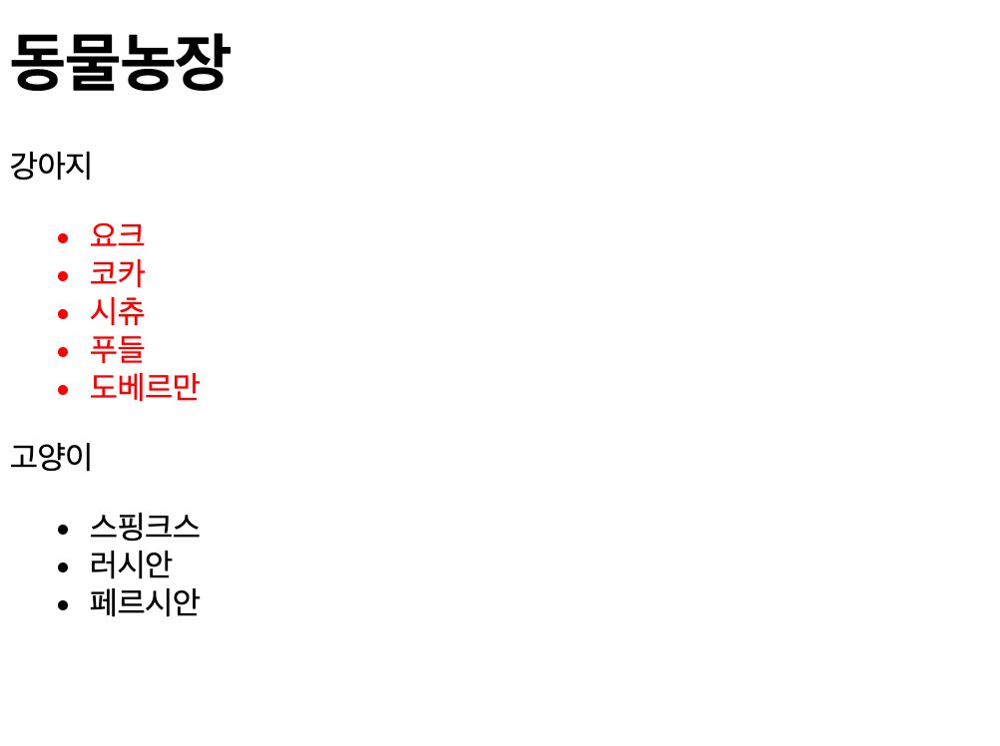

## DOM(Document Object Model)

### DOM tree



DOM tree는 네 종류의 노드로 구성된다.

- 문서 노드(Document Node)

트리의 최상위에 존재하며 각각 요소, 어트리뷰트, 텍스트 노드에 접근하려면 문서 노
드를 통해야 한다. 즉, DOM tree에 접근하기 위한 시작점(entry point)이다.

- 요소 노드(Element Node)

요소 노드는 HTML 요소를 표현한다. HTML 요소는 중첩에 의해 부자 관계를 가지며 이
부자 관계를 통해 정보를 구조화한다. 따라서 요소 노드는 문서의 구조를 서술한다고
말 할 수 있다. 어트리뷰트, 텍스트 노드에 접근하려면 먼저 요소 노드를 찾아 접근해
야 한다. 모든 요소 노드는 요소별 특성을 표현하기 위해 HTMLElement 객체를 상속한
객체로 구성된다. (그림: DOM tree의 객체 구성 참고)

- 어트리뷰트 노드(Attribute Node)

어트리뷰트 노드는 HTML 요소의 어트리뷰트를 표현한다. 어트리뷰트 노드는 해당 어트
리뷰트가 지정된 요소의 자식이 아니라 해당 요소의 일부로 표현된다. 따라서 해당 요
소 노드를 찾아 접근하면 어트리뷰트를 참조, 수정할 수 있다.

- 텍스트 노드(Text Node)

텍스트 노드는 HTML 요소의 텍스트를 표현한다. 텍스트 노드는 요소 노드의 자식이며
자신의 자식 노드를 가질 수 없다. 즉, 텍스트 노드는 DOM tree의 최종단이다.

### DOM Query / Traversing (요소로 접근)

#### 하나의 요소 노드 선택(DOM Query)

#### document.getElementById(id)

- `id` 속성 값으로 요소 노드를 한 개 선택하여 반환, 여러 노드가 있는 경우 첫번째
  요소만 반환

- HTMLElement를 상속받은 객체를 리턴한다.

> 📌 아래의 예제부터 모두 class="red" 인 요소는 색상이 red 라는 css 설정과 다음
> 의 html 요소들을 고정해놓고 사용한다.

```css
.red {
  color: red;
}
```

```html
<h1>동물농장</h1>
<p class="dog">강아지</p>
<ul>
  <li id="cocker" class="red">코카</li>
  <li id="sichu" class="red">시츄</li>
  <li id="poodle" class="red">푸들</li>
</ul>
<p class="cat">고양이</p>
<ul>
  <li id="sphinx" class="black">스핑크스</li>
  <li id="russian" class="black">러시안</li>
  <li id="persian" class="black">페르시안</li>
</ul>
```

```javascript
const elem = document.getElementById('sphinx');
elem.className = 'red';
```

- 결과


#### document.querySelector(cssSelector)

- CSS 선택자로 요소 노드 한 개 선택하여 반환, 여러 노드가 있는 경우 첫번째 요소
  만 반환

- HTMLElement를 상속받은 객체를 리턴한다.

```javascript
const elem = document.querySelector('#sphinx');
elem.className = 'red';
```


#### 여러 개의 요소 노드 선택(DOM Query)

#### document.getElementsByClassName(class)

- `class` 속성 값으로 요소 노드를 모두 선택 한다. 공백으로 구분하여 여러 class를
  지정할 수 있다.

- HTMLCollection 을 리턴한다. (live)

```javascript
const elems = document.getElementsByClassName('black');
for (let i = 0; i < elems.length; i++) {
  elems[i].className = 'red';
}
```

- 결과


위 예제의 실행 결과가 이상한 것을 볼 수 있는데, getElementsByClassName 메소드의
반환값인 HTMLCollection이 **실시간으로 Node의 상태 변경을 반영하기 때문**이다.

즉 loop가 실행되면서, elems의 className 조건에 부합되지 않는 요소들이 제거되면서
elems 배열의 길이가 변동되기 때문에 루프가 제대로 실행되지 않는다.

이를 해결하는 방법은 다음과 같다

- 반복문을 역방향으로 돌린다.

- while 반복문을 사용하면서, elems의 요소가 남아있지 않을 때까지 반복한다.

```javascript
const elems = document.getElementsByClassName('black');

while (elems.length > 0) {
  // elems에 요소가 남아 있지 않을 때까지 무한반복
  elems[0].className = 'red';
}
```

- HTMLCollection을 배열로 변경한다. (권장)

```javascript
const elems = document.getElementsByClassName('black');

[...elems].forEach((elem) => (elem.className = 'red'));
```

- querySelectorAll 메소드를 사용한다.


#### document.getElementsByTagName(tagName)

- 지정된 CSS 선택자를 사용하여 요소 노드를 모두 선택한다

- NodeList(non-live) 를 리턴한다.

> NodeList는 HTMLCollection과 달리 non-live 이기 때문에, loop 안에서 length의 변
> 화가 일어나지 않는다.

```javascript
const elems = document.querySelectorAll('.black');
elems.forEach((elem) => (elem.className = 'red'));
```

#### document.getElementsByTagName(tagName)

- 태그 이름으로 요소 노드를 모두 선택한다

- HTMLCollection (live)을 리턴한다

```javascript
const elems = document.getElementsByTagName('li');
[...elems].forEach((elem) => (elem.className = 'red'));
```

#### DOM Traversing(탐색)

기준이 되는 노드와 관계를 갖고 있는 노드로 이동하면서 탐색할 수 있다.

#### parentNode

- 부모 노드를 탐색한다.

- HTMLElement를 상속받은 객체를 리턴한다.

```javascript
const elem = document.querySelector('#sphinx');
elem.parentNode.className = 'red';
```

#### firstChild, lastChild

- 자식 노드를 탐색한다

- HTMLElement를 상속받은 객체를 리턴한다.

```javascript
const elem = document.querySelector('ul');
elem.firstChild.className = 'black';
elem.lastChild.className = 'black';
```

위의 예제를 실행해보면 잘 동작하지 않는데, IE를 제외한 대부분의 브라우저들이 요
소 사이의 공백 또는 줄바꿈 문자를 텍스트 노드로 취급하여 첫번째 자식 노드, 마지
막 자식 노드를 HTML 요소로 판단하지 않기 때문이다.

이를 해결하는 방법은 다음과 같다.

- HTML의 공백을 제거한다.

```html
<ul>
  <li id="cocker" class="red">코카</li>
  <li id="sichu" class="red">시츄</li>
  <li id="poodle" class="red">푸들</li>
</ul>
```

- jQuery: .prev() 와 jQuery: .next() 를 사용한다.

- 또는 firstElementChild, lastElementChild를 사용한다.


#### hasChildNodes()

- 자식 노드가 있는지 확인하고 Boolean 값을 반환한다.

#### childNodes

- 자식 노드의 컬렉션을 반환한다.

- 텍스트 요소를 포함한 모든 자식 요소를 반환한다.

- NodeList(non-live)를 리턴한다.

#### children

- 자식 노드의 컬렉션을 반환한다. 자식 요소 중에서 Element type 요소 만을 반환한
  다.

- HTMLCollection(live)를 리턴한다.

```javascript
const elem = document.querySelector('ul');

if (elem.hasChildNodes()) {
  console.log(elem.childNodes);

  console.log(elem.children);
  [...elem.children].forEach((el) => console.log(el));
}
```


#### previousSibling, nextSibling

- 형제 노드를 탐색한다. **text node를 포함한 모든 형제 노드를 탐색**한다.

- HTMLElement를 상속받은 객체를 리턴한다.

#### previousElementSibling, nextElementSibling

- 형제 노드를 탐색한다. 형제 노드 중에서 **Element type 요소만을 탐색**한다.

- HTMLElement를 상속받은 객체를 리턴한다.

### DOM Manipulation (조작)

노드에 대한 정보는 다음과 같은 프로퍼티를 통해 접근할 수 있다.

#### nodeName

| 노드                      | 프로퍼티 값              |
| ------------------------- | ------------------------ |
| 문서 노드(document node)  | #document                |
| 요소 노드(element node)   | 태그 이름(영어로 대문자) |
| 속성 노드(attribute node) | 속성 이름                |
| 텍스트 노드(text node)    | #text                    |

#### nodeType

| 노드                      | 프로퍼티 값 |
| ------------------------- | ----------- |
| 요소 노드(element node)   | 1           |
| 속성 노드(attribute node) | 2           |
| 텍스트 노드(text node)    | 3           |
| 주석 노드(comment node)   | 8           |
| 문서 노드(document node)  | 9           |

#### nodeValue

| 노드                      | 프로퍼티 값         |
| ------------------------- | ------------------- |
| 요소 노드(element node)   | null                |
| 속성 노드(attribute node) | 해당 속성의 속성 값 |
| 텍스트 노드(text node)    | 해당 텍스트 문자열  |

#### 텍스트 노드에의 접근/수정

요소의 텍스트는 텍스트 노드에 저장되어 있다. 텍스트 노드에 접근하려면 다음의 수
순을 따라야 한다.

1. 해당 텍스트 노드의 부모 노드를 선택

1. firstChild 프로퍼티를 사용하여 텍스트 노드를 탐색

1. 텍스트 노드의 nodeValue를 이용하여 텍스트 취득

1. nodeValue를 이용하여 텍스트 수정

```javascript
const elem = document.querySelector('ul');
console.dir(elem); // HTMLElement: ul
console.log(elem.nodeName); // UL
console.log(elem.nodeType); // 1: Element node
console.log(elem.nodeValue); // null

const firstDog = elem.firstElementChild;
console.log(firstDog.nodeName); // LI
console.log(firstDog.nodeType); // 1: Element node
console.log(firstDog.nodeValue); // null

const textNode = firstDog.firstChild;
console.log(textNode.nodeName); // #text
console.log(textNode.nodeType); // 3: Text node
console.log(textNode.nodeValue); // 코카
textNode.nodeValue = '포메리안';
```




#### 속성 노드에의 접근/수정

속성 노드를 조작할 때 다음 프로퍼티와 메소드를 사용할 수 있다.

#### className

class 속성의 값을 취득 또는 변경한다. className 프로퍼티에 값을 할당하는 경우
class 속성이 없으면 class 속성을 생성하고 지정된 값을 설정한다. class 속성의 값
이 여러 개일 경우 공백으로 구분된 문자열이 반환되므로 String 메소드 `split(' ')`
을 사용하여 배열로 변경하여 사용한다.

```javascript
const elems = document.querySelectorAll('li');

[...elems].forEach((elem) => {
  if (elem.className === 'red') {
    elem.className = 'black';
  }
});
```



#### classList

add, remove, item, toggle, contains, replace 메소드를 제공한다.

```javascript
const elems = document.querySelectorAll('li');

[...elems].forEach((elem) => {
  if (elem.classList.contains('black')) {
    elem.classList.replace('black', 'red');
  }
});
```



#### id

- `id` 속성의 값을 취득 또는 변경한다. `id` 속성에 값을 할당하는 경우, `id` 속성
  이 존재하지 않으면 `id` 속성을 생성하고 지정된 값을 설정한다.

```javascript
const heading = document.querySelector('h1');

console.dir(heading);
console.log(heading.firstChild.nodeValue);

heading.id = 'heading';
console.log(heading.id); // heading
```

#### hasAttribute(attribute)

- 지정한 속성을 갖고 있는지 검사한다.

- Return : Boolean

#### getAttribute(attribute)

- 속성의 값을 취득한다

- Return : String

#### setAttribute(attribute, value)

- 속성과 속성의 값을 설정한다.

- Return : undefined

#### removeAttribute(attribute)

- 지정한 속성을 제거한다

- Return : undefined

```javascript
const elems = document.querySelectorAll('li');

elems.forEach((elem) => {
  if (elem.hasAttribute('class')) {
    console.log(elem.getAttribute('id'));
  }
});

const sphinx = document.getElementById('sphinx');
sphinx.setAttribute('class', 'red');

const sichu = document.getElementById('sichu');
sichu.removeAttribute('class');
console.log(sichu.hasAttribute('class'));
```



#### HTML 콘텐츠 조작(Manipulation)

#### textContent

요소의 텍스트 콘텐츠를 취득 또는 변경한다. 이 때 마크업은 무시되기 때문에
`ul.textContent = '<h1>Heading</h1>'` 처럼 마크업을 포함시키면 문자열로 인식되어
그대로 출력된다.

```javascript
const ul = document.querySelector('ul');
console.log(ul.textContent);

const cocker = document.getElementById('cocker');
console.log(cocker.textContent);

cocker.textContent += '스 파니엘';
console.log(cocker.textContent);

cocker.textContent = '<li>코카스 파니엘</li>';
console.log(cocker.textContent);
```


#### innerText

innerText 프로퍼티로도 텍스트 콘텐츠에 접근할 수 있다. 하지만 비표준이고, CSS 순
종적이라, CSS에 의해 비표시 되어 있는 경우 텍스트가 반환되지 않는다. CSS를 고려
해야 하기 때문에 textContent 프로퍼티보다 느리다.

#### innerHTML

해당 요소의 모든 자식 요소를 포함하는 모든 콘텐츠를 하나의 문자열로 취득할 수 있
다. 이 문자열은 마크업을 포함한다.

```javascript
const ul = document.querySelector('ul');
console.log(ul.innerHTML);

const cocker = document.getElementById('cocker');
console.log(cocker.innerHTML);

cocker.innerHTML += '스 파니엘';
console.log(cocker.innerHTML);

cocker.innerHTML = '<li>코카스 파니엘</li>';
console.log(cocker.innerHTML);
```



innerHTML 프로퍼티를 사용하여 마크업이 포함된 새로운 요소를 DOM에 추가할 수 있다
.

```javascript
const cocker = document.getElementById('cocker');
cocker.innerHTML += '<li id="york" class="red">요크</li>';
```


하지만 이렇게 마크업이 포함된 콘텐츠를 추가하는 것은 크로스 스크립팅 공격에 취약
하다

```javascript
// 에러 이벤트를 발생시켜 스크립트가 실행되도록 한다.
elem.innerHTML = '';
```

#### DOM 조작 방식

innerHTML 프로퍼티를 사용하지 않고 새로운 콘텐츠를 추가할 수 있는 방법은 DOM을직
접 조작하는 것이다. 하나의 요소를 추가하는 경우 사용한다.

1. 요소 노드 생성 - createElement() 메소드를 사용해서 새로운 요소 노드를 생성한
   다. 메소드의 인자로 태그 이름을 전달한다.

1. 텍스트 노드 생성 - createTextNode() 메소드를 사용하여 새로운 텍스트 노드를 생
   성한다. 경우에 따라 생략할 수 있지만, 생략하는 경우 콘텐츠가 비어있는 요소가
   된다.

1. 생성된 요소를 DOM에 추가 - appendChild() 메소드를 사용하여 생성된 노드를 DOM
   tree에 추가한다. 또는 removeChild() 메소드를 사용하여 DOM tree에서 노드를 삭
   제할 수도 있다.

#### createElement(tagName)

- 태그 이름을 인자로 전달하여 요소를 생성한다.

- Return : HTMLElement를 상속받은 객체

#### createTextNode(text)

- 텍스트를 인자로 전달하여 텍스트 노드를 생성한다.

- Return : Text 객체

#### appendChild(Node)

- 인자로 전달한 노드를 마지막 자식 요소로 DOM 트리에 추가한다.

- Return : 추가한 노드

#### removeChild(Node)

- 인자로 전달한 노드를 DOM 트리에 제거한다.

- Return : 제거한 노드

```javascript
// 태그 이름을 인자로 전달하여 새로운 요소 생성
const newDog = document.createElement('li');

// 텍스트 노드를 생성
const newText = document.createTextNode('포메리안');

// 텍스트 노드를 newDog의 자식으로 DOM 트리에 추가
newDog.appendChild(newText);

const container = document.querySelector('ul');

// newElem을 container의 자식으로 DOM 트리에 추가. 마지막 요소로 추가된다.
container.appendChild(newDog);

const removeDog = document.getElementById('sichu');

// container의 자식인 removeElem 요소를 DOM 트리에서 제거한다
console.log(container.removeChild(removeDog));
```



#### insertAdjacentHTML(position, string)

인자로 전달한 텍스트를 HTML로 파싱하고, 그 결과로 생성된 노드를 DOM 트리의 지정
된 위치에 삽입한다. 첫번째 인자는 삽입 위치, 두번째 인자는 삽입할 요소를 표현한
문자열이다. 첫번째 인자로 올 수 있는 값은 아래와 같다.

- `beforebegin`

- `afterbegin`

- `beforeend`

- `afterend`

```html
<!-- beforebegin -->
<p>
  <!-- afterbegin -->
  foo
  <!-- beforeend -->
</p>
<!-- afterend -->
```

```javascript
const dogList = document.querySelector('ul');
dogList.insertAdjacentHTML('afterbegin', '<li id="york" class="dog">요크</li>');
dogList.insertAdjacentHTML(
  'beforeend',
  '<li id="dober" class="dog">도베르만</li>',
);
```



#### innerHTML vs DOM 조작 방식 vs insertAdjacentHTML()

#### innerHTML

| 장점                                                       | 단점                                                                                                                            |
| ---------------------------------------------------------- | ------------------------------------------------------------------------------------------------------------------------------- |
| DOM 조작 방식에 비해 빠르고 간편하다.                      | XSS공격에 취약점이 있기 때문에 사용자로 부터 입력받은 콘텐츠(untrusted data: 댓글, 사용자 이름 등)를 추가할 때 주의하여야 한다. |
| 간편하게 문자열로 정의한 여러 요소를 DOM에 추가할 수 있다. | 해당 요소의 내용을 덮어 쓴다. 즉, HTML을 다시 파싱한다. 이것은 비효율적이다.                                                    |
| 콘텐츠를 취득할 수 있다.                                   |                                                                                                                                 |

#### DOM 조작 방식

| 장점                                                                 | 단점                                          |
| -------------------------------------------------------------------- | --------------------------------------------- |
| 특정 노드 한 개(노드, 텍스트, 데이터 등)를 DOM에 추가할 때 적합하다. | innerHTML보다 느리고 더 많은 코드가 필요하다. |

#### insertAdjacentHTML()

| 장점                                                       | 단점                                                                                                                            |
| ---------------------------------------------------------- | ------------------------------------------------------------------------------------------------------------------------------- |
| 간편하게 문자열로 정의된 여러 요소를 DOM에 추가할 수 있다. | XSS공격에 취약점이 있기 때문에 사용자로 부터 입력받은 콘텐츠(untrusted data: 댓글, 사용자 이름 등)를 추가할 때 주의하여야 한다. |
| 삽입되는 위치를 선정할 수 있다.                            |                                                                                                                                 |

#### 결론

innerHTML과 insertAdjacentHTML()은 크로스 스크립팅 공격(XSS: Cross-Site
Scripting Attacks)에 취약하다. 따라서 untrusted data의 경우, 주의하여야 한다. 텍
스트를 추가 또는 변경시에는 textContent, 새로운 요소의 추가 또는 삭제시에는 DOM
조작 방식을 사용하도록 한다.

### style

style 속성을 사용하면 inline 스타일 선언을 생성한다. 특정 요소에 inline 스타일을
지정하는 경우 사용한다.

```javascript
const dogList = document.querySelector('ul');
dogList.insertAdjacentHTML('afterbegin', '<li id="york" class="dog">요크</li>');
dogList.insertAdjacentHTML(
  'beforeend',
  '<li id="dober" class="dog">도베르만</li>',
);

const york = document.getElementById('york');
const dober = document.getElementById('dober');

york.style.color = 'red';
dober.style.color = 'red';
```



style 프로퍼티 값을 취득하려면 window.getComputedStyle을 사용한다. 이 메소드는인
자로 주어진 요소의 모든 CSS 프로퍼티 값을 반환한다.

```javascript
const box = document.querySelector('.box');

const width = getStyle(box, 'width');
const height = getStyle(box, 'height');
const backgroundColor = getStyle(box, 'background-color');
const border = getStyle(box, 'border');

console.log('width: ' + width);
console.log('height: ' + height);
console.log('backgroundColor: ' + backgroundColor);
console.log('border: ' + border);

/**
 * 요소에 적용된 CSS 프로퍼티를 반환한다.
 * @param {HTTPElement} elem - 대상 요소 노드.
 * @param {string} prop - 대상 CSS 프로퍼티.
 * @returns {string} CSS 프로퍼티의 값.
 */
function getStyle(elem, prop) {
  return window.getComputedStyle(elem, null).getPropertyValue(prop);
}
```

### 참고자료

🔗 [문서 객체 모델(Document Object Model)](https://poiemaweb.com/js-dom)
