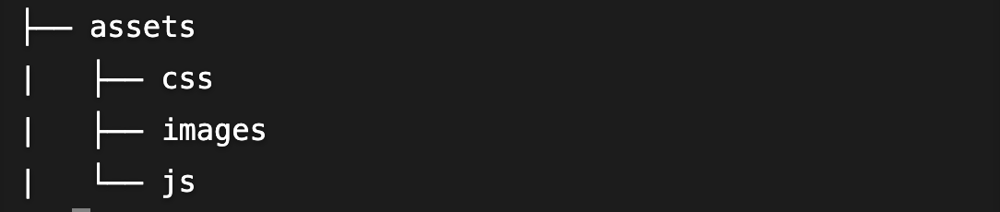

[Assets](https://jekyllrb.com/docs/step-by-step/07-assets/)

Jekyll에서는 CSS, JS, 이미지, 다른 asset들을 직접적으로 사용할 수 있다. 그것들을 site 폴더에 넣으면 빌드된 사이트로 복사된다.

Jekyll 사이트는 종종 이 구조를 사용하여 asset을 체계적으로 관리한다.



<br />

### Sass

---

`_includes/navigation.html` 에 사용된 인라인 스타일은 좋은 방법이 아니다. 따라서 클래스로 지정하는 방법으로 바꾼다.

```html
<nav>
  
    <a href="{{ item.link }}" class="current">{{ item.name }}</a>
  
</nav>
```

표준 CSS를 사용하는 것도 가능하지만 Sass를 이용하여 한 단계 더 나아가 보겠다. Sass는 Jekyll에 CSS를 바로 올릴 수 있는 환상적인 확장이다.

먼저 Sass 파일을 `/assets/css/styles.scss` 에 다음과 같이 만든다.

```sass
---
---
@import "main";
```

상단에 빈 front matter는 Jekyll에게 이 파일을 처리해야 한다고 알려준다. `@import "main"` 은 Sass에게 웹 사이트 폴더의 루트에 있는 `_sass/` 디렉토리에서 `main.scss` 이라는 파일을 찾아보도록 한다.

이제 `main.scss` 가 있어야 한다. 이렇게 나누는 것이 규모가 큰 프로젝트에서 CSS를 체계적으로 조직하는데 좋은 방법이다.

`/_sass/main.scss` 에 이렇게 Sass 파일을 만든다.

```sass
.current {
  color: green;
}
```

이제 레이아웃에서 스타일시트를 참조해야한다.

`_layouts/default.html` 을 열고 스타일시트를 `<head>` 에 추가한다.

```html
<!DOCTYPE html>
<html>
  <head>
    <meta charset="utf-8" />
    <title>{{ page.title }}</title>
    <link rel="stylesheet" href="/assets/css/styles.css" />
  </head>
  <body>
     {{ content }}
  </body>
</html>
```

<br />
