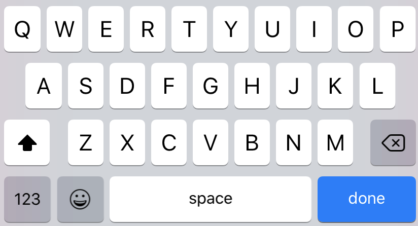

### `Dimensions` API

[Dimensions · React Native](https://reactnative.dev/docs/dimensions)

```javascript
import { Dimensions } from 'react-native';
```

```javascript
const windowWidth = Dimensions.get('window').width;
const windowHeight = Dimensions.get('window').height;

or;

const { height, width } = Dimensions.get('window');
```

사용하는 핸드폰(윈도우 객체)의 가로 너비, 세로 너비를 구할 수 있다.

### `Platform Specific Code`

[Platform Specific Code · React Native](https://reactnative.dev/docs/platform-specific-code)

```javascript
import { Platform, StyleSheet } from 'react-native';

const styles = StyleSheet.create({
  height: Platform.OS === 'ios' ? 200 : 100,
});
```

```javascript
import { Platform, StyleSheet } from 'react-native';

const styles = StyleSheet.create({
  container: {
    flex: 1,
    ...Platform.select({
      ios: {
        backgroundColor: 'red',
      },
      android: {
        backgroundColor: 'blue',
      },
    }),
  },
});
```

### `Shadow Props`

[Shadow Props · React Native](https://reactnative.dev/docs/shadow-props)

```javascript
...Platform.select({
  ios: {
    shadowColor: "rgb(50, 50, 50)",
    shadowOpacity: 0.5,
    shadowRadius: 5,
    shadowOffset: {
      height: -1,
      width: 0
    }
  },
  android: {
    elevation: 3
  }
})
```

`shadow` 는 iOS와 Android에서 속성이 다르다. Android는 `elevation` 으로 사용한다.

### `ScrollView`

스크롤뷰 컴포넌트 안에 ToDo 컴포넌트를 넣는다.

```javascript
<ScrollView>
  <ToDo />
</ScrollView>
```

### `TextInput`

- `placeholderTextColor` : 플레이스홀더 텍스트 색깔

- `onChangeText` : 텍스트가 바뀌면 실행될 콜백함수

- `autoCorrect` : 텍스트 자동수정 (false로 하는게 편할 듯)

- `returnKeyType` : 키보드 레이아웃에서 표시될 문구

```javascript
<TextInput returnKeyType={'done'} />
```



### `setState`

[React.Component - React](https://ko.reactjs.org/docs/react-component.html#setstate)

[함수형 setState가 리액트(React)의 미래이다(Functional setState is the future of React)](https://www.vobour.com/%ED%95%A8%EC%88%98%ED%98%95-setstate%EA%B0%80-%EB%A6%AC%EC%95%A1%ED%8A%B8-react-%EC%9D%98-%EB%AF%B8%EB%9E%98%EC%9D%B4%EB%8B%A4-functiona)

[누구든지 하는 리액트 4편: props 와 state](https://velopert.com/3629)

```javascript
_toggleComplete = () => {
  this.setState(prevState => {
    return {
      isCompleted: !prevState.isCompleted,
    };
  });
};
```

> 📌 `setState` 에 updater 함수를 넣는 것이 이해되지 않음.

- `setState` 함수의 파라미터로 함수를 넣는 것이 어떤 의미인가?

- `setState` 함수로 전달되는 함수의 파라미터는 어디서 받아오는 것인가?

<br />
