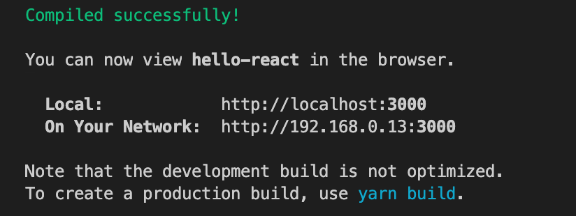
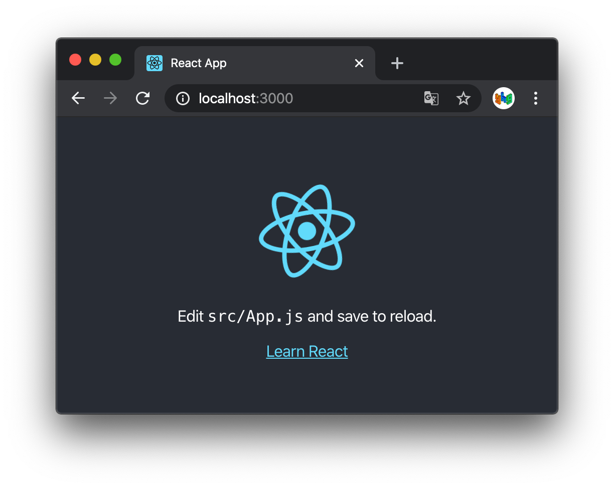
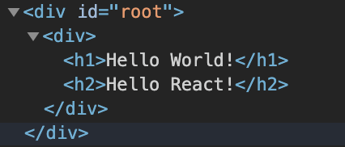

> 이 글은 김민준(velopert)님의 [리액트를 다루는 기술](http://www.yes24.com/Product/Goods/78233628?Acode=101)을참조하여 작성한 글입니다.

## 프로젝트 생성

개발 환경 설정을 운영체제에 맞게 잘 설치한 이후 아래의 코드로 리액트 프로젝트를생성할 수 있다.

```bash
yarn create react-app hello-react

# yarn을 사용하지 않는다면
npm init react-app hello-react
```

프로젝트가 성공적으로 생성되면 프로젝트 디렉토리로 이동한 이후 리액트 서버를 구동할 수 있다.

```bash
cd hello-react
yarn start # 또는 npm start
```

터미널에 이러한 결과가 나오면 성공적으로 서버가 구동된 것이다.



터미널에 나와있는 대로 브라우저에서 [http://localhost:3000](http://localhost:3000에)에 접속하면 리액트 페이지를 볼수있다



맥의 경우 터미널에서 `^ + C` 로 서버를 종료할 수 있다.

<br />

## 코드 이해하기

`src/App.js`

```javascript
import React from 'react';
import logo from './logo.svg';
import './App.css';

function App() {
	return (
		<div className="App">
			<header className="App-header">
				
				<p>
					Edit <code>src/App.js</code> and save to reload.
				</p>
				<a
					className="App-link"
					href="https://reactjs.org"
					target="_blank"
					rel="noopener noreferrer"
				>
					Learn React
				</a>
			</header>
		</div>
	);
}

export default App;
```

create-react-app으로 프로젝트를 생성한 후 `src/App.js` 를 열어보면 다음의 코드가생성되어 있다.

`import React from 'react';` 이 코드는 리액트 라이브러리를 불러와서 사용할 수 있게 해주는 코드이다. 리액트 프로젝트를 만들면 `node_modules` 디렉토리가 함께 생성되는데, 이 디렉토리는 npm(Node Package Manager)으로 설치한 외부 패키지들이 저장되는 곳이다. 이 디렉토리에 있는 리액트 모듈을 가져와서 사용하는 것이다.

`import logo from './logo.svg';` , `import './App.css';` 이 코드를 보면 리액트뿐만 아니라 css, svg 또한 모듈로 가져오는 것을 확인할 수 있다. 이처럼 js, 스타일시트, 이미지 등 모든 것을 모듈로 로딩해서 사용하도록 할 수 있다. 이렇게 모듈 시스템을 사용하면, 파일 단위로 관리할 수 있어서 프로젝트의 규모가 커질 때 관리하기용이해진다.

그런데 이렇게 모듈을 불러와 사용하는 것은 원래 브라우저에는 없던 기능이고, Node.js에서 지원하는 기능이다. 이러한 기능을 브라우저에서 사용하기 위해 번들러 (bundler)를 사용하는 것이다. 리액트에서 주로 사용하는 번들러가 바로 웹팩 (Webpack)이다. 이 번들러 도구를 사용하면 불러온 여러 개의 모듈을 모두 합쳐서 하나의 파일을 생성할 수 있기 때문에 모든 브라우저에서 사용할 수 있다.

원래 웹팩을 사용하기 위해서 직접 설치하고 설정하는 과정을 거쳐야 하지만 create-react-app은 이 번거로운 작업을 모두 대신해주기 때문에 편리하다. (하지만직접 설치하고 설정하는 과정을 경험해볼 필요가 있다.)

이 웹팩의 자세한 원리와 작동 방법은 아래의 같이 읽기를 읽어보자.

<br />

그 다음 코드를 보자.

```javascript
function App() {
	return (
		<div className="App">
			<header className="App-header">
				
				<p>
					Edit <code>src/App.js</code> and save to reload.
				</p>
				<a
					className="App-link"
					href="https://reactjs.org"
					target="_blank"
					rel="noopener noreferrer"
				>
					Learn React
				</a>
			</header>
		</div>
	);
}
```

이 코드는 App이라는 컴포넌트를 만드는데, `function` 키워드를 사용하여 만들고 있다. 이를 함수형 컴포넌트라고 한다. 프로젝트에서 컴포넌트를 렌더링하면 함수에서반환하고 있는 내용을 나타낸다. 반환하는 내용은 마치 HTML 코드처럼 보인다. 하지만이는 JSX라는 문법이다. UI가 어떻게 보여야 하는지 정의하는 코드 조각이라고 할 수있다.

<br />

## JSX란?

JSX는 JavaScript XML의 약자로 자바스크립트의 확장 문법이며 XML과 매우 비슷하게생겼다. JSX 코드는 브라우저에서 실행되기 전에 바벨(Babel)을 사용하여 일반 자바스크립트 형태의 코드로 변환된다.

```javascript
function App() {
	return (
		<div>
			Hello <b>react</b>
		</div>
	);
}
```

위의 코드는 아래와 같이 변환된다.

```javascript
function App() {
	return React.createElement(
		'div',
		null,
		'Hello ',
		React.createElement('b', null, 'react'),
	);
}
```

아래처럼 작성하는 것은 매우 불편한 일이다. JSX를 사용하면 매우 편하게 UI를 렌더링할 수 있다.

> JSX는 공식적 자바스크립트 문법이 아니다.

<br />

### JSX의 장점

#### 보기 쉽고 익숙하다.

JSX는 HTML 코드와 비슷해 가독성이 높고 작성하기도 쉽다.

#### 높은 활용도

HTML 태그 뿐만 아니라 리액트 컴포넌트를 JSX 안에서 작성할 수 있다. `App.js` 에서만든 App 컴포넌트를 `src/index.js` 에서는 마치 HTML 태그 쓰듯이 작성한다.

```javascript
ReactDOM.render(<App />, document.getElementById('root'));
```

> `index.js` 의 이 코드는 App 컴포넌트를 `public/index.html` 파일에 작성된 `id="root"` 인 요소 안에 렌더링하는 역할을 한다.

<br />

## JSX 문법

JSX는 HTML과 유사한 편리한 문법이지만 몇가지 규칙을 지켜야 한다.

<br />

### 감싸인 요소

컴포넌트에 여러 요소가 있다면 반드시 부모 요소 하나로 감싸야 한다. 아래의 코드는작동하지 않는다.

`src/App.js`

```javascript
import React from 'react';

function App() {
  return (
      <h1>Hello World!</h1>
      <h2>Hello React!</h2>
  );
}

export default App;
```

Virtual DOM에서 컴포넌트 변화를 감지할 때 효율적으로 비교하기 위해 컴포넌트 내부는 하나의 DOM 트리 구조로 이루어져야 한다는 규칙이 있기 때문이다. 아래처럼 `<div>` 요소로 감싸는 것으로 해결할 수 있다.

`src/App.js`

```javascript
import React from 'react';

function App() {
	return (
		<div>
			<h1>Hello World!</h1>
			<h2>Hello React!</h2>
		</div>
	);
}

export default App;
```

하지만 이렇게 했을 때 불필요하게 상위에 `<div>` 요소가 추가된다.



이를 해결하기 위해 리액트의 Fragment 기능을 사용할 수 있다.

`src/App.js`

```javascript
import React, {Fragment} from 'react';

function App() {
	return (
		<Fragment>
			<h1>Hello World!</h1>
			<h2>Hello React!</h2>
		</Fragment>
	);
}

export default App;
```

Fragment를 이렇게도 표현할 수 있다.

`src/App.js`

```javascript
import React from 'react';

function App() {
	return (
		<>
			<h1>Hello World!</h1>
			<h2>Hello React!</h2>
		</>
	);
}

export default App;
```


이렇게 불필요한 `<div>` 요소 추가를 막을 수 있다.

<br />

### 자바스크립트 표현

JSX 안에서는 JS 표현식을 쓸 수 있다. JSX 내부에 코드를 `{}` 로 감싸면 된다.

`src/App.js`

```javascript
import React from 'react';

function App() {
	const name = 'React';
	return (
		<>
			<h1>Hello World!</h1>
			<h2>Hello {name}!</h2>
		</>
	);
}

export default App;
```

#### 조건부 연산자(삼항 연산자)

JSX 밖에서 if 문을 사용할 수 있지만, JSX 내부에서는 조건부 연산자 즉 삼항 연산자를 사용해야 한다.

삼항 연산자 : `condition ? exprIfTrue : exprIfFalse`

`src/App.js`

```javascript
import React from 'react';

function App() {
	const name = 'React';
	return (
		<div>
			{name === 'React' ? <h1>Hello React!</h1> : <h1>Who are you?</h1>}
		</div>
	);
}

export default App;
```

#### AND 연산자(&&)

특정 조건을 만족할 때 내용을 보여주고 그렇지 않을 때 아무것도 렌더링하지 않아야하는 상황.

`src/App.js`

```javascript
import React from 'react';

function App() {
	const name = 'Reaaaact';
	return <div>{name === 'React' ? <h1>Hello React!</h1> : null}</div>;
}

export default App;
```

이처럼 조건이 false라면 null을 렌더링하게 하므로 조건부 렌더링을 할 수 있는데, &&를 사용하면 더 짧은 코드가 가능하다.

```javascript
<div>
  {name === 'React' ? <h1>Hello React!</h1>}
</div>
```

리액트에서 false를 렌더링할 때는 null과 마찬가지로 아무것도 나타나지 않기 때문이다.

> [🔗 Truthy and Falsy](https://learnjs.vlpt.us/useful/02-truthy-and-falsy.html)

주의할 점은 falsy한 값인 0은 예외적으로 화면에 나타난다는 것이다.

```javascript
const number = 0;
return number && <div>내용</div>;
```

이 코드는 화면에 숫자 0이 렌더링된다.

#### undefined를 렌더링하지 않기

리액트 컴포넌트에서는 함수에서 undefined만 반환하여 렌더링하는 상황을 만들면 안된다.

`src/App.js`

```javascript
import React from 'react';
import './App.css';

function App() {
	const name = undefined;
	return name;
}

export default App;
```

이 코드는 에러가 발생한다.


어떤 값이 undefined일 수 있는 상황을 OR(||) 연산자를 사용해 막을 수 있다.

`return name || '값이 undefined입니다.';`

JSX 내부에서 undefined를 렌더링 하는 것은 괜찮다.

`return <div>{name}</div>;`

#### 인라인 스타일링

리액트에서 DOM 요소에 스타일을 적용할 때는 문자열 형태가 아니라 객체 형태로 넣어주어야 한다. 또한 스타일 이름을 카멜 표기법(camelCase)로 작성해야 한다. (background-color는 backgroundColor로)

#### class 대신 className

HTML에서 사용하는 class 속성 대신 JSX에서는 className으로 사용한다. JSX에서 class로 작성해도 적용되기는 하지만 console 창에 경고가 나타난다.

#### 꼭 닫아야 하는 태그

HTML 코드에서는 가끔 태그를 닫지 않은 상태로 작성하기도 하는데, JSX에서는 태그를닫지 않으면 오류가 발생한다. 태그 사이에 별도의 내용이 없다면 self-closing 태그로 작성할 수 있다.

#### 주석

JSX 내부 주석은 `{/* ... */}` 로 작성한다. 태그 내부에서는 `// ...` 의 형태도 가능하다.

<br />

## ESLint와 Prettier

### ESLint

ESLint는 문법 검사 도구로, 코드 작성에 오류가 있을 때 에러 혹은 경고 메시지를 VS Code에서 바로 확인할 수 있다.

### Prettier

Prettier를 사용하면 코드를 자동 정리 할 수 있다. 특히 스타일을 커스터마이징할 수있는 장점이 있다. 루트 디렉터리에 `.prettierrc` 라는 파일을 생성하고 다음처럼 입력한다.

`.prettierrc`

```javascript
{
  "singleQuote": true,
  "semi": true,
  "useTabs": false,
  "tabWidth": 2
}
```

설정이 이해하기 쉽게 되어있다. 순서대로 작은 따옴표, 세미콜론, 탭 사용, 탭 길이에 대한 설정이다.

또한 VS Code 설정에서 Format On Save 기능을 활성화하면 저장을 트리거로 코드가 자동 정리된다.

<br />

## 같이 읽기

[React 개발 환경을 구축하면서 배우는 웹팩(Webpack) 기초](https://velog.io/@jeff0720/React-%EA%B0%9C%EB%B0%9C-%ED%99%98%EA%B2%BD%EC%9D%84-%EA%B5%AC%EC%B6%95%ED%95%98%EB%A9%B4%EC%84%9C-%EB%B0%B0%EC%9A%B0%EB%8A%94-Webpack-%EA%B8%B0%EC%B4%88)

[웹팩의 기본 개념](http://jeonghwan-kim.github.io/js/2017/05/15/webpack.html)

[SPA(single page app)에서 webpack을 사용하는 이유](https://medium.com/@ljs0705/spa-single-page-app-%EC%97%90%EC%84%9C-webpack%EC%9D%84-%EC%82%AC%EC%9A%A9%ED%95%98%EB%8A%94-%EC%9D%B4%EC%9C%A0-ce7d3f82fe9)

[Webpack 같은 모듈 번들러를 만들어 보자 - LINE ENGINEERING](https://engineering.linecorp.com/ko/blog/write-you-a-webpack-for-great-good/)
