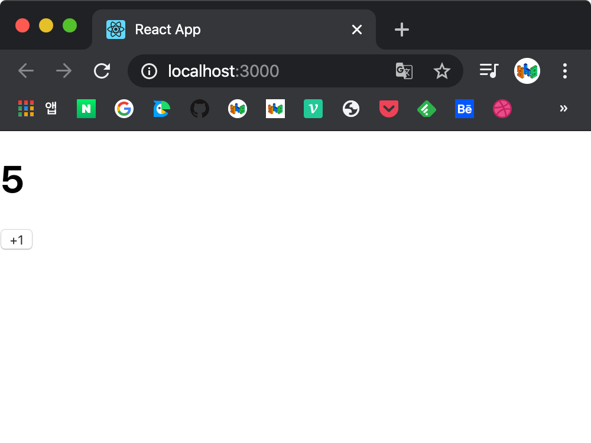
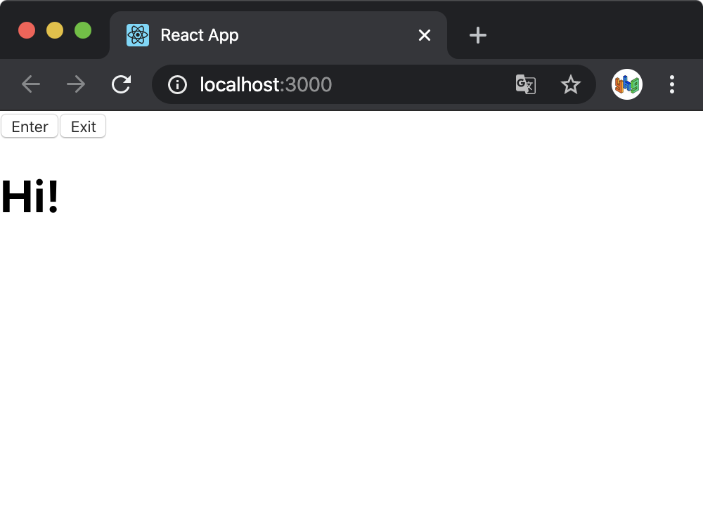

> 이 글은 김민준(velopert)님의 [리액트를 다루는 기술](http://www.yes24.com/Product/Goods/78233628?Acode=101)을참조하여 작성한 글입니다.

리액트 애플리케이션의 인터페이스는 여러 가지 컴포넌트로 구성되어 있다. 리액트에서 컴포넌트는단순한 템플릿 이상의 기능을 수행한다. 데이터에 따라 UI를 만들어주고 , 라이프사이클 API를 이용해 컴포넌트가 화면에서 나타날 때, 사라질 때, 변화가 일어날 때 주어진 작업을 처리하고, 임의 메서드로 특별한 기능을 붙여줄 수 있다.

컴포넌트에는 클래스형 컴포넌트와 함수형 컴포넌트가 있는데, 먼저 클래스형 컴포넌트부터 알아본다.

<br />

### 클래스형 컴포넌트

2장에서 본 `App.js` 처럼 `function` 키워드로 선언되어 있고 컴포넌트를 `return` 하는 구조로 되어있는 컴포넌트가 함수형 컴포넌트이다.

반면 클래스형 컴포넌트의 코드 구조는 다음과 같다.

`App.js`

```javascript
import React, {Component} from 'react';

class App extends Component {
	render() {
		const name = 'react';
		return <div classNme="react">{name}</div>;
	}
}

export default App;
```

<br />

코드 구조를 보면 `App` class는 리액트 `Component` 를 확장하고 있고, `render()` 함수를 갖고 있으며, `render` 함수에서 보여줄 JSX를 반환하고 있다. 클래스형 컴포넌트에서는 이 `render` 함수가 꼭 있어야 한다.

<br />

#### 함수형 vs 클래스형

그러면 어떤 함수형 컴포넌트와 클래스형 컴포넌트에 어떤 차이가 있을까?

함수형 컴포넌트는 클래스형 컴포넌트보다 선언이 편리하고, 메모리 자원을 덜 사용하며, 배포시 결과물의 크기가 더 작다. 주요 단점으로는 `state` 와 라이프사이클 API 사용이 불가능하다는 점이었는데, 리액트 v16.8 이후 Hooks 기능의 도입으로 해결되었다.

리액트 공식 매뉴얼에서 함수형 컴포넌트와 Hooks를 권장하는 만큼 함수형 컴포넌트로작성하는 것이 점점 중요해지고 있지만, 클래스형 컴포넌트가 사라지는 것이 아니므로클래스형 컴포넌트의 기능을 알아둘 필요가 있다.

<br />

### 컴포넌트 만들기

컴포넌트를 만들기 위해서는 `create react-app` 으로 만든 리액트 프로젝트에서 src 디렉토리에 컴포넌트 파일 `NewComponent.js` 을 생성한다.

`NewComponent.js`

```javascript
import React from 'react';

const NewComponent = () => {
	return <div>Hello React Component!</div>;
};

export default NewComponent;
```

<br />

#### 모듈 내보내기(Export) 및 불러오기(Import)

컴포넌트를 작성하면 맨 아래 줄 코드처럼 해당 클래스를 다른 파일에서 import 할 수있도록 export 해주어야 한다.

```javascript
export default NewComponent;
```

<br />

그리고 나서 이 컴포넌트를 불러올 다른 컴포넌트에서 import 하려면 다음과 같이 할수 있다.

```javascript
import React from 'react';
import NewComponent from './NewComponent';

const App = () => {
	return (
		<div>
			<NewComponent />
		</div>
	);
};

export default App;
```

<br />

### `props`

`props` 는 properties를 줄인 표현으로 컴포넌트 속성을 설정할 때 사용하는 요소이다. `props` 값은 해당 컴포넌트를 불러와 사용하는 부모 컴포넌트에서 설정할 수 있다.

<br />

#### 컴포넌트를 사용할 때 `props` 값 지정하기

컴포넌트를 사용하는 부모 컴포넌트에서 `props` 값을 지정할 수 있다. `App.js` 에서사용하는 `NewComponent` 에 `props` 값을 지정하려면 다음과 같이 할 수 있다.

`App.js`

```javascript
import React from 'react';
import NewComponent from './NewComponent';

const App = () => {
	return (
		<div>
			<NewComponent name="younho9" />
		</div>
	);
};

export default App;
```

<br />

#### JSX 내부에서 `props` 렌더링

이렇게 부모 컴포넌트에서 `NewComponent` 에 지정한 `name` 이라는 속성은 다음과 같이 `NewComponent` 에서 `props` 를 파라미터로 받아 와서 사용 할 수 있다.

`NewComponent.js`

```javascript
import React from 'react';

const NewComponent = (props) => {
	return <div>Hello, React Component! I'm {props.name}</div>;
};

export default NewComponent;
```

<br />

#### `props` 기본값 설정 : `defaultProps`

만약 해당 컴포넌트를 사용하는 부모 컴포넌트에서 `props` 값을 지정하지 않았을 경우에 `defaultProps` 로 기본값을 설정할 수 있다.

```javascript
import React from 'react';

const NewComponent = (props) => {
	return <div>Hello, React Component! I'm {props.name}</div>;
};

NewComponent.defaultProps = {
	name: 'default name',
};

export default NewComponent;
```

<br />

#### 태그 사이의 내용을 보여주는 `children`

리액트 컴포넌트를 사용할 때, `children` 이라는 `props` 는 컴포넌트 태그 사이의내용을 보여준다.

`App.js`

```javascript
import React from 'react';
import NewComponent from './NewComponent';

const App = () => {
	return <NewComponent>React</NewComponent>;
};

export default App;
```

<br />

위 코드에서 `NewComponent` 태그 사이에 작성한 React 라는 문자열을 `NewComponent` 내부에서 보여주려면 `props.children` 를 사용하면 된다.

`NewComponent.js`

```javascript
import React from 'react';

const NewComponent = (props) => {
	return (
		<div>
			Hello, React Component! My name is {props.name}
			<br />
			Children is {props.children}
		</div>
	);
};

NewComponent.defaultProps = {
	name: 'default name',
};

export default NewComponent;
```

<br />

#### 비구조화 할당 문법을 통해 props 내부 값 추출하기

현재 `NewComponent` 에서 `props` 를 조회할 때마다 `props.` 으로 시작하는 키워드를 붙여주어야 하는데, 이를 편하게 하기 위해 ES6 문법인 비구조화 할당을 사용할 수있다.

`NewComponent.js`

```javascript
import React from 'react';

const NewComponent = (props) => {
	const {name, children} = props;
	return (
		<div>
			Hello, React Component! My name is {name}
			<br />
			Children is {children}
		</div>
	);
};

NewComponent.defaultProps = {
	name: 'default name',
};

export default NewComponent;
```

<br />

함수의 파라미터 부분에서 바로 비구조화 할당 문법을 사용할 수도 있다.

`NewComponent.js`

```javascript
import React from 'react';

const NewComponent = ({name, children}) => {
	return (
		<div>
			Hello, React Component! My name is {name}
			<br />
			Children is {children}
		</div>
	);
};

NewComponent.defaultProps = {
	name: 'default name',
};

export default NewComponent;
```

<br />

#### `propTypes` 를 통한 `props` 검증

컴포넌트의 필수 `props` 지정 또는 `props` 타입 지정을 위해 `propTypes` 를 사용한다.

`NewComponent.js`

```javascript
import React from 'react';
import PropTypes from 'prop-types';

const NewComponent = ({name, children}) => {
	return (
		<div>
			Hello, React Component! My name is {name}
			<br />
			Children is {children}
		</div>
	);
};

NewComponent.defaultProps = {
	name: 'default name',
};

NewComponent.propTypes = {
	name: PropTypes.string,
};

export default NewComponent;
```

<br />

먼저 `PropTypes` 를 `import` 구문으로 불러오고, `defaultProps` 와 마찬가지로 코드 하단에 정의한다. 다음의 정의는 `name` 속성이 반드시 문자열(string) 형태로 전달되야 한다는 것을 의미한다.

만약 이 컴포넌트를 사용하는 App 컴포넌트에서 `name` 값을 문자열이 아닌 숫자로 전달한다면 어떻게 될까?


<br />

화면에 값이 렌더링되어 나타나기는 하지만, Console을 열어보면 경고 메시지를 볼 수있는데, `NewComponent` 의 `name` `prop` 에 `string` 타입이 들어올 것으로 생각했지만 유효하지 않은 `number` 타입이 들어왔다고 표시하고 있다.

이렇게 `props` 에 원하는 타입을 지정할 수 있는 것이다.

또한 `isRequired` 를 사용하면, 필수 `propTypes` 를 지정할 수 있다. propTypes 를지정할 때 뒤에 `isRequired` 를 붙여주면 된다.

```javascript
NewComponent.propTypes = {
	name: PropTypes.string.isRequired,
};
```

<br />

이렇게 하면 `name` `prop` 을 만약 지정하지 않는다면 경고 메시지가 나타나게 된다.

PropTypes 에는 배열, 함수, 숫자 등 여러 종류를 설정할 수 있다. 아래의 링크에서자세한 정보를 확인할 수 있다.

[facebook/prop-types](https://github.com/facebook/prop-types)

<br />

#### 클래스형 컴포넌트에서 `props` 사용하기

클래스형 컴포넌트에서 `props` 를 사용할 때는 `render` 함수에서 `this.props` 를조회하면 된다. 그리고 `defaultProps` 와 `propTypes` 는 동일한 방식으로 설정할 수있다.

`NewComponent.js`

```javascript
import React, {Component} from 'react';
import PropTypes from 'prop-types';

class NewComponent extends Component {
	render() {
		const {name, children} = this.props;
		return (
			<div>
				Hello, React Component! My name is {name}
				<br />
				Children is {children}
			</div>
		);
	}
}

NewComponent.defaultProps = {
	name: 'default name',
};

NewComponent.propTypes = {
	name: PropTypes.string.isRequired,
};

export default NewComponent;
```

<br />

클래스형 컴포넌트에서는 `defaultProps` 와 `propTypes` 를 class 내부에서 지정할수도 있다.

```javascript
import React, {Component} from 'react';
import PropTypes from 'prop-types';

class NewComponent extends Component {
	static defaultProps = {
		name: 'default name',
	};

	static propTypes = {
		name: PropTypes.string.isRequired,
	};
	render() {
		const {name, children} = this.props;
		return (
			<div>
				Hello, React Component! My name is {name}
				<br />
				Children is {children}
			</div>
		);
	}
}

export default NewComponent;
```

<br />

### `state`

리액트에서 `state` 는 컴포넌트 내부에서 바뀔 수 있는 값을 의미한다. `props` 는컴포넌트가 사용되는 과정에서 부모 컴포넌트가 설정하는 값이고, 컴포넌트 자신은 `props` 를 읽기 전용으로 사용할 수 있다.

리액트에는 두 가지 종류의 `state` 가 있는데, 하나는 클래스형 컴포넌트가 가지고있는 `state` 이고, 다른 하나는 함수형 컴포넌트에서 `useState` 라는 함수를 통해사용하는 `state` 이다.

<br />

#### 클래스형 컴포넌트의 `state`

src 디렉터리에 새로운 `Counter.js` 컴포넌트를 만든다.

`Counter.js`

```javascript
import React, {Component} from 'react';

class Counter extends Component {
	constructor(props) {
		super(props);
		this.state = {
			number: 0,
		};
	}
	render() {
		const {number} = this.state;
		return (
			<div>
				<h1>{number}</h1>
				<button
					onClick={() => {
						this.setState({number: number + 1});
					}}
				>
					+1
				</button>
			</div>
		);
	}
}

export default Counter;
```

<br />

컴포넌트에 `state` 를 설정할 때는, `constructor` 메소드를 작성하여 설정한다. 이는 컴포넌트의 생성자 메소드로, 반드시 `super(props)` 를 호출하여, 리액트 Component 클래스가 지닌 생성자 함수를 호출해 주어야한다.

그 다음 `this.state` 값에 초기값을 설정해주는데, 컴포넌트의 `state` 는 객체 형식이어야 한다.

`render` 함수에서 현재 `state` 를 조회할 때는 `this.state` 를 조회하면 된다. 그리고 `button` 의 `onClick` 이라는 값을 `props` 로 넣어주는데, 이는 버튼을 클릭할때 호출 시킬 함수를 설정한다. (이벤트)

이벤트로 설정할 함수를 화살표 함수 문법을 사용해서 넣어주었다. 함수 내부에서는 `this.setState` 라는 함수를 사용했는데, 이는 `state` 값을 바꿀 수 있게 해준다.

<br />

이제 Counter 컴포넌트를 App에서 불러와 렌더링한다.

`App.js`

```javascript
import React from 'react';
import Counter from './Counter';

const App = () => {
	return <Counter />;
};

export default App;
```

<br />



<br />

버튼을 클릭하면 숫자가 1씩 올라간다.

<br />

앞에서 `constructor` 메소드를 사용했는데 다른 방식으로 간단하게 `state` 의 초기값을 지정할 수 있다.

```javascript
import React, {Component} from 'react';

class Counter extends Component {
	state = {
		number: 0,
	};
	render() {
		const {number} = this.state;
		return (
			<div>
				<h1>{number}</h1>
				<button
					onClick={() => {
						this.setState({number: number + 1});
					}}
				>
					+1
				</button>
			</div>
		);
	}
}

export default Counter;
```

<br />

#### `this.setState` 에 객체 대신 함수 인자 전달하기

`this.setState` 는 `state` 값을 비동기적으로 업데이트한다. 만약 `onClick` 함수내부가 다음과 같다면 어떻게 될까?

```javascript
onClick={() => {
  this.setState({ number: number + 1 });
  this.setState({ number: this.state.number + 1 });
}}
```

<br />

`this.setState` 를 두 번 사용했기 때문에 Click 이벤트가 발생했을 때 숫자가 2씩증가할 것 같지만, 숫자가 1씩 증가하는데, `this.setState` 를 하고 나서 `state` 값이바로 바뀌지 않기 때문이다.

이를 객체 대신에 함수를 `setState` 의 인자로 넣어줌으로 해결할 수 있다.

```javascript
onClick={() => {
  this.setState(prevState => ({
    number: prevState.number + 1
  }));
  this.setState(prevState => ({
    number: prevState.number + 1
  }));
}}
```

<br />

이렇게 `setState` 의 인자로 함수로 넣어주면 2씩 증가하는 것을 확인할 수 있다.

<br />

#### `this.setState` 가 끝난 후 특정 작업 실행하기

`setState` 함수의 두 번째 파라미터로 콜백 함수를 등록하여 `setState` 가 끝난 후특정 작업을 처리할 수 있다.

```javascript
<button
	onClick={() => {
		this.setState(
			(prevState) => ({
				number: prevState.number + 1,
			}),
			() => {
				console.log('setState가 호출되었습니다.');
			},
		);
	}}
>
	+1
</button>
```

<br />

#### 함수형 컴포넌트에서 `useState` 사용하기

리액트 16.8 이전 버전에서는 함수형 컴포넌트에서 `state` 를 사용할 수 없었는데, 16.8이후로는 `useState` 함수로 함수형 컴포넌트에서도 `state` 를 사용할 수 있게되었다. 이 과정에서 Hooks라는 것을 사용하게 된다.

src 디렉토리에 `Say.js` 를 생성한다.

`Say.js`

```javascript
import React, {useState} from 'react';

const Say = () => {
	const [message, setMessage] = useState('');
	const onClickEnter = () => setMessage('Hi!');
	const onClickLeave = () => setMessage('Bye!');

	return (
		<div>
			<button onClick={onClickEnter}>Enter</button>
			<button onClick={onClickLeave}>Exit</button>
			<h1>{message}</h1>
		</div>
	);
};

export default Say;
```

<br />

코드 첫 줄을 보면 `useState` 를 import 한다. 그리고 `useState` 함수를 사용하는데 , 함수의 인자에는 상태의 초깃값을 넣어줄 수 있다. 클래스형 컴포넌트에서의 `state` 초깃값은 객체 형태로 넣어주어야 하지만, `useState` 에서 값의 형태는 자유이다.

함수를 호출하면 배열이 반환되는데, 배열의 첫 번째 원소는 현재 상태, 두 번째 원소는 상태를 바꾸어 주는 세터(Setter) 함수이다. 이를 비구조화 할당으로 `message` , `setMessage` 에 할당해 주고 있다. `onClickEnter` 함수는 'Hi!' 라는 메시지로 `state` 를 세팅하는 함수이고, `onClickLeave` 함수는 'Bye!' 라는 메시지로 `state` 를 세팅하는 함수이다.

<br />



<br />

결과를 보면 Enter, Exit 버튼을 클릭할 때 메시지가 변하는 것을 확인할 수 있다.

<br />

`useState` 는 한 컴포넌트에서 여러 번 사용할 수 있다. 색을 관리하는 `color` 를 `state` 에 추가한다.

```javascript
import React, {useState} from 'react';

const Say = () => {
	const [message, setMessage] = useState('');
	const onClickEnter = () => setMessage('Hi!');
	const onClickLeave = () => setMessage('Bye!');

	const [color, setColor] = useState('black');

	return (
		<div>
			<button onClick={onClickEnter}>Enter</button>
			<button onClick={onClickLeave}>Exit</button>
			<h1 style={{color}}>{message}</h1>
			<button style={{color: 'red'}} onClick={() => setColor('red')}>
				Red
			</button>
			<button style={{color: 'green'}} onClick={() => setColor('green')}>
				Green
			</button>
			<button style={{color: 'blue'}} onClick={() => setColor('blue')}>
				Blue
			</button>
		</div>
	);
};

export default Say;
```

<br />

> JSX inline style 문법 `style={ 객체 }` 이므로 `color` 는 현재 문자열. `{ color }` 로 하면 `{ color : "black" }` 로 객체 형태가 된다. 따라서 `style={{ color }}` 가 옳은 문법.

<br />


<br />

### `state` 를 사용할 때 주의 사항

클래스형, 함수형 컴포넌트 모두 `state` 의 값을 바꾸어야 할 때는 `setState` 혹은 `useState` 를 통해 전달받은 세터 함수를 사용해야 한다. 다음 코드처럼 `state` 값을 직접 변경해서는 안된다.

```javascript
// 클래스형 컴포넌트
this.state.number = this.state.number + 1;
this.state.array = this.array.push(2);
this.state.object.value = 5;

// 함수형 컴포넌트
const [object, setObject] = useState({a: 1, b: 1});
object.b = 2;
```

<br />

왜냐하면 리액트에서는 `state` 의 변경을 감지하고, 변경된 부분을 리렌더링을 하는데 `setState` (또는 `useState` 의 세터 함수)를 사용하지 않고 직접 `state` 값을수정할 경우 변경을 감지하지 못하기 때문이다.

따라서 참조값을 가지는 배열이나 객체를 업데이트해야 할 때는 배열이나 객체 사본을만들고, 사본의 값을 업데이트 한 후, 그 사본의 상태를 `setState` 혹은 세터 함수를통해 업데이트 해야한다.

```javascript
// 객체
const object = {a: 1, b: 2, c: 3};
const nextObject = {...object, b: 2};

// 배열
const array = [
	{id: 1, value: true},
	{id: 2, value: true},
	{id: 3, value: false},
];
const nextArray = array.concat({id: 4});
```

> 객체에서는 spread 연산자 사용, 배열에서는 배열 내장함수를 사용

<br />

### 정리


`props` 와 `state` 모두 컴포넌트에서 사용하거나 렌더링할 데이터를 담고 있지만, `props` 는 부모 컴포넌트가 설정하고, `state` 는 컴포넌트 내부에서 값을 업데이트한다.

`props` 를 사용한다고 값이 무조건 고정적이지 않은데, 부모 컴포넌트의 `state` 를자식 컴포넌트의 `props` 로 전달하고, 자식 컴포넌트에서 특정 이벤트가 발생할 때부모 컴포넌트의 메소드를 호출한다면, `props` 도 유동적으로 사용할 수 있다.

<br />

### 같이 읽기

---

[React.Component - React](https://ko.reactjs.org/docs/react-component.html#setstate)

<br />
