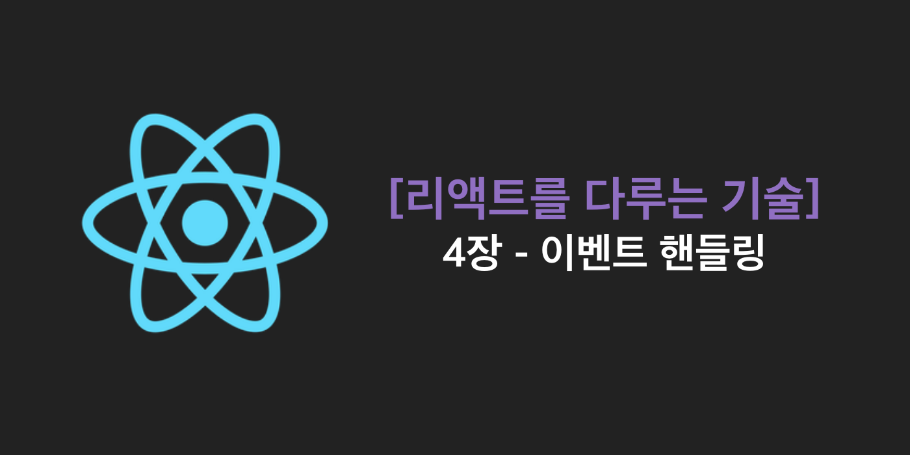
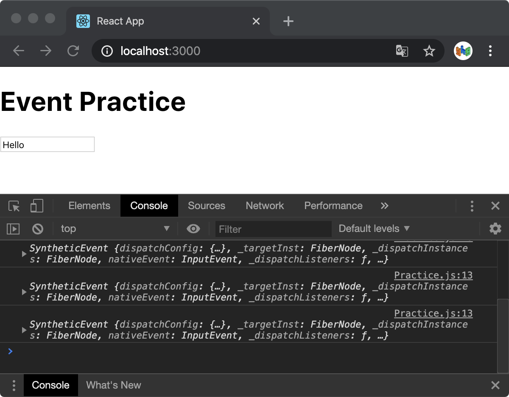
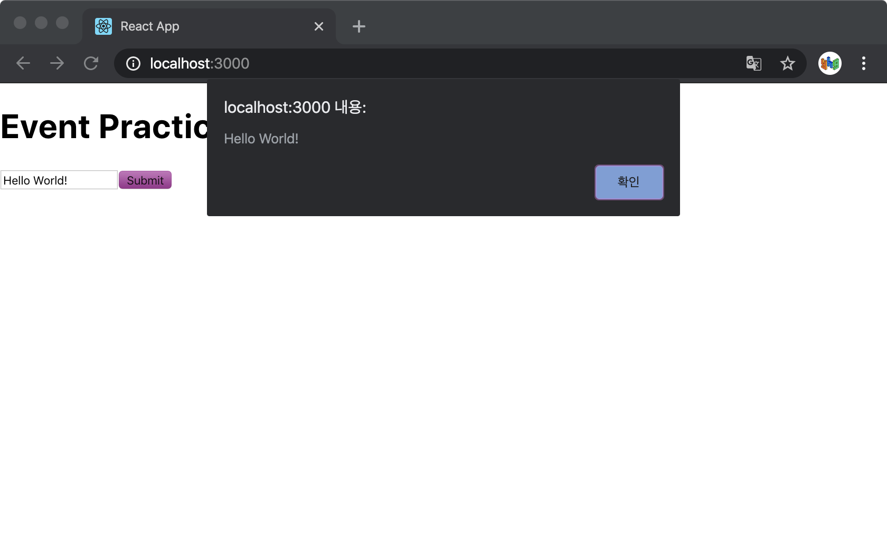
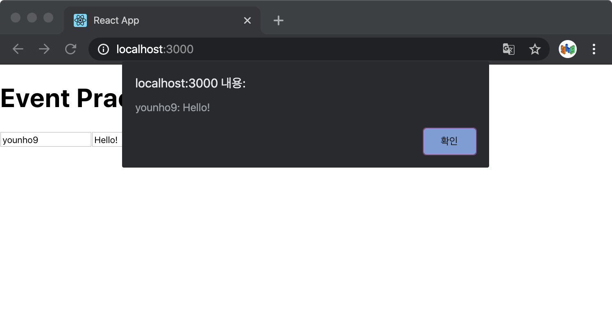

> 이 글은 김민준(velopert)님의 [리액트를 다루는 기술](http://www.yes24.com/Product/Goods/78233628?Acode=101)을참조하여 작성한 글입니다.

## 리액트의 이벤트 시스템

사용자가 웹 브라우저에서 DOM 요소들과 상호 작용하는 것을 이벤트(event)라고 한다. 리액트의 이벤트 시스템은 웹 브라우저의 HTML 이벤트와 인터페이스가 동일하기 때문에 사용법이 꽤 비슷하다. 하지만 주의해야 할 몇 가지 사항이 있다.

<br />

### 이벤트 사용 시 주의 사항

1. 이벤트 이름은 카멜 표기법으로

   HTML에서는 `onclick` 으로 작성하지만 리액트에서는 카멜 표기법으로 `onClick` 으로 작성해야 한다.

1. 이벤트에는 함수 형태의 값을 전달.

   HTML에서 이벤트를 설정할 때 큰따옴표 안에 실행할 코드를 넣었지만, 리액트에서는 함수 형태의 객체를 전달한다. 화살표 함수 문법을 사용하거나 혹은 외부에 미리 함수를 만들어서 전달하기도 한다.

1. DOM 요소에만 이벤트를 설정할 수 있다.

   div, button, input, form, span 등의 DOM 요소에는 이벤트를 설정할 수 있지만, 직접 만든 리액트 컴포넌트에는 이벤트를 자체적으로 설정할 수 없다.

   ```javascript
   <MyComponent onClick={doSomething} />
   ```

   이 코드는 이름이 `onClick` 인 `props` 를 컴포넌트에 전달할 뿐이다.

   컴포넌트에 자체적으로 이벤트를 설정할 수는 없지만, 전달받은 props 를 컴포넌트내부의 DOM 이벤트로 설정할 수는 있다.

   ```javascript
   <div onClick={this.props.onClick}>{/* ... */}</div>
   ```

<br />

리액트에서 지원하는 다양한 이벤트 종류는 아래의 링크를 통해 확인할 수 있다.

[합성 이벤트(SyntheticEvent) - React](https://ko.reactjs.org/docs/events.html)

<br />

## 이벤트 핸들링 예제

### 컴포넌트 생성 및 불러오기

src 디렉토리에 `EventPractice.js` 파일을 만들고 App 컴포넌트에서 불러와 렌더링한다.

`EventPractice.js`

```javascript
import React, {Component} from 'react';

class EventPractice extends Component {
	render() {
		return (
			<div>
				<h1>Event Practice</h1>
			</div>
		);
	}
}

export default EventPractice;
```

<br />

`App.js`

```javascript
import React from 'react';
import EventPractice from './Practice';

const App = () => {
	return <EventPractice />;
};

export default App;
```

<br />

### `onChange` 이벤트 핸들링하기

`EventPractice` 컴포넌트에 input 요소를 렌더링하는 코드와 해당 요소에 onChange 이벤트를 설정하는 코드를 작성한다.

```javascript
import React, {Component} from 'react';

class EventPractice extends Component {
	render() {
		return (
			<div>
				<h1>Event Practice</h1>
				<input
					type="text"
					name="message"
					placeholder="type something"
					onChange={(e) => {
						console.log(e);
					}}
				/>
			</div>
		);
	}
}

export default EventPractice;
```

<br />

`yarn start` 또는 `npm start` 로 리액트 앱을 실행하고, `F12` 를 눌러 콘솔 창을킨후 input 요소에 아무 텍스트를 입력해본다.



<br />

콘솔에 `SyntheticzEvent` 라는 객체가 나타나는 것을 볼 수 있는데, 이 객체는 웹 브라우저의 네이티브 이벤트를 감싸는 객체로, 이벤트 함수의 파라미터(예제 코드에서는 `e` )로 접근할 수 있다.

네이티브 이벤트와 인터페이스가 같으므로, 순수 JS에서 HTML 이벤트를 다룰 때와 똑같이 사용하면 되지만, 네이티브 이벤트와 달리 이벤트가 끝나면 이벤트가 초기화 되므로 정보를 참조할 수 없기 때문에, 비동기적으로 이벤트 객체를 참조해야 한다면 `e.persist()` 함수를 호출해 주어야 한다.

<br />

이제 `state` 에 input 값을 담아보도록 한다. `state` 초기값을 설정하고 이벤트 핸들링 함수 내부에서 `this.setState` 메소드를 호출하여 `state` 를 업데이트한다.

```javascript
import React, {Component} from 'react';

class EventPractice extends Component {
	state = {
		message: '',
	};

	render() {
		return (
			<div>
				<h1>Event Practice</h1>
				<input
					type="text"
					name="message"
					placeholder="type something"
					value={this.state.message}
					onChange={(e) => {
						this.setState({
							message: e.target.value,
						});
					}}
				/>
			</div>
		);
	}
}

export default EventPractice;
```

<br />

인풋에 아무거나 입력했을 때 오류가 발생하지 않는다면 `state` 에 텍스트를 잘 담은것이다.

이제 input 요소 아래에 button 을 하나 만들고, 클릭 이벤트가 발생하면 현재 input 에 담긴 텍스트를 띄운 후 공백으로 설정하도록 한다.

```javascript
import React, {Component} from 'react';

class EventPractice extends Component {
	state = {
		message: '',
	};

	render() {
		return (
			<div>
				<h1>Event Practice</h1>
				<input
					type="text"
					name="message"
					placeholder="type something"
					value={this.state.message}
					onChange={(e) => {
						this.setState({
							message: e.target.value,
						});
					}}
				/>
				<button
					onClick={() => {
						alert(this.state.message);
						this.setState({
							message: '',
						});
					}}
				>
					Submit
				</button>
			</div>
		);
	}
}

export default EventPractice;
```

<br />



<br />

### 임의 메소드 만들기

현재의 코드는 이벤트에 실행할 함수를 렌더링 메소드 내부에 만들어서 전달해주고 있다. 이 방법 대신 함수를 미리 만들어 전달하면 가독성을 높일 수 있다.

```javascript
import React, {Component} from 'react';

class EventPractice extends Component {
	state = {
		message: '',
	};

	constructor(props) {
		super(props);
		this.handleChange = this.handleChange.bind(this);
		this.handleClick = this.handleClick.bind(this);
	}

	handleChange(e) {
		this.setState({
			message: e.target.value,
		});
	}

	handleClick() {
		alert(this.state.message);
		this.setState({
			message: '',
		});
	}

	render() {
		return (
			<div>
				<h1>Event Practice</h1>
				<input
					type="text"
					name="message"
					placeholder="type something"
					value={this.state.message}
					onChange={this.handleChange}
				/>
				<button onClick={this.handleClick}>Submit</button>
			</div>
		);
	}
}

export default EventPractice;
```

<br />

여기서 주의해야할 점은 this 바인딩이다. this는 함수가 어디서 호출되는지에 따라결정된다. 클래스의 임의 메소드가 특정 HTML 요소의 이벤트로 등록되는 과정에서 메소드와 this의 관계가 끊어지게 된다.

따라서 this를 컴포넌트 자신으로 가르키게 하기 위해 메소드를 this와 바인딩하는 작업이 필요하고, 현재 코드에서는 `constructor` 함수 내부에서 함수를 바인딩하고 있다. 메소드 바인딩은 이렇게 생성자 메소드에서 하는 것이 정석이다. 새 메소드를 만들 때마다 `constructor` 도 수정해야하기 때문이다.

하지만 클래스형 컴포넌트에서 [public class fields](https://babeljs.io/docs/en/babel-plugin-proposal-class-properties) 문법을 사용하여 화살표 함수로 메소드를 구현하면, 좀 더 편하게 작성할 수 있다. 화살표 함수의 this는 부모 함수의 this를 상속받는데 JS에서 클래스는 함수로 구현되어있기 때문에 this는 컴포넌트 자신이 되므로 bind(this)를 하지 않아도 된다.

```javascript
import React, {Component} from 'react';

class EventPractice extends Component {
	state = {
		message: '',
	};

	handleChange = (e) => {
		this.setState({
			message: e.target.value,
		});
	};

	handleClick = () => {
		alert(this.state.message);
		this.setState({
			message: '',
		});
	};

	render() {
		return (
			<div>
				<h1>Event Practice</h1>
				<input
					type="text"
					name="message"
					placeholder="type something"
					value={this.state.message}
					onChange={this.handleChange}
				/>
				<button onClick={this.handleClick}>Submit</button>
			</div>
		);
	}
}

export default EventPractice;
```

<br />

이 문법은 실험적인 문법으로 바벨을 설정해주어야 하는데 Create-React-App 으로 만든 프로젝트는 이 문법이 기본적으로 설정되어 있으므로 사용 가능하다.

<br />

### input 여러 개 다루기

이제 input 값을 `state` 에 넣는 방법을 배웠다. 그런데 input 이 여러 개일 때는 어떻게 해야할까? 메소드를 여러 개 만들어 해결할 수 있지만, `event` 객체를 활용하면더 쉽게 처리할 수 있다.

`onChange` 이벤트 핸들러에서 `e.target.name` 은 해당 input의 name을 가리킨다. 이값을 이용해 state를 설정하면 쉽게 해결할 수 있다.

```javascript
import React, {Component} from 'react';

class EventPractice extends Component {
	state = {
		username: '',
		message: '',
	};

	handleChange = (e) => {
		this.setState({
			[e.target.name]: e.target.value,
		});
	};

	handleClick = () => {
		alert(this.state.username + ': ' + this.state.message);
		this.setState({
			username: '',
			message: '',
		});
	};

	render() {
		return (
			<div>
				<h1>Event Practice</h1>
				<input
					type="text"
					name="username"
					placeholder="User name"
					value={this.state.username}
					onChange={this.handleChange}
				/>
				<input
					type="text"
					name="message"
					placeholder="type something"
					value={this.state.message}
					onChange={this.handleChange}
				/>
				<button onClick={this.handleClick}>Submit</button>
			</div>
		);
	}
}

export default EventPractice;
```

<br />



<br />

```javascript
handleChange = (e) => {
	this.setState({
		[e.target.name]: e.target.value,
	});
};
```

이 코드를 보면 `e.target.name` 을 `[]` 로 감싸는데, 이렇게 객체 안에서 key를 `[]` 로 감싸면 그 안에 넣은 레퍼런스가 가리키는 실제 값이 key 값으로 사용된다.

<br />

### `onKeyPress` 이벤트 핸들링

키를 눌렀을 때 발생하는 `KeyPress` 이벤트를 처리해본다. 두 번째 인풋에서 `Enter` 키를 눌렀을 때 `handleCick` 메소드를 호출하도록 코드를 추가한다.

```javascript
import React, {Component} from 'react';

class EventPractice extends Component {
	state = {
		username: '',
		message: '',
	};

	handleChange = (e) => {
		this.setState({
			[e.target.name]: e.target.value,
		});
	};

	handleClick = () => {
		alert(this.state.username + ': ' + this.state.message);
		this.setState({
			username: '',
			message: '',
		});
	};

	handleKeyPress = (e) => {
		if (e.key === 'Enter') {
			this.handleClick();
		}
	};

	render() {
		return (
			<div>
				<h1>Event Practice</h1>
				<input
					type="text"
					name="username"
					placeholder="User name"
					value={this.state.username}
					onChange={this.handleChange}
				/>
				<input
					type="text"
					name="message"
					placeholder="type something"
					value={this.state.message}
					onChange={this.handleChange}
					onKeyPress={this.handleKeyPress}
				/>
				<button onClick={this.handleClick}>Submit</button>
			</div>
		);
	}
}

export default EventPractice;
```

<br />

## 함수형 컴포넌트로 구현해 보기

이제 클래스형 컴포넌트로 작성했던 EventPractice 컴포넌트를 함수형 컴포넌트로 바꾸어본다.

`EventPractice.js`

```javascript
import React, {useState} from 'react';

const EventPractice = () => {
	const [username, setUsername] = useState('');
	const [message, setMessage] = useState('');
	const onChangeUsername = (e) => setUsername(e.target.value);
	const onChangeMessage = (e) => setMessage(e.target.value);
	const onClick = () => {
		alert(username + ': ' + message);
		setUsername('');
		setMessage('');
	};
	const onKeyPress = (e) => {
		if (e.key === 'Enter') {
			onClick();
		}
	};

	return (
		<div>
			<h1>Event Practice</h1>
			<input
				type="text"
				name="username"
				placeholder="User name"
				value={username}
				onChange={onChangeUsername}
			/>
			<input
				type="text"
				name="message"
				placeholder="type something"
				value={message}
				onChange={onChangeMessage}
				onKeyPress={onKeyPress}
			/>
			<button onClick={onClick}>Submit</button>
		</div>
	);
};

export default EventPractice;
```

<br />

기능이 이전과 같이 동작하는지 확인해본다.

위의 함수형 컴포넌트 코드에서는 `e.target.name` 을 사용하지 않고 `onChange` 관련함수를 따로 만들었다. 하지만 input의 개수가 많아질수록 불편해지므로, `e.target.name` 을 활용하는 것이 더 좋을 수 있다.

```javascript
import React, {useState} from 'react';

const EventPractice = () => {
	const [form, setForm] = useState({
		username: '',
		message: '',
	});
	const {username, message} = form;
	const onChange = (e) => {
		const nextForm = {
			...form,
			[e.target.name]: e.target.value,
		};
		setForm(nextForm);
	};
	const onClick = () => {
		alert(username + ': ' + message);
		setForm({
			username: '',
			message: '',
		});
	};
	const onKeyPress = (e) => {
		if (e.key === 'Enter') {
			onClick();
		}
	};

	return (
		<div>
			<h1>Event Practice</h1>
			<input
				type="text"
				name="username"
				placeholder="User name"
				value={username}
				onChange={onChange}
			/>
			<input
				type="text"
				name="message"
				placeholder="type something"
				value={message}
				onChange={onChange}
				onKeyPress={onKeyPress}
			/>
			<button onClick={onClick}>Submit</button>
		</div>
	);
};

export default EventPractice;
```

<br />

`e.target.name` 값을 활용하려면 `useState` 를 사용할 때 input 값들이 들어있는 객체를 정의해 사용하면 된다.

## 정리

리액트에서 이벤트를 다루는 것은 순수 JS 또는 jQuery를 사용한 웹 애플리케이션에서이벤트를 다루는 것과 비슷하다. 따라서 기존 HTML DOM Event를 알고 있다면 리액트의컴포넌트 이벤트도 쉽게 다룰 수 있다.

## 같이 읽기

[이벤트 처리하기 - React](https://ko.reactjs.org/docs/handling-events.html)

[https://medium.com/@wongni/%EB%A6%AC%EC%95%A1%ED%8A%B8%EC%97%90%EC%84%9C-bind-this-%EB%B9%BC-%EB%B2%84%EB%A6%AC%EA%B8%B0-dfb0bbf7bef0](https://medium.com/@wongni/%EB%A6%AC%EC%95%A1%ED%8A%B8%EC%97%90%EC%84%9C-bind-this-%EB%B9%BC-%EB%B2%84%EB%A6%AC%EA%B8%B0-dfb0bbf7bef0)

<br />
