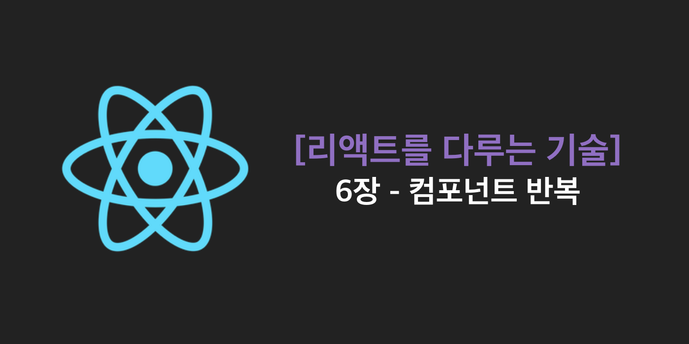
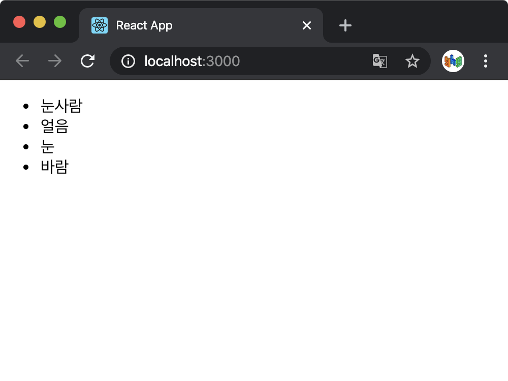
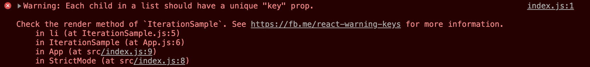

> 이 글은 김민준(velopert)님의
> [리액트를 다루는 기술](http://www.yes24.com/Product/Goods/78233628?Acode=101)을
> 참조하여 작성한 글입니다.

웹 애플리케이션을 만들다 보면 반복되는 코드를 작성할 때가 있다. 이 장에서는 리액
트 프로젝트에서 반복적인 애용을 효율적으로 보여주고 관리하는 방법을 알아본다.

<br />

## 자바스크립트 배열의 `map()` 함수

자바스크립트 배열 객체의 내장 함수인 `map()` 함수를 사용하여 반복되는 컴포넌트를
렌더링할 수 있다.

먼저 `map()` 함수에 대한 mdn 문서를 보고 정리해본다

[Array.prototype.map()](https://developer.mozilla.org/ko/docs/Web/JavaScript/Reference/Global_Objects/Array/map)

`map()` 메소드는 배열 내의 모든 요소 각각에 대하여 주어진 함수를 호출한 결과를모
아 새로운 배열을 반환하는 함수이다.

```javascript
arr.map(callback(currentValue[, index[, array]])[, thisArg])
```

`map()` 함수는 `callback` 함수, `thisArg` (옵셔널) 를 매개변수로 받는다. 그리고
`callback` 함수는 `currentValue` , `index` (옵셔널), `array` (옵셔널) 3개의 매개
변수를 받는다

- `callback`

  - `currentValue` : 현재 처리하고 있는 요소

  - `index` (옵셔널) : 현재 처리하고 있는 요소의 index 값

  - `array` (옵셔널) : 현재 처리하고 있는 원본 배열

- `thisArg` (옵셔널) : callback 함수 내부에서 사용할 this 레퍼런스

그리고 배열의 각 요소에 대해 실행한 `callback` 의 결과를 모은 새로운 배열을 리턴
한다.

### 예제

```javascript
var numbers = [1, 4, 9];
var doubles = numbers.map(function (num) {
  return num * 2;
});
// doubles = [2, 8, 18]

var roots = numbers.map(Math.sqrt); // Math.sqrt는 x의 제곱근을 반환하는 함수.
// roots = [1, 2, 3]
```

<br />

`call()` 이나 `apply()` 메소드를 이용하여 유사 배열 객체에 배열 메소드를 빌려서
사용할 수 있다.

```javascript
let map = Array.prototype.map;
let a = map.call('Hello World', function (x) {
  return x.charCodeAt(0); // 각 문자의 ASCII 인코딩 값을 가져오는 함수.
});
// a = [72, 101, 108, 108, 111, 32, 87, 111, 114, 108, 100]

var elems = document.querySelectorAll('select option:checked');
var values = [].map.call(elems, function (obj) {
  return obj.value;
});
```

> [`Array.from()`](https://developer.mozilla.org/ko/docs/Web/JavaScript/Reference/Global_Objects/Array/from)
> 을 사용할 수도 있다.

<br />

`map` 에 하나의 인자만 받는 콜백을 사용하는 경우가 많은데, 두 개 이상의 인자를사
용하는 함수를 사용할 때 혼란스러울 수 있다.

```javascript
['1', '2', '3'].map(parseInt);
```

이렇게 작성했을 때 결과를 `[1, 2, 3]` 으로 기대하지만 결과는 `[1, NaN, NaN]` 인
데, 이는 `parseInt` 함수가 두 개의 인자를 받을 수 있기 때문이다. 첫 번째 인자는
변환하고자 하는 표현이고, 두 번째는 숫자로 변환할 때 사용할 진법(radix)이다.

`Array.prototype.map` 은 위에서 본 것처럼 배열의 값, 인덱스, 배열 세 가지의 인자
를 전달하므로, 배열의 인덱스가 진법(radix)으로 전달되어 혼란스럽게 작동한다.

`[1, NaN, NaN]` 으로 표시되는 이유는 아래의 링크로 `parseInt()` 함수를 이해해야
한다.

[parseInt()](https://developer.mozilla.org/ko/docs/Web/JavaScript/Reference/Global_Objects/parseInt)

<br />

## 데이터 배열을 컴포넌트 배열로 변환하기

기존 자바스크립트의 배열로 컴포넌트로 구성된 배열을 생성할 수 있다. src 디렉토리
에 `IterationSample.js` 파일을 생성한다.

`IterationSample.js`

```javascript
import React from 'react';

const IterationSample = () => {
  const names = ['눈사람', '얼음', '눈', '바람'];
  const nameList = names.map((name) => <li>{name}</li>);
  return <ul>{nameList}</ul>;
};

export default IterationSample;
```

`nameList` 에 `<li>눈사람</li>` , `<li>얼음</li>` , ... 의 컴포넌트로 구성된 배
열이 저장된다.

<br />

이제 App 컴포넌트에서 불러와 렌더링 해보면

`App.js`

```javascript
import React, {Component} from 'react';
import IterationSample from './IterationSample';

class App extends Component {
  render() {
    return <IterationSample />;
  }
}

export default App;
```

<br />



원하는 대로 렌더링이 된 것을 확인할 수 있다.

하지만 `F12` 키를 눌러 크롬의 콘솔 창을 확인해 보면 경고 메시지가 나타나는 것을
볼 수 있다.



경고 메시지를 보면 리스트에 있는 각 자손 요소(child)가 "key" prop이 없다고 나온
다.

key가 무엇인지 알아보자.

<br />

## key

리액트에서 key는 컴포넌트 배열을 렌더링 했을 때, 어떤 원소에 변동이 있었는지 식
별하는 것을 돕는데 사용되는 속성이다. key가 없을 때는 Virtual DOM을 비교하면서리
스트를 **순차적으로 비교**하면서 변화를 감지하기 때문에, 리스트의 맨 앞이나 중간
에 엘리먼트가 삽입될 때 성능 저하가 발생한다. 따라서 이 문제를 극복하기 위해 key
를 사용한다.

성능 저하가 발생하는 원인은 아래의 링크에서 자세히 설명해주고 있다.

[재조정 (Reconciliation) - React](https://ko.reactjs.org/docs/reconciliation.html#recursing-on-children)

<br />

### key 설정

key 값을 설정할 때는 map 함수의 인자로 전달되는 함수 내부에서 컴포넌트 `props`
를 설정하듯이 설정하면 된다. 그런데 key 값은 언제나 유일해야 한다. 따라서 데이터
가 가진 고윳값을 key 값으로 설정해야 한다.

앞서 만든 예제 컴포넌트에는 고유 번호가 없기 때문에 콜백 함수의 인수인 index 값
을 사용할 수 있다.

`IterationSample.js`

```javascript
import React from 'react';

const IterationSample = () => {
  const names = ['눈사람', '얼음', '눈', '바람'];
  const nameList = names.map((name, index) => <li key={index}>{name}</li>);
  return <ul>{nameList}</ul>;
};

export default IterationSample;
```

<br />

이제 각 항목의 고유한 key를 지정해 주었기 때문에 개발자 도구에서 경고 메시지를표
시하지 않는 것을 확인할 수 있다.

하지만 항목의 순서가 바뀔 수 있는 경우 key에 index를 사용하는 것은 권장하지 않는
다. 렌더링한 항목에 대한 안정적인 ID가 없을 때, **최후의 수단**으로 index를 key
로 사용한다.

인덱스를 key로 사용할 경우 부정적인 영향에 대한 상세 설명은 아래의 링크를 참조하
자.

[Index as a key is an anti-pattern](https://medium.com/@robinpokorny/index-as-a-key-is-an-anti-pattern-e0349aece318)

<br />

## 응용

이제 고정된 배열이 아닌 동적인 배열을 렌더링하도록 한다. 즉 데이터를 추가하고 삭
제하는 것이 가능하도록 예제를 변경해본다. 또한 index 값이 아닌 고윳값을 만들어
key로 사용하는 법도 알아본다.

### 초기 상태 설정하기

`IterationSample` 컴포넌트에서 `useState` 를 사용하여 상태를 설정한다.

```javascript
import React, {useState} from 'react';

const IterationSample = () => {
  const [names, setNames] = useState([
    {id: 1, text: '눈사람'},
    {id: 2, text: '얼음'},
    {id: 3, text: '눈'},
    {id: 4, text: '바람'},
  ]);
  const [inputText, setInputText] = useState('');
  const [nextId, setNextId] = useState(5);

  const nameList = names.map((name) => <li key={name.id}>{name.text}</li>);
  return <ul>{nameList}</ul>;
};

export default IterationSample;
```

<br />

이전과 달리 `names` 에 `text` 와 고유의 `id` 를 담고 있는 객체들의 배열을 넣어준
다. 그리고 새로 추가할 데이터를 입력받기 위해 `inputText` 를 추가했고, `nextId`
를 통해 추가될 데이터의 아이디를 계산해 주도록 했다.

<br />

### 추가 기능 구현하기

```javascript
import React, {useState} from 'react';

const IterationSample = () => {
  const [names, setNames] = useState([
    {id: 1, text: '눈사람'},
    {id: 2, text: '얼음'},
    {id: 3, text: '눈'},
    {id: 4, text: '바람'},
  ]);
  const [inputText, setInputText] = useState('');
  const [nextId, setNextId] = useState(5);

  const onChange = (e) => setInputText(e.target.value);
  const onClick = () => {
    const nextNames = names.concat({
      id: nextId,
      text: inputText,
    });
    setNextId(nextId + 1);
    setNames(nextNames);
    setInputText('');
  };

  const nameList = names.map((name) => <li key={name.id}>{name.text}</li>);
  return (
    <>
      <input value={inputText} onChange={onChange} />
      <button onClick={onClick}>추가</button>
      <ul>{nameList}</ul>
    </>
  );
};

export default IterationSample;
```

<br />

`onChange` 함수를 통해 `inputText` 를 입력받도록 했다.

그리고 `onClick` 함수에서는 배열의 내장 함수 `concat` 을 사용하여 새로운 항목을
추가한 배열을 만들어준 다음, 새로 만들어진 `nextNames` 를 `setNames` 로 상태를업
데이트해 준다.

새 항목을 추가할 때 배열의 `push` 함수가 아니라 `concat` 을 사용하는 이유가 중요
한데, `push` 함수는 기존 배열에 항목을 추가하는 것으로 기존 배열 자체를 변경하는
반면, `concat` 함수는 기존 배열에 항목을 추가한 새로운 배열을 만들어 준다.

리액트에서 상태를 업데이트할 때는 기존 상태를 그대로 두면서 새로운 값을 상태로설
정해야 한다.

> 이를 **불변성 유지**라고 하며, 이는 리액트 컴포넌트의 성능을 최적화하는데 중요
> 한 개념이다.

불변성 유지에 대해서는 다음에 알아보도록 한다.

<br />

### 제거 기능 구현하기

이번에는 각 항목을 더블클릭했을 때 해당 항목이 사라지는 기능을 구현해 보는데, 불
변성을 유지하면서 배열의 특정 항목을 지울 때는 배열의 내장 함수 `filter` 를 사용
한다. `filter` 의 사용 법은 아래의 링크를 참조한다.

[Array.prototype.filter()](https://developer.mozilla.org/ko/docs/Web/JavaScript/Reference/Global_Objects/Array/filter)

```javascript
import React, {useState} from 'react';

const IterationSample = () => {
  const [names, setNames] = useState([
    {id: 1, text: '눈사람'},
    {id: 2, text: '얼음'},
    {id: 3, text: '눈'},
    {id: 4, text: '바람'},
  ]);
  const [inputText, setInputText] = useState('');
  const [nextId, setNextId] = useState(5);

  const onChange = (e) => setInputText(e.target.value);
  const onClick = () => {
    const nextNames = names.concat({
      id: nextId,
      text: inputText,
    });
    setNextId(nextId + 1);
    setNames(nextNames);
    setInputText('');
  };
  const onRemove = (id) => {
    const nextNames = names.filter((name) => name.id !== id);
    setNames(nextNames);
  };
  const nameList = names.map((name) => (
    <li key={name.id} onDoubleClick={() => onRemove(name.id)}>
      {name.text}
    </li>
  ));
  return (
    <>
      <input value={inputText} onChange={onChange} />
      <button onClick={onClick}>추가</button>
      <ul>{nameList}</ul>
    </>
  );
};

export default IterationSample;
```

<br />

HTML 요소를 더블클릭할 때 사용하는 이벤트의 이름은 `onDoubleClick` 이다.
`onRemove` 라는 함수를 구현해서 각 `li` 요소에 이벤트로 등록해준다. `onRemove`
함수에서는 클릭할 때 클릭이 발생한 `li` 요소의 `id` 를 매개변수로 받아 해당 `id`
를 가진 `name` 객체를 제거하고, 필터링 된 배열 `nextNames` 로 `names` 를 업데이
트 한다.

## 정리

반복되는 데이터를 렌더링하고, 유동적인 배열을 만들어 추가 기능, 제거 기능을 구현
해 보았다. 컴포넌트 배열을 렌더링할 때는 `key` 값 설정에 주의해야 한다.

배열을 변형할 때는 배열에 직접 접근하여 수정하는 것이 아니라 `concat` , `filter`
등의 배열 내장 함수를 사용하여 새로운 배열을 만든 후 이를 새로운 상태로 설정해주
어야 한다는 점을 기억하자.

## 같이 읽기

[리스트와 Key - React](https://ko.reactjs.org/docs/lists-and-keys.html)
