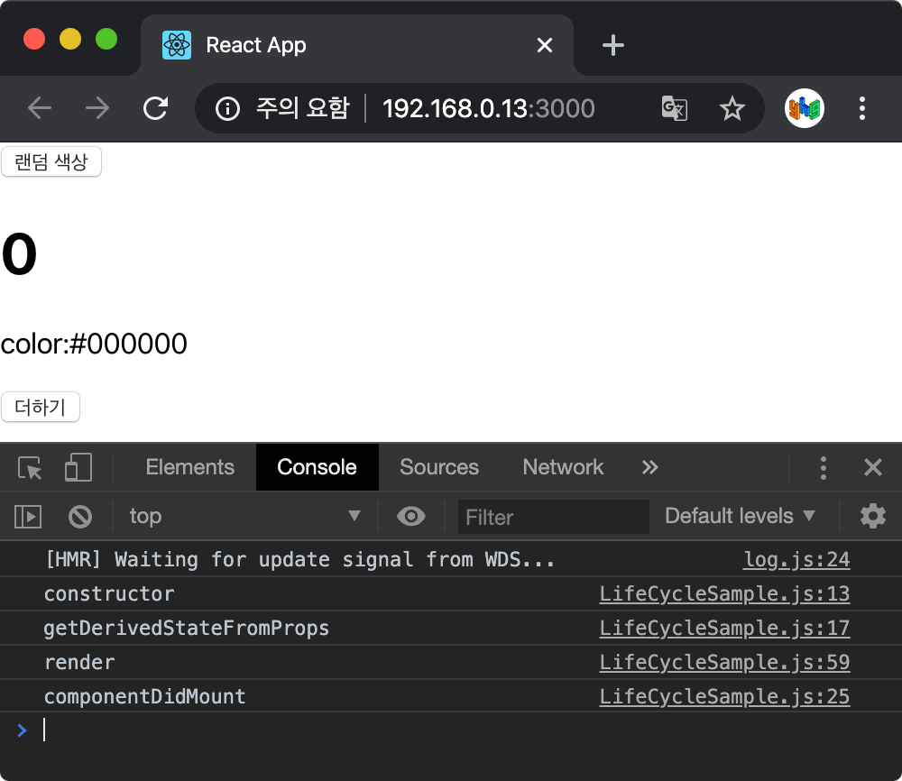
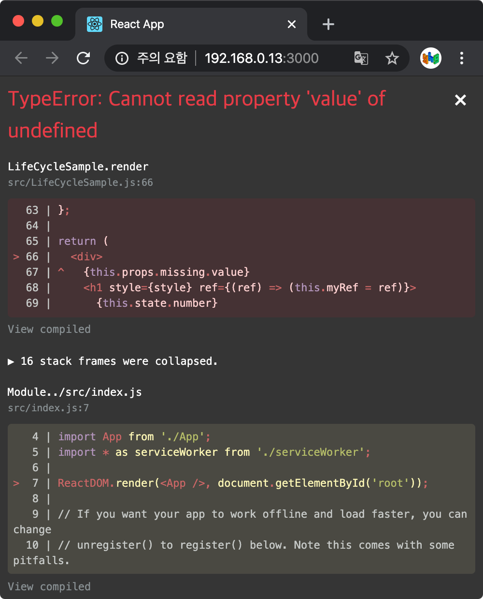

> 이 글은 김민준(velopert)님의 [리액트를 다루는 기술](http://www.yes24.com/Product/Goods/78233628?Acode=101)을 참조하여 작성한 글입니다.

모든 리액트 컴포넌트에는 라이프사이클(수명 주기)이 존재한다. 리액트 프로젝트를 진행하다 보면, **컴포넌트를 처음으로 렌더링할 때** 혹은 **컴포넌트를 업데이트하기 전후로** 어떤 작업을 처리해야할 수도 있고, 불필요한 업데이트를 방지해야 할 수도 있다. 이때 컴포넌트의 라이프사이클 메서드를 사용한다.

## 라이프사이클 메서드의 이해

라이프사이클 메서드는 총 아홉 가지이다.

**Will** 접두사 - 어떤 작업을 작동하기 전에 실행되는 메서드

**Did** 접두사 - 어떤 작업을 작동한 후에 실행되는 메서드

이 메서드들을 컴포넌트 클래스에서 덮어 써 선언함으로 사용할 수 있다.

라이프사이클은 총 세 가지 **마운트, 업데이트, 언마운트**로 나눈다.

1. **마운트** : 페이지에 컴포넌트가 나타남

1. **업데이트** : 컴포넌트 정보를 업데이트(리렌더링)

1. **언마운트** : 페이지에서 컴포넌트가 사라짐

<br />

### 마운트

DOM이 생성되고 웹 브라우저상에 나타나는 것을 마운트(mount)라고 한다. 이 때 다음의 메서드를 호출한다.

컴포넌트 만들기

1. `constructor` 메서드 : 컴포넌트를 새로 만들 때마다 호출되는 클래스 생성자 메서드

1. `getDerivedStateFromProps` 메서드 : `props` 에 있는 값을 `state` 에 넣을 때 사용하는 메서드

1. `render` 메서드 : 준비한 UI를 렌더링하는 메서드

1. `componentDidMount` 메서드 : 컴포넌트가 웹 브라우저상에 나타난 후에 호출하는 메서드

<br />

### 업데이트

컴포넌트는 다음의 경우에 업데이트한다.

- `props` 가 바뀔 때

- `state` 가 바뀔 때

- 부모 컴포넌트가 리렌더링될 때

- `this.forceUpdate` 로 강제로 렌더링을 트리거할 때

<br />

이러한 경우로 컴포넌트를 업데이트하게 되면 다음의 메서드를 호출한다.

컴포넌트 업데이트

1. `getDerivedStateFromProps` 메서드 : `props` 에 있는 값을 `state` 에 넣을 때 사용하는 메서드 (마운트에서도 호출됨)

1. `shouldComponentUpdate` 메서드 : 컴포넌트가 리렌더링을 해야 할지 말아야 할지를 결정하는 메서드 ( `true` 를 반환하면 리렌더링, `false` 면 리렌더링 하지 않음.)

1. `render` 메서드 : 준비한 UI를 렌더링하는 메서드

1. `getSnapshotBeforeUpdate` : 컴포넌트 변화를 DOM에 반영하기 직전에 호출하는 메서드

1. `componentDidUpdate` : 컴포넌트의 업데이트 작업이 끝난 후 호출하는 메서드

<br />

### 언마운트

컴포넌트를 DOM에서 제거하는 것을 언마운트(unmount)라고 한다. 컴포넌트를 언마운트하면 다음의 메소드를 호출한다.

- `componentWIllUnmount` : 컴포넌트가 웹 브라우저상에서 사라지기 전에 호출하는 메서드

<br />

## 라이프사이클 메서드 살펴보기

### `render`

컴포넌트의 모양새를 정의하는 메서드. 라이프사이클 메서드 중 유일한 **필수 메서드**이다.

이 메서드 안에서 `this.props` 와 `this.state` 에 접근할 수 있다.

이 메서드 안에서 이벤트 설정이 아닌 곳에서 `setState` 를 사용해선 안되고, 브라우저의 DOM에 접근해서도 안된다. DOM 정보를 가져오거나 `state` 에 변화를 줄 때는 `componentDidMount` 에서 처리해야 한다.

<br />

### `constructor`

컴포넌트의 생성자 메서드로 컴포넌트를 만들 때 처음으로 실행된다. 초기 `state` 를 정할 수 있다.

<br />

### `getDerivedStateFromProps`

`props` 로 받아 온 값을 `state` 에 동기화시키는 용도.

```javascript
static getDerivedStateFromProps(nextProps, prevState) {
  if(nextProps.value !== prevState.value) {
    return { value: nextProps.value };
  }
  return null;
}
```

<br />

### `componentDidMount`

컴포넌트를 만들고 첫 렌더링을 마친 후 실행한다. 이 안에서 다른 자바스크립트 라이브러리 또는 프레임워크의 함수를 호출하거나 이벤트 등록, `setTimeout` , `setInterval` , 네트워크 요청 같은 비동기 작업을 처리하면 된다.

<br />

### `shouldComponentUpdate`

`props` 또는 `state` 를 변경했을 때 리렌더링을 시작할지 여부를 지정하는 메서드. 이 메서드를 따로 생성하지 않으면 기본적으로 `true` 를 반환해서 언제나 리렌더링을 한다. `false` 를 반환하면 업데이트 과정이 여기서 중지된다. (리렌더링되지 않는다.)

<br />

### `getSnapshotBeforeUpdate`

`render` 에서 만들어진 결과물이 브라우저에 실제로 반영되기 직전에 호출. 주로 업데이트 직전의 값을 참고할 일이 있을 때 활용된다.

```javascript
getSnapshotBeforeUpdate(prevProps, prevState) {
  if(prevState.array !== this.state.array) {
    const { scrollTop, scrollHeight } = this.list
    return { scrollTop, scrollHeight };
  }
}
```

<br />

### `componentDidUpdate`

```javascript
componentDidUpdate(prevProps, prevState, snapshot){...}
```

리렌더링을 완료한 후 실행한다. `prevProps` 또는 `prevState` 를 사용하여 컴포넌트가 이전에 가졌던 데이터에 접근할 수 있다. 또한 `getSnapshotBeforeUpdate` 에서 반환한 값이 있다면 여기서 `snapshot` 값을 전달받을 수 있다.

<br />

### `componentWillUnmount`

컴포넌트를 DOM에서 제거할 때 실행. `componentDidMount` 에서 등록한 이벤트, 타이머, 직접 생성한 DOM이 있다면 여기서 제거 작업을 해야한다.

<br />

### `componentDidCatch`

컴포넌트 렌더링 도중에 에러가 발생했을 때 애플리케이션이 먹통이 되지 않고 오류 UI를 보여줄 수 있게 해준다.

```javascript
componentDidCatch(error, info) {
  this.setState({
    error: true
  });
  console.log({ error, info });
}
```

`error` 파라미터는 어떤 에러가 발생했는지 알려주고 `info` 파라미터는 어디에 있는 코드에서 오류가 발생했는지에 대한 정보를 준다.

<br />

## 라이프사이클 메서드 사용하기

`LifeCycleSample.js` 라는 컴포넌트를 만든다.

```javascript
import React, { Component } from 'react';

class LifeCycleSample extends Component {
  state = {
    number: 0,
    color: null,
  };

  myRef = null;

  constructor(props) {
    super(props);
    console.log('constructor');
  }

  static getDerivedStateFromProps(nextProps, prevState) {
    console.log('getDerivedStateFromProps');
    if (nextProps.color !== prevState.color) {
      return { color: nextProps.color };
    }
    return null;
  }

  componentDidMount() {
    console.log('componentDidMount');
  }

  shouldComponentUpdate(nextProps, nextState) {
    console.log('shouldComponentUpdate', nextProps, nextState);
    return nextState.number % 10 !== 4;
  }

  componentWillUnmount() {
    console.log('componentWillUnmount');
  }

  handleClick = () => {
    this.setState({
      number: this.state.number + 1,
    });
  };

  getSnapshotBeforeUpdate(prevProps, prevState) {
    console.log('getSnapshotBeforeUpdate');
    if (prevProps.color !== this.props.color) {
      return this.myRef.style.color;
    }
    return null;
  }

  componentDidUpdate(prevProps, prevState, snapshot) {
    console.log('componentDidUpdate', prevProps, prevState);
    if (snapshot) {
      console.log('업데이트 되기 직전 색상: ', snapshot);
    }
  }

  render() {
    console.log('render');

    const style = {
      color: this.props.color,
    };

    return (
      <div>
        <h1 style={style} ref={ref => (this.myRef = ref)}>
          {this.state.number}
        </h1>
        <p>color:{this.state.color}</p>
        <button onClick={this.handleClick}>더하기</button>
      </div>
    );
  }
}

export default LifeCycleSample;
```

<br />

이 컴포넌트는 라이프사이클 메서드를 실행할 때마다 콘솔 디버거에 기록하고 부모 컴포넌트에서 `props` 로 색상을 받고, 버튼을 누르면 `state.number` 값을 1씩 더한다.

`shouldComponentUpdate` 메서드에서 `state.number` 값의 마지막 자리 수가 4이면 리렌더링을 취소하도록 설정했다.

<br />

`App.js`

```javascript
import React, { Component } from 'react';
import LifeCycleSample from './LifeCycleSample';

function getRandomColor() {
  return '#' + Math.floor(Math.random() * 16777215).toString(16);
}
class App extends Component {
  state = {
    color: '#000000',
  };
  handleClick = () => {
    this.setState({
      color: getRandomColor(),
    });
  };
  render() {
    return (
      <div>
        <button onClick={this.handleClick}>랜덤 색상</button>
        <LifeCycleSample color={this.state.color} />
      </div>
    );
  }
}
export default App;
```

<br />



코드를 저장하면 다음 결과가 나타난다.

위쪽 버튼과 아래쪽 버튼을 번갈아 누르면 아래처럼 나타난다.

<br />

### 에러 잡아내기

`render` 함수에서 존재하지 않는 함수를 사용하려고 하거나, 존재하지 않는 객체의 값을 조회할 때 발생한다.

`LifeCycleSample.js`

```javascript
render() {
  console.log('render');

  const style = {
    color: this.props.color,
  };

  return (
    <div>
      {this.props.missing.value}
      <h1 style={style} ref={(ref) => (this.myRef = ref)}>
        {this.state.number}
      </h1>
      <p>color:{this.state.color}</p>
      <button onClick={this.handleClick}>더하기</button>
    </div>
  );
}
```

이렇게 존재하지 않는 `props` 인 `missing` 객체의 `value` 를 조회해서 렌더링하려고 하면 브라우저에서 에러가 발생한다.

<br />



<br />

오른쪽 위의 X 버튼을 누르면 오류 창이 닫히고 브라우저에는 아무것도 없는 흰 페이지만 남는다. 에러가 발생했을 때 따로 처리해주지 않으면 이렇게 빈 페이지만 남아 사용자를 당황시키게 된다.

이를 해결하기 위해 `ErrorBoundary` 라는 컴포넌트를 생성해본다.

`ErrorBoundary.js`

```javascript
import React, { Component } from 'react';

class ErrorBoundary extends Component {
  state = {
    error: false,
  };

  componentDidCatch(error, info) {
    this.setState({
      error: true,
    });
    console.log({ error, info });
  }
  render() {
    if (this.state.error) return <div>에러가 발생했습니다!</div>;
    return this.props.children;
  }
}

export default ErrorBoundary;
```

<br />

에러가 발생하면 `componentDidCatch` 메서드가 호출되며, `this.state.error` 값을 `true` 로 업데이트해준다. 그러면 `render` 에서 에러가 발생했음을 알려주는 문구를 보여준다.

이 컴포넌트를 `App.js` 에서 `LifeCycleSample` 컴포넌트를 감싸준다.

`App.js`

```javascript
import React, { Component } from 'react';
import LifeCycleSample from './LifeCycleSample';
import ErrorBoundary from './ErrorBoundary';

function getRandomColor() {
  return '#' + Math.floor(Math.random() * 16777215).toString(16);
}
class App extends Component {
  state = {
    color: '#000000',
  };
  handleClick = () => {
    this.setState({
      color: getRandomColor(),
    });
  };
  render() {
    return (
      <div>
        <button onClick={this.handleClick}>랜덤 색상</button>
        <ErrorBoundary>
          <LifeCycleSample color={this.state.color} />
        </ErrorBoundary>
      </div>
    );
  }
}
export default App;
```

<br />

여전히 에러가 발생하지만, X 버튼을 누른 뒤 브라우저를 보면 에러가 발생했다는 것을 알려주는 페이지를 볼 수 있다.

## 정리


라이프사이클 메서드는 컴포넌트 상태에 변화가 있을 때마다 실행하는 메서드이다. 이 메서드들은 서드파티 라이브러리를 사용하거나 DOM을 직접 건드려야 하는 상황에서 유용하다. 컴포넌트 업데이트의 성능을 개선할 때는 `shouldComponentUpdate` 가 중요하게 사용된다.

## 같이 읽기

[State and Lifecycle - React](https://ko.reactjs.org/docs/state-and-lifecycle.html)

[React.Component - React](https://ko.reactjs.org/docs/react-component.html)

<br />
