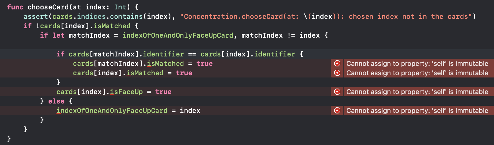
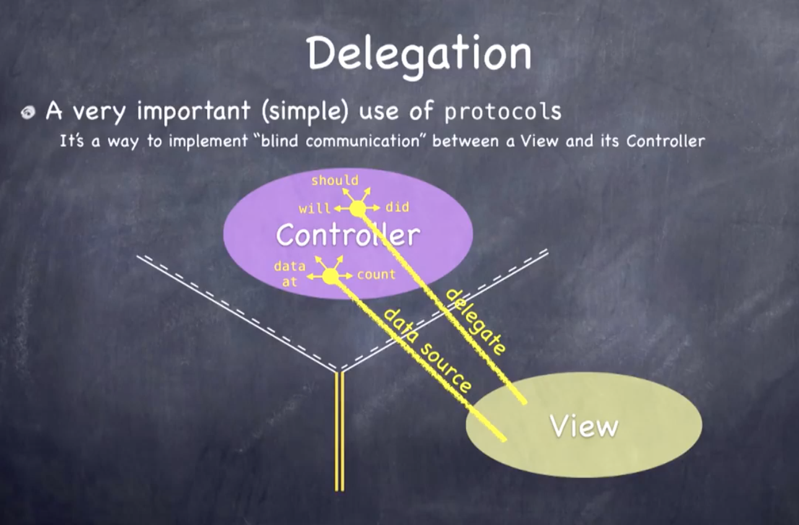

# Lecture 4. Swift - Part. 2 (Protocols and Closures)

## Today

### Mostly more Swift but some other stuff too

- Quick demo of mutating

- protocols

- String

- NSAttributedString

- Closures (and functions as types in general)

## 구조체로 바꿔보기

```swift
// class Concentration {
struct Concentration {
	...
}
```

> `class` 로 선언되어 있는 `Concentration` 을 `struct` 로 변경한다. `struct` 는 값타입이며, 쓰기시 복사하는 형태로 복사하게 된다. `Class` 는 레퍼런스 타입으로 복사되지 않고 해당 `class` 를 가르키는 `Pointer` 를 전달하게 된다.

※ 쓰기시 복사 (copy on write) : 구조체는 힙 내부에 존재하지 않고, 전달할 때 계속해서 복사된다. 스위프트는 **내용이 변경 되었을 때 복사**하기 때문에 굉장히 효율적이다. 반면 클래스는 힙 안에 존재하기 때문에 전달될 때 포인터를 전달하고 따라서 한 객체 안에 수많은 포인터가 존재할 수 있다.

<br>



> `struct` 는 자기 자신 내부에 있는 값을 변경할 수 없기 때문에 오류가 발생한다. `mutating` 이라는 예약어를 통해 해결할 수 있다.

## 프로토콜 (protocol)

> : 별도의 구현이 없는 메소드와 변수의 리스트이고 API에서 원하는 것을 불러오는 방식이다. 호출자와 피호출자가 원하는 것을 표현한다. 

- 프로토콜은 API를 매우 유연하고 표현가능하도록 만들어 준다. (블라인드 커뮤니케이션 구조에서 효과적)
- **프로토콜은 하나의 타입**
- 순수하게 기능만을 상속, 다중 상속 가능
- 프로토콜에서 구현되는 모든 메소드와 프로퍼티들은 프로토콜을 상속하는 경우 반드시 구현해야 한다. 

### 프로토콜의 선언

```swift
protocol SomeProtocol: InheritedProtocol1, InheritedProtocol2 {
	var someProperty: Int {get set}
	func aMethod(arg1: Double, anotherArgument: String) -> SomeType
	mutating func changeIt()
	required init(arg: Type)
}
```

> - `SomeProtocol` 이 `InheritedProtocol1,2` 를 상속받고 있으므로 `SomeProtocol` 을 상속받는 경우  `InheritedProtocol1,2` 도 구현해 주어야 한다.
>
> - `property` 의 경우 `get` 또는 `get` , `set` 인지 명시해 주어야 한다.
> - `receiver` 를 변경할 것이 예상되는 함수에 대해서는 `mutating` 을 명시해 주어야 한다.

```swift
protocol SomeProtocol: class, InheritedProtocol1, InheritedProtocol2 {
	...
  required init(arg: Type)
}
```

> - 이 프로토콜이 절대 `struct` 에서 구현되지 않도록 하려면  `class` 를 프로토콜을 선언할 때 넣으면 된다. (`mutating` 을 사용할 필요가 없다.)
> - `class` 의 경우 `init` 은 반드시 `required` 를 명시해 주어야 한다. 그렇지 않으면 `subclass` 에서 이를 준수하지 않을 것이다.

### 프로토콜 구현

```swift
class SomeClass: SuperClassOfSomeClass, SomeProtocol, AnotherProtocol {
  // SomeClass의 구현
  // SomeProtocol & AnotherProtocol에 있는 method나 properties가 반드시 포함되어야 한다.
}

struct SomeStruct: SomeProtocol, AnotherProtocol {
  // SomeStruct의 구현
  // SomeProtocol & AnotherProtocol에 있는 method나 properties가 반드시 포함되어야 한다.
}

enum SomeEnum: SomeProtocol, AnotherProtocol {
  // SomeEnum의 구현
  // SomeProtocol & AnotherProtocol에 있는 method나 properties가 반드시 포함되어야 한다.
}
```

> 원하는 수만큼 프로토콜을 다중 상속 받을 수 있다.

### 프로토콜 타입에 맞게 사용하기

```swift
protocol Moveable {
  mutating func move(to point: CGPoint)
}

class Car: Moveable {
  func move(to point: CGPoint) { ... }
  func changeOil()
}

struct Shape: Moveable {
  mutating func move(to point: CGPoint) { ... }
  func draw()
}

let prius: Car = Car()
let square: Shape = Shape()

var thingToMove: Moveable = prius // thingToMove는 Moveable 타입 변수가 되었다
thingToMove.move(to: ...)
thingToMove.changeOil() // thingToMove는 Car 타입 변수가 아니므로 changeOil()을 호출할 수 없다

// Moveable 타입으로 할 수 있는 것들
thingToMove = square
let thingsToMove: [Moveable] = [prius, square]

func slide(slider: Moveable) {
  let positionToSlideTo = ...
  slider.move(to: positionToSlideTo)
}
slide(prius)
slide(square)

func slipAndSlide(x: Slippery & Moveable) { ... } // 여러 프로토콜을 &로 연결하는 방법
slipAndSlide(prius) // prius는 Moveable만 가능하므로 불가능
```

### 프로토콜의 용도

- **MVC Delegation**



1. `View` 는 `Delegation protocol` 을 선언한다. (`View` 가 `Controller` 가 하길 윈하는 것을 담고 있음)

2. `View` 의 `API` 는 `Delegation protocol` 을 `type` 으로 가지는 `weak` `delegate` `property` 를 가지고 있다.
3. `View` 는 그 변수를 통해 `will` , `did` , `should` 같은 것을 사용한다.
4. `Controller` 는 구현할 `protocol` 을 선언한다.
5. `Controller` 는 `View` 의 `Delegate` 변수를 자기자신에게 설정한다.
6. `Controller` 는 `protocol` 을 구현한다.

> 이제 `View` 는 `Controller` 와 연관된다. 하지만 `View` 는 `Controller` 가 무엇인지 알 수 없다.

- Example - `UIScrollView`

```swift
// UIScrollView has a delegate property
weak var delegate: UIScrollViewDelegate?

// The UIScrollViewDelegate protocol looks like this
@objc protocol UIScrollViewDelegate {
  optional func scrollViewDidScroll(scrollView: UIScrollView)
  optional func viewForZooming(in scrollView: UIScrollView) -> UIView
	... and many more ...
}
```

- Example - `Dictionary`

```swift
protocol Hashable: Equatable {
	var hashValue: Int { get }
}
```

```swift
protocol Equatable {
	static func ==(lhs: Self, rhs: Self) -> Bool
}
```

```
Dictionary<Key: Hashable, Value>
```

- 프로토콜은`extension` 을 사용해 메소드에 대한 기본 구현을 제공할 수 있다.

## String

> : 문자열은 `Unicode` 로 만들어지지만 `Character` 라는 개념이 있다.
>
> 문자열은 정수로 색인할 수 없다. 
>
> ex) "café pesto" 의 경우 é 는 2개의 Unicode로 표현될 수도 있고 1개로 표현될 수도 있기 때문이다.

```swift
let pizzaJoint = "café pesto"
let firstCharacterIndex = pizzaJoint.startIndex // of type String.Index
let fourthCharacterIndex = pizzaJoint.index(firstCharacterIndex, offsetBy: 3)
let fourthCharacter = pizzaJoint[fourthCharacterIndex] // é

if let firstSpace = pizzaJoint.index(of: " ") { // returns nil if " " not found 
	let secondWordIndex = pizzaJoint.index(firstSpace, offsetBy: 1)
	let secondWord = pizzaJoint[secondWordIndex..<pizzaJoint.endIndex]
}
```

> `..<` 는 `String.Index` 타입의 `Range` 이다. `Range` 는 `Array` 와 같은 `generic type` 이다. (`Int` 의 `Range` 일 필요는 없다.) 

```swift
// Another way to find the second word
pizzaJoint.components(separatedBy: " ")[1]
```

> `components(separatedBy: )` : return an `Array<String>` 

```swift
for c in s { } // iterate through all Characters in s
let characterArray = Array(s) // Array<Character>
(Array has an init that takes any Sequence as an argument)
```

> `String` 은 또한 `Character` 의  `Collection` 이다. (`Array` 처럼)
>
> 모든 `indexing` 과 관련된 것들은 (`index(of: )` , etc) `Collection` 의 한 부분이다.
>
> `Collection` 은 또한 `Sequence` 이기 때문에 위의 것들이 가능하다.
>
> `Array<Character>` 로 문자열을 만들면 `Int` 로 `indexing` 할 수 있다. (하나의 요령)   

```swift
var s = pizzaJoint // makes a mutable copy of pizzaJoint (because it's a value type!)
s.insert(contentsOf: "foo", at: s.index(of: " ")!) // café foo pesto
// The type of contentsOf: argument is any Collection of Character (which String is)
```

> 문자열은 구조체로 만들어져있기 때문에 `value` 타입이다.
>
> 통상 문자열은 상수로 선언을 하지만, 경우에 따라서는 변수로 선언할 수도 있다. 이와 같은 경우 구조체이므로 내부의 값을 바꾸고자 할 때는 mutating이라는 예약어를 사용해야 하며, `insert(contentsOf: at:)` 이 그중 하나의 예이다.

- Other String Methods

```swift
func hasPrefix(String) -> Bool
func hasSuffix(String) -> Bool
var localizedCapitalized/Lowercase/Uppercase: String
func replaceSubrange(Range<String.Index>, with: Collection of Character)
```

```swift
s.replaceSubrange(..<s.endIndex, with: "new contents")
```

> `..<Range` 를 보면 좌변에 범위의 시작을 적지 않았다. 하지만 `Swift` 는 영리하게 `String` 의 시작점을 `default` 로 알고 있고, 마찬가지로 끝 부분을 비워놓아도 된다. 

## NSAttributedString

> : 문자열의 모든 문자가 각각 폰트나 색깔과 같은 속성을 딕셔너리로 갖고 있는 문자열. 딕셔너리의 여러 키와 값들이 그 문자를 어떻게 화면에 표현할지 나타낸다. 
>
> 딕셔너리의 키는 폰트나 색깔 등이고, 값은 `UIFont` 또는 `UIColor` 와 같은 것들이다.

- `NSAttributedString` 를 생성하고 사용하는 방법

```swift
let attributes: [NSAttributedStringKey : Any] = [ // note: type cannot be inferred here
	.strokeColor : UIColor.orange,
	.strokeWidth : 5.0 // negative number here would mean fill (positive means outline)
]
let attribtext = NSAttributedString(string: "Flips: 0", attributes: attributes)
flipCountLabel.attributedText = attribtext // UIButton has attributedTitle
```

> 절대 자료구조에 `Any` 라는 타입을 사용해서는 안된다.
>
> 이는 `Objective-C` 에서 가져온 API이기 때문에 `Swift` 답지 않다. 

- `NSAttributedString` 의 특이한 점

`NSAttributedString` 의 `NS` 가 붙어있는 것을 보면 오래된 API임을 알 수 있다.

이것은 `String` 이 아닌 완전히 다른 클래스이다.

구조체가 아니기 때문에 `var` 를 이용해서 가변 변수를 만들 수 없다.

mutability를 얻기 위해서는 `NSMutableAttributedString` 을 사용해야 한다.

NSString 으로 만들어진 것인데 이것은 String과는 달라서 인덱스가 서로 맞지 않을 수 있다.

NSString과 String 사이에는 자동적인 연결이 있어서 NSString을 받는 API에 String을 넣을 수 있다.

하지만 NSAttributedString을 색인할 때 특별한 문자가 있으면 색인 작업이 잘 되지 않는다.

## Function Type

> : 변수를 함수 타입으로 선언할 수 있다.
>
> `argument` 와 `return` 의 타입을 선언하기만 하면 된다. 

```swift
var operation: (Double) -> Double
operation = sqrt // sqrt is just a function that takes a Double and returns a Double
let result = operation(4.0) // result will be 2.0
```

### Closure

> : "in-line" 으로 함수를 작성할 수 있다.

- Closure를 사용하지 않을 때

```swift
func changeSign(operand: Double) -> Double { return -operand }

var operation: (Double) -> Double
operation = changeSign
let result = operation(4.0) // result will be -4.0
```

- Closure를 사용할 때

```swift
var operation: (Double) -> Double
operation = { (operand: Double) -> Double in return -operand }
let result = operation(4.0) // result will be -4.0
```

> 사용하려는 함수의 이름을 뺀 나머지를 그대로 가져오고 `{` 를 맨 앞자리로 옮긴 후 `{` 자리에 `in` 을 쓴다.

```swift
operation = { (operand) -> in return -operand}
```

> `Swift` 는 `operation` 의 `argument` 와 `return` 의 타입 추론이 가능하다.

```swift
operation = { (operand) -> in -operand }
```

> `Swift` 는 함수가 무엇인가를 리턴한다는 것을 알고 있다.

```swift
operation = { -$0 }
```

> `Swift` 는 인자의 이름을 `$0`, `$1` ... 으로 생략할 수 있게 했다. (`in` 도 필요없어졌다.)

- `map` 과 Closure

```swift
let primes = [2.0, 3.0, 5.0, 7.0, 11.0]
let negativePrimes = primes.map({ -$0 })
let invertedPrimes = primes.map() { 1.0/$0 }
let primeStrings = primes.map { String($0) }
```

> 만약 Closure가 마지막 인자라면 2번째 경우처럼 Closure를 괄호 밖으로 내놓아도 된다.
>
> 만약 Closure가 유일한 인자라면 3번째 경우처럼 `()` 를 생략해도 된다.

- `property` initialization

```swift
var someProperty: Type = {
	// construct the value of some Property here
	return <the constructed value>
} ()
// This is especially useful with lazy property initialization
```

- Capturing

클로저는 참조 타입이다. 클로저는 타입을 가져서 배열이나 딕셔너리에 넣을 수 있는데, 그러면 클로저는 힙에 들어간다. 클로저에서 주변 코드로부터 변수를 받았다면 그 변수들도 힙 내에 머물게 된다.

```swift
var ltuae = 42
operation = { ltuae * $0 }
arrayOfOperations.append(operation)
```

메모리 사이클을 일으킬 수 있고 이 때 `unowned` 를 사용할 수 있다.

