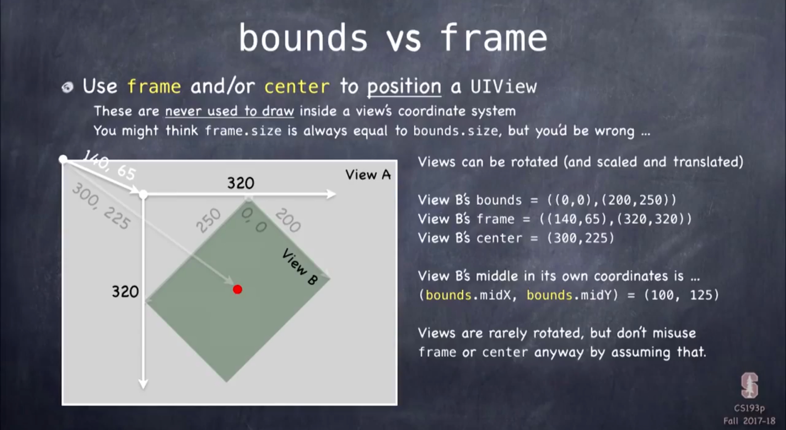

# Lecture 5. Drawing in iOS

## Today

### Miscellaneous

- Error Handling
- Any
- Other Interesting Classes

### Views

- Custom Drawing

### Demo: Draw a Playing Card

- enum

## Thrown Errors

> In Swift, methods can throw errors

```swift
func save() throws
do {
	try context.save()
} catch let error {
	// error will be something that implements the error protocol, e.g, NSError
	// usually these are enums that have associated values to get error details
	throw error // this would re-throw the error (only ok if the method we are in throws)
}
```

> 통상적으로 에러를 날릴 수 있는 메소드 호출 주변에 `do-catch` 문을 집어넣고, 메소드 호출에 앞서 `try` 를 쓴다. `catch` 뒤의 `let` `error` 는 에러 프로토콜을 구현한 지역 변수이다.
> 
> 즉 `do` 를 실행해보고 `error` 가 발생한다면 `error` 를 `throw` 한다.

```swift
try! context.save()
// or
let x = try? errorProneFunctionThatReturnsAnInt()
```

> `try!` 을 사용할 수 있는데 `error` 가 발생하면 앱이 강제종료 된다. 따라서 `error` 가 발생하지 않을 것을 100% 확신할 때 사용하며 현실적으로는 지양해야 한다.
>
> 심각하지 않은 `error` 라면 `try?` 를 사용할 수 있다. `try?` 는 에러를 날려도 앱을 멈추지 않고 에러를 무시한다.
>
> 위 상황에서 함수의 리턴은 옵셔널 타입으로 함수가 `error` 를 발생시키면 `nil` 을 리턴하고 정상적으로 작동한다면 정수를 리턴한다.

## Any & AnyObject

> `Any` 와 `AnyObject` 는 `Objective-C` 와의 호환을 위해 존재한다. `Swift` 는 강타입 언어로 `Any` 상태에서는 어떠한 메소드를 호출 할 수 없다. 따라서 이를 명시적으로 바꿔줘야 하며 이때 사용하는 키워드는 `as?` 이다.

```swift
let vc: UIViewController = ConcentrationViewController()

if let cvc = vc as? ConcentrationViewController {
	cvc.flipCard()
}
```

> `vc` 는 `UIViewController` 이므로 `ConcentrationViewController` 에 구현되어 있는 `flipCard()` 메소드를 사용할 수 없는데, 아래 코드처럼 `Down Casting` 을 통해 해결할 수 있다.

## Other Interesting Classes

### NSObject

> `Objective-C` 의 모든 클래스의 루트 클래스.

`Objective-C` 에서는 반드시 모든 클래스가 `NSObject` 에서 상속되어야 한다. 하지만 `Swift` 는 아니다.

### NSNumber

> `Objective-C` 에서 숫자를 전달할 때 사용하는 클래스.

```swift
let n = NSNumber(35.5) // or let n: NSNumber = 35.5
let intified: Int = n.intValue // also doubleValue, boolValue, etc.
```

### Date

> 날짜나 시간을 표현하는 타입. 정밀한 시간을 측정한다.

`Date` 와 함께 `Calendar`, `DateFormatter`, `DateComponents` 등의 클래스가 종종 쓰인다. `Date` 를 곧바로 `UI` 에 넣을 때는 매우 조심해야 한다. 언어마다 달의 이름도 다르고, 다른 날짜 체계를 쓰기 때문이다.

### Data

> 비트가 담겨있는 가방. iOS API 간에 데이터를 전송할 때 사용한다.

jpeg, JSON 등 데이터를 다양한 클래스로 바꿀 수 있는 메소드가 있음.

## Views

> `UIView` 의 `Subclass` 
>
> 좌표계를 정의하는 화면의 사각형

- 드로잉할 때 사용
- 멀티터치를 할 때에도 사용
- 계층적 구조
  - var superview: UIView?
  - Var subviews: [UIView]

> 최상위에는 검정색 뷰가 있다. 그리고 `UIViewController` 에서 아주 중요한 변수인 `view` 가 있다. 

```swift
func addSubview(_ view: UIView) // sent to view's superview
func removeFromSuperview() // sent to the view you want to remove(not its superview)
```

### Initializing a UIView

- View의 초기화는 가능하다면 사용을 피해야 한다.

- 두 가지 initializer

```swift
init(frame: CGRect) // UIView가 code로 만들어졌을 때
init(coder: NSCoder) // UIView가 storyboard로 만들어졌을 때
```

- 만약 init이 필요할 때 구현하는 법

```swift
func setup() { ... }

override init(frame: CGRect) { // a designated initializer
	super.init(frame: frame)
	setup() // might have to be before super.init
}
required init?(coder aDecoder: NSCoder) { // a required, failable initializer
	super.init(coder: aDecoder)
	setup()
}
```

- 또 다른 방법

```swift
awakeFromNib() {
  
}
```

## 드로잉을 하는 법

### 4가지 타입

- `CGFloat` : 드로잉은 부동 소숫점 숫자를 좌표로 하는 시스템에서 이루어지는데, 이 숫자들이 `CGFloat` 타입이 된다.
- `CGPoint` : `CGFloat` 타입인 변수 x, y로 이루어져 있는 구조체, 위치를 나타냄.
- `CGSize` : `CGFloat` 타입의 `height` 와 `width` 가 들어있음
- `CGRect` : `CGPoint` 와 `CGSize` 를 가지고 있는 구조체이다.

```swift
let cgf = CGFloat(aDouble)

var point = CGPoint(x: 37.0, y: 55.2)
point.y -= 30
point.x += 20.0

var size = CGSize(width: 100.0, height: 50.0)
size.width += 42.5
size.height += 75

struct CGRect {
  var origin: CGPoint
  var size: CGSize
}
let rect = CGRect(origin: aCGPoint, size: aCGSize)

// CGRect의 properties와 functions
var minX: CGFloat
var midY: CGFloat
intersects(CGRect) -> Bool
intersect(CGRect)
contains(CGPoint) -> Bool
```

### View Coordinate System (좌표계)

- iOS에서 원점은 왼쪽 상단이다. (Mac 은 왼쪽 하단)
- 좌표계의 단위는 `points` 

> `pixels` 은 디바이스에서 그릴 수 있는 최소 단위이며, `points` 는 coordinate system에서의 단위이다. 대부분의 경우 `point` 당 2 `pixels` 가 있지만, 1,3일 수도 있다. `var contentsScaleFactor: CGFloat` 를 통해 확인할 수 있다.

- `bounds` : 쓰고 있는 드로잉 좌표계의 원점과 높이 너비 등을 알려줌. 

```swift
var bounds: CGRect
```

> `bounds` 는 `CGRect` 타입의 변수. 뷰마다 서로 다른 좌표계를 갖고 있다.

- `UIView` 가 어디인지

```swift
var center: CGPoint
var frame: CGRect
```

> `frame` 과 `center` 는 슈퍼 뷰 입장에서의 드로잉 하고 있는 곳이 어디인지를 알려주고 `bounds` 는 지금 드로잉 하는 곳을 말한다.



> `view` 는 회전할 수 있다. `view` 가 회전했다면  `bounds` 는 유지되지만 `frame` 은 더 커져야 할 것이다.

### Creating Views

```swift
let newView = UIView(frame: myViewFrame) // or let newView = UIView()

let labelRect = CGRect(x: 20, y:20, width: 100, height: 50)
let label = UILabel(frame: labelRect) // UILabel is a subclass of UIView
label.text = "Hello"
view.addSubview(label)
```

### Custom Views

- 언제 `UIButton` 이나 `UILabel` 을 사용하지 않고 자신의 `UIView` 서브클래스를 사용하는가?

원하는 드로잉을 하고 싶을 때나 원하는 터치 이벤트를 다룰 때, 두 손가락을 오므리는 이벤트를 다룰 때 등

- 드로잉하기 위해서는 `UIView` 에서 이 함수를 오버라이드해서 구현하는 방법이 유일하다. ( `CGRect` )

```swift
override func draw(_ rect: CGRect)
```

- 오버라이드했던 드로잉하는 함수를 직접 호출하면 안된다.

```swift
setNeedsDisplay()
setNeedsDisplay(_ rect: CGRect)
```

- 어떻게 my draw(CGRect)를 구현하는가
  1. 드로잉 레이어에 들어있는 코어 그래픽스를 이용
  2. 객체 지향적으로 `UIBezierPath` 클래스를 불러와 드로잉

- Core Graphics Concepts

```swift
UIGraphicsGetCurrentContext() // 드로잉하는 컨텍스트를 알려준다.
```

> 코어 그래픽스는 컨텍스트를 기반으로 하여 컨텍스트를 알아야만 한다.
>
> 1. 컨텍스트를 얻은 뒤
> 2. path를 만든다
> 3. 드로잉 성질을 설정한다. (font, color ...)
> 4. stroke or fill 을 결정한다.

- `UIBezierPath`

> 선 굵기를 설정하거나 테두리 그리기, 채워 넣기를 할 수 있는 메소드가 있다. `arc(to)` `line(to)` ...

### Defining a Path

- Create a UIBezierPath

```swift
let path = UIBezierPath()
```

- Move around, add lines or arcs to the path

```swift
path.move(to: CGPoint(80, 50))
path.addLine(to: CGPoint(140, 150))
path.addLine(to: CGPoint(10, 150))
```

- Close the path (if you want)

```swift
path.close()
```

- Now that you have a path, set attributes and storke/fill

```swift
UIColor.green.setFill()
UIColor.red.setStroke()
path.linewidth = 3.0
path.fill()
path.stroke()
```

- you can also draw common shapes with UIBezierPath

```swift
let roundedRect = UIBezierPath(roundedRect: CGRect, cornerRadius: CGFloat)
let oval = UIBezierPath(ovalIn: CGRect)
// ... and others
```

- Clipping your drawing to a UIBezierPath's path

```swift
addClip() 
```

> Clipping 한 이후에 한 드로잉은 모두 Clipping 한 path 내부에만 남는다.

- Hit detection (점이 path 내부에 있는지 확인)

```swift
func contains(_ point: CGPoint) -> Bool
```

### UIColor

- Colors are set using UIColor

```swift
let green = UIColor.green
```

> colorLiteral, RGB init or pattern (using UIImage) 로 컬러를 만들 수 있다.

- Background color of a UIView

```swift
var backgroundColor: UIColor 
```

- Colors can have alpha (transparency)

```swift
let semitransparentYellow = UIColor.yellow.withAlphaComponent(0.5)
```

> 0.0 은 완전 투명. 1.0 은 완전 불투명

- 만약 투명한 view를 만들고자 한다면 ..

```swift
var opaque = false
var alpha: CGFloat
```

> opaque 변수를 false로 설정해야 한다.

### Layers

- `UIView` 의 드로잉 메커니즘은 코어 애니메이션이라는 시스템에 만들어져있다. ( `CALayer` )

```swift
var layer: CALayer

// CALayer의 변수들
var cornerRadius: CGFloat
var borderWidth: CGFloat
var borderColor: CGColor?
```

