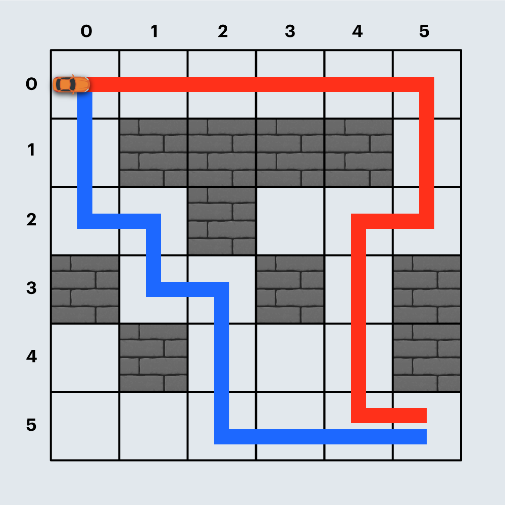
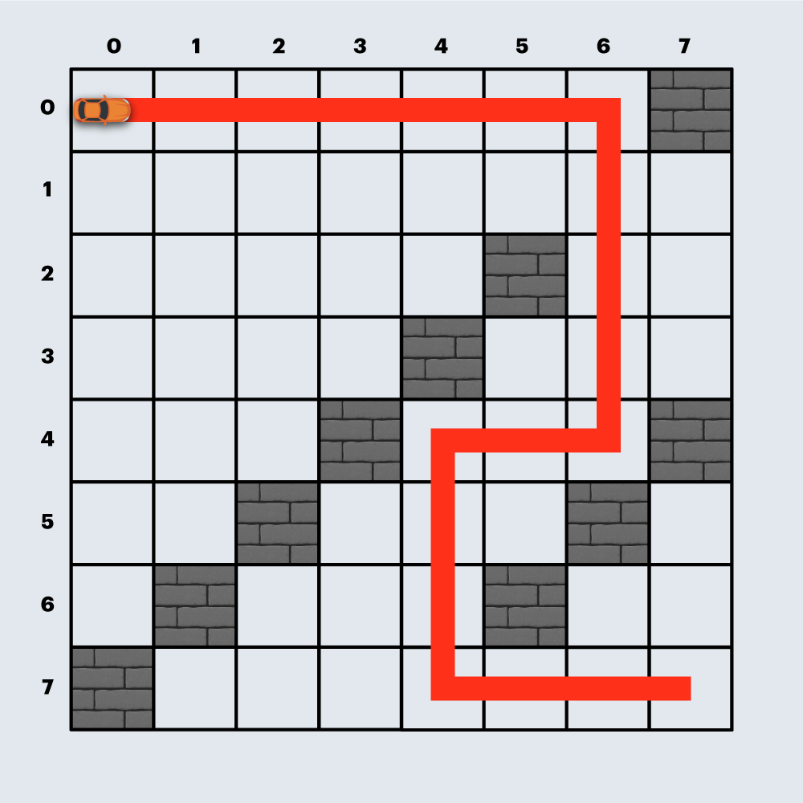

# 2020 카카오 인턴십 - 경주로 건설

## 문제

[코딩테스트 연습 - 경주로 건설](https://programmers.co.kr/learn/courses/30/lessons/67259?language=javascript)





## 구현

```javascript
function solution(board) {
  let answer = Number.MAX_VALUE;

  const directions = {
    top: [0, -1],
    down: [0, 1],
    left: [-1, 0],
    right: [1, 0],
  };

  const start = new Node(0, 0, 'init', 0);

  const q = new Queue();
  q.enqueue(start);
  const n = board.length;

  while (!q.isEmpty()) {
    const current = q.dequeue();
    if (current.x === n - 1 && current.y === n - 1) {
      answer = answer > current.cost ? current.cost : answer;
      continue;
    }

    Object.entries(directions).forEach(([direction, value]) => {
      const next = new Node();
      next.x = current.x + value[0];
      next.y = current.y + value[1];
      next.direction = direction;

      if (isOutBoard(next.x, next.y, n)) {
        return;
      }
      if (isWall(next.x, next.y, board)) {
        return;
      }
      if (isBackward(current.direction, direction)) {
        return;
      }

      if (current.direction === 'init' || current.direction === direction) {
        next.cost = current.cost + 100;
      } else if (current.direction !== direction) {
        next.cost = current.cost + 600;
      }

      if (board[next.y][next.x] === 0) {
        board[next.y][next.x] = next.cost;
        q.enqueue(next);
      } else if (board[next.y][next.x] >= next.cost) {
        board[next.y][next.x] = next.cost;
        q.enqueue(next);
      }
    });
  }

  return answer;
}

function isOutBoard(x, y, range) {
  if (x < 0 || y < 0) {
    return true;
  }
  if (x > range - 1 || y > range - 1) {
    return true;
  }
  return false;
}

function isWall(x, y, board) {
  return board[y][x] === 1;
}

function isBackward(cur, next) {
  if (cur === 'left' && next === 'right') {
    return true;
  }
  if (cur === 'right' && next === 'left') {
    return true;
  }
  if (cur === 'top' && next === 'down') {
    return true;
  }
  if (cur === 'down' && next === 'top') {
    return true;
  }
  return false;
}

class Queue {
  constructor() {
    this._arr = [];
  }
  enqueue(item) {
    this._arr.push(item);
  }
  dequeue() {
    return this._arr.shift();
  }
  isEmpty() {
    return this._arr.length === 0;
  }
}

class Node {
  constructor(x, y, direction, cost) {
    this.x = x;
    this.y = y;
    this.direction = direction;
    this.cost = cost;
  }
}
```

### 어려웠던 점

- 최단 경로 문제에서 BFS를 떠올리는 것이 어려웠다.

- BFS를 실제 문제에 사용하려니 어려웠다.

### 배운 점

- BFS의 원리

  - Queue를 사용해서 현재 노드에서 방문할 수 있는 모든 노드를 큐에 추가한다. (enqueue)

  - Queue에서 하나를 꺼내서 (dequeue) 다시 반복한다.

- JavaScript Queue 구현

  - Array의 push, shift를 이용하면 Queue를 간단하게 구현할 수 있다.

- Object.entries로 key, value 순회하기

- forEach에서 return을 사용하여 for 문의 continue처럼 사용하기

  - forEach에서 break 구현하기 → some 함수, every 함수 사용
