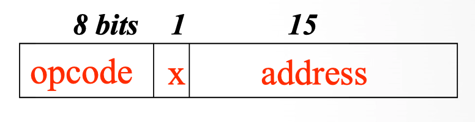
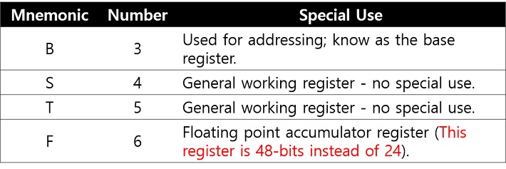
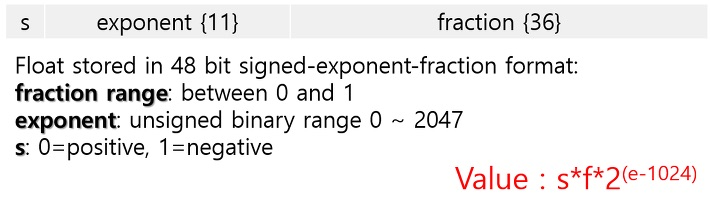
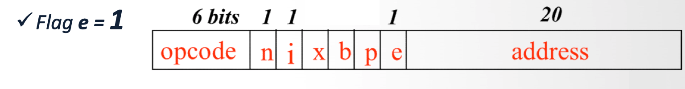

# SIC/XE Machine Architecture

## 시스템 소프트웨어와 기계 종속성

1. 시스템 소프트웨어의 설계는 그 소프트웨어가 동작할 머신의 구조와 밀접한 관련이 있다.

   - 예를 들어, 어셈블러는 mnemonic instruction을 machine code로 해석하고, 운영체제는 컴퓨팅 시스템의 자원을 직접적으로 관리한다.

1. 시스템의 구체적인 구현법은 시간이 지남에 따라 변했지만, 바탕에 깔려있는 컨셉은 여전하다.

1. 시스템 소프트웨어의 기본적인 구조와 설계는 대부분의 컴퓨터에서 비슷하다.

   - 예를 들어, 어셈블러의 일반적인 설계와 로직은 다른 머신 아키텍쳐에서 거의 동일하다.

## SIC와 SIC/XE

실제 머신은 매우 복잡하여 학습하기 좋지 않고, 가장 기본적인 기능에 충실할 수 없으므로, SIC와 SIC/XE를 통해 이해하도록 한다. SIC와 SIC/XE는 가상의 컴퓨터(hypothetical computer)로 실제 머신에서 볼 수 있는 하드웨어의 기능들을 포함하고, 일반적이지 않고 관련 없는 복잡성들은 제거했다.

> 구체적인 세부사항으로부터 떨어져서 시스템 소프트웨어의 기본적인 컨셉을 이해하도록 한다.

SIC는 Simplified Instructional Computer로 가상 컴퓨터의 표준적인 모델이고, SIC/XE는 SIC의 확장된 버전(the eXtra Equipment(or Expensive))이다. SIC에서 작동하는 프로그램은 모두 SIC/XE에서 정상적으로 동작하는 상위호환(upward compatibility)을 보장한다. 하지만 SIC/XE에서 작동하는 프로그램이 SIC에서 작동된다는 하위호환(backward compatibility)은 보장하지 않는다.

## SIC Machine Architecture

### 메모리

- 8비트 바이트로 구성

- 3바이트 워드(Word)로 구성(24비트)

- 전체 메모리는 32KB(2^15 바이트)

### 레지스터

SIC에는 특수한 목적을 가진 5개의 레지스터가 존재한다. 길이는 각각 24비트이고 숫자 표현과 Mnemonic 표현을 가진다.

- A(0) : Accumulator register

- X(1) : Index register

- L(2) : Linkage register

- PC(8) : Program Counter register

- SW(9) : Status Word register

### 데이터 포맷

Integer와 Character 두 가지 데이터 포맷을 지원한다. (Floating-point는 지원하지 않음)

Character는 8비트(ASCII), Integer는 24비트

### 명령어 포맷(Instruction format)

- opcode(8비트) : 명령어를 구분하기 위한 부분

- X(1비트) : Indexed addressing or Direct addressing 인지를 나타내는 플래그.

- address(15비트) : 주소를 나타내는 부분

#### Addressing Modes

- Direct addressing mode (x=0) : Target Address = address

- Indexed addressing mode (x=1) : Target Address = address + (X)

직접 주소는 주소를 직접 사용하고 인덱스 주소는 해당 주소에 Index 레지스터의 값을 더한 것을 주소로 사용한다.

### 명령어 종류(Instruction Type)

- Load & Store

- Arithmetic & Logic

- Comparison

- Conditional Jumps

- Subroutine Linkage

- I/O

> 명령어 표기법

A ← (A) + (m .. m+2) : A 레지스터에 A 레지스터의 값과 메모리 주소 _m, m+1, m+2_ 에 있는 값(3Bytes word 이므로)을 더해서 넣는다.

`()` 로 감싸 있으면 메모리 주소 또는 레지스터 주소에 담겨있는 값을 말하고 감싸 있지 않으면 해당 주소를 말한다.

#### Load & Store

LDA, LDX, STA, STX, etc.

- `LDA` _`m`_ : A 레지스터 ← (_m .. m+2)_, A 레지스터에 _m_ 이 가르키는 메모리 주소에 있는 값을 Load함.

- `LDX` _`m`_ : X 레지스터 ← (_m .. m+2)_, X 레지스터에 _m_ 이 가르키는 메모리 주소에 있는 값을 Load함.

- `STA` _`m`_ : (_m .. m+2)_ ← A 레지스터, A 레지스터에 있는 값을 _m_ 이 가르키는 메모리 주소에 Store함.

- `STX` _`m`_ : (_m .. m+2)_ ← X 레지스터, X 레지스터에 있는 값을 _m_ 이 가르키는 메모리 주소에 Store함.

> LDCH, STCH 의 Character 데이터를 다룰 때는 앞의 16비트를 자르고 맨 뒤의 8자리만 Load하고 Store한다

#### Arithmetic & Logic

이 명령어들은 모두 A 레지스터와 관련이 있다.

- `ADD` _`m`_ : A ← (A) + (_m_ .. _m+2_)

- `SUB` _`m`_ : A ← (A) - (_m_ .. _m+2_)

- `MUL` _`m`_ : A ← (A) \* (_m_ .. _m+2_)

- `DIV` _`m`_ : A ← (A) / (_m_ .. _m+2_)

- `AND` _`m`_ : A ← (A) & (_m_ .. _m+2_)

- `OR` _`m`_ : A ← (A) | (_m_ .. _m+2_)

#### Comparison

2가지 명령어 COMP 와 TIX

- `COMP` _`m`_ : 비교되어 나온 값(크다, 작다, 같다)을 SW 레지스터의 Condition code에 저장한다

- `TIX` _`m`_ : X ← (X) + 1; 후 X와 (_m .. m+2_) 를 비교한 결과를 SW 레지스터의 Condition code에 저장한다

#### Conditional Jumps

SW 레지스터의 Condition code에 따라 점프하는 명령어이다.

`J` _`m`_ : PC ← (_m .. m+2_)

`JLT` _`m`_ : PC ← (_m .. m+2_) if CC set to <

`JGT` _`m`_ : PC ← (_m .. m+2_) if CC set to >

`JEQ` _`m`_ : PC ← (_m .. m+2_) if CC set to =

#### Subroutine Linkage

`JSUB` _`m`_ : L ←(PC); PC ← _m_

`RSUB` : PC ← (L)

`JSUB` 은 L(링커) 리턴 할 때 돌아갈 값을 보관하는 레지스터에 PC를 저장해두고 PC에 서브루틴(_m_) 을 부른다. 그리고 _m_ 에 있는 명령들을 수행한 후, 다시 원래의 루틴으로 L 레지스터를 참조해 돌아온다.

`RSUB` 은 리턴과 유사한 의미이다.

#### I/O

인풋과 아웃풋은 한번에 1바이트 씩만 전송한다. A 레지스터의 마지막 1바이트(rightmost byte)를 사용한다. 모든 디바이스는 각각을 구별하기 위해 unique한 8비트의 코드가 부여된다. 따라서 구별되는 한도 내 2^8 개의 디바이스가 붙을 수 있다.

`TD` _`m`_ : Test device specified by (_m_), (sets CC), < : device is ready, = device isn't ready

`RD` _`m`_ : A[rightmost byte] ← data from device specified by (_m_)

`WD` _`m`_ : Device specified by (_m_) ← (A)[rightmost byte]

## SIC/XE Machine Architecture

SIC/XE는 SIC의 업그레이드판으로 많은 기능들은 동일하다. 동일한 부분을 제외하고 변화된 부분을 알아본다.

### 메모리

- 전체 메모리는 1MB(2^20 바이트)

### 레지스터

SIC가 가진 5개의 레지스터에 더해 4개가 더 추가되어 9개가 되었다. F 레지스터만 48비트이고 나머지는 모두 24비트이다.

### 데이터 포맷

48비트 부동소수점(Floating-point data type)이 추가되었다. 이것은 다음의 포맷을 가진다.

### 명령어 포맷

SIC와는 달리 명령어를 처리하는 포맷이 존재한다.

- Format 1 (1 byte) : Opcode(8bits)

- Format 2 (2 byte) : Opcode(8bits) + r1(4bits) + r2(4bits)

- Format 3 (3 byte) (_Flag e = 0_) : Opcode(6bits) + | n | i | x | b | p | e | + address(12bits)

- Format 4 (4 byte) (_Flag e = 1_) : Opcode(6bits) + | n | i | x | b | p | e | + address(20bits)

#### Addressing Modes

- **Relative addressing** modes for Format 3

  - Base relative addressing, when _b=1, p=0 : TA = (B) + disp/addr_

  - PC relative addressing, when _b=0, p=1 : TA = (PC) + disp/addr_

- **Direct addressing** mode for Format 3 & 4

  - _b = p = 0 : TA = disp/addr_

> when _x=1_ 일 때, **indexed addressing**이 결합되어 (X)가 TA 계산에 더해진다

- _i=1, n=0_ : **immediate addressing**, 메모리 참조 없이 TA가 operand 값으로 쓰인다.

- _i=0, n=1_ : **indirect addressing**, 메모리 참조 값으로 다시 메모리 접근

> indexed는 immediate or indirect에서 사용될 수 없다.

- _i=0, n=0_ : **simple addressing for SIC**

  - b, p, e 값이 address field로 쓰인다. (SIC의 address는 15bits이므로)

- _i=1, n=1_ : **simple addressing for SIC/XE**

## 참고자료

[SIC 머신이란? (가상 컴퓨터)](https://1228.tistory.com/entry/SIC-%EB%A8%B8%EC%8B%A0%EC%9D%B4%EB%9E%80-%EA%B0%80%EC%83%81-%EC%BB%B4%ED%93%A8%ED%84%B0?category=296710)

[SIC/XE 머신이란 무엇인가?](https://1228.tistory.com/entry/SICXE-%EB%A8%B8%EC%8B%A0%EC%9D%B4%EB%9E%80-%EB%AC%B4%EC%97%87%EC%9D%B8%EA%B0%80?category=296710)

[SIC(Simplified Instructional Computer)의 구조(Architecture), 명령어 포멧(Instruction formats), 주소 형식(Addressing modes)](http://dev.youngkyu.kr/7?category=577623)

[SIC/XE의 구조(Architecture), SIC과 어떻게 다른가?, Special symbols](http://dev.youngkyu.kr/9?category=577623)
