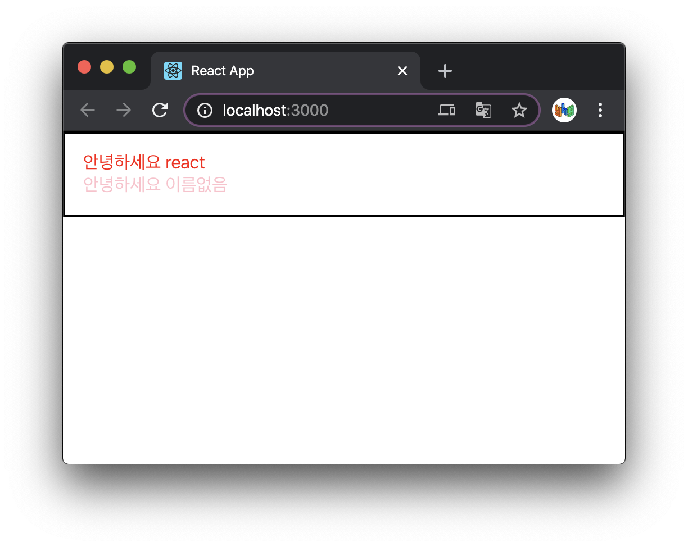
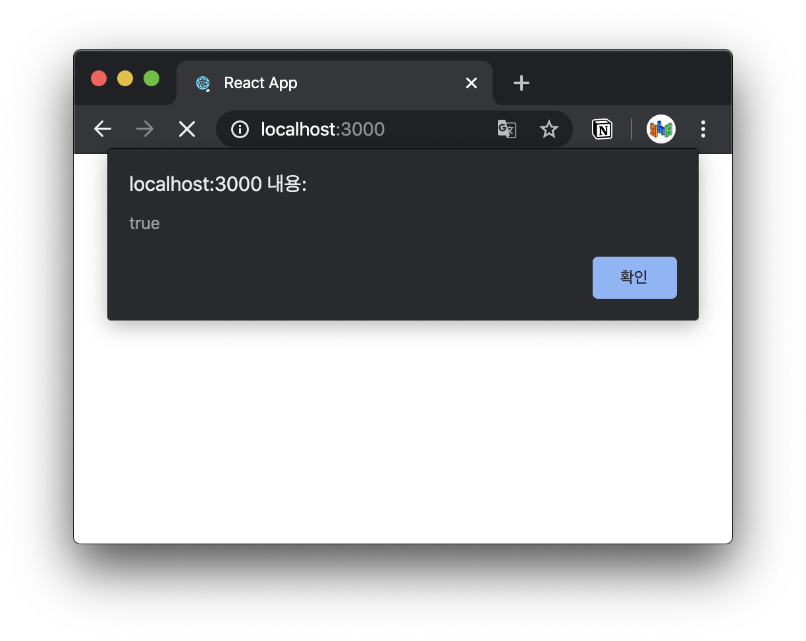

# 0315

## React

### `props` 를 통해 컴포넌트에게 값 전달하기 (계속)

#### `defaultProps` 로 기본값 설정

`Hello.js`

```javascript
import React from 'react';

function Hello({ color, name }) {
  return <div style={{ color }}>안녕하세요 {name}</div>
}

Hello.defaultProps = {
  name: '이름없음'
}

export default Hello;
```

이렇게 컴포넌트에 `props` 를 지정하지 않았을 때 기본적으로 사용할 값을 설정할 수 있다.

`App.js`

```javascript
import React from 'react';
import Hello from './Hello';

function App() {
  return (
    <>
      <Hello name="react" color="red"/>
      <Hello color="pink"/>
    </>
  );
}

export default App;
```


#### `props.children`

컴포넌트 **태그 사이에 넣은 값**을 조회하고 싶을 땐, `props.children` 을 조회하면 된다.

`props.children` 을 사용하는 `Wrapper.js` 를 만들어 본다.

`Wrapper.js`

```javascript
import React from 'react';

function Wrapper() {
  const style = {
    border: '2px solid black',
    padding: '16px',
  };
  return (
    <div style={style}>

    </div>
  )
}

export default Wrapper;
```

`App.js`

```javascript
import React from 'react';
import Hello from './Hello';
import Wrapper from './Wrapper';

function App() {
  return (
    <Wrapper>
      <Hello name="react" color="red"/>
      <Hello color="pink"/>
    </Wrapper>
  );
}

export default App;
```

이렇게 하면 내부의 내용이 보이지 않는다. `Wrapper.js` 에서 `props.children` 을 렌더링해주어야 한다.

`Wrapper.js`

```javascript
import React from 'react';

function Wrapper(props) {  // props 대신 { children } 으로 비구조화 할당 후
  const style = {
    border: '2px solid black',
    padding: '16px',
  };
  return (
    <div style={style}>
      { props.children } {/* 여기서 children 으로만 받아도 된다. */}
    </div>
  )
}

export default Wrapper;
```



### 조건부 렌더링

`props` 를 이용하여 특정 조건에 따라 다른 결과물을 렌더링 하도록 할 수 있다.

`App.js`

```javascript
import React from 'react';
import Hello from './Hello';
import Wrapper from './Wrapper';


function App() {
  return (
    <Wrapper>
      <Hello name="react" color="red" isSpecial={true}/>
      <Hello color="pink" />
    </Wrapper>
  )
}

export default App;
```

`isSpecial` 이라는 `props` 를 전달하고, (이 때 `true` 는 자바스크립트 값이므로 중괄호로 감싸야한다.

`Hello.js`

```javascript
import React from 'react';

function Hello({ color, name, isSpecial }) {
  return (
    <div style={{ color }}>
      { isSpecial ? <b>*</b> : null }
      안녕하세요 {name}
    </div>
  );
}

Hello.defaultProps = {
  name: '이름없음'
}

export default Hello;
```

삼항 연산자를 사용할 수 있다. 또한 단축 평가 논리 계산법으로 `isSpecial && <b>*</b>` 로 할 수도 있다.

또한 `props` 값을 설정할 때 이름만 작성하고 값 설정을 생략할 경우 이를 `true` 로 설정한 것으로 간주한다.

`App.js`

```javascript
import React from 'react';
import Hello from './Hello';
import Wrapper from './Wrapper';

function App() {
  return (
    <Wrapper>
      <Hello name="react" color="red" isSpecial />
      <Hello color="pink"/>
    </Wrapper>
  );
}

export default App;
```

`Hello.js`

```javascript
import React from 'react';

function Hello({ color, name, isSpecial }) {
  
  return (
    <div style={{ color }}>
      { isSpecial ? alert(isSpecial) : null }
      안녕하세요
      {name}
    </div>
  );
}

Hello.defaultProps = {
  name: '이름없음'
}

export default Hello;
```

`isSpecial` 에 값을 설정하지 않고 `Hello.js` 에서 만약 `isSpecial` 이 `true` 라면 `isSpecial` 을 alert로 내보내게 했다.



`true` 가 출력된다.


### `useState` 를 통해 컴포넌트에서 바뀌는 값 관리하기

Counter 예제를 react로 구현해 본다.

`App.js`

```javascript
import React from 'react';
import Counter from './Counter';

function App() {
  return (
    <Counter />
  );
}

export default App;
```

`Counter.js`

```javascript
import React, { useState } from 'react';

function Counter() {
  const [number, setNumber] = useState(0);

  const onIncrease = () => {
    setNumber(number + 1);
  }

  const onDecrease = () => {
    setNumber(number - 1);
  }

  return (
    <div>
      <h1>{number}</h1>
      <button onClick={onIncrease}>+1</button>
      <button onClick={onDecrease}>-1</button>
    </div>
  );
}

export default Counter;
```


#### 함수형 업데이트

이 때, `setNumber` 함수(Setter 함수)를 사용할 때 업데이트 하고 싶은 새로운 값을 파라미터로 넣어주고 있는데, 그 대신 기존의 값을 어떻게 업데이트 할 지에 대한 함수를 등록하는 방식으로도 값을 업데이트 할 수 있다.

`Counter.js`

```javascript
import React, { useState } from 'react';

function Counter() {
  const [number, setNumber] = useState(0);

  const onIncrease = () => {
    setNumber(prevNumber => prevNumber + 1);
  }

  const onDecrease = () => {
    setNumber(prevNumber => prevNumber - 1);
  }

  return (
    <div>
      <h1>{number}</h1>
      <button onClick={onIncrease}>+1</button>
      <button onClick={onDecrease}>-1</button>
    </div>
  );
}

export default Counter;
```


