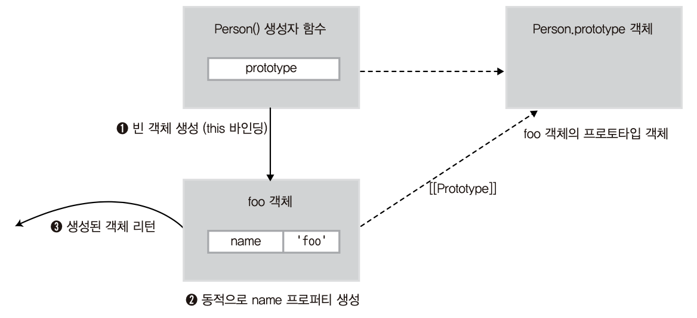
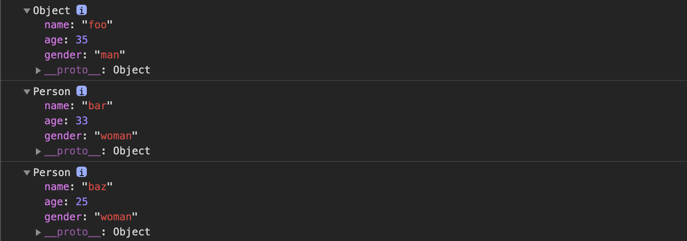
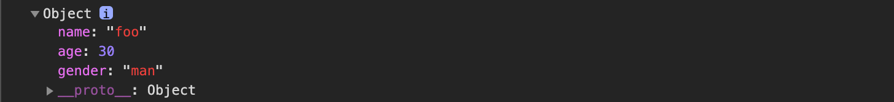
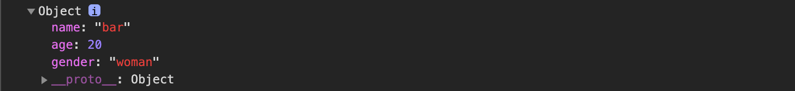

# 4. 함수와 프로토타입 체이닝 - 2

> 이 글은 고현준, 송형주 님의 [인사이드 자바스크립트](https://g.co/kgs/K6Laug)를 참조하여 작성한 글입니다.

> 📌 Table of Contents

## 함수의 다양한 형태

### 콜백 함수

콜백 함수는 개발자가 단지 함수를 등록하기만 하고, 이벤트가 발생했거나 특정 시점에 도달했을 때 시스템에서 호출되는 함수를 말한다. 또한 특정 함수의 인자로 넘겨서, 코드 내부에서 호출되는 함수 또한 콜백 함수가 될 수 있다.

대표적인 콜백 함수의 사용 예가 JS에서의 이벤트 핸들러 처리이다. 웹페이지가 로드 되거나 키보드가 입력되는 등의 DOM 이벤트가 발생할 경우, 브라우저는 정의된 DOM 이벤트에 해당하는 이벤트 핸들러를 실행시킨다. 이러한 이벤트 핸들러에 콜백 함수가 등록했다면, 콜백 함수는 이벤트가 발생할 때마다 브라우저에 의해 실행되게 된다.

```html
<!DOCTYPE html>
<html>
  <body>
    <script>
      // 페이지 로드 시 호출될 콜백 함수
      window.onload = function() {
        alert('This is the callback function.');
      };
    </script>
  </body>
</html>
```

### 즉시 실행 함수

함수를 정의함과 동시에 바로 실행하는 함수를 즉시 실행 함수라 한다.

```javascript
(function(name) {
  console.log('This is the immediate function -->' + name);
})('foo');
```

[실행 결과]

```
This is the immediate function --> foo
```

즉시 실행 함수는 함수 리터럴을 괄호 `()` 로 감싼다. 그런 다음 함수가 바로 호출 될 수 있도록 `()` 괄호 쌍을 추가한다. 이 때 괄호 안에 값을 추가해 인자를 넘겨줄 수 있다.

이렇게 즉시 실행 함수를 만들면, 이후에 같은 함수를 다시 호출할 수 없다. **최초 한 번의 실행**만을 필요로 하는 초기화 코드 부분에 사용할 수 있다.

jQuery와 같은 자바스크립트 라이브러리나 프레임워크 소스를 살펴보면, 즉시 실행 함수 형태로 구성되어 있는데 이는 자바스크립트의 변수 유효 범위 특성 때문이다.

자바스크립트에서는 **함수 유효 범위**를 지원한다. 기본적으로 자바스크립트는 변수를 선언할 때 전역 유효 범위를 가지지만, 함수 내부에서 정의된 매개변수와 변수들은 함수 코드 내부에서만 유효하다. (함수 내에 변수는 `var` 를 사용해야 전역 유효 범위를 갖지 않는다.) 이것은 달리 말하면 함수 외부의 코드에서 함수 내부의 변수를 액세스하는 게 불가능 하다는 뜻이다.

따라서 라이브러리 코드를 즉시 실행 함수 내부에 정의하면, 라이브러리 내의 변수들은 함수 외부에서 접근할 수 없고, 전역 네임스페이스를 더럽히지 않아 변수 이름 충돌이 발생하지 않는다.

- 함수 내에 `var` 문을 사용해 변수 이름을 적용할 경우

```javascript
var num = 10;

function myFunc() {
  var num = 20;
}

myFunc();

console.log(num); // 10
```

- 함수 내에 `var` 문을 사용하지 않을 경우

```javascript
var num = 10;

function myFunc() {
  num = 20;
}

myFunc();

console.log(num); // 20
```

### 내부 함수

JS에서는 함수 코드 내부에서 함수 정의가 가능하다. 이러한 함수를 **내부 함수**(inner function)이라 한다.

```javascript
// parent() 함수 정의
function parent() {
  var a = 100;
  var b = 200;

  // child() 내부 함수 정의
  function child() {
    var b = 300;

    console.log(a);
    console.log(b);
  }
  child();
}

parent();
child();
```

[출력 결과]

```
100
300
Uncaught ReferenceError: child is not defined
```

내부 함수에서는 자신을 둘러싼 부모 함수 변수에 접근 가능하다. **(스코프 체이닝)**

내부 함수는 일반적으로 자신이 정의된 부모 함수 내부에서만 호출이 가능하다.

그런데, 부모 함수에서 내부 함수를 외부로 리턴할 경우, 부모 함수 밖에서도 내부 함수를 호출하는 것이 가능하다.

```javascript
function parent() {
  var a = 100;
  // child() 내부 함수
  var child = function() {
    console.log(a);
  };

  // child() 함수 반환
  return child;
}

var inner = parent();
inner();
```

[출력 결과]

```
100
```

이와 같이 실행이 끝난 `parent()` 와 같은 부모 함수 스코프의 변수를 참조하는 `inner()` 와 같은 함수를 **클로저**라고 한다.

### 함수를 리턴하는 함수

JS에서는 함수도 일급 객체이므로 일반 값처럼 함수 자체를 리턴할 수 있는데, 이를 통해 함수를 호출함과 동시에 다른 함수로 바꾸거나 자기 자신을 재정의하는 함수를 구현할 수 있다.

```javascript
var self = function() {
  console.log('a');
  return function() {
    console.log('b');
  };
};
self = self(); // a
self(); // b
```

## 함수 호출과 `this`

### `arguments` 객체

JS에서는 함수를 호출할 때 함수 형식에 맞춰 인자를 넘기지 않더라도 에러가 발생하지 않는다.

```javascript
function func(arg1, arg2) {
  console.log(arg1, arg2);
}

func(); // undefined undefined
func(1); // 1 undefined
func(1, 2); // 1 2
func(1, 2, 3); // 1 2
```

JS에서는 정의된 함수 인자와 다르게 넘기더라도 에러가 발생하지 않는다.

함수의 인자보다 적게 함수를 호출 했을 경우에는 `undefined` 가 할당되고, 많게 호출 했을 경우에는 무시된다.

이러한 특성 때문에 런타임 시에 호출된 인자의 개수를 확인하고 동작을 다르게 해줘야 할 경우가 있는데, `arguments` 객체가 이를 가능케 한다.

JS에서는 함수를 호출할 때 암묵적으로 `arguments` 객체가 내부로 전달된다.

`arguments` 객체는 함수를 호출할 때 넘긴 인자들이 배열 형태로 저장된 객체를 의미한다. 특이한 점은 이 객체가 **유사 배열 객체**라는 점이다.

```javascript
function add(a, b) {
  console.dir(arguments);
  return a + b;
}

console.log(add(1)); // NaN
console.log(add(1, 2)); // 3
console.log(add(1, 2, 3)); // 3
```

`length` 프로퍼티가 있기 때문에 배열과 유사하게 동작하지만, 배열 메소드를 사용할 경우 에러가 발생한다.

`arguments` 객체는 매개변수 개수가 정확하게 정해지지 않은 함수를 구현하거나 전달된 인자의 개수에 다라 서로 다른 처리를 해줘야 하는 함수를 개발하는 데 유용하게 사용할 수 있다.

```javascript
function sum() {
  var result = 0;

  for (var i = 0; i < arguments.length; i++) {
    result += arguments[i];
  }

  return result;
}

console.log(sum(1, 2, 3)); // 6
console.log(sum(1, 2, 3, 4, 5, 6, 7, 8, 9)); // 45
```

### 호출 패턴과 `this` 바인딩

JS에서는 함수를 호출할 때 기존 매개변수로 전달되는 인자값에 더해 `arguments` 객체 및 `this` 인자가 함수 내부로 암묵적으로 전달된다.

JS의 여러 가지 **함수가 호출되는 방식(호출 패턴)**에 따라 `this` 가 다른 객체를 참조하기( `this` 바인딩) 때문에 이해하기 어렵다.

#### 객체의 메소드를 호출할 때 `this` 바인딩

객체의 프로퍼티가 함수일 경우 메소드라고 한다. 메소드를 호출할 때 메소드 내부 코드에서 사용된 `this` 는 **메소드를 호출한 객체로 바인딩**된다.

```javascript
var myObject = {
  name: 'foo',
  sayName: function() {
    console.log(this.name);
  },
};

var otherObject = {
  name: 'bar',
};

otherObject.sayName = myObject.sayName;

myObject.sayName(); // foo
otherObject.sayName(); // bar
```

이 예제에서 `sayName()` 메소드에 사용된 `this` 는 자신을 호출한 객체에 바인딩되어, `myObject` 에서 호출한 경우는 `foo` , `otherObject` 에서 호출한 경우는 `bar` 가 출력된다.

#### 함수를 호출할 때 `this` 바인딩

함수를 호출하면, 함수 코드 내부에서 사용된 `this` 는 전역 객체에 바인딩된다. 브라우저에서 자바스크립트를 실행하는 경우 전역 객체는 `window` 객체가 된다.

즉 자바스크립트의 모든 전역 변수는 전역 객체( `window` )의 프로퍼티이다.

```javascript
var foo = "I'm foo";

console.log(foo); // I'm foo
console.log(window.foo); // I'm foo
```

함수를 호출할 때 `this` 바인딩

```javascript
var test = 'This is test';
console.log(window.test);

// sayFoo() 함수
var sayFoo = function() {
  console.log(this.test); // sayFoo() 함수 호출 시 this는 전역 객체에 바인딩된다.
};

sayFoo();
```

이렇게 함수 호출시 `this` 가 전역 객체에 바인딩되는 것은 내부 함수를 호출했을 경우에도 그대로 적용되므로 주의해야 한다.

```javascript
var value = 100;

var myObject = {
  varlue: 1,
  func1: function() {
    this.value += 1;
    console.log('func1() called. this.value : ' + this.value);

    func2 = function() {
      this.value += 1;
      console.log('func2 called. this.value : ' + this.value);

      func3 = function() {
        this.value += 1;
        console.log('func3() called. this.value : ' + this.value);
      };
      func3();
    };
    func2();
  },
};
myObject.func1();
```

내부 함수 호출도 함수 호출로 취급되므로 `func2()` , `func3()` 호출시에 `this` 는 전역 객체에 바인딩되어 `window.value` 에 1을 더한 값이 나온다.

[출력 결과]

```
func1() called - this.value : 2
func2() called - this.value : 101
func3() called - this.value : 102
```

이렇게 내부 함수가 `this` 를 참조하는 한계를 극복하려면 부모 함수의 `this` 를 내부 함수가 접근 가능한 다른 변수에 저장하는 방법이 사용된다. 이러한 경우 변수의 이름을 관례상 `that` 이라 한다.

```javascript
var value = 100;

var myObject = {
  varlue: 1,
  func1: function() {
    var that = this;

    this.value += 1;
    console.log('func1() called. this.value : ' + this.value);

    func2 = function() {
      that.value += 1;
      console.log('func2 called. this.value : ' + that.value);

      func3 = function() {
        that.value += 1;
        console.log('func3() called. this.value : ' + that.value);
      };
      func3();
    };
    func2();
  },
};
myObject.func1();
```

[출력 결과]

```
func1() called - this.value : 2
func2() called - this.value : 3
func3() called - this.value : 4
```

#### 생성자 함수를 호출할 때 `this` 바인딩

객체 생성하는 방법은 크게 두가지

- 객체 리터럴

- 생성자 함수 : 기존 함수에 `new` 연산자를 붙여서 호출하면 해당 함수가 생성자 함수로 동작

> 일반 함수에 `new` 를 붙여 호출하면 원치 않는 생성자 함수처럼 동작할 수 있으므로, 특정 함수가 생성자 함수라면 **함수 이름의 첫 문자를 대문자로 쓰기**를 권장.

생성자 함수의 내부 `this` 는 메소드, 함수 호출 방식의 `this` 바인딩과 다르게 동작한다.

> ⭐ 생성자 함수가 동작하는 방식

`new` 연산자로 자바스크립트 함수를 생성자로 호출하면 다음과 같은 순서로 동작한다.

1.  빈 객체 생성 및 `this` 바인딩

    생성자 함수 코드가 실행되기 전, **빈 객체**가 생성(생성자 함수가 새로 생성하는 객체)되고 이 객체가 `this` 로 바인딩된다. 이 객체는 **자신을 생성한 생성자 함수의 prototype 프로퍼티**가 가리키는 객체를 **자신의 프로토타입 객체로 설정**한다.

1.  `this` 를 통한 프로퍼티 생성

    이후에는 함수 코드 내부의 `this` 를 통해 앞서 생성된 빈 객체에 동적으로 프로퍼티나 메소드를 생성한다.

1.  생성된 객체 리턴
    생성자 함수에서는 리턴문이 없는 경우 `this` 로 바인딩된 새로 생성된 객체가 리턴된다. 명시적으로 `this` 를 리턴해도 결과는 같다. (생성자 함수가 아니라면 리턴값이 명시되어 있지 않은 경우 `undefined` 가 리턴된다.)

```javascript
// Person() 생성자 함수
var Person = function(name) {
  // 함수 코드 실행 전
  this.name = name;
  // 함수 리턴
};

// foo 객체 생성
var foo = new Person('foo');
console.log(foo.name); // foo
```



> ⭐ 객체 리터럴 방식과 생성자 함수를 통한 객체 생성 방식의 차이

객체 리터럴 방식은 같은 형태의 객체를 재생성할 수 없다. 이에 반해 `Person()` 생성자 함수를 사용해 같은 형태의 다른 객체를 여러개 생성할 수 있다.

```javascript
// 객체 리터럴 방식으로 foo 객체 생성
var foo = {
  name: 'foo',
  age: 35,
  gender: 'man',
};
console.dir(foo);

// 생성자 함수
function Person(name, age, gender, position) {
  this.name = name;
  this.age = age;
  this.gender = gender;
}

// Person 생성자 함수를 이용해 bar 객체, baz 객체 생성
var bar = new Person('bar', 33, 'woman');
console.dir(bar);

var baz = new Person('baz', 25, 'woman');
console.dir(baz);
```

[출력 결과]



> ❓ 책과 다른 출력 결과

> 책에서는 생성자 함수로 생성된 객체 `bar` , `baz` 의 `__proto__` : Person으로 출력되는 것으로 나옴

- 프로토타입 확인 결과

```javascript
foo instanceof Person; // false
Person.prototype.isPrototypeOf(foo); // false
Object.prototype.isPrototypeOf(foo); // true

bar instanceof Person; // true
Person.prototype.isPrototypeOf(bar); // true
Object.prototype.isPrototypeOf(bar); // true

baz instanceof Person; // true
Person.prototype.isPrototypeOf(baz); // true
Object.prototype.isPrototypeOf(baz); // true
```

> ⭐ 생성자 함수를 `new` 를 붙이지 않고 호출할 경우

객체 생성을 목적으로 작성한 생성자 함수를 `new` 를 붙이지 않거나, 일반 함수를 `new` 를 붙여 호출할 경우 오류가 발생할 수 있다. ( `this` 바인딩 방식이 다르기 때문)

```javascript
function Person(name, age, gender, position) {
  this.name = name;
  this.age = age;
  this.gender = gender;
}

var qux = Person('qux', 20, 'man');
console.log(qux); // undefined

console.log(window.name); // qux
console.log(window.age); // 20
console.log(window.gender); // man
```

생성자 함수 `Person( ... )` 에 `return` 이 없기 때문에 `qux` 는 `undefined` 가 출력된다.

생성자 함수를 `new` 키워드없이 일반 함수 형태로 호출했기 때문에 `this` 가 전역 객체인 `window` 객체로 바인딩 된다.

이러한 오류를 방지하기 위해 일반적으로 생성자 함수로 사용할 함수는 첫 글자를 대문자로 표기한다. 또한 추가적으로 다음의 패턴을 사용하는 것도 가능하다.

```javascript
function A(arg) {
  if (!(this instanceof A)) return new A(arg);
  this.value = arg ? arg : 0;
}
var a = new A(100);
var b = A(10);

console.log(a.value); // 100
console.log(b.value); // 10
console.log(global.value); // undefined
```

함수 A가 호출될 때 `this` 가 A의 인스턴스가 아니라면 `new` 로 호출된 것이 아님을 의미하고 이 경우 `new` 로 A를 호출하여 반환하게 하였다.

> 어떤 코드에서는 `if (!(this instanceof arguments.callee))` 로 작성함으로, 특정 함수 이름과 상관없이 이 패턴을 사용하도록 한다.

#### `call` 과 `apply` 메소드를 이용한 명시적인 `this` 바인딩

각각의 상황에 따라 `this` 가 자동으로 바인딩되는데, 이러한 내부적인 `this` 바인딩 이외에도 `this` 를 특정 객체에 **명시적으로 바인딩**시키는 방법도 있다. `apply()` 와 `call()` 메소드를 사용함으로 가능하다.

이 메소드들은 모든 함수의 부모 객체인 `Function.prototype` 객체의 메소드이므로, 모든 함수는 다음과 같은 형식으로 `apply()` 메소드를 호출하는 것이 가능하다.

```javascript
function.apply(thisArg, argArray)
```

`call()` 메소드는 `apply()` 메소드와 기능이 같고 단지 넘겨받는 인자의 형식만 다르다.

우선 `apply()` 메소드를 호출하는 주체가 함수고, `apply()` 메소드도 `this` 를 특정 객체에 바인딩할 뿐 본질적인 기능은 **함수 호출**이라는 것이다.

첫 번째 인자 `thisArg` 는 `apply()` 메소드를 호출한 함수 내부에서 사용한 `this` 에 바인딩할 객체를 가리킨다. 두 번째 `argArray` 인자는 함수를 호출할 때 넘길 인자들의 배열을 가리킨다.

```javascript
// 생성자 함수
function Person(name, age, gender) {
  this.name = name;
  this.age = age;
  this.gender = gender;
}

// foo 빈 객체 생성
var foo = {};

// apply() 메소드 호출
Person.apply(foo, ['foo', 30, 'man']);
console.dir(foo);
```

[출력 결과]



첫 번째 인자로 넘긴 `foo` 가 `Person()` 함수에서 `this` 바인딩된다. `apply()` 메소드의 두 번째 인자로 넘긴 배열 `['foo', 30, 'man']`은 호출하려는 `Person()` 함수의 인자 `name` , `age` , `gender` 로 각각 전달된다.

`call()` 메소드는 `apply()` 와 기능이 같지만 `apply()` 의 두 번째 인자에서 배열 형태로 넘긴 것을 각각 하나의 인자로 넘긴다.

```javascript
Person.call(foo, 'foo', 30, 'man');
```

`apply()` 와 `call()` 메소드의 대표적인 용도가 `arguments` 객체와 같은 **유사 배열 객체에서 배열 메소드**를 사용하는 경우이다.

```javascript
function myFunction() {
  var args = Array.prototype.slice.apply(arguments);
  console.dir(args);
}

myFunction(1, 2, 3);
```

이 코드는 이렇게 해석될 수 있다.

> `Array.prototype.slice()` 메소드를 호출해라. 이 때 `this` 는 `arguments` 객체로 바인딩해라.

### 함수 리턴

자바스크립트 함수는 항상 리턴값을 반환한다. 특히 `return` 문을 사용하지 않았더라도 항상 다음의 규칙으로 리턴값을 전달하게된다.

#### 규칙 1) 일반 함수나 메소드는 리턴값을 지정하지 않을 경우 `undefined` 가 리턴된다

```javascript
// noReturnFunc() 함수
var noReturnFunc = function () {
	console.log(‘This function has no return statement.’);
};

var result = noReturnFunc(); // This function has no return statement.
console.log(result); // undefined
```

#### 규칙 2) 생성자 함수에서 리턴값을 지정하지 않을 경우 생성된 객체가 리턴된다

생성자 함수에서는 일반적으로 리턴값을 지정하지 않고, 새로 생성된 객체가 리턴되도록 한다. 그런데 만약 `this` 로 바인딩되는 생성된 객체가 아닌 다른 객체를 리턴하면 어떻게 될 것인가?

```javascript
// Person() 생성자 함수
function Person(name, age, gender) {
  this.name = name;
  this.age = age;
  this.gender = gender;

  // 명시적으로 다른 객체 반환
  return { name: 'bar', age: 20, gender: 'woman' };
}

var foo = new Person('foo', 30, 'man');
console.dir(foo);
```

[출력 결과]



출력 결과를 살펴보면, 생성자 함수의 리턴값을 객체 리터럴 방식의 특정 객체로 지정한 경우 `new` 연산자로 `Person()` 함수를 호출해서 새로운 객체를 생성하더라도 리턴값에서 명시적으로 넘긴 객체나 배열이 리턴된다.

하지만 생성자 함수의 리턴값으로 넘긴 값이 객체가 아닌 문자열, 숫자, Boolean이라면 이러한 리턴값을 무시하고 `this` 로 바인딩된 객체가 리턴된다.

```javascript
function Person(name, age, gender) {
  this.name = name;
  this.age = age;
  this.gender = gender;

  return 100;
}

var foo = new Person('foo', 30, 'man');
console.log(foo); // Person { name: 'foo', age: 30, gender: 'man' }
```

## 참고자료
