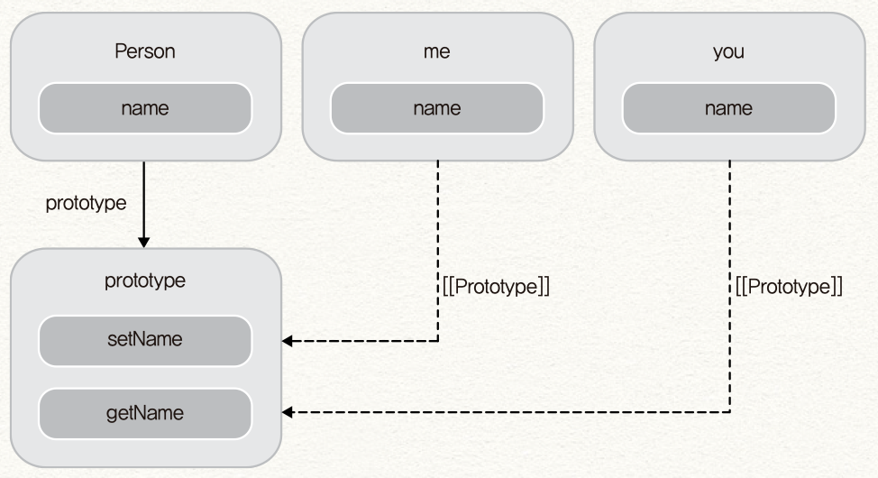

# 6. 객체지향 프로그래밍

> 이 글은 고현준, 송형주 님의 [인사이드 자바스크립트](https://g.co/kgs/K6Laug)를 참조하여 작성한 글입니다.

> 📌 Table of Contents

## 클래스 기반 언어 vs 프로토타입 기반 언어

먼저 클래스란 같은 종류의 집단에 속하는 속성(attribute)과 행위(behavior)를 정의한 것으로, 객체지향 프로그램의 기본적인 사용자 정의 데이터형이라고 할 수 있다. 결국 클래스는 객체 생성에 사용되는 패턴 혹은 청사진일 뿐이며 `new` 연산자를 통한 인스턴스화 과정이 필요하다.

이러한 클래스 기반 언어는 모든 인스턴스가 클래스에 정의된 대로 같은 구조이고, 보통 런타임에 그 구조를 변경할 수 없다. 이러한 특성은 정확성, 안정성, 예측성 측면에서 좋지만, 프로토타입 기반의 언어는 동적으로 자유롭게 객체의 구조와 동작 방식을 바꿀 수 있다는 장점이 있다.

자바스크립트는 클래스 개념이 없고 별도의 객체 생성 방식이 존재한다.

- 객체 리터럴

- `Object()` 생성자 함수

- 생성자 함수

자바스크립트는 거의 모든 것이 객체이고, 함수 객체로 많은 것을 구현해내는데, 클래스, 생성자, 메소드도 모두 함수로 구현이 가능하다.

```javascript
function Person(name) {
  this.name = name;

  this.getName = function() {
    return this.name;
  };

  this.setName = function(value) {
    this.name = value;
  };
}

var me = new Person('zzoon');
console.log(me.getName()); // zzoon

me.setName('iamhjoo');
console.log(me.getName()); // iamhjoo
```

여기서 `new` 키워드로 새로운 객체 `me` 를 만든 부분을 주목하자.

```javascript
var me = new Person('zzoon');
```

이 형태는 기존 객체지향 프로그래밍 언어에서 한 클래스의 인스턴스를 생성하는 코드와 매우 유사하다. 함수 `Person` 이 클래스이자 생성자의 역할을 하는 것이다.

자바스크립트에서 클래스 기반의 객체지향 프로그래밍은 기본적인 형태가 이와 같아서 클래스 및 생성자의 역할을 하는 함수가 있고 사용자가 `new` 키워드로 인스턴스를 생성하여 사용할 수 있다.

하지만 이것은 문제가 많은 예제이다. `Person` 생성자 함수로 여러 객체를 만든다고 해보자.

```javascript
var me = new Person('me');
var you = new Person('you');
var him = new Person('him');
```

이렇게 사용하는 것은 겉으로는 별 문제 없이 작동하지만, 각 객체는 자기 영역에서 공통적으로 사용할 수 있는 `setName()` , `getName()` 함수를 따로 생성하고 있어서, 중복되는 영역을 불필요하게 메모리에 올려놓고 사용하고 있다.

이러한 문제를 해결하는 방법은 자바스크립트의 프로토타입 기반의 객체지향을 이용하는 것이다.

```javascript
function Person(arg) {
  this.name = arg;
}

Person.prototype.getName = function() {
  return this.name;
};

Person.prototype.setName = function(value) {
  this.name = value;
};

var me = new Person('me');
var you = new Person('you');
console.log(me.getName());
console.log(you.getName());
```

이 예제에서는 `Person` 함수 객체의 `prototype` 프로퍼티에 `getName()` 과 `setName()` 함수를 정의했다. 이 `Person` 으로 객체를 생성한다면, 각 객체는 각자 따로 함수 객체를 생성할 필요 없이 `getName()` 과 `setName()` 함수를 프로토타입 체인으로 접근할 수 있다.



이렇게 자바스크립트에서 클래스 안의 메소드를 정의할 때는 프로토타입 객체에 정의한 후, `new` 로 생성한 객체에서 접근할 수 있게 하는 것이 좋다.

아래는 더글라스 크락포드가 제안한 프로토타입 객체에 메소드를 추가하는 방식이다.

```javascript
Function.prototype.method = function(name, func) {
  if (!this.prototype[name]) {
    this.prototype[name] = func;
  }
};

function Person(arg) {
  this.name = arg;
}

Person.method('setName', function(value) {
  this.name = value;
});

Person.method('getName', function() {
  return this.name;
});

var me = new Person('me');
var you = new Person('you');

console.log(me.getName()); // me
console.log(you.getName()); // you
```

## 상속

자바스크립트는 클래스를 기반으로 하는 전통적인 상속을 지원하지는 않지만, 객체 프로토타입 체인을 이용하여 상속을 구현해낼 수 있다. 이러한 상속의 구현 방식은 크게 두 가지로 구분할 수 있는데, 하나는 클래스 기반 언어의 상속 방식을 흉내내는 것(의사 클래스 패턴 상속, Pseudo-classical Inheritance)이고, 두 번째는 프로토타입으로 상속을 구현하는 것(프로토타입 패턴 상속, Prototypal Inheritance)이다.

### 의사 클래스 패턴 상속

의사 클래스 패턴은 자식 생성자 함수의 `prototype` 프로퍼티를 부모 생성자 함수의 인스턴스로 교체하여 상속을 구현하는 방법이다.

```javascript
function Person(arg) {
  this.name = arg;
}

Person.prototype.setName = function(value) {
  this.name = value;
};

Person.prototype.getName = function() {
  return this.name;
};

function Student(arg) {}

var you = new Person('iamhjoo');
Student.prototype = you;

var me = new Student('zzoon');
me.setName('zzoon');
console.log(me.getName());
```

이러한 방식은 몇 가지 문제를 갖고 있다.

- `me` 인스턴스를 생성할 때 부모 클래스인 `Person` 의 생성자를 호출하지 않는다.

이 코드로 `me` 인스턴스를 생성할 때 `'zzoon'` 을 넘겼으나 이를 반영하는 코드가 없어서 `setName()` 메소드가 호출되고 나서야 `me` 객체에 `name` 프로퍼티가 만들어진다.

이를 해결하기 위해 `Student` 함수에 다음 코드를 추가하여 부모 클래스의 생성자를 호출해야 한다.

```javascript
function Student(arg) {
  Person.apply(this, arguments);
}
```

`Student` 함수 안에서 새롭게 생성된 객체를 `apply` 함수의 첫 번째 인자로 넘겨 `Person` 함수를 실행시킨다.

- `new` 연산자를 통해 인스턴스를 생성한다.

생성자 함수 사용에는 위험이 존재하는데 만약 생성자 함수를 호출할 때 `new` 연산자를 포함하는 것을 잊게 되면, `this` 가 새로운 객체와 바인딩되지 않고 전역 객체에 바인딩된다.

- 생성자 링크의 파괴

위 예제에서 `Student` 객체의 프로토타입은 `Person` 생성자 함수가 생성한 `you` 객체이다. 프로토타입 객체는 내부 프로퍼티로 `constructor` 를 가지며, 이는 생성자 함수를 가리키는 반면 `you` 객체는 `constructor` 프로퍼티를 가지고 있지 않고, 따라서 프로토타입 체인에 의해 `Person.prototype` 의 `constructor` 인 `Person` 함수를 가리키게 된다.

- 객체리터럴

의사 클래스 패턴 상속은 기본적으로 생성자 함수를 이용하기 때문에 객체리터럴 패턴으로 생성한 객체의 상속에는 적합하지 않다. 이는 객체리터럴 패턴으로 생성한 객체의 생성자 함수는 `Object()` 이고 이를 변경할 방법이 없기 때문이다.

### 프로토타입을 이용한 상속

프로토타입 패턴 상속은 `Object.create` 함수를 사용하여 객체에서 다른 객체로 직접 상속을 구현하는 방식이다. 프로토타입 패턴 상속은 개념적으로 의사 클래스 패턴 상속보다 간단하며, 의사 클래스 패턴의 단점인 `new` 연산자가 필요없고 생성자 링크도 파괴되지 않으며 객체 리터럴에도 사용할 수 있다.
