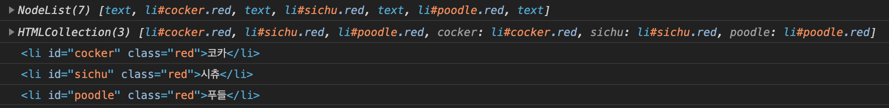
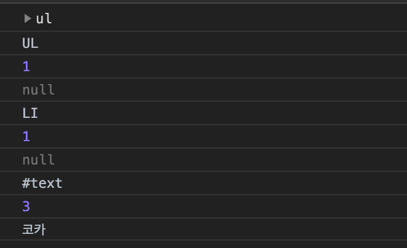
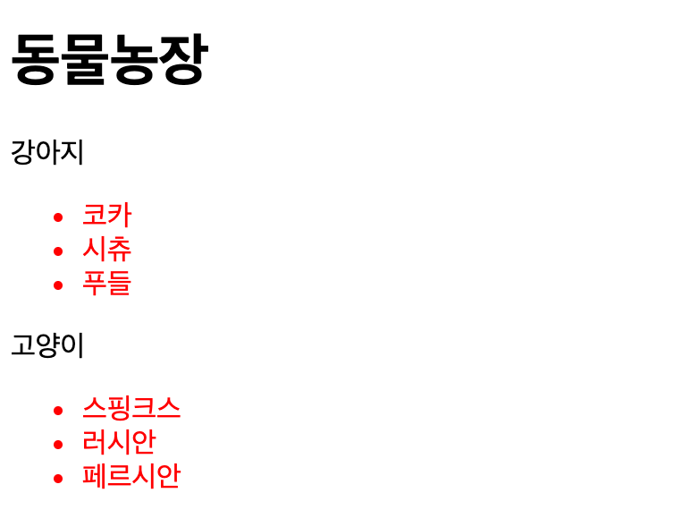
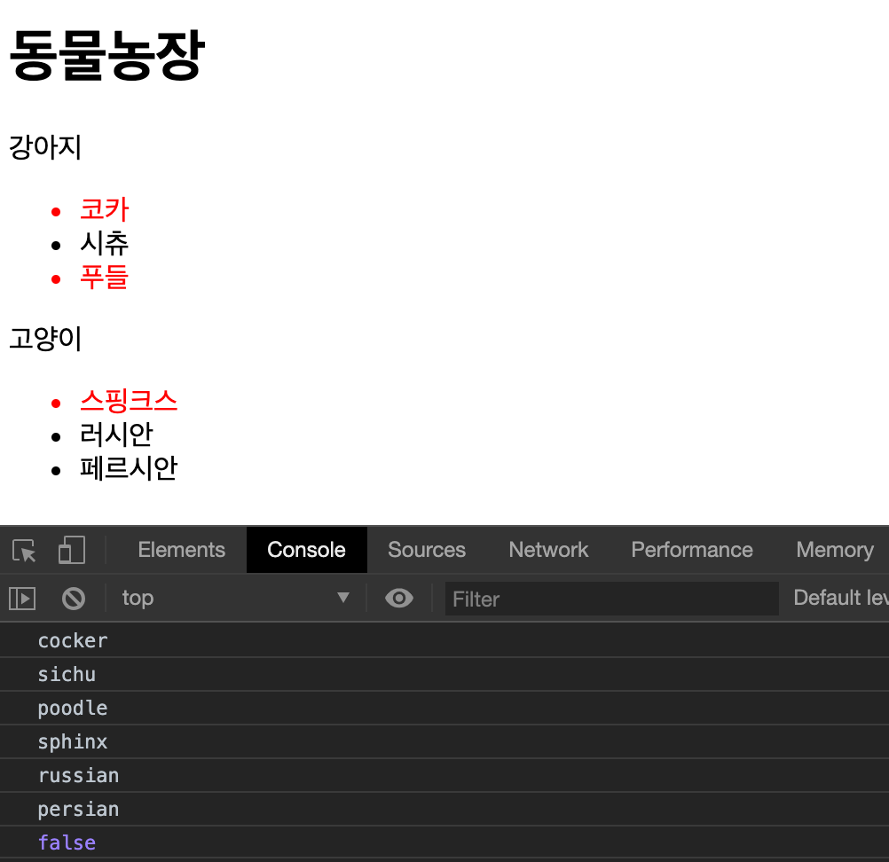
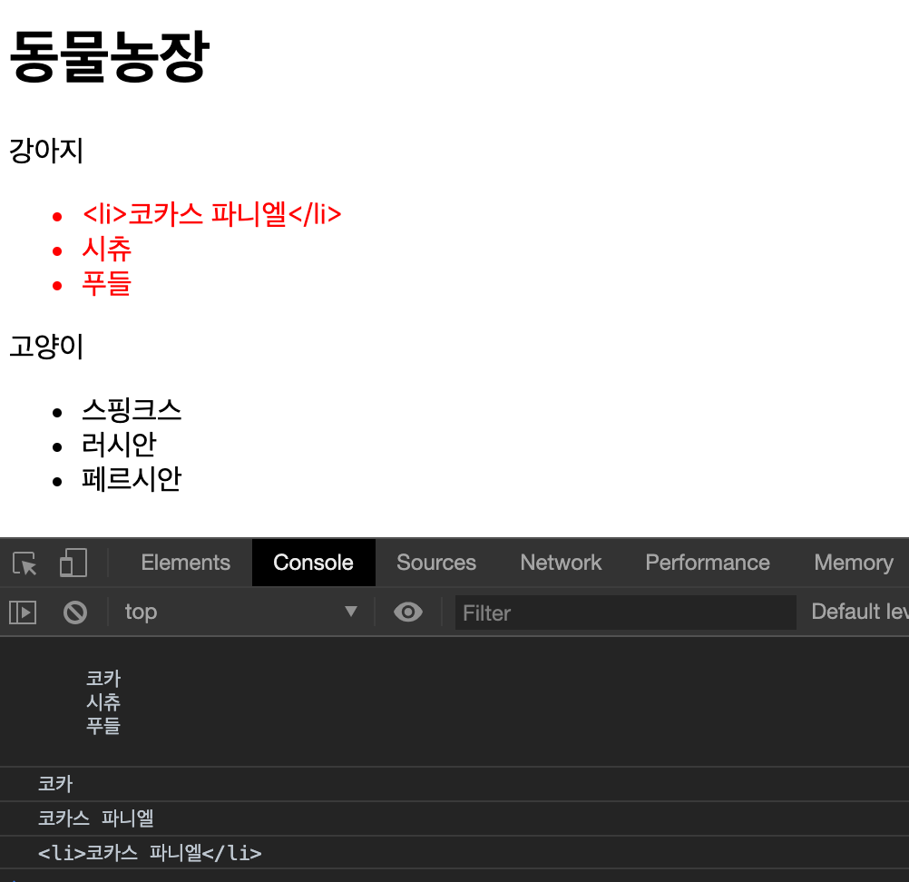
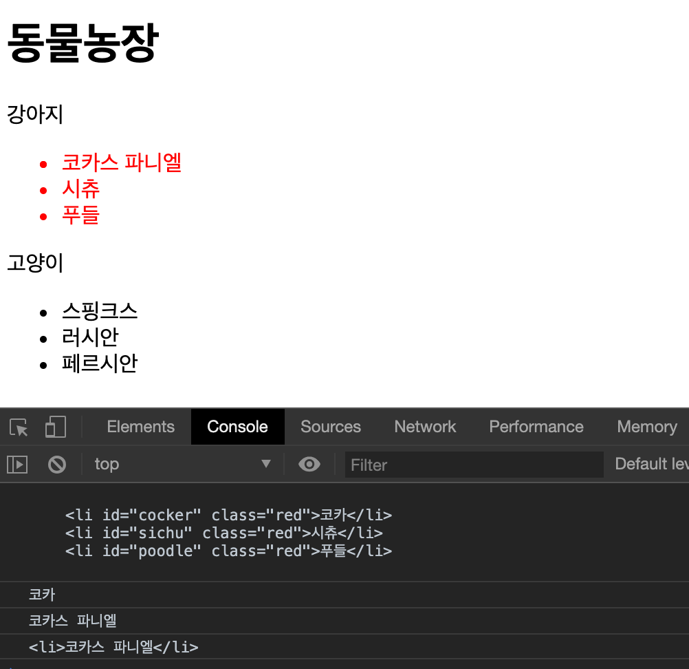
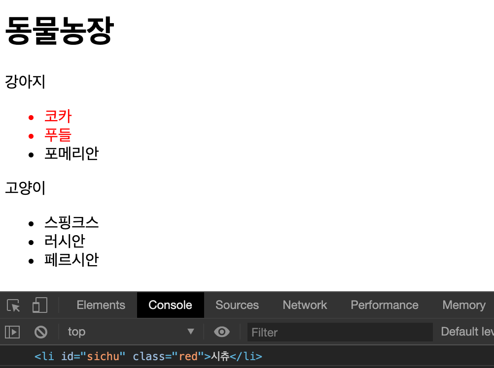

# DOM

> 📌 Table of Contents


## DOM(Document Object Model)

### DOM tree


DOM tree는 네 종류의 노드로 구성된다.

- 문서 노드(Document Node)

트리의 최상위에 존재하며 각각 요소, 어트리뷰트, 텍스트 노드에 접근하려면 문서 노드를 통해야 한다. 즉, DOM tree에 접근하기 위한 시작점(entry point)이다.

- 요소 노드(Element Node)

요소 노드는 HTML 요소를 표현한다. HTML 요소는 중첩에 의해 부자 관계를 가지며 이 부자 관계를 통해 정보를 구조화한다. 따라서 요소 노드는 문서의 구조를 서술한다고 말 할 수 있다. 어트리뷰트, 텍스트 노드에 접근하려면 먼저 요소 노드를 찾아 접근해야 한다. 모든 요소 노드는 요소별 특성을 표현하기 위해 HTMLElement 객체를 상속한 객체로 구성된다. (그림: DOM tree의 객체 구성 참고)

- 어트리뷰트 노드(Attribute Node)

어트리뷰트 노드는 HTML 요소의 어트리뷰트를 표현한다. 어트리뷰트 노드는 해당 어트리뷰트가 지정된 요소의 자식이 아니라 해당 요소의 일부로 표현된다. 따라서 해당 요소 노드를 찾아 접근하면 어트리뷰트를 참조, 수정할 수 있다.

- 텍스트 노드(Text Node)

텍스트 노드는 HTML 요소의 텍스트를 표현한다. 텍스트 노드는 요소 노드의 자식이며 자신의 자식 노드를 가질 수 없다. 즉, 텍스트 노드는 DOM tree의 최종단이다.

### DOM Query / Traversing (요소로 접근)

#### 하나의 요소 노드 선택(DOM Query)

#### document.getElementById(id)

- `id` 속성 값으로 요소 노드를 한 개 선택하여 반환, 여러 노드가 있는 경우 첫번째 요소만 반환

- HTMLElement를 상속받은 객체를 리턴한다.

> 📌 아래의 예제부터 모두 class="red" 인 요소는 색상이 red 라는 css 설정과 다음의 html 요소들을 고정해놓고 사용한다.

```css
.red {
  color: red;
}
```

```html
<h1>동물농장</h1>
<p class="dog">강아지</p>
<ul>
  <li id="cocker" class="red">코카</li>
  <li id="sichu" class="red">시츄</li>
  <li id="poodle" class="red">푸들</li>
</ul>
<p class="cat">고양이</p>
<ul>
  <li id="sphinx" class="black">스핑크스</li>
  <li id="russian" class="black">러시안</li>
  <li id="persian" class="black">페르시안</li>
</ul>
```

```javascript
const elem = document.getElementById('sphinx');
elem.className = 'red';
```

- 결과


#### document.querySelector(cssSelector)

- CSS 선택자로 요소 노드 한 개 선택하여 반환, 여러 노드가 있는 경우 첫번째 요소만 반환

- HTMLElement를 상속받은 객체를 리턴한다.

```javascript
const elem = document.querySelector('#sphinx');
elem.className = 'red';
```


#### 여러 개의 요소 노드 선택(DOM Query)

#### document.getElementsByClassName(class)

- `class` 속성 값으로 요소 노드를 모두 선택 한다. 공백으로 구분하여 여러 class를 지정할 수 있다.

- HTMLCollection 을 리턴한다. (live)

```javascript
const elems = document.getElementsByClassName('black');
for (let i = 0; i < elems.length; i++) {
  elems[i].className = 'red';
}
```

- 결과


위 예제의 실행 결과가 이상한 것을 볼 수 있는데, getElementsByClassName 메소드의 반환값인 HTMLCollection이 **실시간으로 Node의 상태 변경을 반영하기 때문**이다.

즉 loop가 실행되면서, elems의 className 조건에 부합되지 않는 요소들이 제거되면서 elems 배열의 길이가 변동되기 때문에 루프가 제대로 실행되지 않는다.

이를 해결하는 방법은 다음과 같다

- 반복문을 역방향으로 돌린다.

- while 반복문을 사용하면서, elems의 요소가 남아있지 않을 때까지 반복한다.

```javascript
const elems = document.getElementsByClassName('black');

while (elems.length > 0) {
  // elems에 요소가 남아 있지 않을 때까지 무한반복
  elems[0].className = 'red';
}
```

- HTMLCollection을 배열로 변경한다. (권장)

```javascript
const elems = document.getElementsByClassName('black');

[...elems].forEach((elem) => (elem.className = 'red'));
```

- querySelectorAll 메소드를 사용한다.


#### document.getElementsByTagName(tagName)

- 지정된 CSS 선택자를 사용하여 요소 노드를 모두 선택한다

- NodeList(non-live) 를 리턴한다.

> NodeList는 HTMLCollection과 달리 non-live 이기 때문에, loop 안에서 length의 변화가 일어나지 않는다.

```javascript
const elems = document.querySelectorAll('.black');
elems.forEach((elem) => (elem.className = 'red'));
```

#### document.getElementsByTagName(tagName)

- 태그 이름으로 요소 노드를 모두 선택한다

- HTMLCollection (live)을 리턴한다

```javascript
const elems = document.getElementsByTagName('li');
[...elems].forEach((elem) => (elem.className = 'red'));
```

#### DOM Traversing(탐색)

기준이 되는 노드와 관계를 갖고 있는 노드로 이동하면서 탐색할 수 있다.

#### parentNode

- 부모 노드를 탐색한다.

- HTMLElement를 상속받은 객체를 리턴한다.

```javascript
const elem = document.querySelector('#sphinx');
elem.parentNode.className = 'red';
```

#### firstChild, lastChild

- 자식 노드를 탐색한다

- HTMLElement를 상속받은 객체를 리턴한다.

```javascript
const elem = document.querySelector('ul');
elem.firstChild.className = 'black';
elem.lastChild.className = 'black';
```

위의 예제를 실행해보면 잘 동작하지 않는데, IE를 제외한 대부분의 브라우저들이 요소 사이의 공백 또는 줄바꿈 문자를 텍스트 노드로 취급하여 첫번째 자식 노드, 마지막 자식 노드를 HTML 요소로 판단하지 않기 때문이다.

이를 해결하는 방법은 다음과 같다.

- HTML의 공백을 제거한다.

```html
<ul><li id="cocker" class="red">코카</li>
  <li id="sichu" class="red">시츄</li>
  <li id="poodle" class="red">푸들</li></ul>
```

- jQuery: .prev() 와 jQuery: .next() 를 사용한다.

- 또는 firstElementChild, lastElementChild를 사용한다.


#### hasChildNodes()

- 자식 노드가 있는지 확인하고 Boolean 값을 반환한다.

#### childNodes

- 자식 노드의 컬렉션을 반환한다.

- 텍스트 요소를 포함한 모든 자식 요소를 반환한다.

- NodeList(non-live)를 리턴한다.

#### children

- 자식 노드의 컬렉션을 반환한다. 자식 요소 중에서 Element type 요소 만을 반환한다.

- HTMLCollection(live)를 리턴한다.

```javascript
const elem = document.querySelector('ul');

if (elem.hasChildNodes()) {
  console.log(elem.childNodes);

  console.log(elem.children);
  [...elem.children].forEach((el) => console.log(el));
}
```



#### previousSibling, nextSibling

- 형제 노드를 탐색한다. **text node를 포함한 모든 형제 노드를 탐색**한다.

- HTMLElement를 상속받은 객체를 리턴한다.

#### previousElementSibling, nextElementSibling

- 형제 노드를 탐색한다. 형제 노드 중에서 **Element type 요소만을 탐색**한다.

- HTMLElement를 상속받은 객체를 리턴한다.

### DOM Manipulation (조작)

노드에 대한 정보는 다음과 같은 프로퍼티를 통해 접근할 수 있다.

#### nodeName

| 프로퍼티 값 | 노드 |
| --- | --- |
| #document | 문서 노드(document node) |
| 태그 이름(영어로 대문자) | 요소 노드(element node) |
| 속성 이름 | 속성 노드(attribute node) |
| #text | 텍스트 노드(text node) |


#### nodeType

| 프로퍼티 값 | 노드 |
| --- | --- |
| 1 | 요소 노드(element node) |
| 2 | 속성 노드(attribute node) |
| 3 | 텍스트 노드(text node) |
| 8 | 주석 노드(comment node) |
| 9 | 문서 노드(document node) |


#### nodeValue

| 프로퍼티 값 | 노드 |
| --- | --- |
| null | 요소 노드(element node) |
| 해당 속성의 속성 값 | 속성 노드(attribute node) |
| 해당 텍스트 문자열 | 텍스트 노드(text node) |


#### 텍스트 노드에의 접근/수정

요소의 텍스트는 텍스트 노드에 저장되어 있다. 텍스트 노드에 접근하려면 다음의 수순을 따라야 한다.

1. 해당 텍스트 노드의 부모 노드를 선택

1. firstChild 프로퍼티를 사용하여 텍스트 노드를 탐색

1. 텍스트 노드의 nodeValue를 이용하여 텍스트 취득

1. nodeValue를 이용하여 텍스트 수정

```javascript
const elem = document.querySelector('ul');
console.dir(elem); // HTMLElement: ul
console.log(elem.nodeName); // UL
console.log(elem.nodeType); // 1: Element node
console.log(elem.nodeValue); // null

const firstDog = elem.firstElementChild;
console.log(firstDog.nodeName); // LI
console.log(firstDog.nodeType); // 1: Element node
console.log(firstDog.nodeValue); // null

const textNode = firstDog.firstChild;
console.log(textNode.nodeName); // #text
console.log(textNode.nodeType); // 3: Text node
console.log(textNode.nodeValue); // 코카
textNode.nodeValue = '포메리안';
```




#### 속성 노드에의 접근/수정

속성 노드를 조작할 때 다음 프로퍼티와 메소드를 사용할 수 있다.

#### className

class 속성의 값을 취득 또는 변경한다. className 프로퍼티에 값을 할당하는 경우 class 속성이 없으면 class 속성을 생성하고 지정된 값을 설정한다. class 속성의 값이 여러 개일 경우 공백으로 구분된 문자열이 반환되므로 String 메소드 `split(' ')` 을 사용하여 배열로 변경하여 사용한다.

```javascript
const elems = document.querySelectorAll('li');

[...elems].forEach((elem) => {
  if (elem.className === 'red') {
    elem.className = 'black';
  }
});
```


#### classList

add, remove, item, toggle, contains, replace 메소드를 제공한다.

```javascript
const elems = document.querySelectorAll('li');

[...elems].forEach((elem) => {
  if (elem.classList.contains('black')) {
    elem.classList.replace('black', 'red');
  }
});
```



#### id

- `id` 속성의 값을 취득 또는 변경한다. `id` 속성에 값을 할당하는 경우, `id` 속성이 존재하지 않으면 `id` 속성을 생성하고 지정된 값을 설정한다.

```javascript
const heading = document.querySelector('h1');

console.dir(heading);
console.log(heading.firstChild.nodeValue);

heading.id = 'heading';
console.log(heading.id); // heading
```

#### hasAttribute(attribute)

- 지정한 속성을 갖고 있는지 검사한다.

- Return : Boolean

#### getAttribute(attribute)

- 속성의 값을 취득한다

- Return : String

#### setAttribute(attribute, value)

- 속성과 속성의 값을 설정한다.

- Return : undefined

#### removeAttribute(attribute)

- 지정한 속성을 제거한다

- Return : undefined

```javascript
const elems = document.querySelectorAll('li');

elems.forEach((elem) => {
  if (elem.hasAttribute('class')) {
    console.log(elem.getAttribute('id'));
  }
});

const sphinx = document.getElementById('sphinx');
sphinx.setAttribute('class', 'red');

const sichu = document.getElementById('sichu');
sichu.removeAttribute('class');
console.log(sichu.hasAttribute('class'));
```



#### HTML 콘텐츠 조작(Manipulation)

#### textContent

요소의 텍스트 콘텐츠를 취득 또는 변경한다. 이 때 마크업은 무시되기 때문에 `ul.textContent = '<h1>Heading</h1>'` 처럼 마크업을 포함시키면 문자열로 인식되어 그대로 출력된다.

```javascript
const ul = document.querySelector('ul');
console.log(ul.textContent);

const cocker = document.getElementById('cocker');
console.log(cocker.textContent);

cocker.textContent += '스 파니엘';
console.log(cocker.textContent);

cocker.textContent = '<li>코카스 파니엘</li>';
console.log(cocker.textContent);
```



#### innerText

innerText 프로퍼티로도 텍스트 콘텐츠에 접근할 수 있다. 하지만 비표준이고, CSS 순종적이라, CSS에 의해 비표시 되어 있는 경우 텍스트가 반환되지 않는다. CSS를 고려해야 하기 때문에 textContent 프로퍼티보다 느리다.

#### innerHTML

해당 요소의 모든 자식 요소를 포함하는 모든 콘텐츠를 하나의 문자열로 취득할 수 있다. 이 문자열은 마크업을 포함한다.

```javascript
const ul = document.querySelector('ul');
console.log(ul.innerHTML);

const cocker = document.getElementById('cocker');
console.log(cocker.innerHTML);

cocker.innerHTML += '스 파니엘';
console.log(cocker.innerHTML);

cocker.innerHTML = '<li>코카스 파니엘</li>';
console.log(cocker.innerHTML);
```



innerHTML 프로퍼티를 사용하여 마크업이 포함된 새로운 요소를 DOM에 추가할 수 있다.

```javascript
const cocker = document.getElementById('cocker');
cocker.innerHTML += '<li id="york" class="red">요크</li>';
```


하지만 이렇게 마크업이 포함된 콘텐츠를 추가하는 것은 크로스 스크립팅 공격에 취약하다

```javascript
// 에러 이벤트를 발생시켜 스크립트가 실행되도록 한다.
elem.innerHTML = '';
```

#### DOM 조작 방식

innerHTML 프로퍼티를 사용하지 않고 새로운 콘텐츠를 추가할 수 있는 방법은 DOM을 직접 조작하는 것이다. 하나의 요소를 추가하는 경우 사용한다.

1. 요소 노드 생성 - createElement() 메소드를 사용해서 새로운 요소 노드를 생성한다. 메소드의 인자로 태그 이름을 전달한다.

1. 텍스트 노드 생성 - createTextNode() 메소드를 사용하여 새로운 텍스트 노드를 생성한다. 경우에 따라 생략할 수 있지만, 생략하는 경우 콘텐츠가 비어있는 요소가 된다.

1. 생성된 요소를 DOM에 추가 - appendChild() 메소드를 사용하여 생성된 노드를 DOM tree에 추가한다. 또는 removeChild() 메소드를 사용하여 DOM tree에서 노드를 삭제할 수도 있다.

#### createElement(tagName)

- 태그 이름을 인자로 전달하여 요소를 생성한다.

- Return : HTMLElement를 상속받은 객체

#### createTextNode(text)

- 텍스트를 인자로 전달하여 텍스트 노드를 생성한다.

- Return : Text 객체

#### appendChild(Node)

- 인자로 전달한 노드를 마지막 자식 요소로 DOM 트리에 추가한다.

- Return : 추가한 노드

#### removeChild(Node)

- 인자로 전달한 노드를 DOM 트리에 제거한다.

- Return : 제거한 노드

```javascript
// 태그 이름을 인자로 전달하여 새로운 요소 생성
const newDog = document.createElement('li');

// 텍스트 노드를 생성
const newText = document.createTextNode('포메리안');

// 텍스트 노드를 newDog의 자식으로 DOM 트리에 추가
newDog.appendChild(newText);

const container = document.querySelector('ul');

// newElem을 container의 자식으로 DOM 트리에 추가. 마지막 요소로 추가된다.
container.appendChild(newDog);

const removeDog = document.getElementById('sichu');

// container의 자식인 removeElem 요소를 DOM 트리에서 제거한다
console.log(container.removeChild(removeDog));
```



#### insertAdjacentHTML(position, string)

인자로 전달한 텍스트를 HTML로 파싱하고, 그 결과로 생성된 노드를 DOM 트리의 지정된 위치에 삽입한다. 첫번째 인자는 삽입 위치, 두번째 인자는 삽입할 요소를 표현한 문자열이다. 첫번째 인자로 올 수 있는 값은 아래와 같다.

- `beforebegin`

- `afterbegin`

- `beforeend`

- `afterend`

```html
<!-- beforebegin -->
<p>
  <!-- afterbegin -->
  foo
  <!-- beforeend -->
</p>
<!-- afterend -->
```

```javascript
const dogList = document.querySelector('ul');
dogList.insertAdjacentHTML('afterbegin', '<li id="york" class="dog">요크</li>');
dogList.insertAdjacentHTML(
  'beforeend',
  '<li id="dober" class="dog">도베르만</li>',
);
```


#### innerHTML vs DOM 조작 방식 vs insertAdjacentHTML()

#### innerHTML

| 단점 | 장점 |
| --- | --- |
| XSS공격에 취약점이 있기 때문에 사용자로 부터 입력받은 콘텐츠(untrusted data: 댓글, 사용자 이름 등)를 추가할 때 주의하여야 한다. | DOM 조작 방식에 비해 빠르고 간편하다. |
| 해당 요소의 내용을 덮어 쓴다. 즉, HTML을 다시 파싱한다. 이것은 비효율적이다. | 간편하게 문자열로 정의한 여러 요소를 DOM에 추가할 수 있다. |
|     | 콘텐츠를 취득할 수 있다. |


#### DOM 조작 방식

| 단점 | 장점 |
| --- | --- |
| innerHTML보다 느리고 더 많은 코드가 필요하다. | 특정 노드 한 개(노드, 텍스트, 데이터 등)를 DOM에 추가할 때 적합하다. |


#### insertAdjacentHTML()

| 단점 | 장점 |
| --- | --- |
| XSS공격에 취약점이 있기 때문에 사용자로 부터 입력받은 콘텐츠(untrusted data: 댓글, 사용자 이름 등)를 추가할 때 주의하여야 한다. | 간편하게 문자열로 정의된 여러 요소를 DOM에 추가할 수 있다. |
|     | 삽입되는 위치를 선정할 수 있다. |


#### 결론

innerHTML과 insertAdjacentHTML()은 크로스 스크립팅 공격(XSS: Cross-Site Scripting Attacks)에 취약하다. 따라서 untrusted data의 경우, 주의하여야 한다. 텍스트를 추가 또는 변경시에는 textContent, 새로운 요소의 추가 또는 삭제시에는 DOM 조작 방식을 사용하도록 한다.

### style

style 속성을 사용하면 inline 스타일 선언을 생성한다. 특정 요소에 inline 스타일을 지정하는 경우 사용한다.

```javascript
const dogList = document.querySelector('ul');
dogList.insertAdjacentHTML('afterbegin', '<li id="york" class="dog">요크</li>');
dogList.insertAdjacentHTML(
  'beforeend',
  '<li id="dober" class="dog">도베르만</li>',
);

const york = document.getElementById('york');
const dober = document.getElementById('dober');

york.style.color = 'red';
dober.style.color = 'red';
```


style 프로퍼티 값을 취득하려면 window.getComputedStyle을 사용한다. 이 메소드는 인자로 주어진 요소의 모든 CSS 프로퍼티 값을 반환한다.

```javascript
const box = document.querySelector('.box');

const width = getStyle(box, 'width');
const height = getStyle(box, 'height');
const backgroundColor = getStyle(box, 'background-color');
const border = getStyle(box, 'border');

console.log('width: ' + width);
console.log('height: ' + height);
console.log('backgroundColor: ' + backgroundColor);
console.log('border: ' + border);

/**
 * 요소에 적용된 CSS 프로퍼티를 반환한다.
 * @param {HTTPElement} elem - 대상 요소 노드.
 * @param {string} prop - 대상 CSS 프로퍼티.
 * @returns {string} CSS 프로퍼티의 값.
 */
function getStyle(elem, prop) {
  return window.getComputedStyle(elem, null).getPropertyValue(prop);
}
```

### 참고자료

🔗 [문서 객체 모델(Document Object Model)](https://poiemaweb.com/js-dom)

