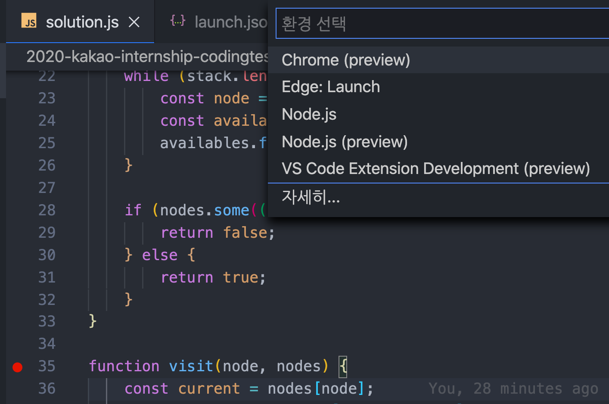
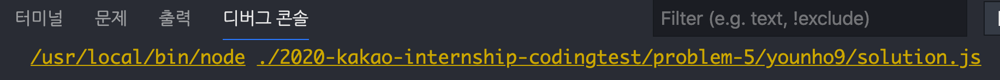
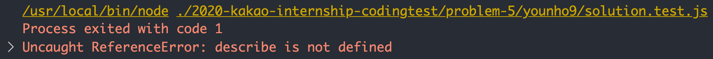
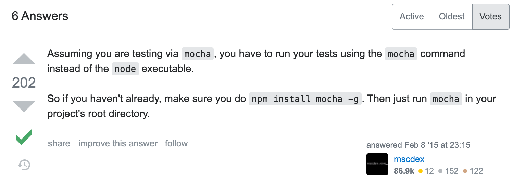
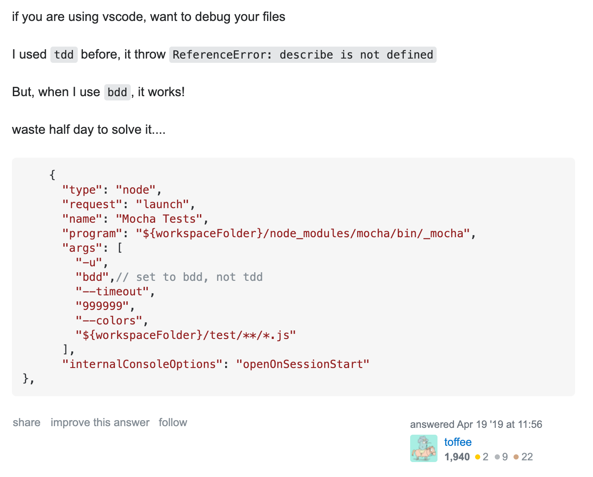
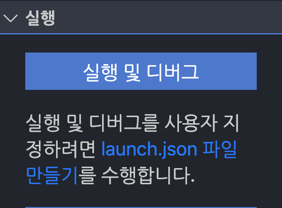
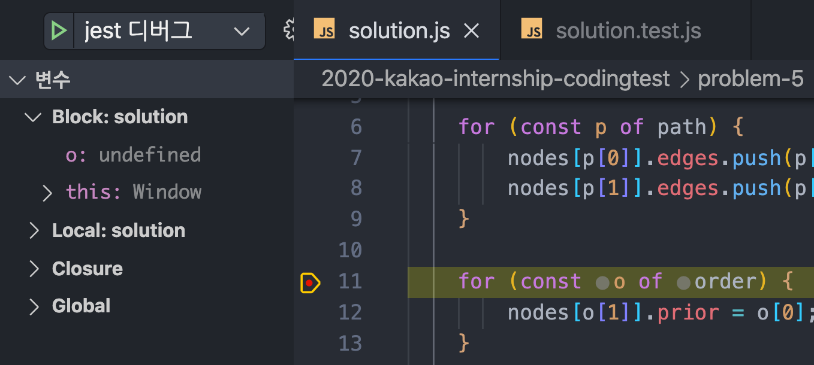

# NodeJS, Jest, VSCode debugging

## 문제 상황



알고리즘 폴더 내부의 `solution.js` 파일에 중단점를 걸고 환경을 Node.js로 설정하면 디버깅이 될거라 기대했는데 아무 일도 일어나지 않았다.




디버그 콘솔을 보니 node로 `solution.js` 를 실행하는데, `solution` 함수를 호출하는 코드가 없기 때문에, 선언만 하고 끝난 듯 했다.

그러면 `solution.test.js` 에서 `solution` 함수를 호출하니, `solution.test.js` 파일에 중단점을 걸어보기로 했다.




`test` 파일에 중단점을 걸었더니 `describe` 함수를 찾지 못했다.




[ReferenceError: describe is not defined NodeJs](https://stackoverflow.com/questions/28400459/referenceerror-describe-is-not-defined-nodejs)

[Debug single javascript file in "Visual Studio Code"](https://stackoverflow.com/questions/47167457/debug-single-javascript-file-in-visual-studio-code)

stackoverflow를 찾아보니 테스트 코드를 실행시킬 때 `node` 대신 `mocha` 로 실행해야한다고 한다. 현재 jest를 쓰고 있는데 jest도 마찬가지일 듯 싶었다. 

그럼 어떻게 vscode의 디버그 모드를 jest로 실행시키는지 궁금했다. stackoverflow의 다른 답변도 더 찾아본 결과 `.vscode/launch.json` 을 설정해서 해결하는 것 같았다.




`launch.json` 의 `program` 에 실행할 `jest` 를 넣고 `args` 로 `test` 파일 또는 `test` 파일이 있는 디렉토리를 넘겨주면 된다.




`launch.json` 만들기

```javascript
{
    "version": "0.2.0",
    "configurations": [
        {
            "type": "node",
            "request": "launch",
            "name": "jest 디버그",
            "skipFiles": ["<node_internals>/**"],
            "program": "${workspaceFolder}/node_modules/jest/bin/jest.js",
            "args": ["${relativeFileDirname}"]
        }
    ]
}
```

VSCode 변수( `${relativeFileDirname}` ) 로 현재 열려있는 파일이 있는 디렉토리를 가져올 수 있다. 이걸 `args` 로 넘기면 `jest ./foo/bar/directory` 가 완성된다.




이제 열려있는 `solution.js` 에서 중단점을 잡고 `F5` 키를 누르면 `solution.js` 파일이 있는 디렉토리를 `jest` 로 디버그 모드로 실행한다. `solution.js` 와 `solution.test.js` 파일이 같은 디렉토리에 있기 때문에 `test` 코드가 디버그 모드로 실행되고, 테스트 코드의 인풋으로 `solution` 함수를 호출할 수 있다.


디버그 콘솔을 보니 `node` 로 `jest` 를 실행하고, `args` 로 현재 파일이 있는 디렉토리를 넘긴다.


### 참고자료

[Troubleshooting · Jest](https://jestjs.io/docs/en/troubleshooting)

[Visual Studio Code Variables Reference](https://code.visualstudio.com/docs/editor/variables-reference)

[Debugging in Visual Studio Code](https://code.visualstudio.com/docs/editor/debugging)

