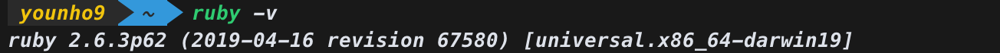
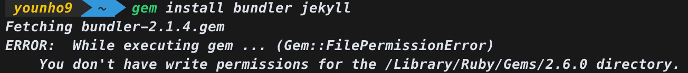
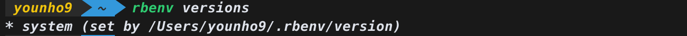
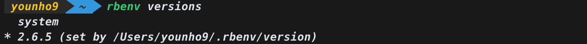
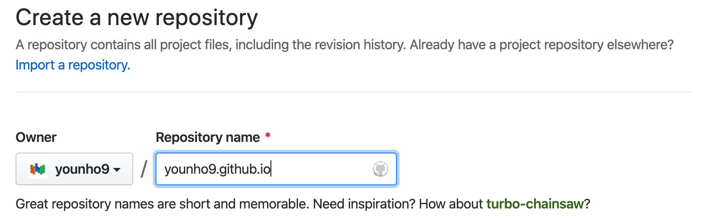

# Jekyll + Github page를 이용해 개인블로그 만들기

## Jekyll 설치하기 (Mac)

[Jekyll on macOS](https://jekyllrb.com/docs/installation/macos/)



맥에는 루비가 기본적으로 설치되어 있지만, Jekyll 홈페이지의 설명대로 아래의 명령을 입력하면 오류가 발생한다.

```
# RubyGems를 통해 Jekyll과 Bundler를 설치한다
gem install jekyll bundler
```



### Gem::FilePermissionError

맥은 시스템 ruby를 사용하고 있다. sudo를 통해 root 권한으로 실행하면 설치가 가능하지만, 보안상 이유로 권장하지 않는 설치법이라고 한다.

rbenv라는 ruby version 관리자를 통해 여러 버전의 루비를 맥에 설치하고 관리할 수 있다. 시스템 루비가 아닌 다른 루비를 rbenv를 통해 설치하여 jekyll 환경을 만들 수 있다.

[Troubleshooting](https://jekyllrb.com/docs/troubleshooting/)

### brew

brew를 이용해 rbenv와 ruby-build를 설치한다.

```
brew update
brew install rbenv ruby-build
```

설치가 완료되면 아래의 명령으로 테스트해본다.

```
rbenv versions
```



아래의 명령으로 설치가능한 루비 버전 목록을 보고 원하는 버전을 설치한다.

```
rbenv install -l

rbenv install 2.6.5
```

설치 후 rbenv로 글로벌 버전을 설치한 루비 버전으로 변경한다.

```
rbenv global 2.6.5
```

다시 버전을 확인해본다.



이제 Jekyll과 bundler를 설치할 수 있다.

```
# RubyGems를 통해 Jekyll과 bundler를 설치한다
gem install jekyll bundler
```

## Jekyll 사이트 만들고 Github page로 호스팅하기

### Jekyll을 이용해 사이트 빌드

```
# ./myblog에 새 Jekyll 사이트를 생성한다
jekyll new younho9.github.io

# 생성된 디렉토리로 이동한다
cd younho9.github.io

# 미리보기 서버로 사이트를 빌드한다
bundle exec jekyll serve

# 이제 브라우저로 http://localhost:4000에 접속한다
```

### GitHub에 username.github.io로 repository 만들기



Github에서 username.github.io로 repository를 만든다

```
# git init으로 git 생성
git init

# git status로 현재 git 상황 보기
git status

# git add -A로 모든 파일을 staging area로 옮긴다
git add -A

# git status로 옮겨졌는지 확인
git status

# git commit으로 커밋
git commit -m 'Initial commit'

# git log로 커밋 확인
git log

# git 원격저장소로 log remote
git remote add origin <https://github.com/username/username.github.io.git>

# git remote로 확인
git remote -v

# git push로 동기화
git push -u origin master
```

이제 [u](http://username.github.io)sername.github.io에서 만든 사이트를 볼 수 있다.