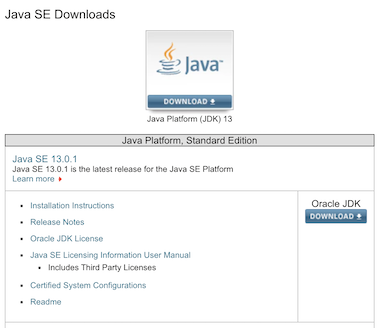
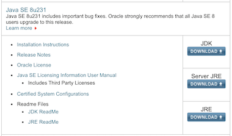
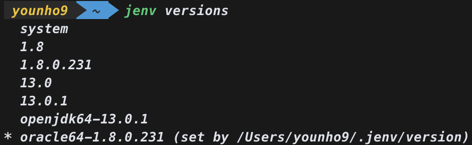
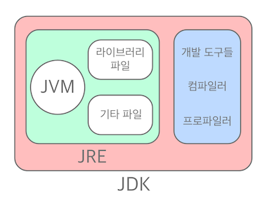

## Java를 설치하려는데...

컴퓨터를 초기화하여 Java를 다시 설치하려고 했다.

> 🔗 _[Java SE 다운로드 페이지](https://www.oracle.com/technetwork/java/javase/downloads/index.html)_

 

 

왼쪽은 현재 가장 최신 버전인 듯한 13.0.1이고, 오른쪽은 보편적으로 많이 쓰인다고 하는 8버전이다. 그런데 왜 표기법이 하나는 13.0.1이고, 하나는 8u231인가?

 

### 자바 버전 표기법

---

> 💡 Java `SE` `13.` `0.` `1` `(LTS)`

`SE` : Standard Edition
`13.` : 주 버전
`0.` : 개선 버전
`1` : 업데이트 버전
`(LTS)` : 장기 지원 서비스(Long Term Support)를 받을 수 있는 버전

위는 자바 버전을 표기하는 방법이다.

예를 들어 Java SE 13.0.1 (LTS)은 주 버전이 13이고, 수정이 1번 되었다는 것을 의미한다.

그리고 Java 8버전과 같은 경우의 Java SE 8u231은 주 버전이 8이고, 수정이 231번 되었다는 것을 의미한다. (너무 많아서 이렇게 표기했나)

또한 그냥 Java 8, Java 13 버전이라고 편하게 부르기도 한다.

그리고 Java SE 13을 설치한다는 것은 JDK 13을 설치한다는 것과 동일한 의미이다.

8버전의 경우 JDK 1.8이라고 하기도 한다.

근데 JDK가 무슨 뜻인가?

 

### JDK가 뭔데?

---

**JDK는 자바 개발 도구(Java Development Kit)의 약자이다.**

JDK는 Java를 실행하기 위한 환경인 JRE와 함께 + 개발을 위해 필요한 도구(javac, java 등)들을 모두 포함하는 이른바 Java Platform이다.

Java로 프로그램을 만들기 위해서는 **반드시 JDK로 설치해야 한다!**

그럼 JRE는?

 

### JRE는 뭔데?

---

**JRE는 자바 실행환경(Java Runtime Environment)의 약자이다.**

JRE는 JVM 이 자바 프로그램을 동작시킬 때 필요한 라이브러리 파일들과 기타 파일들을 가지고 있다. JRE는 JVM의 실행환경을 구현했다고 할 수 있다.

요약하면 JVM + 런타임에 사용하는 다른 파일들(라이브러리)

그럼 JVM은?

 

### JVM은 뭔데?

---

**JVM은 자바 가상머신(Java Virtual Machine)의 약자이다.**

JVM은 자바 바이너리 파일(.class)을 실행할 수 있다. 또한 JVM은 플랫폼에 의존적이다. 즉 리눅스의 JVM과 윈도우즈의 JVM은 다르다. 단, 컴파일된 바이너리 코드는 어떤 JVM에서도 동작시킬 수 있다.

JVM은 다음과 같은 역할을 한다.

- 바이너리 코드를 읽고 (Loads code)

- 바이너리 코드를 검증하고 (Verifies code)

- 바이너리 코드를 실행하고 (Executes code)

- 실행환경(Runtime Environment)의 규격을 제공한다. (Provides runtime environment)

> 💡 어떠한 장비에서든지 실행될 수 있도록 기본 환경을 제공해 준다.

 

### 그림으로 정리

---

그림으로 요약하자면 이러하다.

 

## Reference

🔗*[[혼자 공부하는 자바] Java 8/11 다운로드 & 개발 환경 설정하기(JDK)](https://m.post.naver.com/viewer/postView.nhn?volumeNo=22725606&memberNo=25379965&searchKeyword=%EC%84%A4%EC%B9%98%EB%90%9C%EC%97%85%EB%8D%B0%EC%9D%B4%ED%8A%B8&searchRank=134)*

🔗*[[점프 투 자바] JVM, JRE, JDK의 차이](https://wikidocs.net/257)*

🔗*[자바 소프트웨어(JRE, JDK, Server-JRE) 차이](https://wanzargen.tistory.com/8?category=700063)*

🔗*[[JAVA 자바] JDK, JRE, JVM 차이](https://arer.tistory.com/156)*

🔗*[JDK, JRE, 그리고 JVM의 차이](https://tworab.tistory.com/13)*

