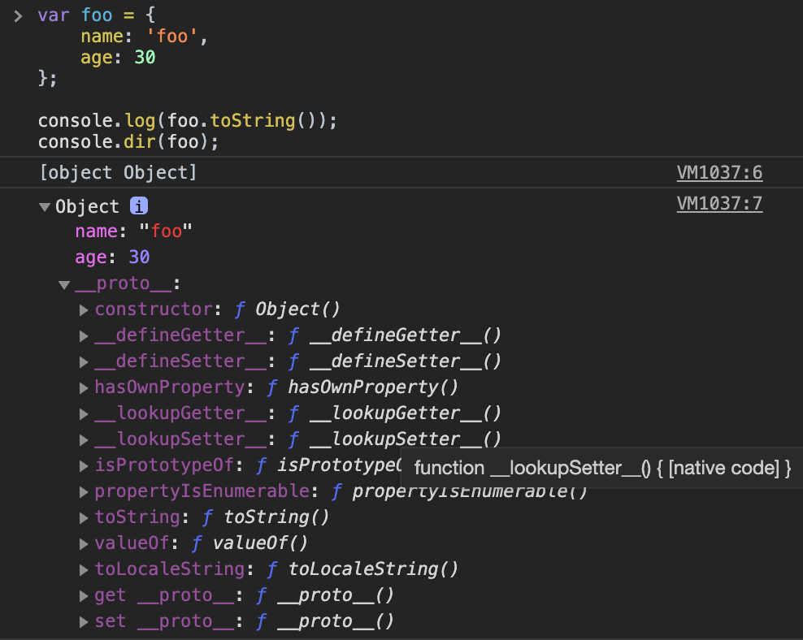
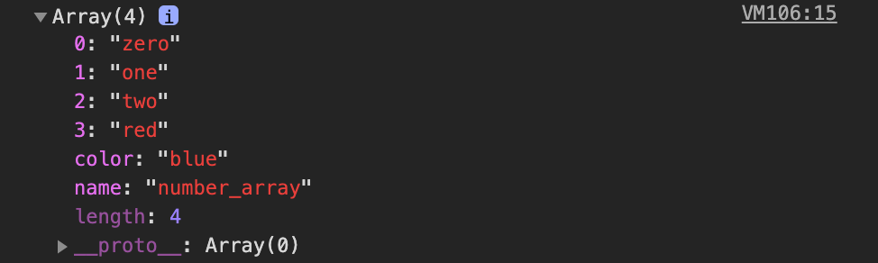

> 이 글은 고현준, 송형주 님의 [인사이드 자바스크립트](https://g.co/kgs/K6Laug)를 참조하여 작성한 글입니다.

## 프로토타입

자바스크립트의 모든 객체는 자신의 부모 역할을 하는 객체와 연결되어 있다. (객체지향의 상속 개념과 비슷)

부모 객체의 속성을 자신의 것처럼 쓸 수 있다.

```javascript
var foo = {
  name: 'foo',
  age: 30,
};

console.log(foo.toString());
console.dir(foo);
```

[출력 결과]



생성한 `foo` 객체에는 `toString()` 메소드가 없음에도 에러가 발생하지 않는데, 이는 `foo` 객체의 프로토타입에 `toString()` 메소드가 정의되어 있기 때문이다.

자바스크립트의 **모든 객체는 자신의 프로토타입을 가리키는** **`[[Prototype]]`** **라는 숨겨진 프로퍼티**를 가진다.

크롬 브라우저에서는 `__proto__` 가 숨겨진 `[[Prototype]]` 프로퍼티를 의미한다.

우선은 **Object.prototype 객체**가 생성된 객체의 프로토타입 객체가 된다는 것만 기억하고 넘어가자.

또한 객체를 생성할 때 결정된 프로토타입 객체는 임의의 다른 객체로 변경하는 것도 가능하다.

(이를 통해 객체의 상속 등의 기능을 구현한다.)

<br />

## 배열

배열은 자바스크립트 객체의 특별한 형태이다.

C나 Java의 배열과 같은 기능을 하는 객체지만 크기를 따로 지정하지 않아도 되고, 어떤 위치에 어느 타입의 데이터를 저장하더라도 에러가 발생하지 않는다. ex) `var arr = [ 1, '2', true, 1.1, '안녕하세요', [1, 2, 3, 4]];`

<br />

### 배열 리터럴

객체 리터럴이 중괄호 `{}` 를 이용한 표기법이었다면, 배열 리터럴은 대괄호 `[]` 를 이용한다.

객체 리터럴은 `key: value` 쌍으로 프로퍼티의 이름과 프로퍼티의 값을 모두 표기해야 하지만, 배열은 각 요소의 값만을 포함한다.

객체가 프로퍼티의 이름으로 대괄호나 마침표 표기법으로 프로퍼티에 접근했다면, 배열은 대괄호 내에 인덱스 값을 넣어서 접근한다.

<br />

### 배열의 요소 생성

객체가 동적으로 프로퍼티를 추가할 수 있듯이, 배열도 동적으로 원소를 추가할 수 있다. 특히 자바스크립트의 경우는 값을 순차적으로 넣을 필요 없이 아무 인덱스 위치에나 동적으로 추가할 수 있다.

```javascript
var emptyArr = [];
console.log(emptyArr[0]);

emptyArr[0] = 100;
emptyArr[3] = 'eight';
emptyArr[7] = true;
console.log(emptyArr);
console.log(emptyArr.length);
```

<br />

### 배열의 `length` 프로퍼티

자바스크립트의 모든 배열은 `length` 프로퍼티가 있다.

`length` 프로퍼티는 **배열의 가장 큰 인덱스에 1을 더한 값**이다. (원소 개수와 일치하는 것이 아님)

```javascript
var arr = [];
console.log(arr.length); // 0

arr[0] = 0;
arr[1] = 1;
arr[2] = 2;
arr[100] = 100;
console.log(arr.length); // 101
```

> `arr` 의 원소 개수가 4개 뿐이지만, `arr.length` 의 값은 101임.

<br />

배열의 `length` 프로퍼티는 코드를 통해 명시적으로 값을 변경할 수도 있다.

```javascript
var arr = [0, 1, 2];
console.log(arr.length); // 3

arr.length = 5;
console.log(arr); // [0, 1, 2, undefined, undefined]

arr.length = 2;
console.log(arr); // [0, 1]
console.log(arr[2]); // undefined
```

`arr.length` 를 기존 `length` 보다 크게 변경하면 원소가 할당되지 않았던 인덱스는 `undefined` 로 출력되고, 또한 기존 `length` 보다 작게 변경하면 할당되었던 인덱스가 삭제된다.

<br />

#### 배열 표준 메소드와 `length` 프로퍼티

자바스크립트는 배열에서 사용가능한 다양한 표준 메소드를 제공하는데, 이러한 **배열 메소드는** **`length`** **프로퍼티를 기반으로 동작**하기 때문에 `length` 프로퍼티가 굉장히 중요하다.

- `push()` 메소드 : 배열의 현재 `length` 값의 위치에 새로운 원소를 추가한다.

`arr.length` 값을 변경하면 변경한 위치 뒤에 `push()` 를 하게 된다.

<br />

### 배열과 객체

자바스크립트에서는 배열 역시 객체인데, 배열은 일반 객체와 약간 차이가 있따.

```javascript
// colorsArray 배열
var colorsArray = ['orange', 'yellow', 'green'];
console.log(colorsArray[0]); // orange
console.log(colorsArray[1]); // yellow
console.log(colorsArray[2]); // green

// colorsObj 객체
var colorsObj = {
  0: 'orange',
  1: 'yellow',
  2: 'green',
};
console.log(colorsObj[0]); // orange
console.log(colorsObj[1]); // yellow
console.log(colorsObj[2]); // green

// typeof 연산자 비교
console.log(typeof colorsArray); // object
console.log(typeof colorsObj); // object

// length 프로퍼티
console.log(colorsArray.length); // 3
console.log(colorsObj.length); // undefined

// 배열 표준 메소드
colorsArray.push('red');
console.log(colorsArray); // ['orange', 'yellow', 'green', 'red']
colorsObj.push('red'); // Uncaught TypeError: Object #<Object> has no method 'push'
```

- 배열과 객체는 유사하게 리터럴 방식으로 생성할 수 있고, 결과값 출력과 프로퍼티 접근 모두 비슷하게 할 수 있다.

> 객체의 프로퍼티 접근에서 프로퍼티 속성을 **문자열 형태**로 적어야 하는데, 자바스크립트 엔진이 `[]` 내부에 숫자가 사용될 경우, 숫자를 자동으로 문자열 형태로 바꾸어주어 정상적으로 접근된 것을 볼 수 있다.

- `typeof` 연산자 결과가 모두 `object` 이다.

- 객체에는 `length` 프로퍼티가 없다. ( `undefined` )

- 객체에서는 배열 표준 메소드를 호출할 수 없다.

> 객체의 경우 객체 표준 메소드를 저장하고 있는 `Object.prototype` 객체가 프로토타입인 반면 배열의 경우 `Array.prototype` 객체가 프로토타입이다.
> 또한 `Array.prototype` 의 프로토타입은 `Object.prototype` 객체이다. 따라서 배열은 `Array.prototype` 에 포함된 배열 표준 메소드와 `Object.prototype` 의 객체 표준 메소드를 모두 사용할 수 있다.

<br />

### 배열의 프로퍼티 동적 생성

배열도 자바스크립트 객체로, 인덱스가 숫자인 배열 원소 이외에도 객체처럼 동적으로 프로퍼티를 추가할 수 있다.

```javascript
// 배열 생성
var arr = ['zero', 'one', 'two'];
console.log(arr.length); // 3

// 프로퍼티 동적 추가
arr.color = 'blue';
arr.name = 'number_array';
console.log(arr.length); // 3

// 배열 원소 추가
arr[3] = 'red';
console.log(arr.length); // 4

// 배열 객체 출력
console.dir(arr);
```

[ `console.dir(arr)` 출력 결과]



배열도 객체처럼 `key: value` 형태로 배열 원소 및 프로퍼티를 가질 수 있다.

<br />

### 배열의 프로퍼티 열거

객체는 `for in` 문으로 프로퍼티를 열거하는데, 배열도 객체이므로 `for in` 문을 사용하는 것이 가능하지만, 불필요한 프로퍼티가 출력될 수 있으므로 `for` 문을 사용하는 것이 좋다.

> `for of` 문
> `for in` 은 객체의 모든 열거가능한 속성에 대해 반복하는 반면, `for of` 문은 컬렉션 전용으로 `[Symbol.iterator]` 속성이 있는 컬렉션 요소에 대해 반복한다.

```javascript
const iterable = [10, 20, 30];

for (const value of iterable) {
  console.log(value);
}
// 10
// 20
// 30
```

<br />

> ☝ 의문 : 참조 변수의 `let` , `const` 차이 - [🔗 [javascript] ES6 반드시 알아야할 문법 let, const 차이점](https://smilerici.tistory.com/68)

**기본 변수일 때**

- `let` : 변수

- `const` : 상수

**참조 변수일 때**

- `let` : 참조값이 변할 수 있음. (다른 객체 지정 가능)

- `const` : 참조값이 변할 수 없음. (내부 속성은 변화 가능)

```javascript
const objA = {};
let objB = {};

objA = objB; // Error: "objA" is read-only
objB = objA;
```

<br />

### 배열 요소 삭제

배열도 객체이므로 배열 요소나 프로퍼티를 삭제하는 데 `delete` 연산자를 사용할 수 있다.

```javascript
var arr = ['zero', 'one', 'two', 'three'];
delete arr[2];
console.log(arr); // ['zero', 'one', undefined, 'three']
console.log(arr.length); // 4
```

`delete arr[2]` 로 배열의 요소를 삭제하면, `arr[2]` 에 `undefined` 가 할당되게 되지만, 배열의 `length` 값은 변하지 않는다. 즉 원소 자체를 삭제하지 않는다.

때문에 배열에서 요소를 완전히 삭제할 경우 자바스크립트에서는 `splice()` 배열 메소드를 사용한다.

<br />

#### `splice()` 함수

```javascript
array.splice(start[, deleteCount[, item1[, item2[, ...]]]])
```

**매개변수**

- `start` : 배열의 변경을 시작할 인덱스, 배열의 길이보다 큰 값이라면 배열의 길이로 설정됨. 음수일 경우 배열의 끝에서부터 세어가고, 절대값이 배열의 길이보다 큰 경우 0으로 설정됨

- `deleteCount` [옵셔널] : 배열에서 제거할 요소의 수. 0이면 어떤 요소도 제거하지 않음. (새로운 요소를 추가할 때 사용)

- `item1, item2, ...` [옵셔널] : 배열에 추가할 요소. 없으면 `splice()` 는 요소를 제거하기만 한다.

반환 값

- 제거한 요소를 담은 배열, 하나만 제거한 경우 길이가 1인 배열을 반환 아무 것도 제거하지 않으면 빈 배열.

<br />

### `Array()` 생성자 함수

일반적인 리터럴로 생성하는 것도 결국 생성자 함수로 생성하는 과정을 단순화한 것이다.

`Array()` 생성자로 생성할 때는 반드시 `new` 연산자를 써야한다는 것을 기억하자.

`Array()` 생성자 함수는 호출할 때 인자 개수에 따라 동작이 다르다.

- 호출할 때 인자가 숫자 1개 일 경우 : 호출된 인자를 `length` 로 갖는 빈 배열 생성

- 그 외 : 호출된 인자를 요소로 갖는 배열 생성

```javascript
var foo = new Array(3);
console.log(foo); // [undefined, undefined, undefined]
console.log(foo.length); // 3

var bar = new Array(1, 2, 3);
console.log(bar); // [1, 2, 3]
console.log(bar.length); // 3
```

<br />

### 유사 배열 객체

만약 일반 객체에 `length` 라는 프로퍼티가 있으면 어떻게 될까? - 이러한 객체를 **유사 배열 객체(array-like object)** 라고 한다.

유사 배열 객체는 객체임에도 불구하고 표준 배열 메소드를 사용하는게 가능하다. ( `apply()` 메서드를 사용해야 한다)

```javascript
var arr = ['bar'];
var obj = {
  name: 'foo',
  length: 1,
};

arr.push('baz');
console.log(arr); // ['bar', 'baz']

Array.prototype.push.apply(obj, ['baz']);
console.log(obj); // { '1': 'baz', name: 'foo', length: 2}
```

> `arguments` 객체나 `jQuery` 객체가 유사 배열 객체 형태로 되어 있다.

<br />

## 기본 타입과 표준 메서드

자바스크립트는 숫자, 문자열, `Boolean` 에 대해 각 타입별로 호출 가능한 표준 메소드를 정의하고 있다.

기본 타입의 경우는 객체가 아닌데 어떻게 메소드를 호출할 수 있는가?

기본값은 메소드 처리 순간에 객체로 변환된 다음 타입별 표준 메소드를 호출하고, 끝나면 다시 기본값으로 복귀한다.

```javascript
var num = 0.5;
console.log(num.toExponential(1)); // 5.0e-1

console.log('test'.charAt(2)); // s
```

<br />

## 연산자

### `+` 연산자

더하기 연산과 문자열 연결 연산

### `typeof` 연산자

피연산자의 타입을 문자열 형태로 리턴.

| Type      | Name      | typeof 결과    |
| --------- | --------- | -------------- |
| 기본 타입 | 숫자      | 'number'       |
| 기본 타입 | 문자열    | 'string'       |
| 기본 타입 | Boolean   | 'boolean'      |
| 기본 타입 | **null**  | **'object'**   |
| 기본 타입 | undefined | 'undefined'    |
| 참조 타입 | 객체      | 'object'       |
| 참조 타입 | 배열      | **'object'**   |
| 참조 타입 | 함수      | **'function'** |

> ☝ `null` 과 배열이 'object' 라는 점. 함수는 'function' 이라는 점에 유의

<br />

### 동등 연산자( `==` )와 일치 연산자( `===` )

동등 연산자는 비교하려는 피연산자의 타입이 다를 경우에 타입 변환 후 비교.

일치 연산자는 타입이 다를 경우 변경하지 않고 비교.

`==` 동등 연산자는 권장되지 않음.

<br />

### `!!` 연산자

`!!` 연산자는 피연산자를 `Boolean` 값으로 변환한다.

```javascript
console.log(!!0); // false
console.log(!!1); // true
console.log(!!''); // false
console.log(!!'string'); // true
console.log(!!false); // false
console.log(!!true); // true
console.log(!!null); // false
console.log(!!undefined); // false
console.log(!!{}); // true
console.log(!![]); // true
```

`null` 과 `undefined` 는 `false` , 객체와 배열은 모두 비어있어도 `true`
