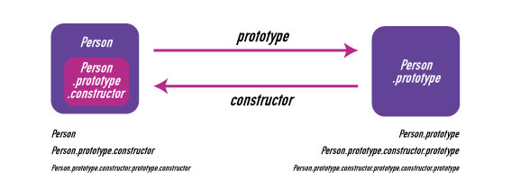
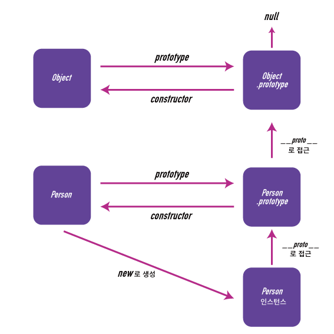

## 일반 함수 vs 화살표 함수

```javascript
const shape = {
	radius: 10,
	diameter() {
		return this.radius * 2;
	},
	arrowDiameter: () => {
		return this.radius * 2;
	},
};

console.log(shape.diameter());
// 20
console.log(shape.arrowDiameter());
// NaN

const diameter = shape.diameter;
const arrowDiameter = shape.arrowDiameter;

console.log(diameter());
// NaN
console.log(arrowDiameter());
// NaN
```

```javascript
function Shape() {
	this.radius = 10;
	this.diameter = function () {
		return this.radius * 2;
	};
	this.arrowDiameter = () => {
		return this.radius * 2;
	};
}

const shape = new Shape();

console.log(shape.diameter());
// 20
console.log(shape.arrowDiameter());
// 20

const diameter = shape.diameter;
const arrowDiameter = shape.arrowDiameter;

console.log(diameter());
// NaN
console.log(arrowDiameter());
// 20
```

- 일반 함수는 **호출할 때 동적으로** `this` 를 바인딩한다.

- 화살표 함수는 **선언할 때 정적으로** `this` 를 바인딩한다. (언제나 상위 스코프의 `this` 를 가리킨다.)

- 일반 함수는 `prototype` 프로퍼티를 가진다. ⇒ `constructor` 함수로 사용될 수 있다.

- 화살표 함수는 `prototype` 프로퍼티를 가지고 있지 않다. ⇒ `constructor` 함수로사용될 수 없다.

<br />

## 생성자 함수(constructor)와 프로토타입(prototype)

```javascript
function Person(name, age) {
	this.name = name;
	this.age = age;
}

// Person.prototype = { constructor: function Person(...) { ... } }
// Person.prototype.constructor = function Person(...) { ... }

const foo = new Person('foo', 30);
// foo: Person { name: 'foo', age: 30 }
// foo.__proto__: { constructor: function Person(...) { ... } }
// foo.__proto__.constructor = function Person(...) { ... }
```

<br />



<br />



> ☝ `__proto__` 는 ECMAScript의 스펙이 아닌 일부 모던 브라우저가 구현한 것으로, `[[Prototype]]` 를 접근하는 속성이다.

```javascript
function Person(name) {
	this.name = name;
	this.getName = function () {
		return this.name;
	};
}

console.log(Person.prototype); // { constructor: function Person(name) { ... } }

function Child(name, age) {
	Person.call(this, name);
	this.age = age;
	this.getAge = function () {
		return this.age;
	};
}

console.log(Child.prototype); // { constructor: function Child(name, age) { ... } }

Child.prototype = Object.create(Person.prototype);

console.log(Object.create(Person.prototype)); // Person {}
console.log(Child.prototype); // Person {}
console.log(Child.prototype.constructor); // function Person(name) { ... }

Child.prototype.constructor = Child;

console.log(Child.prototype);
// Person { constructor: function Child(name, age) { ... } }

var child = new Child('foo', 20);

console.log(child.getName()); // 'foo'
console.log(child.getAge()); // 20
```

## 클래스 문법은 단지 "구문적 설탕" 인가?

```javascript
class User {
	constructor(name) {
		this.name = name;
	}

	sayHi() {
		alert(this.name);
	}
}

let user = new User('John');
user.sayHi();
```

```javascript
function User(name) {
	this.name = name;
}

User.prototype.sayHi = function () {
	alert(this.name);
};

let user = new User('John');
user.sayHi();
```

ES6의 클래스 문법을 사용하는 것과 일치한 결과를 기존 `function` + `prototype` 문법의 조합으로 만들 수 있기 때문에 일부 사람들은 단지 클래스 문법을 "구문적 설탕" (syntax sugar)라고 말한다.

하지만 몇 가지 중요한 차이가 있다.

1. `class` 문법을 사용해서 만든 함수엔 특수 내부 프로퍼티인 `[[FunctionKind]]: "classConstructor"` 가 이름표처럼 붙어서, 이 클래스 생성자를 `new` 와 함께 호출하지 않으면 에러가 발생한다.

1. 클래스의 메소드는 `non-enumerable` 로, `for ... in` 구문 등의 객체 순회에서메소드는 순회하지 않는다. (enumerable 플래그가 false 이다.)

1. 클래스는 항상 `use strict` 모드이다.

1. 이외에도 getter, setter, 믹스인 등의 기능이 있다.

### 클래스와 함수에서의 `new` 연산자 동작


