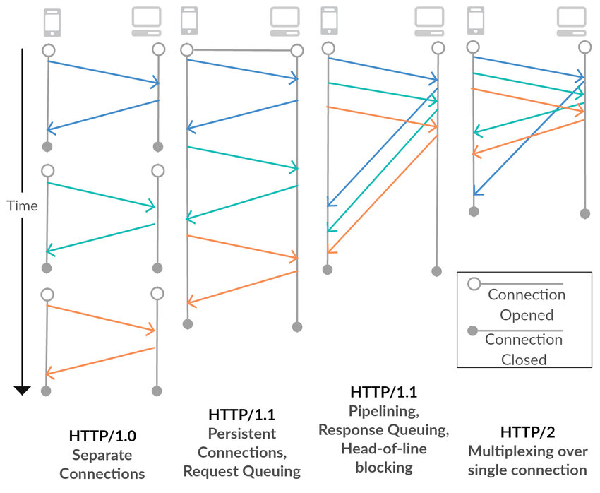
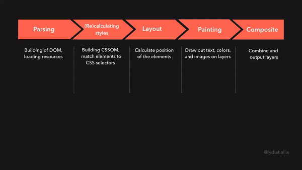

## 웹팩

- 웹팩은 static module bundler이다.

- 웹팩은 **엔트리 포인트**부터 프로세스하여, 의존하고 있는 모듈에 대해 내부적으로 **dependency graph**를 구성하고, 최종적으로 하나의 **번들 파일**을 구성한다.

  - Entry : dependency graph를 구성하기 시작할 진입점

  - Output : 번들된 결과 파일

  - Loader : 기본적으로 js, json 파일만 가져올 수 있지만, loader는 웹팩이 다른 유형의 파일도 모듈로서 가져오고 dependency graph를 구성할 수 있도록 해준다. ex) jpg 이미지, 폰트, ...

  - Plugin : 번들링 최적화, 자원 관리, 환경 변수의 주입 등 다양한 목적의 환경 설정을 위해 사용.

  - Mode : production | development 등 환경에 따라 웹팩을 설정할 수 있다.

## HTTP

### HTTP 버전별 차이점

[HTTP의 진화](https://developer.mozilla.org/ko/docs/Web/HTTP/Basics_of_HTTP/Evolution_of_HTTP)

#### HTTP/0.9

- 초기 버전

- `GET` 이 유일한 메서드

- HTTP 헤더가 없었고 HTML 파일만 전송될 수 있었음.

- 상태나 오류 코드도 없었다.

#### HTTP/1.0

- 버전 정보가 요청으로 전송되기 시작 ex) `GET /mypage.html HTTP/1.0`

- 상태 코드가 응답의 시작 부분에 붙어 전송됨.

- HTTP 헤더 개념이 도입됨.

  - HTML 파일 외에 다른 문서를 전송할 수 있게 됨.

#### HTTP/1.1

- HTTP의 첫 번째 표준 버전

- 커넥션을 재사용할 수 있게 됨.

  - 원본 문서 내에 임베드된 리소스를 위해서, 기존에 연결된 커넥션을 다시 사용할 수 있음.

- 파이프라이닝으로 첫 번째 요청에 대한 응답이 완전히 전송되기 전에 두 번째 요청 전송을 가능하게 했다.

#### HTTP/2

- 이진 프로토콜 (1.1은 텍스트 프로토콜)

- Multiplexing

> ☝ `multiplexing` vs `pipelining`

- pipelining은 순서가 중요하다 → Head Of Line blocking 문제

- multiplexing은 순서가 중요하지 않다.

[HTTP 1.1 vs HTTP.2 vs HTTP/2 with Push - Manning](https://freecontent.manning.com/animation-http-1-1-vs-http-2-vs-http-2-with-push/)

### HTTP 상태 코드

#### `1xx` : 정보 응답

#### `2xx` : 성공 응답

- `200` : OK. 요청 성공

- `201` : Created. 생성 요청 성공

- `202` : Accepted. 요청 수락

- `204` : 성공했으나 반환할 것이 없음

#### `3xx` : 리다이렉션 메시지

- `300` : Multiple choices. 여러 리소스에 대한 요청 결과 목록

- `301` , `302` , `303` : Redirect. 리소스 위치가 변경된 상태

- `304` : Not modified. 리소스가 수정되지 않았음

#### `4xx` : 클라이언트 에러 응답

- `400` : Bad Request. 요청 오류

- `401` : Unauthorized. 권한 없음

- `403` : Forbidden. 요청 거부

- `404` : Not Fount. 리소스가 없는 상태

#### `5xx` : 서버 에러 응답

- `500` : 서버가 요청을 처리 못함

- `501` : Not Implemented. 서버가 지원하지 않는 요청

- `503` : Service Unavailable. 과부하 등으로 당장 서비스가 불가능한 상태

### 브라우저 렌더링 과정

- DOM 및 CSSOM 트리는 결합되어 렌더링 트리를 형성합니다.

- 렌더링 트리에는 페이지를 렌더링하는 데 **필요한 노드**만( 메타 태그, 스크립트 태그, `display: none` 등이 제외됨. )포함됩니다.

  > ☝ `visibility: hidden` , `display: none` 은 다르다.

- 레이아웃은 각 객체의 정확한 위치 및 크기를 계산합니다. (경우에 따라 "리플로우"라고도 한다.)

- 마지막 단계는 최종 렌더링 트리에서 수행되는 페인트이며, 픽셀을 화면에 렌더링합니다. (경우에 따라 "리페인트"라고도 한다.)

 

### 브라우저 렌더링 최적화

오늘날 대부분의 기기는 **초당 60회(60fps)**의 빈도로 화면을 새로 고친다. 따라서 각 프레임에는 16ms 가량의 시간만 할당된다. (1초 / 60 = 16.66ms) 실제로 브라우저가 실행 준비를 하는 시간이 있기 때문에 10ms 내에 모든 작업을 완료해야 한다.

#### 픽셀 파이프라인

- **자바스크립트** : 자바스크립트로 시각적 변화를 일으키는 작업. CSS Animation, Transitions, Web Animation API 역시 포함.

- **스타일 계산** : 어떤 스타일 규칙(CSS)을 어떤 요소에 적용할지 계산하는 프로세스

- **레이아웃** : 화면에서 얼마의 공간을 차지하고 어디에 배치되는지 계산하기 시작할 수 있다.

- **페인트** : 픽셀을 채우는 프로세스. 텍스트, 색, 이미지, 경계 및 그림자 등 모든 시각적 부분을 그리는 작업. 레이어라고 하는 다수의 표면에서 수행

- **합성** : 페이지의 여러 부분이 여러 레이어로 그려졌기 때문에 페이지가 정확히 렌더링 되려면 정확한 순서로 화면에 그려야 한다.

> ☝ 코드가 파이프라인의 어떤 부분을 트리거 하는지 정확히 이해하는 것이 중요

#### 1. JS / CSS > 스타일 > 레이아웃 > 페인트 > 합성

레이아웃 너비, 높이, 왼쪽 또는 상단 위치 등 요소의 기하학적 형태에 영향을 주는 **"layout"** 속성을 변경하면 브라우저가 다른 모든 요소를 확인하고 페이지에 대해 **"리플로우"**를 수행해야 한다. 영향을 받은 영역이 있으면 다시 페인트하고, 다시 합성해야 한다.

#### 2. JS / CSS > 스타일 > 페인트 > 합성

페이지의 레이아웃에 영향을 주지 않는 배경 이미지, 텍스트 색상, 그림자 등의 **"paint only"** 속성을 변경하면 브라우저가 레이아웃을 건너뛰고 페인트 작업, 합성 작업을 수행한다.

#### 3. JS / CSS > 스타일 > 합성

레이아웃과 페인트가 필요 없는 속성을 변경하면 브라우저가 합성 단계로 건너 뛴다. 가장 이상적이고 비용이 가장 적게 드는 버전이다. ( 현재 부합되는 속성은 `transform` , `opacity` 2가지 뿐이다. )

> ☝ CSS 속성이 어떤 버전을 트리거할 지 알고 싶은 경우 [CSS 트리거](https://csstriggers.com/)를 참조. 또는 [이 링크](https://docs.google.com/spreadsheets/u/0/d/1Hvi0nu2wG3oQ51XRHtMv-A_ZlidnwUYwgQsPQUg1R2s/pub?single=true&gid=0&output=html) 참조

#### 참고자료

- [https://twitter.com/lydiahallie/status/1231255327032541185](https://twitter.com/lydiahallie/status/1231255327032541185)

[Rendering Performance | Web Fundamentals | Google Developers](https://developers.google.com/web/fundamentals/performance/rendering)

 

### 이미지 레이지로드

[Lazy-loading images](https://web.dev/lazy-loading-images/)

[The Complete Guide to Lazy Loading Images | CSS-Tricks](https://css-tricks.com/the-complete-guide-to-lazy-loading-images/#method-1-trigger-the-image-load-using-javascript-events)

 
