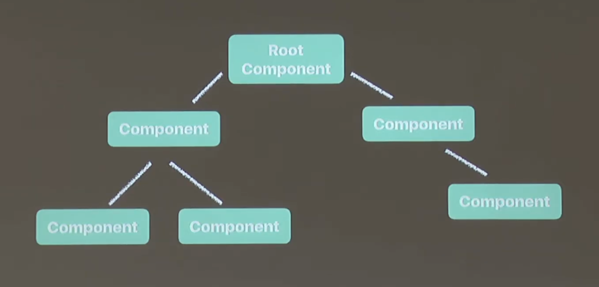
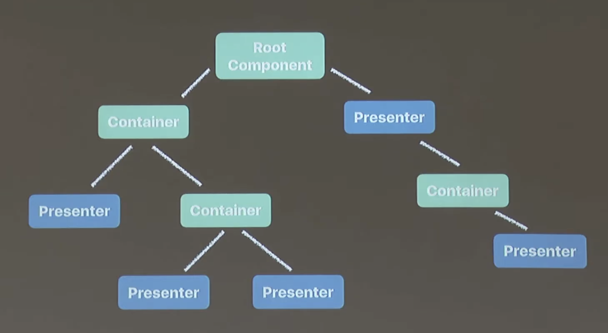
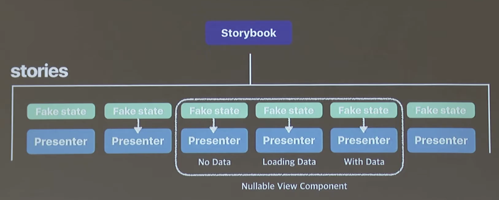
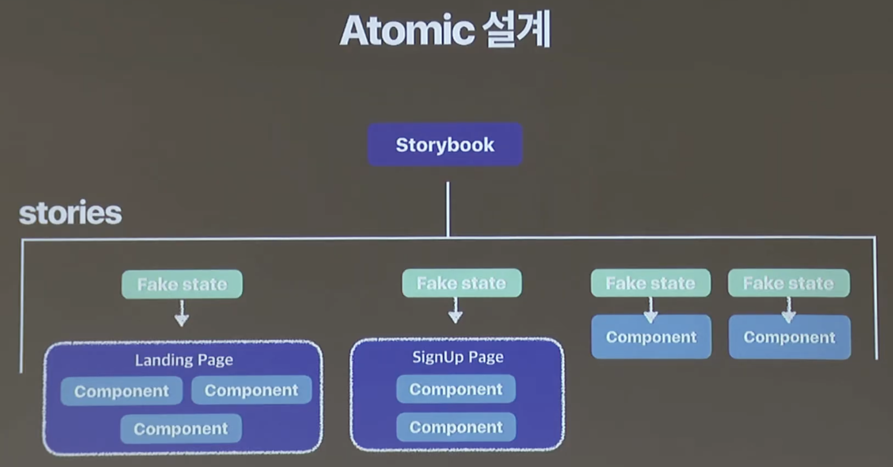
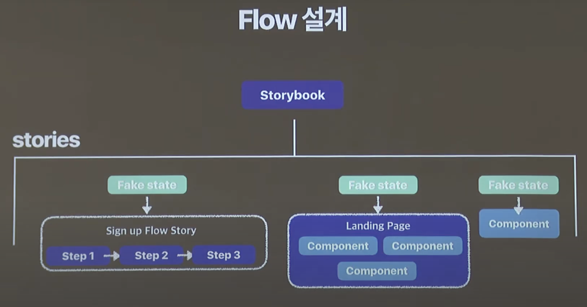

## Say Hello to Storybook

### 리액트 컴포넌트 트리

      - Pure Components

      

      - Container - Presenter 패턴

      

      - Redux

      

      - MobX

      

### 뷰가 깊숙히 숨어 있는 경우

- 깊은 트리, nullable, 라우팅 등으로 인해 하나의 컴포넌트를 수정하기 위해 들여야하는 노력이 너무 크다.

## 스토리북이 하는 역할

> 스토리북은 UI컴포넌트를 위한 간단한 scaffolder이자 UI 테스팅 툴이다.

> 각종 라우팅과 state들로 연결이 되어있는 React 뷰 컴포넌트들을 nomalize 시켜 isolate 시켜 독립적 환경에서 돌아갈 수 있도록 해주는 UI scaffolding 라이브러리이다.

      

      

      

- 자체 웹팩이 있어서 핫 리로딩 지원

- 디자이너와 개발자, PM을 연결시켜주는 하나의 툴이다.

### 스토리북은 앱 밖에서 따로 돈다

### addons

- actions : 이벤트 시 로그를 찍어줌

- links : 스토리에서 다른 스토리로 이동

- knobs : 동적으로 상태 변경

- console : 콘솔 찍어줌

- notes : 다른 사람에게 노트를 보여줄 수 있다.

#### 서드 파티

- backgrounds

- chapters

 
