## 인증 서비스 기초 강의

### Auth Service Fundamentals

- 구글과 유튜브의 사례 - 인증이 필요한 이유가 있어야 한다.


- 서비스 제공자 : 회원 확보 → 데이터 분석 → 서비스 방향 설정, 다양한 마케팅 활용

- 사용자 : 서비스 이용 편의성, 개인화 서비스 이용

#### 회원 가입

- 서비스의 일원이 되기 위한 절차

- 이 과정을 거치지 못한다면 경우에 따라서 해당 서비스에 게시되어 있는 글 자체를
  못 보게 되는 등 가입자들에 비해 활동의 제약이 발생

#### 로그인

- 로그인은 접근 허가 증명을 얻기 위해 사용자 인증으로 개인이 컴퓨터 시스템에 접
  근하는 작업

<br />

#### 인증 방법

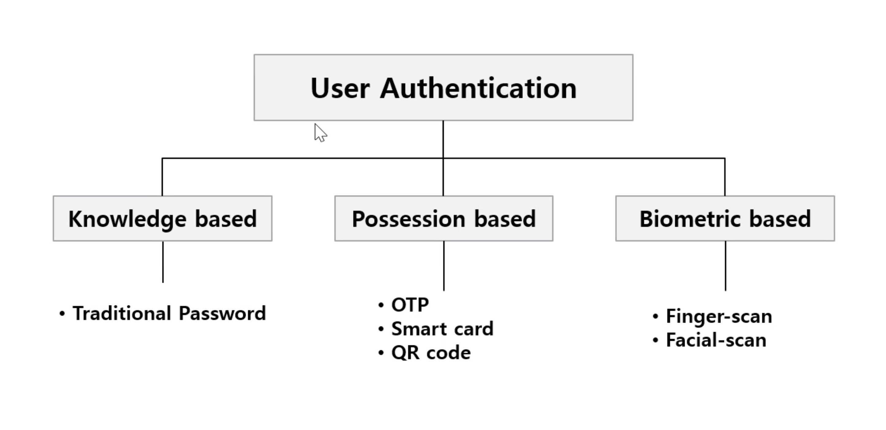

#### Authentication vs Authorization


- Authorization은 올바르게 인증된 유저에게 자원의 소유자가 허가한 자원에 접근할
  수 있는 권한을 부여하는 것이다.

#### OAuth 2.0

- OAuth 2.0은 다양한 플랫폼 환경에서 권한 부여를 위한 표준 프로토콜

- 제 3의 앱이 자원의 소유자인 서비스 이용자를 대신하여 서비스를 요청할 수 있도록
  자원 접근 권한을 위임하는 방법

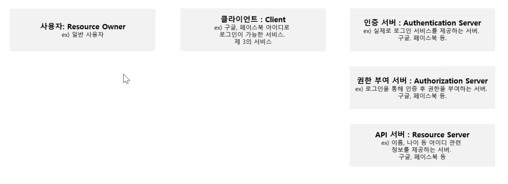

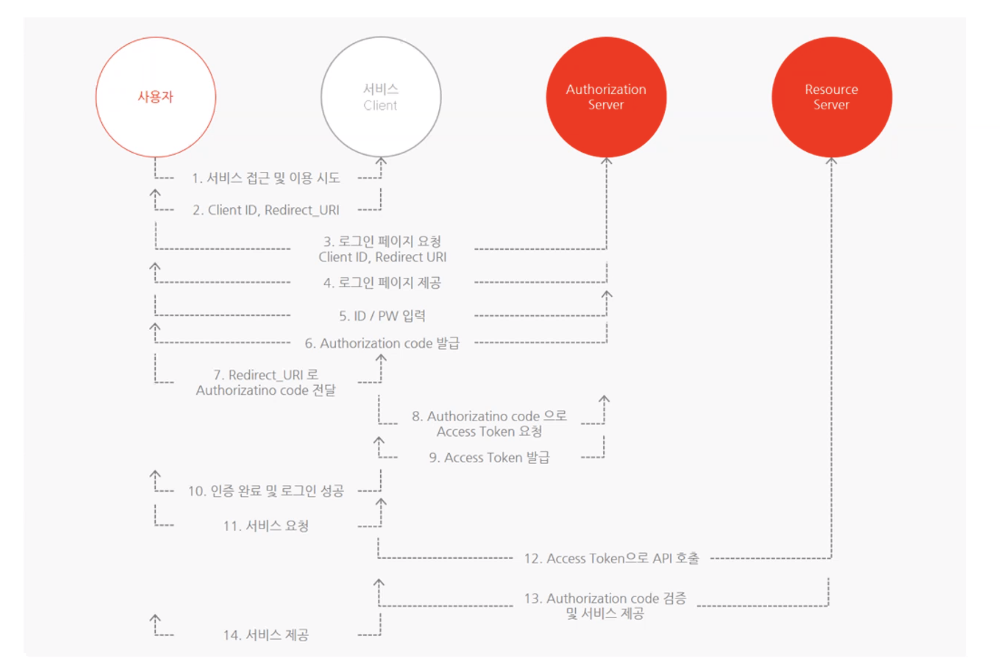

### Sample

필수 정보 - `key` (사용자에 대한 유니크 값), `id` , `password`

- ? 유저 아이디를 `key` 로 사용했을 때의 문제점

  - `id` 는 public 하다.

  - `id` 는 변경될 수 있다. (유저의 `key` 값이 바뀔 수 있다.)

    - 관계된 데이터에 문제가 발생한다.

- `id` 는 `unique` 해야 한다.

  - 대소문자를 허용할 경우 문제가 발생할 수 있다.

- `password` 는 암호화 되어야 한다.

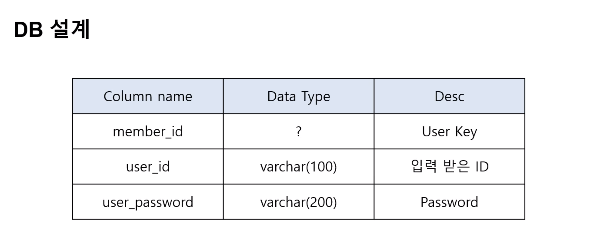

- - 가입 일자

- `key` 값으로 숫자를 사용하면 공격의 여지를 줄 수 있다.

- 문자열을 많이 쓰는데, 유추하기 어려워야 한다.

- `user_id` 는 이메일을 많이 쓰는데, 이메일은 유니크 하다는 점이 보장된다.

  - 이메일이 해당 유저의 소유인지 인증 과정이 필요하다.

- `password` 는 문자와 숫자, 특수 문자 등을 조합하는 것이 좋다.

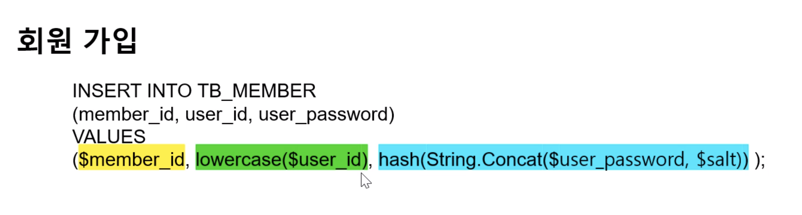

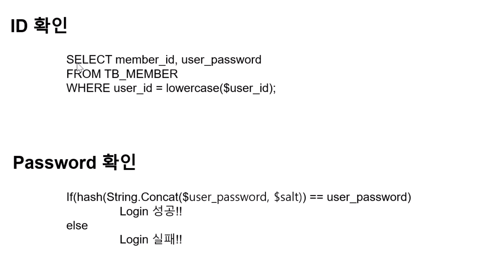

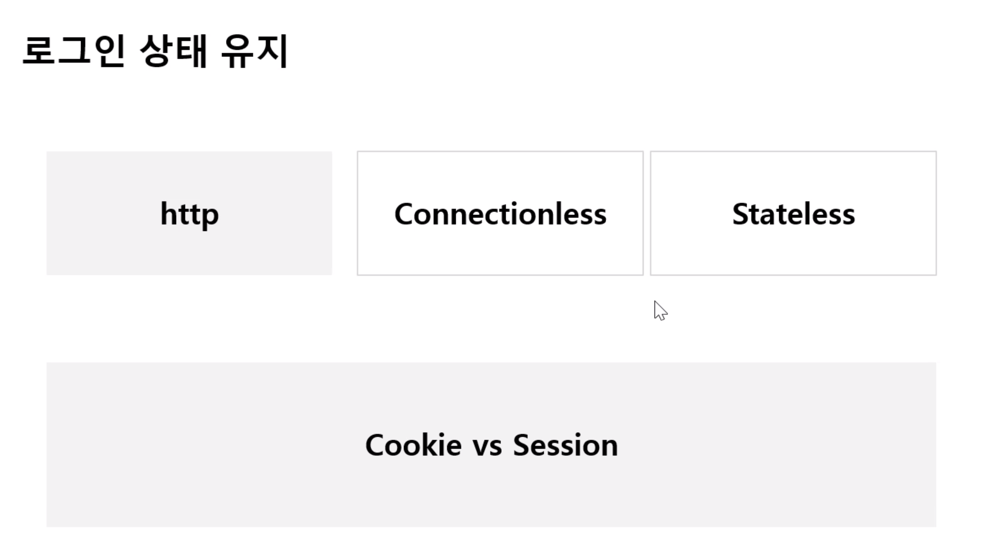

- Cookie vs Session

[쿠키가 보안에 취약한 이유](https://marga.tistory.com/291)

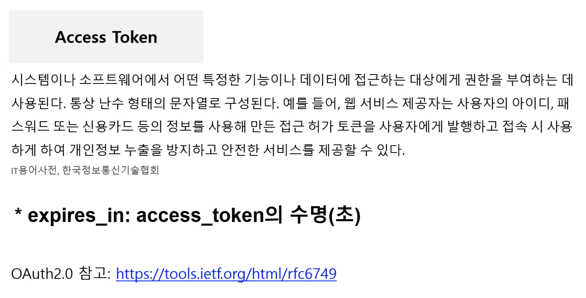

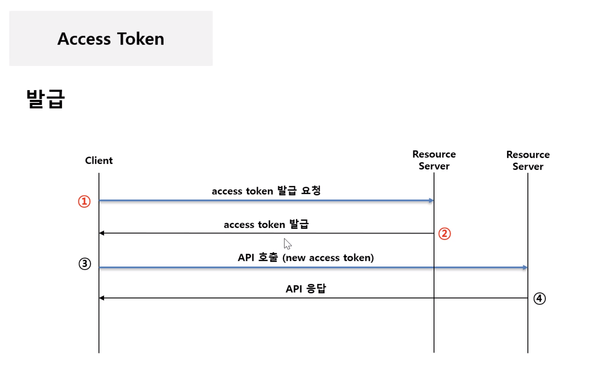

많은 경우 쿠키에 `token` 을 넣는데, 보안 측면에서 그냥 넣는 경우, 조합해서 넣는
경우 등이 있다.

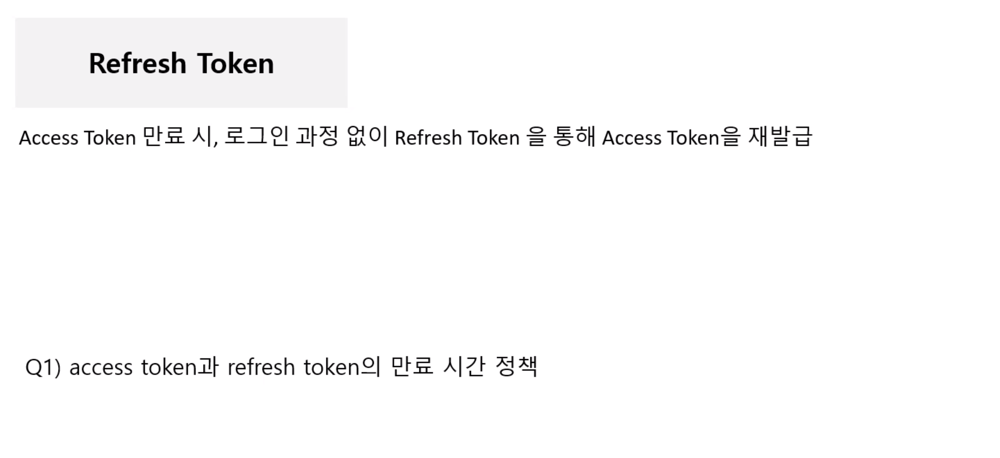

- access token 은 시간 단위를 많이 쓰고 `ex) 6시간` , refresh token은 몇 일 단위
  , `ex) 1주 2주 한 달`

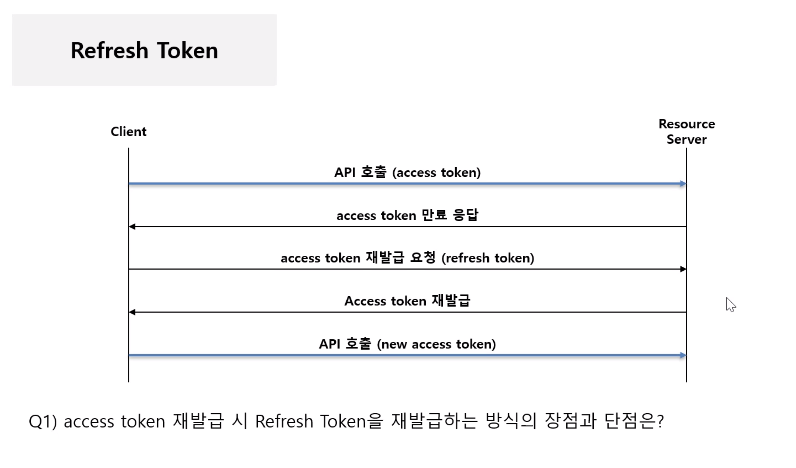

- 재발급 하지 않고 기존 것을 사용하면, refresh token은 언젠가 만료 되어 사용자에
  게 불편함을 줄 수 있다.

- 항상 신규로 발급하면, 여러 플랫폼 간에 재발급 된 토큰을 어떻게 동기화 할 것이
  냐에 대한 고민이 필요하다.

<br />

## Storybook 글로벌 스타일 설정

`preview.js`

```javascript
import React from 'react';

import {ThemeProvider} from 'styled-components';

import GlobalStyle from 'src/styles/GlobalStyle';
import theme from 'src/styles/theme';

export const parameters = {
  actions: {argTypesRegex: '^on[A-Z].*'},
};

export const decorators = [
  (Story) => (
    <ThemeProvider theme={theme}>
      <GlobalStyle />
      <Story />
    </ThemeProvider>
  ),
];
```

<br />

### Styled-components

[The Advanced Way to Style with Styled Components](https://medium.com/javascript-in-plain-english/the-advanced-way-to-style-with-styled-components-98fb70c1eecc)

이슈 - styled-components의 craeteGlobalStyle 적용 시 user agent stylesheet가
override 하는 이슈

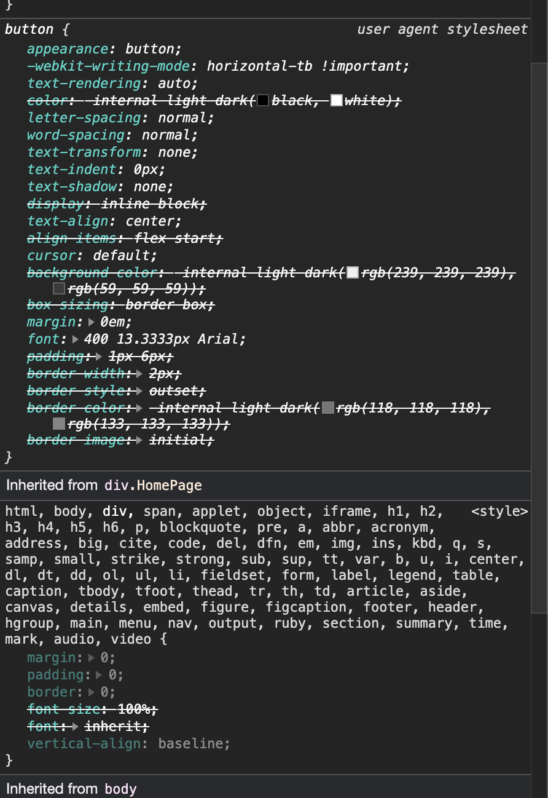

<br />

### Validation

[Use RegEx To Test Password Strength In JavaScript](https://www.thepolyglotdeveloper.com/2015/05/use-regex-to-test-password-strength-in-javascript/)

[Form Validation](https://codesandbox.io/s/form-validation-ievlc?from-embed=&file=/src/Form.js:549-561)
