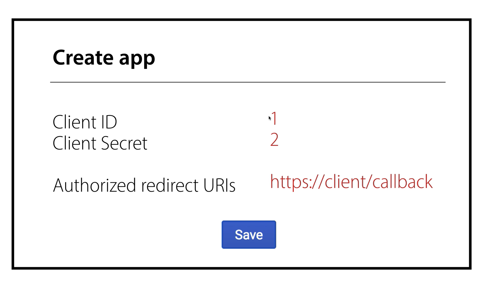
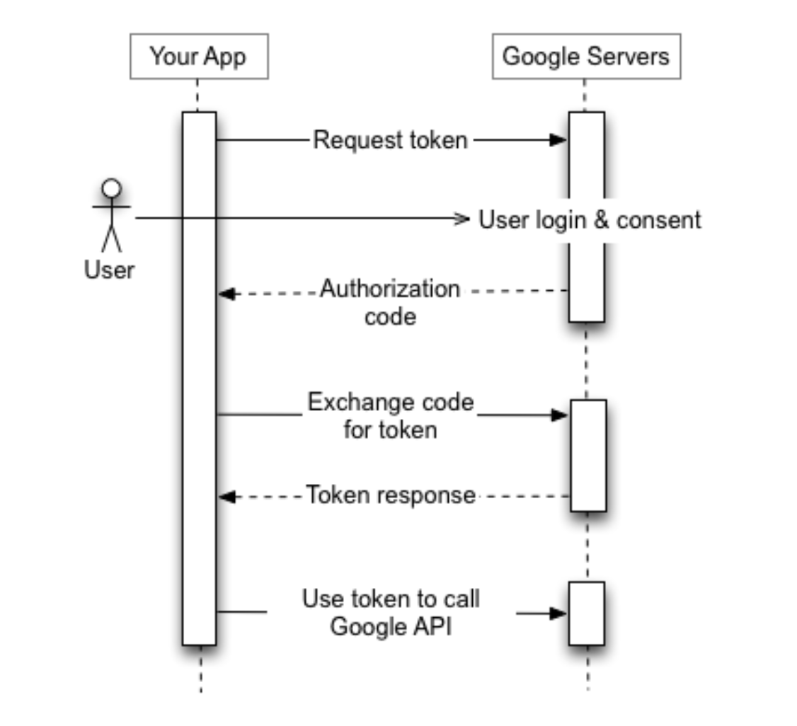

## PMP 가이드

## OAuth

OAuth 기술의 참여자

Our Service ( `example.com` ), User(사용자), Their(Google, Facebook, Twitter 등
등)

 

**User에게 Their의** **`id`** **,** **`pw`** **를 그대로 전달받는 방법**

- User : 처음보는 서비스를 믿을 수 없다.

- Our Service : 유저의 `id` , `pw` 를 안전하게 관리해야할 책임을 지니게 된다.

- Their Service : 제 3자의 서비스가 본인들의 `id` , `pw` 를 갖고 있다는 것에 불
  만이 생긴다.

 

**Their가** **`accessToken`** **을 발급하는 방법**

- `accessToken` 은 `id` , `pw` 가 아니다.

- Their Service는 제공하기 원하는 기능만 제공할 수 있다.

 

### 용어

- Client(Our Service)

- Resource Owner(User)

- Resource Server(Their) + Authorization Server(인증 서버를 따로 구분하기도 함)

 

### 등록

- Client ID : 서비스를 식별하는 아이디

- Client Secret : 서비스에 대한 비밀번호 (절대로 노출이 되어선 안된다.)

- Authorized redirect URIs : Resource Server가 인증 코드를 제공할 서비스의 URL

- Scope : Resource Server에서 제공하는 기능 (필요한 기능에 대한 인증만 제공 가능
  )

소셜 로그인 버튼은 다음의 링크가 담겨있다.

- `http://{리소스 서버의 주소}/?{클라이언트 ID=id}&{스코프=b,c}&{리다이렉트 URL=url}`

 

리소스 서버는 유저의 로그인 정보를 받고, 클라이언트 아이디와 리다이렉트 URL이 일
치하는지 확인하고, 권한 허용에 대한 안내를 유저에게 전달하고, 유저가 허용한 권한
이 무엇인지에 대해 저장한다.

리소스 서버는 `authorization code` 를 담아서 리다이렉트 URL로 유저의 브라우저를
리다이렉트 시킨다.

클라이언트는 `authorization code` 를 유저에게 받고, 리다이렉트 URL, 클라이언트
ID, 클라이언트 시크릿을 갖고 리소스 서버에 요청한다.

이 과정이 완료되면 access token을 발급한다.

access token을 `Header: { Authorization : Bearer token }` 에 담아 보낼 수 있다.

 

### OAuth를 활용해서 API 사용하기

[Using OAuth 2.0 to Access Google APIs | Google Identity](https://developers.google.com/identity/protocols/oauth2/)

 

## Database Naming Convention

### 복수형 vs 단수형

- 테이블은 엔티티의 인스턴스들을 표현하기 때문에 의미적으로 복수형이 더 맞다.

- 테이블을 단수형을 사용했을 때 SQL 문에서 `SELECT activity.name` 으로 표현할 수
  있는 장점이 있다.

  - 하지만 복수형을 사용하더라도 SQL alias를 사용하는 것으로 극복 가능하다.

  - `SELECT id, name, description FROM products product WHERE product.name = ‘foo’ AND product.description = ‘bar’`

- REST API에서 자원에 대한 요청 역시 테이블에 따라 복수형으로 하는 것이 좋다.
  ex) `GET /users/1`

[The table naming dilemma: singular vs. plural](https://medium.com/@fbnlsr/the-table-naming-dilemma-singular-vs-plural-dc260d90aaff#:~:text=Since%20the%20table%20is%20storing,when%20writing%20an%20SQL%20statement)

### camelCase vs snake_case

- MySQL 에서 데이터베이스는 데이터 디렉토리 내의 디렉토리에 해당하고, 테이블은파
  일에 해당한다. 따라서, 운영체제의 대소문자 구분이 데이터베이스, 테이블 및 트리
  거 이름의 대소문자 구분에 영향을 준다.

- Windows는 대소문자를 구분하지 않지만 Unix는 구분, macOS는 구분하지 않는 파일시
  스템을 사용하지만 대소문자를 구분하는 볼륨도 지원함.

- 따라서 `snake_case` 가 이식성과 사용 편의성 측면에서 가장 권장된다.

- 하지만 `camelCase` 를 사용하는 경우도 있고, JS가 `camelCase`를 사용하기 때문에
  얻을 수 있는 편의성이 있다.

- 무엇보다 일관된 규칙을 채택하는 것이 가장 좋다.

[MySQL :: MySQL 8.0 Reference Manual :: 9.2.3 Identifier Case Sensitivity](https://dev.mysql.com/doc/refman/8.0/en/identifier-case-sensitivity.html)

## RESTful API

### 서버 응답에 HTTP 상태 코드를 사용해라

오류 발생시 API 사용자의 혼동을 없애기 위해 오류를 정상적으로 처리하고 발생한 오
류의 종류를 나타내는 HTTP 응답 코드를 반환해야합니다. 이를 통해 API 관리자는 발
생한 문제를 이해할 수있는 충분한 정보를 얻을 수 있습니다. 오류로 인해 시스템이중
단되는 것을 원하지 않으므로 오류를 처리하지 않은 채로 둘 수 있습니다. 즉, API 소
비자가 오류를 처리해야합니다.

일반적인 오류 HTTP 상태 코드는 다음과 같습니다.

- 400 잘못된 요청 – 이는 클라이언트 측 입력이 유효성 검사에 실패 함을 의미합니다
  .

- 401 Unauthorized – 사용자가 리소스에 액세스 할 수있는 권한이 없음을 의미합니다
  . 일반적으로 사용자가 인증되지 않은 경우 반환됩니다.

- 403 금지됨 – 사용자가 인증되었지만 리소스에 액세스 할 수 없음을 의미합니다.

- 404 Not Found – 리소스를 찾을 수 없음을 나타냅니다.

- 500 내부 서버 오류 – 일반적인 서버 오류입니다. 아마도 명시 적으로 던져서는 안
  됩니다.

- 502 Bad Gateway – 업스트림 서버의 잘못된 응답을 나타냅니다.

- 503 서비스를 사용할 수 없음 – 서버 측에서 예기치 않은 일이 발생했음을 나타냅니
  다 (서버 과부하, 시스템의 일부 오류 등이 될 수 있음).

[Best practices for REST API design - Stack Overflow Blog](https://stackoverflow.blog/2020/03/02/best-practices-for-rest-api-design/)

[Best Practices for your REST API](https://solidgeargroup.com/en/best-practices-rest-api/)

## FE API 에러 핸들링

[Catch request errors with Axios](https://gist.github.com/fgilio/230ccd514e9381fafa51608fcf137253)

[Handling Failed HTTP Responses With fetch()](https://www.tjvantoll.com/2015/09/13/fetch-and-errors/)
