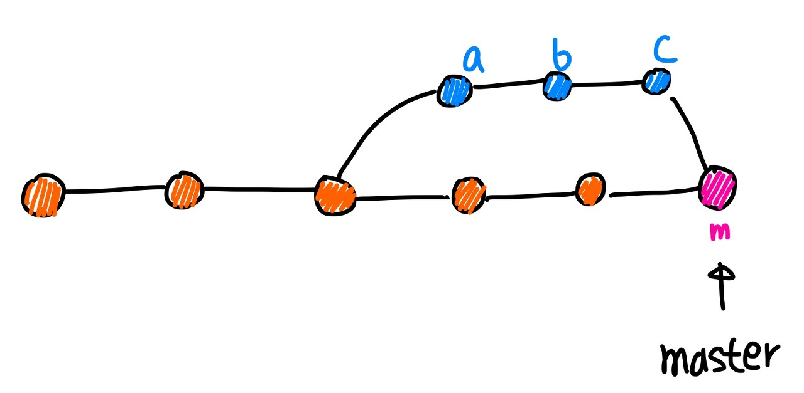
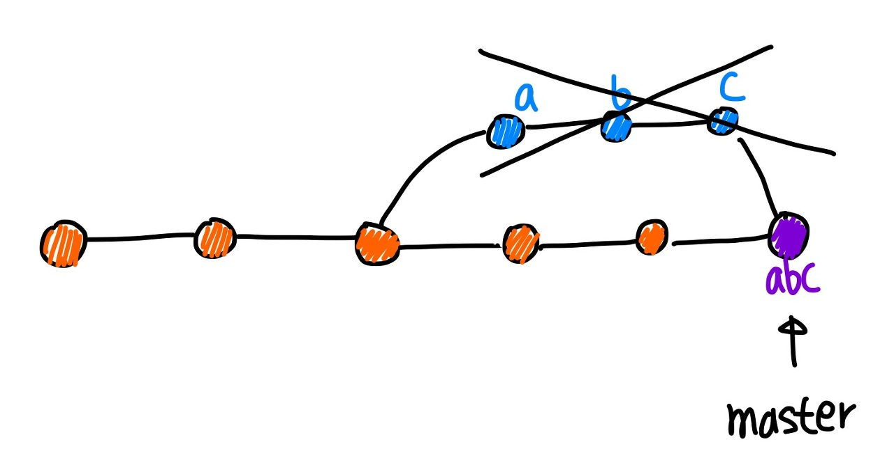
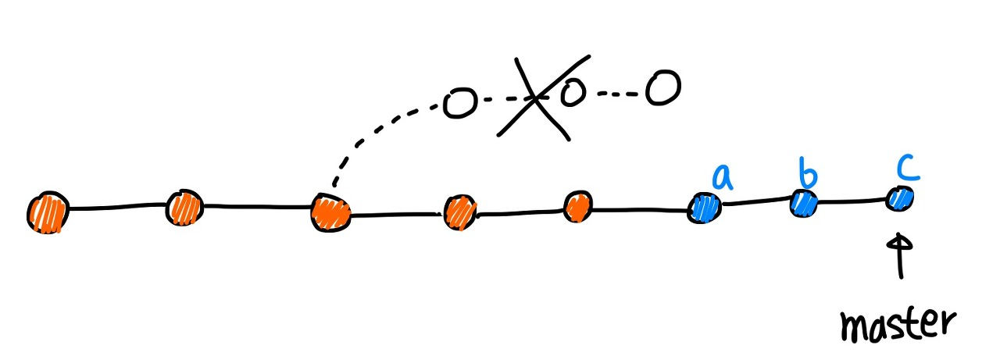
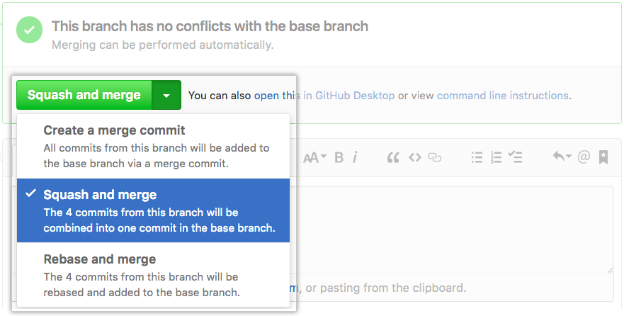
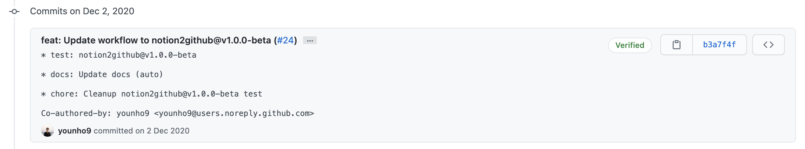
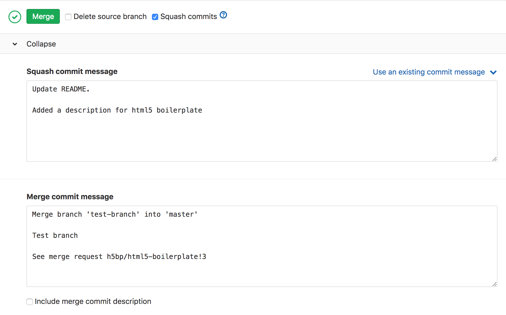
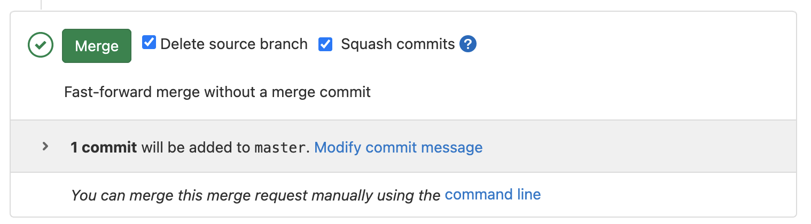

## Merge Options

### Merge

기본적인 Merge 방법으로 하나의 브랜치의 **변경 이력 전체를 합치는 방법**이다.

두 변경 이력을 병합한 **Merge commit**이 새로 생성된다.

### Squash and merge

브랜치 상의 모든 커밋을 **하나로 병합한 내용**을 다른 브랜치에 **추가**하는 방법이다.

PR에 있는 commit log들을 한 개의 커밋으로 추려서 main 브랜치에 병합할 수 있기 때문에, **1 PR = 1 commit** 처럼 사용할 수 있다.

### 참고자료

[[Git] Merge 이해하기 (Merge / Squash and Merge / Rebase and Merge)](https://im-developer.tistory.com/182)

[6. Github으로 협업하는 법](https://brunch.co.kr/@anonymdevoo/9)

[GitHub의 Merge, Squash and Merge, Rebase and Merge 정확히 이해하기 : TOAST Meetup](https://meetup.toast.com/posts/122)

### Rebase and Merge

브랜치 상의 모든 commit들을 합치지 않고 main 브랜치에 추가하는 방법이다.

## GitHub과 GitLab의 Squash and merge 차이

### GitHub

Github에서는 PR에 대한 머지 방법을 다음 사진과 같이 제공한다.

Squash and merge 기능을 사용할 경우, Merge commit이 따로 생성되지 않고, PR 타이틀을 커밋 제목으로 하고, 브랜치의 commit log들이 커밋 내용으로 생성된다.

### GitLab

반면, GitLab에서는 MR을 머지할 때, Squash commits의 옵션을 체크할 수 있도록 하는데, GitHub과 달리 기본적으로 Merge commit이 생성되도록 설정되어 있다.

Merge commit을 생성하지 않기 위해서는 Fast-forward merge를 사용해야 한다.

[Fast-forward merge requests](https://docs.gitlab.com/ee/user/project/merge_requests/fast_forward_merge.html#enabling-fast-forward-merges)

Fast-Forward Merge를 사용하고 Squash commits 옵션을 체크하지 않으면, Rebase and Merge 처럼 동작한다.

Fast-Forward Merge를 사용하고 Squash commits 옵션을 체크하면 Squash and Merge 처럼 동작한다.

하지만 GitHub에서 자동적으로 커밋 메시지 body에 브랜치의 커밋 로그를 기록해주는 반면, GitLab에서는 커밋 로그를 기록해주지 않는다. Merge Request의 내용이 있다면 이 내용을 담을 수 있고, Modify commit message 버튼을 사용하여 직접 수정하는 것도 가능하다.

### 참고자료

[Merging a pull request](https://docs.github.com/en/free-pro-team@latest/github/collaborating-with-issues-and-pull-requests/merging-a-pull-request)

[Merge requests](https://docs.gitlab.com/ee/user/project/merge_requests/)
