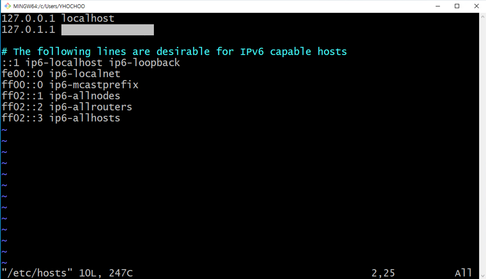

## sudo: unable to resolve host 에러 해결

### 상황

- sudo 명령어가 필요한 상황에서 sudo: unable to resolve host가 발생하는 상황

- hostname과 hosts의 정보가 달라서 생기는 문제

### 해결 방법

- `sudo vi /etc/hosts`

  

- `127.0.0.1 localhost` 뒤에 `127.0.1.1 ip-{hostname}` 를 추가

  

    
