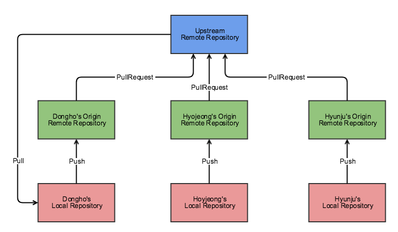

## git-flow

`git-flow` 는 Vincent Driessen의 브랜칭 모델을 적용하여 레포지토리를 작업할 수 있도록 하는 git의 확장이다. [더 알아보기](https://nvie.com/posts/a-successful-git-branching-model/)

### git-flow vs git-flow-avh

git-flow 설치 방법을 찾아보면, [git-flow-avh](https://github.com/petervanderdoes/gitflow-avh)를 설치하라는 가이드가 나오는데, [git-flow](https://github.com/nvie/gitflow) 저장소가 있고, 이게 원본인 것 같아서 약간의 혼란이 있었다.

다행히 git-flow-avh의 깃헙 위키의 [Home](https://github.com/petervanderdoes/gitflow-avh/wiki#what-is-git-flow-avh-edition)과 [FAQ](https://github.com/petervanderdoes/gitflow-avh/wiki/FAQ)에 간략한 설명이 있다.

> git-flow에서 hooks와 filter 구현이 필요했기 때문에 원본 git-flow에 대한 패치를 작성했습니다. 5개월이 지나도, 패치가 구현되지 않았고 우리는 AVH Edition을 만드는 일에 집중하기로 결정했습니다.

AVH는 A Virtual Home이라는 작성자의 개인 웹사이트 이름에서 따왔다고 한다. [참고](https://github.com/petervanderdoes/gitflow-avh/issues/242)

AVH Edition이 git-flow의 기본 기능들을 포함하면서 hooks와 filter 기능을 제공하고, [cheatsheet](https://danielkummer.github.io/git-flow-cheatsheet/index.ko_KR.html) 를 포함해서 AVH Edition으로 가이드하는 문서가 많아서 AVH Edition으로 설치를 진행했다.

### 설치하기

[Installation](https://github.com/petervanderdoes/gitflow-avh/wiki/Installation) 에서 운영체제 별 설치 가이드를 볼 수 있다.

MacOS 기준으로는 brew를 사용하여 설치한다.

```
brew install git-flow-avh
```

`1.7.0` 버전에서 `git flow init` 시에 에러가 발생했는데, ([이슈](https://github.com/fork-dev/Tracker/issues/418)) `~/.gitflow_export` 에 `FLAGS_GET_OPT_CMD` 환경 변수가 있는 것이 원인이었다. 버전이 업데이트 되면서 이를 삭제해야 한다고 한다. [참고](https://github.com/petervanderdoes/gitflow-avh/wiki/Installing-on-Mac-OS-X#post-installation-setup)

### 시작하기

먼저, git 레포지토리를 생성한다.

```
git init hello-git-flow
```

git 레포지토리로 이동한 후, git flow를 시작한다.

```
cd hello-git-flow
git flow init
```

CLI의 질의에 따라 진행하여 브랜치 컨벤션을 정한다.

### 명령어

> git-flow 명령어 한짤 요약


### 느낀점

평소 하나의 Origin 레포지토리를 두고, `main`, `develop`, `feature/`, `fix/` ... 으로 브랜칭한 후, [Pull Request -> Merge -> Pull (develop) 방식의 workflow를 사용했는데](https://github.com/elsewhencode/project-guidelines#12-git-workflow) git flow의 finish 명령어가 로컬에서 머지되는 방식이라, Pull Request와 함께 어떻게 사용하는 것이 가장 적절한지 고민이 들었다.

다행히, [Stack Overflow](https://stackoverflow.com/a/58410075)에 비슷한 고민이 있었다. 기존 워크플로우 대로 사용하려면, finish 명령어를 사용하지 않고, publish -> PR -> Merge -> Pull 식으로 진행하면 된다. 추가적으로 git-flow-avh의 hooks 기능을 활용해 PR 작성 스크립트를 활용할 수 있다.

또는, 하나의 Upstream 레포지토리를 두고 fork하여 협업 대상자의 개인 Origin 레포지토리에서 PR하는 방식으로 진행하는 방식도 있다. [참고](https://techblog.woowahan.com/2553/)

이러한 방식을 사용하면, 각자의 Origin repo에서 부담없이 다양한 실험들을 해볼 수 있는 장점도 있을 수 있다고 한다.



## Reference

[git-flow cheatsheet](https://danielkummer.github.io/git-flow-cheatsheet/index.ko_KR.html)

[우린 Git-flow를 사용하고 있어요](https://techblog.woowahan.com/2553/)
