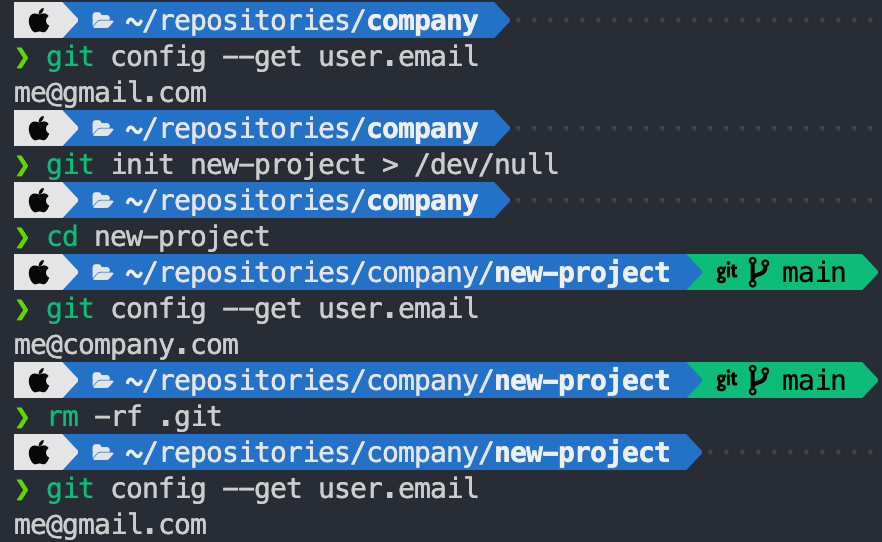

> [git-config - conditional includes](https://git-scm.com/docs/git-config#_conditional_includes)

gitconfig의 conditional includes를 사용하면 로컬 컴퓨터의 디렉토리별로 gitconfig
을 관리하는 것이 가능하다.

다음과 같은 디렉토리 구조를 사용하고 있다고 가정해보자.

```bash
working-directory
  ├── company # 회사 프로젝트
  └── github # 개인 프로젝트
```

회사 프로젝트에서는 회사 메일인 `me@company.com` 를 git user.email로 사용하려고
하고, 개인 프로젝트에는 `me@gmail.com` 을 git user.email로 사용하고 싶다고 하자.

전역 설정으로는 개인 계정을 설정한다.

```bash
git config --global user.name me
git config --global user.email me@gmail.com
```

그리고 `~/.gitconfig` 을 열어서 user 섹션 아래에 `includeIf` 섹션을 추가한다.

`.gitconfig`

```
[user]
    name = me
    email = me@gmail.com

[includeIf "gitdir:~/working-directory/company/"]
    path = ~/working-directory/company/company.inc
```

`gitdir:` 은 glob 패턴을 따르는 문자열로, `git directory` 가 해당 패턴과 일치하
면, path에 있는 파일을 include 한다.

gitconfig 파일은 아래의 설정이 위의 설정을 덮어쓰기 때문에 해당 경로의 파일에
user 설정을 해두면, user 설정이 덮어쓰여 해당 설정을 사용하게 된다.

`~/working-directory/company/company.inc`

```
[user]
	email = me@company.com
```

이렇게 설정한 뒤에 `~/working-directory/company/` 하위에 새로운 git 레포지토리를
생성하면, git 이메일이 회사 계정인 것을 확인할 수 있다.



유의할 점은 git이 설정된 레포지토리어야 한다는 것이다.
