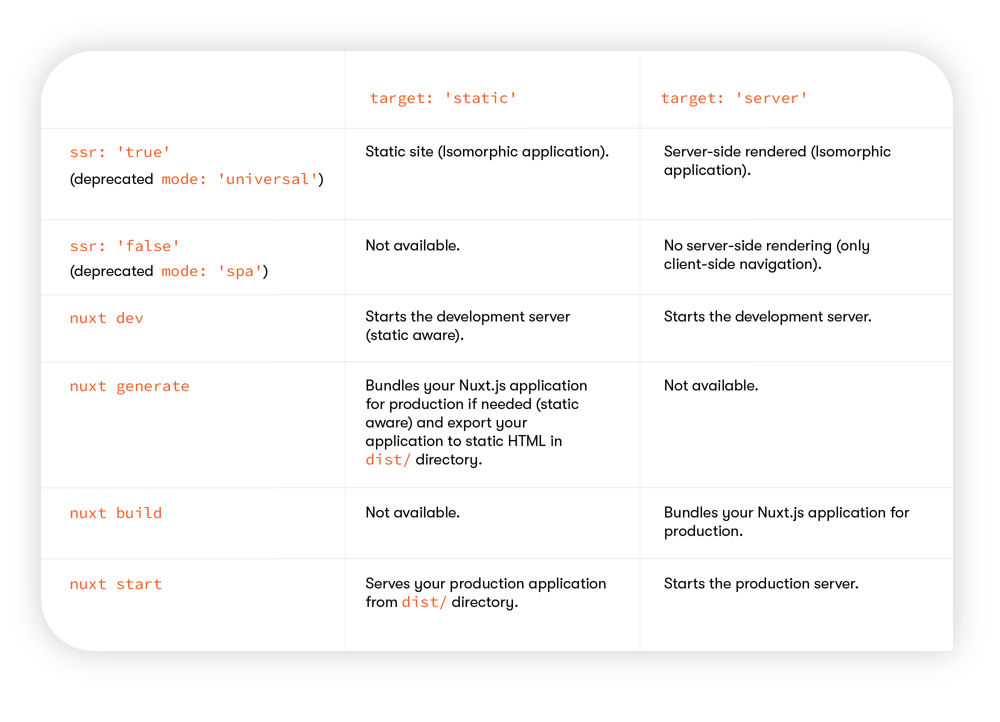

[Nuxt.js 공식 문서](https://nuxtjs.org)의
[Rendering](https://nuxtjs.org/docs/2.x/features/rendering-modes)과
[Deployment Target](https://nuxtjs.org/docs/2.x/features/deployment-targets) 부
분을 읽으면서 `nuxt.config.js`의 `ssr: 'true'`와 `target: 'server'`의 차이가 무
엇인지 헷갈렸다.

static site를 만들기 위해서는 `target: 'static'`과 `ssr: 'true'`를 활성화 해야한
다. `mode: 'universal'`는 같은 기능이지만, deprecated 되었다.

`ssr: 'true'`이 기본값이다.

`ssr: 'false'`는 `mode: 'spa'`와 같은 기능이지만 deprecated 되었다.
`ssr: 'false'`는 `target: 'static'`과 함께 사용할 수 없다.

Nuxt.js에는 몇 가지 명령어가 있는데, `target` 값에 따라서 가능 여부가 달라진다.

아래의 표가 속성 값에 따른 명령어에 대한 기대 동작을 잘 설명해준다.

## 참고자료

[Demystify Nuxtʼs target, mode, and ssr properties](https://kontent.ai/blog/demystify-nuxt-target-mode-and-ssr-properties)
[Going Full Static](https://nuxtjs.org/blog/going-full-static)
