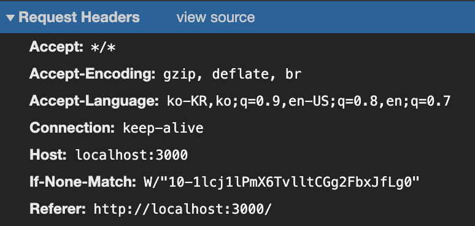
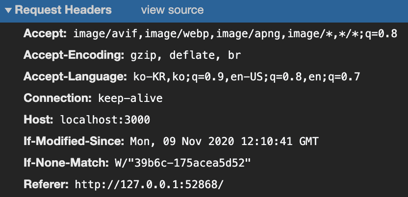

## 배경

프론트엔드에서 데이터를 보여주기 위해서는 여러 서버의 자원을 요청(request)하게 된다. ( `image` , `css` , `js` , `json` ... )

기본적으로 모든 HTTP 요청은 Cross-Site HTTP Request가 가능하다. 즉 `` 태그의 `src` , `<link>` 태그로 `css` , `` 로 둘러싸여 있는 **스크립트 내에서 생성된 HTTP Request**에 대해서는 Same Origin Policy가 적용된다.

### Origin 이란?

여기서 `origin` 이란 (서브)도메인, 프로토콜, 포트번호까지 모두 합친 것을 의미한다. 

(콘솔 창에서 `location.origin` 으로 접근할 수 있다.)

즉 도메인, 프로토콜, 포트번호까지 모두 같아야 동일 출처로 인정되는 것이다.

### Cross Origin

그러면 스크립트 내에서는 같은 출처에 있는 자원만 요청하고, 사용할 수 있는가? 아니다. AJAX가 널리 사용되면서 `<script>` 내부에서도 Cross-Site HTTP Request가 가능해야 한다는 요구가 늘어나면서 W3C로부터 CORS(Cross-Origin-Request-Sharing) 라는 권고안이 나오게 되었다.

#### 브라우저 (Client-Side)

브라우저는 스크립트 내의 다른 출처에 대한 HTTP Request Header에 `Origin` 이라는 필드를 추가해서 요청을 보낸다.

크롬 네트워크 탭에서 Request Header를 살펴보자. (서버 : `http://localhost:3000` )

- Cross Origin

   

- Same Origin

   

- `<script>` 태그 외부의 `request`

   

> ☝ Cross Origin 요청에만 Origin 필드가 추가된 것을 볼 수 있다.

#### 서버 사이드

서버에서 교차 출처 요청을 허용해주기 위해서 HTTP response에 `Access-Control-Allow-*` 옵션들을 사용할 수 있다. 

서버는 `Access-Control-Allow-Origin` 헤더로 어느 출처를 허용할 것인지 명시할 수 있다. 

- express에서의 예시

   - 전체 허용 : `res.header('Access-Control-Allow-Origin', '*');`

   - 특정 출처 허용 : `res.header('Access-Control-Allow-Origin', 'http://example.com');`

또한 `Access-Control-Allow-Methods` 로 허용할 메소드들을 지정할 수 있다.

- `res.header('Access-Control-Allow-Methods', ["POST", "GET", "PUT"]);`

### Preflighted Requests

CORS에는 두 가지 유형의 요청이 있다. **simple request** 와 **preflighted request** 다.

이름에서 드러나듯이, simple request는 간단한 요청, preflighted request는 미리 보내는 요청이다.

#### simple request

simple request는 다음 조건을 만족해야 한다.

- GET, POST 메소드 + (HEAD 메소드)

- POST 방식일 경우 Content-type이 아래 셋 중 하나

   - application/x-www-form-urlencoded

   - multipart/form-data

   - text/plain

- 커스텀 헤더를 전송하지 말아야 한다.

> 자세한 조건은 아래의 문서를 참조한다.

[교차 출처 리소스 공유 (CORS)](https://developer.mozilla.org/ko/docs/Web/HTTP/CORS#%EC%A0%91%EA%B7%BC_%EC%A0%9C%EC%96%B4_%EC%8B%9C%EB%82%98%EB%A6%AC%EC%98%A4_%EC%98%88%EC%A0%9C)

#### preflighted request

preflighted request는 **실질적 요청(actual request)**을 보내기 전에 `Access-Control-Request-*` 헤더를 사용해 미리 요청을 보낸다.

브라우저는 서버로부터 받은 응답을 보고, 허용되었다면 실질적 요청을 보내게 된다.

만약 preflighted request가 허용되지 않았다면 브라우저는 실질적 요청을 전송하지 않게 된다.

이러한 방법을 통해 서버는 허용하지 않은 출처로부터의 자원에 대한 접근이나 수정을 막아 보호를 받게 된다.

### 참고자료

[✋🏼🔥 CS Visualized: CORS](https://dev.to/lydiahallie/cs-visualized-cors-5b8h)

[교차 출처 리소스 공유 (CORS)](https://developer.mozilla.org/ko/docs/Web/HTTP/CORS)

[Cross Origin Resource Sharing - CORS](http://homoefficio.github.io/2015/07/21/Cross-Origin-Resource-Sharing/)

